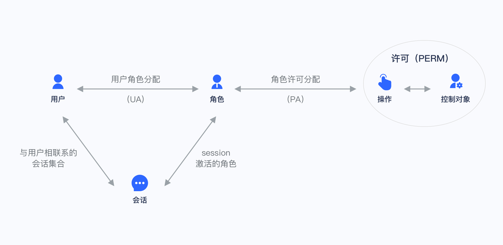

# 用户权限

登录SaaS服务

- https://docs.authing.cn/v2/guides/basics/authenticate-first-user

目前被大家广泛采用的两种权限模型为：[基于角色的访问控制（RBAC）](https://docs.authing.cn/v2/guides/access-control/choose-the-right-access-control-model.html#什么是基于角色的访问控制-rbac)和[基于属性的访问控制（ABAC）](https://docs.authing.cn/v2/guides/access-control/choose-the-right-access-control-model.html#什么是基于属性的访问控制-abac)，二者各有优劣：RBAC 模型构建起来更加简单，缺点在于无法做到对资源细粒度地授权（都是授权某一类资源而不是授权某一个具体的资源）；ABAC 模型构建相对比较复杂，学习成本比较高，优点在于细粒度和根据上下文动态执行。

## 什么是基于角色的访问控制（RBAC）

基于角色的访问控制（Role-based access control，简称 RBAC），指的是通过用户的角色（Role）授权其相关权限，这实现了更灵活的访问控制，相比直接授予用户权限，要更加简单、高效、可扩展。



当使用 RBAC 时，通过分析系统用户的实际情况，基于共同的职责和需求，授予他们不同角色。你可以授予给用户一个或多个角色，每个角色具有一个或多个权限，这种 用户-角色、角色-权限 间的关系，让我们可以不用再单独管理单个用户，用户从授予的角色里面继承所需的权限。

以一个简单的场景（Gitlab 的权限系统）为例，用户系统中有 Admin、Maintainer、Operator 三种角色，这三种角色分别具备不同的权限，比如只有 Admin 具备创建代码仓库、删除代码仓库的权限，其他的角色都不具备。


我们授予某个用户「Admin」这个角色，他就具备了「创建代码仓库」和「删除代码仓库」这两个权限。

不直接给用户授权策略，是为了之后的扩展性考虑。比如存在多个用户拥有相同的权限，在分配的时候就要分别为这几个用户指定相同的权限，修改时也要为这几个用户的权限进行一一修改。有了角色后，我们只需要为该角色制定好权限后，给不同的用户分配不同的角色，后续只需要修改角色的权限，就能自动修改角色内所有用户的权限。

## 什么是基于属性的访问控制（ABAC）

基于属性的访问控制（Attribute-Based Access Control，简称 ABAC）是一种非常灵活的授权模型，不同于 RBAC，ABAC 则是通过各种属性来动态判断一个操作是否可以被允许。

> 当什么条件满足时，XX对象对XX资源拥有XX权限。

### ABAC 的主要组成部分

在 ABAC 中，一个操作是否被允许是基于对象、资源、操作和环境信息共同动态计算决定的。

- 对象：对象是当前请求访问资源的用户。用户的属性包括ID，个人资源，角色，部门和组织成员身份等；
- 资源：资源是当前访问用户要访问的资产或对象（例如文件，数据，服务器，甚至API）。资源属性包含文件的创建日期，文件所有者，文件名和类型以及数据敏感性等等；
- 操作：操作是用户试图对资源进行的操作。常见的操作包括“读取”，“写入”，“编辑”，“复制”和“删除”；
- 环境：环境是每个访问请求的上下文。环境属性包含访问尝试的时间和位置，对象的设备，通信协议和加密强度等。

### ABAC 如何使用属性动态计算出决策结果

在 ABAC 的决策语句的执行过程中，决策引擎会根据定义好的决策语句，结合对象、资源、操作、环境等因素动态计算出决策结果。

每当发生访问请求时，ABAC 决策系统都会分析属性值是否与已建立的策略匹配。如果有匹配的策略，访问请求就会被通过。

例如，策略「当一个文档的所属部门跟用户的部门相同时，用户可以访问这个文档」会被以下属性匹配：

- 对象（用户）的部门 = 资源的所属部门；
- 资源 = “文档”；
- 操作 = “访问”；

策略「早上九点前禁止 A 部门的人访问B系统；」会被以下属性匹配：

- 对象的部门 = A 部门；
- 资源 = “B 系统”；
- 操作 = “访问”；
- 环境 = “时间是早上 9 点”。

```json
{
    "effect":"Allow",
    "actions":[
        "getOrder"
    ],
    "resources":[
        "contextField:contextValue:resourceField:resourceValue" 
    ],
    "condition":[
        {
            "DateLessThan":{
                "CurrentTime":[
                    "2021-03-30 17:00:00"            // 必须满足时间小于2021-03-30 17:00:00
                ]
            }
        }
    ]
}
```

### 最小单元判定流程

每种类型的权限策略都会按照下图所示的流程进行权限判定，这个流程称为最小单元判定流程。


最小单元判定流程如下：

1. 权限判定遵循Deny优先原则，优先检查访问请求是否命中Deny语句。
   - 是：判定结束，返回判定结果为Explicit Deny（显式拒绝）。
   - 否：继续下一步判定。
2. 检查访问请求是否命中Allow语句。
   - 是：判定结束，返回判定结果为Allow（允许）。
   - 否：判定结束，返回判定结果为Implicit Deny（隐式拒绝）。

### ABAC 应用场景

在 ABAC 权限模型下，你可以轻松地实现以下权限控制逻辑：

1. 授权编辑 A 具体某本书的编辑权限；
2. 当一个文档的所属部门跟用户的部门相同时，用户可以访问这个文档；
3. 当用户是一个文档的额拥有者并且文档的状态是草稿，用户可以编辑这个文档；
4. 早上九点前禁止 A 部门的人访问B系统；
5. 在除了上海以外的地方禁止以管理员身份访问A系统；

上述的逻辑中有几个共同点：

- 具体到某一个而不是某一类资源；
- 具体到某一个操作；
- 能通过请求的上下文（如时间、地理位置、资源 Tag）动态执行策略；

如果浓缩到一句话，你可以**细粒度地授权在何种情况下对某个资源具备某个特定的权限。**

### ABAC参考文章

[权限策略基本元素](https://help.aliyun.com/document_detail/93738.html)

[史上最强的权限系统设计攻略(下)、ABAC在复杂场景下的实现思路](https://juejin.cn/post/6951712306598248485)

**[K8s ABAC模型的实现](https://kubernetes.io/zh/docs/reference/access-authn-authz/abac/)**

## 我该如何选择使用哪种权限模型

在这里，组织的规模是至关重要的因素。由于 ABAC 最初的设计和实施困难，对于小型企业而言，考虑起来可能太复杂了。

对于中小型企业，RBAC 是 ABAC 的简单替代方案。每个用户都有一个唯一的角色，并具有相应的权限和限制。当用户转移到新角色时，其权限将更改为新职位的权限。这意味着，在明确定义角色的层次结构中，可以轻松管理少量内部和外部用户。

但是，当必须手动建立新角色时，对于大型组织而言，效率不高。一旦定义了属性和规则，当用户和利益相关者众多时，ABAC 的策略就更容易应用，同时还降低了安全风险。

简而言之，如果满足以下条件，请选择 ABAC：

- 你在一个拥有许多用户的大型组织中；
- 你需要深入的特定访问控制功能；
- 你有时间投资远距离的模型；
- 你需要确保隐私和安全合规；

但是，如果满足以下条件，请考虑 RBAC：

- 你所在的是中小型企业；
- 你的访问控制策略广泛；
- 你的外部用户很少，并且你的组织角色得到了**明确定义**，且数量不多；


## RBAC 与 ABAC 的本质区别

RBAC 权限都是预先定义的，A员工具有 ADMIN 权限，那他就具有这个管理员的权限，一般手动人为介入变更。

ABAC 权限会预先配置场景规则，「每天下午2点之后，允许财务部的员工操作充值功能。」，人本身就存在很多特征，或者说是多样化的角色，例如：男性、财务部、22岁、中国等特征，像例子中的只要是财务部的人就可以访问，哪天操作者更换部门了，就自然的没有权限了。

ARBAC 权限是将RBAC中的角色优势与ABAC的灵活性进行融合，将IT和业务结构结合在一起。