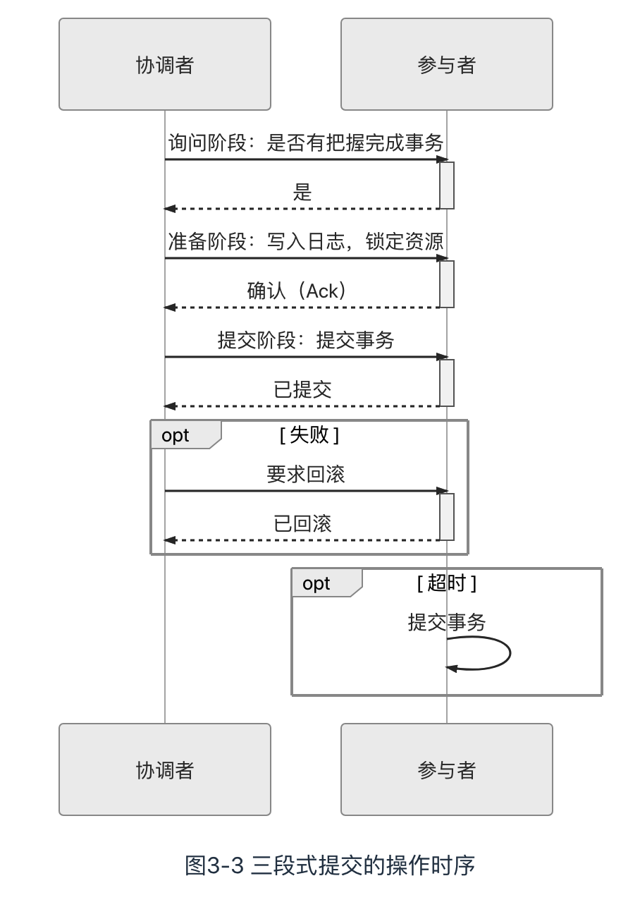

# 全局事务
与本地事务相对的是全局事务（Global Transaction），有一些资料中也将其称为外部事务（External Transaction），在本节里，全局事务被限定为一种适用于单个服务使用多个数据源场景的事务解决方案。请注意，理论上真正的全局事务并没有“单个服务”的约束，它本来就是DTP（ [Distributed Transaction Processing](https://en.wikipedia.org/wiki/Distributed_transaction) ）模型中的概念，但本节所讨论的内容是一种在分布式环境中仍追求强一致性的事务处理方案，对于多节点而且互相调用彼此服务的场合（典型的就是现在的微服务系统）是极不合适的，今天它几乎只实际应用于单服务多数据源的场合中，为了避免与后续介绍的放弃了ACID的弱一致性事务处理方式相互混淆，所以这里的全局事务所指范围有所缩减，后续涉及多服务多数据源的事务，笔者将称其为“分布式事务”。

1991年，为了解决分布式事务的一致性问题， [X/Open](https://en.wikipedia.org/wiki/X/Open) 组织（后来并入了 [The Open Group](https://en.wikipedia.org/wiki/The_Open_Group) ）提出了一套名为 [X/Open XA](https://en.wikipedia.org/wiki/X/Open_XA) _（XA是eXtended Architecture的缩写）的处理事务架构，其核心内容是定义了全局的事务管理器（Transaction Manager，用于协调全局事务）和局部的资源管理器（Resource Manager，用于驱动本地事务）之间的通信接口。XA接口是双向的_ ，能在一个事务管理器和多个资源管理器（Resource Manager）之间形成通信桥梁，通过协调多个数据源的一致动作，实现全局事务的统一提交或者统一回滚，现在我们在Java代码中还偶尔能看见的XADataSource、XAResource这些名字都源于此。

> XA：使用双向的 全局的事务管理器和局部的资源管理器 构成，来控制多个数据来源间事务处理。

不过，XA并不是Java的技术规范（XA提出那时还没有Java），而是一套语言无关的通用规范，所以Java中专门定义了 [JSR 907 Java Transaction API](https://www.jcp.org/en/jsr/detail?id=907) ，基于XA模式在Java语言中的实现了全局事务处理的标准，这也就是我们现在所熟知的JTA。JTA最主要的两个接口是：

* 事务管理器的接口： `javax.transaction.TransactionManager` 。这套接口是给Java EE服务器提供容器事务（由容器自动负责事务管理）使用的，还提供了另外一套 `javax.transaction.UserTransaction` 接口，用于通过程序代码手动开启、提交和回滚事务。
* 满足XA规范的资源定义接口： `javax.transaction.xa.XAResource` ，任何资源（JDBC、JMS等等）如果想要支持JTA，只要实现XAResource接口中的方法即可。

JTA原本是Java EE中的技术，一般情况下应该由JBoss、WebSphere、WebLogic这些Java EE容器来提供支持，但现在 [Bittronix](https://web.archive.org/web/20100414140721/http://docs.codehaus.org/display/BTM/Home)、[Atomikos](http://www.atomikos.com/Main/TransactionsEssentials) 和 [JBossTM](http://www.jboss.org/jbosstm) （以前叫Arjuna）都以JAR包的形式实现了JTA的接口，称为JOTM（Java Open Transaction Manager），使得我们能够在Tomcat、Jetty这样的Java SE环境下也能使用JTA。

现在，我们对本章的 [场景事例](https://icyfenix.cn/architect-perspective/general-architecture/transaction/) 做另外一种假设：如果书店的用户、商家、仓库分别处于不同的数据库中，其他条件仍与之前相同，那情况会发生什么变化呢？加入你平时以声明式事务来编码，那它与本地事务看起来可能没什么区别，都是标个 `@Transactional` 注解而已，但如果以编程式事务来实现的话，就能在写法上看出差异，伪代码如下所示：

```java
public void buyBook(PaymentBill bill) {
    userTransaction.begin();
    warehouseTransaction.begin();
    businessTransaction.begin();
	try {
        userAccountService.pay(bill.getMoney());
        warehouseService.deliver(bill.getItems());
        businessAccountService.receipt(bill.getMoney());
        userTransaction.commit();
        warehouseTransaction.commit();
        businessTransaction.commit();
	} catch(Exception e) {
        userTransaction.rollback();
        warehouseTransaction.rollback();
        businessTransaction.rollback();
	}
}
```

从代码上可看出，程序的目的是要做三次事务提交，但实际上代码并不能这样写，试想一下，如果在 `businessTransaction.commit()` 中出现错误，代码转到 `catch` 块中执行，此时 `userTransaction` 和 `warehouseTransaction` 已经完成提交，再去调用 `rollback()` 方法已经无济于事，这将导致一部分数据被提交，另一部分被回滚，整个事务的一致性也就无法保证了。为了解决这个问题，XA将事务提交拆分成为两阶段过程：

*准备阶段* ：又叫作投票阶段，在这一阶段，协调者询问事务的所有参与的是否准备好提交，参与者如果已经准备好提交则回复Prepared，否则回复Non-Prepared。这里所说的准备操作跟人类语言中通常理解的准备并不相同，对于数据库来说， _准备操作是在重做日志中记录全部事务提交操作所要做的内容，它与::本地事务中真正提交的区别只是暂不写入最后一条Commit Record而已::，这意味着在做完数据持久化后并不立即释放隔离性，即仍继续持有锁，维持数据对其他非事务内观察者的隔离状态。_
* *提交阶段* ：又叫作执行阶段，协调者如果在上一阶段收到所有事务参与者回复的Prepared消息，则先自己在本地持久化事务状态为Commit，在此操作完成后向所有参与者发送Commit指令，所有参与者立即执行提交操作；否则， _任意一个参与者回复了Non-Prepared消息，或任意一个参与者超时未回复，协调者将将自己的事务状态持久化为Abort之后，向所有参与者发送Abort指令，参与者立即执行回滚操作。对于数据库来说，这个阶段的提交操作应是很轻量的，仅仅是持久化一条Commit Record而已，通常能够快速完成，只有收到Abort指令时，才需要根据回滚日志清理已提交的数据，这可能是相对重负载操作。_

以上这两个过程被称为“ [两段式提交](https://zh.wikipedia.org/wiki/%E4%BA%8C%E9%98%B6%E6%AE%B5%E6%8F%90%E4%BA%A4) ”（2 Phase Commit，2PC）协议，而它能够成功保证一致性还需要一些其他前提条件。

* _必须假设网络在提交阶段的短时间内是可靠的，即提交阶段不会丢失消息_ 。同时也假设网络通信在全过程都不会出现误差，即可以丢失后消息，但不会传递错误的消息，XA的设计目标并不是解决诸如 [拜占庭将军](https://en.wikipedia.org/wiki/Byzantine_fault) 一类的问题。两段式提交中投票阶段失败了可以补救（回滚），而提交阶段失败了无法补救（不再改变提交或回滚的结果，只能等崩溃的节点重新恢复）， _因而此阶段耗时应尽可能短，这也是为了尽量控制网络风险的考虑。_
* 必须假设因为网络分区、机器崩溃或者其他原因而导致失联的节点最终能够恢复，不会永久性地处于失联状态。由于在准备阶段已经写入了完整的重做日志，所以当失联机器一旦恢复，就能够从日志中找出已准备妥当但并未提交的事务数据，再而向协调者查询该事务的状态，确定下一步应该进行提交还是回滚操作。

请注意，上面所说的协调者、参与者通常都是由数据库自己来扮演的，不需要应用程序介入。协调者一般是在参与者之间选举产生的，而应用程序相对于数据库来说只扮演客户端的角色。两段式提交的交互时序如图3-2所示。


两段式提交原理简单，并不难实现，但有几个非常显著的缺点：

* *单点问题* ：协调者在两段提交中具有举足轻重的作用，协调者等待参与者回复时可以有超时机制，允许参与者宕机，但参与者等待协调者指令时无法做超时处理。一旦宕机的不是其中某个参与者，而是协调者的话，所有参与者都会受到影响。如果协调者一直没有恢复，没有正常发送Commit或者Rollback的指令，那所有参与者都必须一直等待。
* *性能问题* ：两段提交过程中，所有参与者相当于被绑定成为一个统一调度的整体，期间要经过两次远程服务调用，三次数据持久化（准备阶段写重做日志，协调者做状态持久化，提交阶段在日志写入Commit Record），整个过程将持续到参与者集群中最慢的那一个处理操作结束为止，这决定了两段式提交的性能通常都较差。
* *一致性风险* ：前面已经提到，两段式提交的成立是有前提条件的，当网络稳定性和宕机恢复能力的假设不成立时，仍可能出现一致性问题。宕机恢复能力这一点不必多谈，1985年Fischer、Lynch、Paterson提出了“ [FLP不可能原理](https://en.wikipedia.org/wiki/Consensus_%28computer_science%29#Solvability_results_for_some_agreement_problems) ”，证明了如果宕机最后不能恢复，那就不存在任何一种分布式协议可以正确地达成一致性结果。该原理在分布式中是与“CAP不可兼得原理“齐名的理论。而网络稳定性带来的一致性风险是指：尽管提交阶段时间很短，但这仍是一段明确存在的危险期，如果协调者在发出准备指令后，根据收到各个参与者发回的信息确定事务状态是可以提交的，协调者会先持久化事物状态，并提交自己的事务， _如果这时候网络忽然被断开，无法再通过网络向所有参与者发出Commit指令的话，就会导致部分数据（协调者的）已提交，但部分数据（参与者的）既未提交，也没有办法回滚，产生了数据不一致的问题。_

> 2PC 主要问题产生原因就是网络不可靠导致的。

为了缓解两段式提交协议的一部分缺陷，具体地说是协调者的单点问题和准备阶段的性能问题，后续又发展出了“ [三段式提交](https://zh.wikipedia.org/wiki/%E4%B8%89%E9%98%B6%E6%AE%B5%E6%8F%90%E4%BA%A4) ”（3 Phase Commit，3PC）协议。三段式提交把原本的两段式提交的准备阶段再细分为两个阶段，分别称为::CanCommit、PreCommit，把提交阶段改称为DoCommit阶::段。其中，新增的CanCommit是一个询问阶段，协调者让每个参与的数据库根据自身状态，评估该事务是否有可能顺利完成。将准备阶段一分为二的理由是这个阶段是重负载的操作，一旦协调者发出开始准备的消息，每个参与者都将马上开始写重做日志，它们所涉及的数据资源即被锁住，如果此时某一个参与者宣告无法完成提交，相当于大家都白做了一轮无用功。所以，增加一轮询问阶段，如果都得到了正面的响应，那事务能够成功提交的把握就比较大了，这也意味着因某个参与者提交时发生崩溃而导致大家全部回滚的风险相对变小。因此，在事务需要回滚的场景中，三段式的性能通常是要比两段式好很多的，但在事务能够正常提交的场景中，两者的性能都依然很差，甚至三段式因为多了一次询问，还要稍微更差一些。

> 三段式相比二段式成功率有比较大的提高，回滚的性能也相对比较好，但事务提交的正常场景性能还是比较差，依旧存在网络问题。

同样也是由于事务失败回滚概率变小的原因，在三段式提交中，如果在PreCommit阶段之后发生了协调者宕机，即参与者没有能等到DoCommit的消息的话，默认的操作策略将是提交事务而不是回滚事务或者持续等待，这就相当于避免了协调者单点问题的风险。三段式提交的操作时序如图3-2所示。



从以上过程可以看出，::三段式提交对单点问题和回滚时的性能问题有所改善，但是它对一致性风险问题并未有任何改进，在这方面它面临的风险甚至反而是略有增加了的。::譬如，进入PreCommit阶段之后，协调者发出的指令不是Ack而是Abort，而此时因网络问题，有部分参与者直至超时都未能收到协调者的Abort指令的话，这些参与者将会错误地提交事务，这就产生了不同参与者之间数据不一致的问题。

[全局事务](https://icyfenix.cn/architect-perspective/general-architecture/transaction/global.html)

> 二段式与三段式都存在数据一致性和性能方面的问题，三段式提交稍微提升了性能和成功率。

