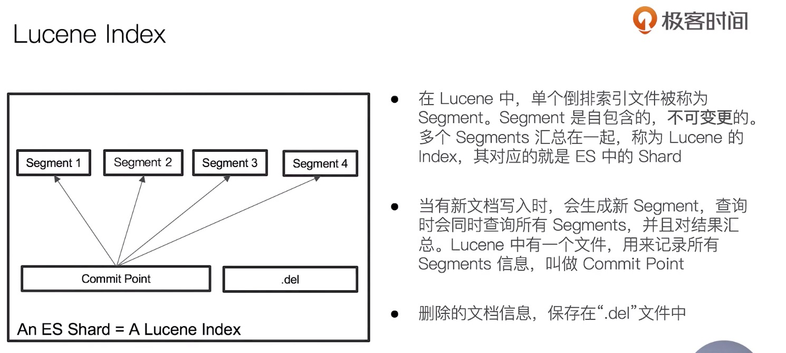
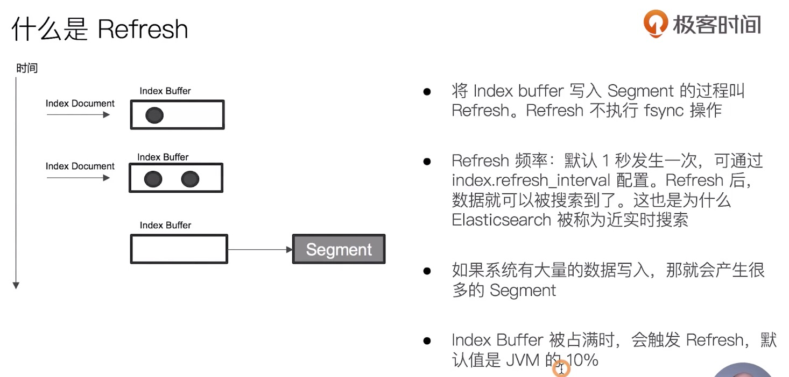
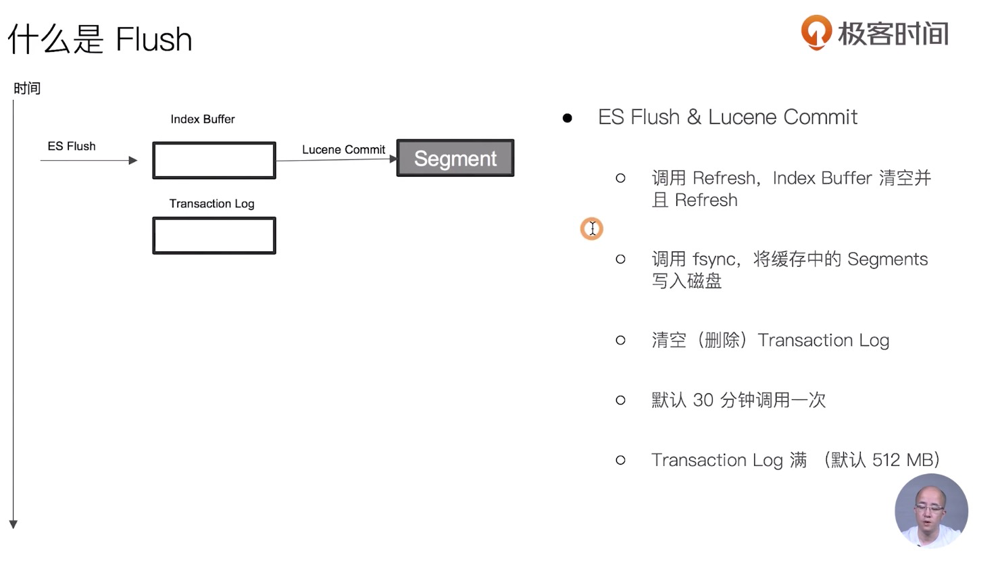

## ES 能做什么

- 数据的模糊查询/精准查询（keyword/text/terms/match/match_phrase/query_string/bool）
- 匹配度查询（explain/boosting/score）
- 多字段匹配查询（Multi Match）
- 查询模板（Search Template/Index Alias）
- 自定义算分排序（Function Score Query）
- 自动补全与纠错（Phrase Suggester/Completion Suggester ）
- 标签化提高查询准确率（Context Suggester）

## 概念

keyword：字段类型设为keyword，es 不会进行分词处理。he is boy，就是 he is boy。

text：字段类型设为text，es 会进行分词处理。he is boy，会变成 ["he","is","boy"]。

terms：只查询分词的数据，keyword 字段，he is boy，必须 he is boy，text字段，he is boy，只能通过 he/is/boy 可以查询到，完成的 he is boy 无法查询得到

match：只要有匹配的就可以被查询，keyword 字段，he is boy，必须 he is boy，text字段，he is boy， he/is/boy/he is boy 都可以被查询。

match_phrase：支持模糊匹配，对顺序提出了要求，配置顺序必须相同，而且必须都是连续的。支持keyword全匹配

query_string：不支持keyword查询，和match_phrase区别的是，不需要连续，顺序还可以调换。

bool：符合查询，包含了must，filter，should，must_not四种。

- must

  返回的文档必须满足must子句的条件，并且参与计算分值

- filter

  返回的文档必须满足filter子句的条件。但是不会像Must一样，参与计算分值

- should

  返回的文档可能满足should子句的条件。在一个Bool查询中，如果没有must或者filter，有一个或者多个should子句，那么只要满足一个就可以返回。minimum_should_match参数定义了至少满足几个子句。

- must_not

  返回的文档必须不满足must_not定义的条件。

# Search

Search API

- URI Search：在 URL 中使用查询参数
- Request Body Search：使用 ES 提供的，基于 `JSON` 格式的更加完备的 `DSL` 语法。

查询索引

```
/index1/_search
/index1,index2/_search
/index*/_search
```

URI 查询

```
# q 表示查询内容
# kv方式表示查询条件
index1/_search?q=customer_id:xha234
GET /movies/_search?q=2012&df=title&sort=year:desc&from=0&size=10&timeout=1s

GET /movies/_search?q=2012&df=title
{
	"profile":"true"
}
```

- q 指定查询语句
- df 默认字段，不指定时，会对所有字段进行查询，用于限定查询
- Sort 排序 
- from 和 size 用于分页
- Profile 可以查看查询是如何被执行的

Query String Syntax

指定字段 VS 泛查询

```
q=title:2012 # 指定字段
q=2012 #泛查询

# 查找美丽心灵, title:Beautiful，但Mind为泛查询
GET /movies/_search?q=title:Beautiful Mind
{
	"profile":"true"
}
```

Term VS Phrase

- Beautiful Mind 等效于 Beautiful OR Mind
- “Beautiful Mind” 等效于 Beautiful AND Mind，包括顺序

分组与引号

- title:(Beautiful AND Mind)

- title="Beautiful Mind"

```
#分组，Bool查询
GET /movies/_search?q=title:(Beautiful Mind)
{
	"profile":"true"
}
```

布尔操作

- AND / OR / NOT 或者 && / || / !
  - 必须大写
  - title:(matrix NOT reloaded)

分组

- `+` 表示 must
- `-` 表示 must_not
- title:(+matrix -reloaded)

范围查询

- 区间查询：[] 闭区间，{} 开区间
  - year:{2019 TO 2018}
  - year:[* TO 2018]

算术符号

- year:>2010
- year:(>2010 && <=2018)
- year:(+>2010 +<=2018)

通配符查询（占用内存大，不建议使用。特别是放在最前面）

- ? 代表 1 个字符，* 代表 0 或多个字符
  - Title:mi?d

正则表达式

- title:[bt]oy

模糊匹配与近似查询

- title:befutiful~1

```
//模糊匹配&近似度匹配
GET /movies/_search?q=title:beautifl~1
{
	"profile":"true"
}
```

Request Body

```
POST /movies,404_idx/_search?ignore_unavailable=true
{
  "profile": true,
	"query": {
		"match_all": {}
	}
}
```

分页

```
POST /kibana_sample_data_ecommerce/_search
{
  "from":10,  #页码
  "size":20, # 页Size
  "query":{
    "match_all": {}
  }
}

```

_source filter

只关心自己希望查询出来的字段值。使用 `_source` 即可。

- 支持通配符，`"_source":["order_dat*"]`

```
#source filtering
POST kibana_sample_data_ecommerce/_search
{
  "_source":["order_date"],
  "query":{
    "match_all": {}
  }
}
```

排序

```
#对日期排序
POST kibana_sample_data_ecommerce/_search
{
  "sort":[{"order_date":"desc"}],
  "query":{
    "match_all": {}
  }

}
```

脚本字段

在 ES 中通过 painless 语句从已有字段值中根据一定的规则，生成一个新的字段。

```
#脚本字段
GET kibana_sample_data_ecommerce/_search
{
  "script_fields": {
    "new_field": {
      "script": {
        "lang": "painless",
        "source": "doc['order_date'].value+'_hello'"
      }
    }
  },
  "query": {
    "match_all": {}
  }
}
```

使用查询表达式— Match

```
POST movies/_search
{
  "query": {
    "match": {
      "title": "last christmas"  # last 或者 christmas
    }
  }
}

POST movies/_search
{
  "query": {
    "match": {
      "title": {
        "query": "last christmas",  # last 且 christmas
        "operator": "and"
      }
    }
  }
}
```

Match Phrase

查询条件要求顺序都是一样的。

- slop 允许中间有一个其他的字符

```
POST movies/_search
{
  "query": {
    "match_phrase": {
      "title":{
        "query": "one love"

      }
    }
  }
}

POST movies/_search
{
  "query": {
    "match_phrase": {
      "title":{
        "query": "one love",
        "slop": 1  # 允许有中间有一个其他的字符

      }
    }
  }
}
```

## ES 相关性

ES 5.0 之前相关性算分采用 TF-IDF，5.0之后采用 BM25。


```shell
POST /testscore/_search
{
  //"explain": true,
  "query": {
    "match": {
      "content":"you"
      //"content": "elasticsearch"
      //"content":"the"
      //"content": "the elasticsearch"
    }
  }
}
```

开启 `explain=true` 可以知道是怎么打分的，默认相关度高的数据在搜索结果中排在前面。

```shell
POST testscore/_search
{
    "query": {
        "boosting" : {
            "positive" : {
                "term" : {
                    "content" : "elasticsearch"
                }
            },
            "negative" : {
                 "term" : {
                     "content" : "like"
                }
            },
            "negative_boost" : 0.2
        }
    }
}
```

Boost 是控制相关度的一种手段

- 索引，字段或查询子条件

参数 Boost 的含义

- 大于 1 ，打分相关度相对性提升
- 大于 0 小于 1，打分权重相关性降低
- 小于 0 ，贡献负分 

## Query Context & Filter Context

在 Elasticsearch 中，有 Query 和 Filter 两种不同的 Context

- Query Context：相关性算分
- Filter Context：不需要算分（yes or no）,可以利用 Cache，获得更好的性能

### 复合查询—— bool 查询

一个bool查询，可以由多个子查询语句组成。

相关性算分值与匹配的子句越多，相关性算分越高。如果多条查询子句被合并为一条复合查询语句，比如 bool 查询，则每个查询子句计算得出的评分会被合并到总的相关性评分中。

| must     | 必须匹配。贡献算分                      |
| -------- | --------------------------------------- |
| should   | 选择性匹配（至少一条）。贡献算分        |
| Must_not | Filter Context 查询字句，必须不能匹配   |
|          | Filter Context 必须匹配，但是不贡献算分 |

```shell
POST /products/_search
{
  "query": {
    "bool" : {
      "must" : {
        "term" : { "price" : "30" }
      },
      "filter": {
        "term" : { "avaliable" : "true" }
      },
      "must_not" : {
        "range" : {
          "price" : { "lte" : 10 }
        }
      },
      "should" : [
        { "term" : { "productID.keyword" : "JODL-X-1937-#pV7" } },
        { "term" : { "productID.keyword" : "XHDK-A-1293-#fJ3" } }
      ],
      "minimum_should_match" :1
    }
  }
}
```

Bool 可以嵌套多个查询。

```shell
POST /animals/_search
{
  "query": {
    "bool": {
      "should": [
        { "term": { "text": "brown" }},
        { "term": { "text": "red" }},
        { "term": { "text": "quick"   }},
        { "term": { "text": "dog"   }}
      ]
    }
  }
}

POST /animals/_search
{
  "query": {
    "bool": {
      "should": [
        { "term": { "text": "quick" }},
        { "term": { "text": "dog"   }},
        {
          "bool":{
            "should":[
               { "term": { "text": "brown" }},
                 { "term": { "text": "brown" }},
            ]
          }

        }
      ]
    }
  }
}
```

- 统一层级下的竞争字段，具有有相同的权重。

- 通过嵌套 bool 查询，可以改变对算分的影响

## 单字符串多字段查询 Disjunction Max Query

should 算分过程

- 查询 should 语句中的两个查询
- 加和两个查询的评分
- 乘以匹配语句的总数
- 除以所有语句的总数

```shell
PUT /blogs/_doc/1
{
    "title": "Quick brown rabbits",
    "body":  "Brown rabbits are commonly seen."
}

PUT /blogs/_doc/2
{
    "title": "Keeping pets healthy",
    "body":  "My quick brown fox eats rabbits on a regular basis."
}

POST /blogs/_search
{
    "query": {
        "bool": {
            "should": [
                { "match": { "title": "Brown fox" }},
                { "match": { "body":  "Brown fox" }}
            ]
        }
    }
}
```

所以说 should 是将分数简单叠加。

Disjunction Max Query，将任何与任一查询匹配的文档作为结果返回。采用字段上最匹配的评分最终评分返回。

```shell
POST blogs/_search
{
    "query": {
        "dis_max": {
            "queries": [
                { "match": { "title": "Quick pets" }},
                { "match": { "body":  "Quick pets" }}
            ]
        }
    }
}

POST blogs/_search
{
    "query": {
        "dis_max": {
            "queries": [
                { "match": { "title": "Quick pets" }},
                { "match": { "body":  "Quick pets" }}
            ],
            "tie_breaker": 0.2
        }
    }
}
```

tie_breaker 是一个介于 0-1 之间的浮点数。0代表使用最佳匹配，1大表所有语句同等重要

## 单字符串多字段查询 Multi Match

三种场景

- 最佳字段（best fields）

  - 当字段之间相互竞争，又相互关联。例如 title 和 body 这样的字段。评分来自最匹配字段

- 多数字段（most fields）

  - 处理英文内容时：一种常见的手段是，在主字段，抽取词干，加入同义词，以匹配更多的文档。相同的文本，加入子字段，以提供更加精确的匹配。其他字段作为匹配文档提高相关度的型号。匹配字段越多则越好。

- 混合字段（cross fields）

  - 对于某些实体，例如人名，地址，图书信息。需要在多个字段中确定信息，单个字段只能作为整体的一部分。希望在任何这些列出的字段中找到尽可能多的词。


```shell
POST blogs/_search
{
  "query": {
    "multi_match": {
      "type": "best_fields",
      "query": "Quick pets", #查询内容
      "fields": ["title","body"], # 被查询字段
      "tie_breaker": 0.2,
      "minimum_should_match": "20%"
    }
  }
}
```

默认类型，best fields，可以不用指定

## 多语言及中文分词与检索

- Elasticsearch IK分词插件 https://github.com/medcl/elasticsearch-analysis-ik/releases
- Elasticsearch hanlp 分词插件 https://github.com/KennFalcon/elasticsearch-analysis-hanlp
- 分词算法综述 https://zhuanlan.zhihu.com/p/50444885
- HanLP 在线 http://hanlp.com/

## 使用 Search Template 和 Index Alias 查询

Search Template 是一个查询模板

```shell
POST _scripts/tmdb
{
  "script": {
    "lang": "mustache",
    "source": {
      "_source": [
        "title","overview"
      ],
      "size": 20,
      "query": {
        "multi_match": {
          "query": "{{q}}",
          "fields": ["title","overview"]
        }
      }
    }
  }
}

POST tmdb/_search/template
{
    "id":"tmdb",
    "params": {
        "q": "basketball with cartoon aliens"
    }
}

```

## Index Alias 查询

创建别名

```shell
POST _aliases
{
  "actions": [
    {
      "add": {
        "index": "movies-2019",
        "alias": "movies-latest"
      }
    }
  ]
}

POST movies-latest/_search
{
  "query": {
    "match_all": {}
  }
}

POST _aliases
{
  "actions": [
    {
      "add": {
        "index": "movies-2019",
        "alias": "movies-lastest-highrate",
        "filter": {
          "range": {
            "rating": {
              "gte": 4
            }
          }
        }
      }
    }
  ]
}

POST movies-lastest-highrate/_search
{
  "query": {
    "match_all": {}
  }
}
```

## 综合排序：Function Score Query 优化算分

Function Score Query：可以在查询结束后，对每一个匹配的文档进行一系列的重新算分，根据新生成的分数进行排序。

提供了几种默认的计算分值的函数

- Weight：为每一个文档设置一个简单而不被规范化的权重
- Field Value Factor：使用该数值来修改 `_score`，例如将”热度“ 和”点赞数“ 作为算分的参考因素
- Random Score：为每一个用户使用一个不同的，随机算分结果
- 衰减函数：以某个字段的值为标准，距离某个值越近，得分越高
- Script Score：自定义脚本完全控制所需逻辑

```shell
DELETE blogs
PUT /blogs/_doc/1
{
  "title":   "About popularity",
  "content": "In this post we will talk about...",
  "votes":   0
}

PUT /blogs/_doc/2
{
  "title":   "About popularity",
  "content": "In this post we will talk about...",
  "votes":   100
}

PUT /blogs/_doc/3
{
  "title":   "About popularity",
  "content": "In this post we will talk about...",
  "votes":   1000000
}


POST /blogs/_search
{
  "query": {
    "function_score": {
      "query": {
        "multi_match": {
          "query":    "popularity",
          "fields": [ "title", "content" ]
        }
      },
      "field_value_factor": {
        "field": "votes"
      }
    }
  }
}

POST /blogs/_search
{
  "query": {
    "function_score": {
      "query": {
        "multi_match": {
          "query":    "popularity",
          "fields": [ "title", "content" ]
        }
      },
      "field_value_factor": {
        "field": "votes",
        "modifier": "log1p"
      }
    }
  }
}

```

通过 设置 modifier 方式，对 score 的平滑度处理。

### Boost Mode 和 Max Boost

Boost Mode

- Multiply：算分与函数值的乘积
- Sum：算分与函数的和
- Min / Max：算分与函数取最小 最大值
- Replace：使用函数值取代算分

Max Boost 可以将算分控制在一个最大值

```shell
POST /blogs/_search
{
  "query": {
    "function_score": {
      "query": {
        "multi_match": {
          "query":    "popularity",
          "fields": [ "title", "content" ]
        }
      },
      "field_value_factor": {
        "field": "votes",
        "modifier": "log1p" ,
        "factor": 0.1
      },
      "boost_mode": "sum",
      "max_boost": 3
    }
  }
}

POST /blogs/_search
{
  "query": {
    "function_score": {
      "random_score": {
        "seed": 911119  # 只要seed值不变，排序不变
      }
    }
  }
}
```

## Term & Phrase Suggester

帮助用户在输入搜索的过程中，进行自动补全或者纠错，提高用户输入精准。在 ES 中通 Phrase Suggester 实现。

```shell
POST /articles/_search
{
  "size": 1,
  "query": {
    "match": {
      "body": "lucen rock"
    }
  },
  "suggest": {
    "term-suggestion": {
      "text": "lucen rock", # 是调用时候提供的文本，通常来自于用户界面上用户输入的内容
      "term": {
        "suggest_mode": "missing",
        "field": "body" # 到指定的字段 body 中查询，missing 查询不到，返回建议的词
      }
    }
  }
}
```

几种 Suggestion Mode

- Missing -- 如索引中已经存在，就不提供建议
- Popular -- 推荐出现频率更高的词
- Always -- 无论是否存在，都提供建议

```shell
POST /articles/_search
{

  "suggest": {
    "term-suggestion": {
      "text": "lucen hocks",
      "term": {
        "suggest_mode": "always",
        "field": "body",
        "prefix_length":0,
        "sort": "frequency"
      }
    }
  }
}
```

**`prefix_length`**

不能被 “模糊化” 的初始字符数。 大部分的拼写错误发生在词的结尾，而不是词的开始。 例如通过将 `prefix_length` 设置为 `3` ，你可能够显著降低匹配的词项数量。

Phrase Suggester 在 Term Suggester 上增加了一些额外的逻辑

一些参数：

- Suggest Mode：missing、popular、always
- Max Errors：最多可以拼错的 Terms 数
- Confidence：限制返回结果数，默认为1

```shell
POST /articles/_search
{
  "suggest": {
    "my-suggestion": {
      "text": "lucne and elasticsear rock hello world ",
      "phrase": {
        "field": "body",
        "max_errors":2,
        "confidence":0,
        "direct_generator":[{
          "field":"body",
          "suggest_mode":"always"
        }],
        "highlight": {
          "pre_tag": "<em>",
          "post_tag": "</em>"
        }
      }
    }
  }
}
```

## 自动补全与基于上下文的提示

Completion Suggester 提供了 ”自动完成“ （Auto Complete）的功能。用户每输入一个字符，就需要即时发送一个查询请求到后端查询匹配项。

对性能要求比较苛刻。 Elasticsearch 采用了不同的数据结构，并非通过倒排索引来完成。而是将 Analyze 的数据编码成 FST 和索引一起存放。 FST 会被 ES 整个加载进内存，速度很快。

FST 只能用于前缀查找

```shell
PUT articles
{
  "mappings": {
    "properties": {
      "title_completion":{
        "type": "completion"
      }
    }
  }
}

POST articles/_bulk
{ "index" : { } }
{ "title_completion": "lucene is very cool"}
{ "index" : { } }
{ "title_completion": "Elasticsearch builds on top of lucene"}
{ "index" : { } }
{ "title_completion": "Elasticsearch rocks"}
{ "index" : { } }
{ "title_completion": "elastic is the company behind ELK stack"}
{ "index" : { } }
{ "title_completion": "Elk stack rocks"}
{ "index" : {} }


POST articles/_search?pretty
{
  "size": 0,
  "suggest": {
    "article-suggester": {
      "prefix": "elk ",
      "completion": {
        "field": "title_completion"
      }
    }
  }
}
```

### Context Suggester

属于 Completion Suggester 的拓展

可以在搜索中加入更多的上下文信息，例如，输入”star“

- 咖啡相关：建议 ”Starbucks“

- 电影相关：”star wars“

实现：

可以定义两种类型的 Context

- Category -- 任意的字符串
- Geo -- 地理位置信息

实现 Context Suggester 的具体步骤

- 定制一个 Mapping
- 索引数据，并且为每个文档加入 Context 信息
- 结合Context 进行 Suggestion 查询

```shell
PUT comments/_mapping
{
  "properties": {
    "comment_autocomplete":{
      "type": "completion",
      "contexts":[{
        "type":"category",
        "name":"comment_category"
      }]
    }
  }
}

POST comments/_doc
{
  "comment":"I love the star war movies",
  "comment_autocomplete":{
    "input":["star wars"],
    "contexts":{
      "comment_category":"movies"
    }
  }
}

POST comments/_doc
{
  "comment":"Where can I find a Starbucks",
  "comment_autocomplete":{
    "input":["starbucks"],
    "contexts":{
      "comment_category":"coffee"
    }
  }
}


POST comments/_search
{
  "suggest": {
    "MY_SUGGESTION": {
      "prefix": "sta",
      "completion":{
        "field":"comment_autocomplete",
        "contexts":{
          "comment_category":"coffee"
        }
      }
    }
  }
}
```

精准度：Complete > Phrase > Term

召回率：Term > Phrase > Completion

性能：Complete > Phrase > Term

## 跨集群搜索 -- Cross Cluster Search

首先需要对每个集群进行集群配置

```shell
//在每个集群上设置动态的设置
PUT _cluster/settings
{
  "persistent": {
    "cluster": {
      "remote": {
        "cluster0": {
          "seeds": [
            "127.0.0.1:9300"
          ],
          "transport.ping_schedule": "30s"
        },
        "cluster1": {
          "seeds": [
            "127.0.0.1:9301"
          ],
          "transport.compress": true,
          "skip_unavailable": true
        },
        "cluster2": {
          "seeds": [
            "127.0.0.1:9302"
          ]
        }
      }
    }
  }
}
```

查询

```shell
#查询
GET /users,cluster1:users,cluster2:users/_search
{
  "query": {
    "range": {
      "age": {
        "gte": 20,
        "lte": 40
      }
    }
  }
}
```

## 文档分布式存储

文档到分片的映射算法

- 确保文档能均匀分布在所用分片上，充分利用硬件资源，避免部分机器空闲，部分机器繁忙
- 潜在的算法
  - 随机 / Round Robbin。当查询文档 1，分片数很多，需要多次查询才能查到 文档1
  - 维护文档到分片的映射关系，当文档数据量大的时候，维护成本高
  - 实时计算，通过文档 1，自动算出，需要去那个分片上获取文档

文档到分片的路由算法

`shard =hash(_routing)%number_of_primary_shards`

- Hash 算法确保文档均匀分散到分片中
- 默认的 `_routing` 值是文档 id
- 可以自行制定 routing 数值，例如用相同国家的商品，都分配到指定的 shard
- 设置 index Settings 后，Primary 数，不能随意修改的根本原因


## 分片及其生命周期

什么是 ES 的分片

- ES 中最小的工作单元 / 是一个 Lucene 的 index

一些问题：

- 为什么 ES 的搜索是近实时的（1秒后被搜到）
- ES 如何保证在断电时数据也不会丢失
- 为什么删除文档，并不会立刻释放空间










