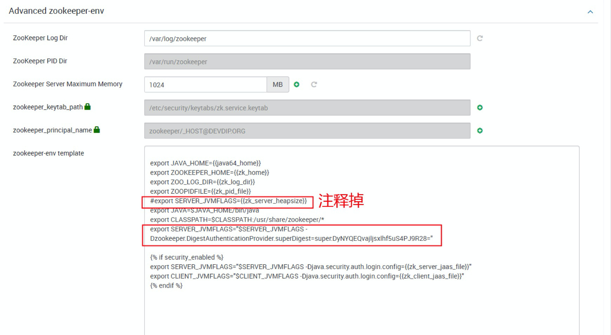

# Q&A

#### Q: hbase:meta 数据丢失

HBase keep having region in transition: 

Regions in Transition

Region State RIT time (ms)

| 1588230740                                                   | hbase:meta,,1.1588230740 state=FAILED_OPEN, ts=Thu Apr 23 12:15:49 ICT 2015 (8924s ago), server=02slave.mabu.com,60020,1429765579823 | 8924009 |
| ------------------------------------------------------------ | ------------------------------------------------------------ | ------- |
| Total number of Regions in Transition for more than 60000 milliseconds | 1                                                            |         |
| Total number of Regions in Transition                        | 1                                                            |         |

解决方案：

1. Stop HBase
2. Move your original /hbase back into place
3. Use a zookeeper cli such as "hbase zkcli"[1] and run "rmr /hbase" to delete the HBase znodes
4. Restart HBase. It will recreate the znodes

If Hbase fails to start after this, you can always try the offline Meta repair:
hbase org.apache.hadoop.hbase.util.hbck.OfflineMetaRepair

Also check for inconsistencies after HBase is up.  As the hbase user, run "hbase hbck -details". If there are inconsistencies reported, normally I would use the "ERROR" messages from the hbck output to decide on the best repair method, but since you were willing to start over just run "hbase hbck -repair".

If the above fails, you can always try the offline Meta repair:

hbase org.apache.hadoop.hbase.util.hbck.OfflineMetaRepair

[1] <http://hbase.apache.org/book.html#trouble.tools>
[2] <http://hbase.apache.org/book.html#hbck.in.depth>


[toc]
原因:hbase无法启动，只能从zookeeper内删除

### 1. 进行zookeeper命令行

```
kinit -kt /etc/security/keytabs/zk.service.keytab zookeeper/dev-dmp4.fengdai.org@DEVDIP.ORG
/usr/hdp/3.0.0.0-1634/zookeeper/bin/zkCli.sh -server dev-dmp3.fengdai.org:2181,dev-dmp4.fengdai.org:2181,dev-dmp5.fengdai.org:2181

//1.1 get查询正常, rmr删除失败,报错如下:
Authentication is not valid : rmr /hbase-secure/table/test_record
```
### 2. 为zk配置认只需操作一次，下次就不需要配了

```
cd /usr/hdp/3.0.0.0-1634/zookeeper/
java -cp "./zookeeper.jar:lib/slf4j-api-1.6.1.jar" org.apache.zookeeper.server.auth.DigestAuthenticationProvider super:password

//将拿到的账密等信息写到zookeeper 环境配置中,然后重启zookeeper
export SERVER_JVMFLAGS="$SERVER_JVMFLAGS -Dzookeeper.DigestAuthenticationProvider.superDigest=super:DyNYQEQvajljsxlhf5uS4PJ9R28="
```



### 3. 从zookeeper删除hbase的表

```
kinit -kt /etc/security/keytabs/zk.service.keytab zookeeper/dev-dmp4.fengdai.org@DEVDIP.ORG
/usr/hdp/3.0.0.0-1634/zookeeper/bin/zkCli.sh -server dev-dmp3.fengdai.org:2181,dev-dmp4.fengdai.org:2181,dev-dmp5.fengdai.org:2181
// 认证
addauth digest super:password
rmr /hbase-secure/table/test_record   //删除会操作成功
```

### 4. 删除hdfs里面hbase的表

```
kinit -kt /etc/security/keytabs/hdfs.headless.keytab hdfs-dev_dmp@DEVDIP.ORG
//删除指定表
hadoop fs -rm -r -f  /apps/hbase/data/data/default/test_record2

//重启hbase 一切正常
```

参考:
https://community.hortonworks.com/articles/82405/how-to-remove-acl-protected-zk-node.html

### hbase 数据导出导入(基于hdfs)

### 1. 数据导出至hdfs(自选版)

```
1.1 查看表列表
hbase shell
list 

1.2 导出表至hdfs
hadoop fs -mkdir /hbase-backup
hbase org.apache.hadoop.hbase.mapreduce.Export FDN_UCENTER_1_1_0_T_APP_USER /hbase-backup/FDN_UCENTER_1_1_0_T_APP_USER

```
### 2. 将备份数据打包并复制到还原服务器上

```
2.1 下载数据
hadoop fs -get /hbase-backup/FDN_UCENTER_1_1_0_T_APP_USER .

2.2 打包
tar zcf FDN_UCENTER_1_1_0_T_APP_USER.tar.gz FDN_UCENTER_1_1_0_T_APP_USER
```

### 3. 导入数据至hbase(ambari版本)
- [x] 相关创建表语句事先准备好==
```
3.1 上传数据
su - hdfs 
hadoop fs -mkdir /hbase-backup/
hadoop fs -chown root:root /hbase-backup/
exit
hadoop fs -put FDN_UCENTER_1_1_0_T_APP_USER /hbase-backup/

3.2 创建hbase表及结构(导入时表必需已存在)
su - hbase
cd /usr/hdp/3.0.0.0-1634/phoenix/bin/
./sqlline.py
CREATE TABLE IF NOT EXISTS TEST_FDN_UCENTER_1_1_0_t_app_user(
   id INTEGER NOT NULL PRIMARY KEY,
   fdn_open_id varchar ,
    fdn_created_time varchar
    )SALT_BUCKETS = 6;

3.3 导入数据至hbase 表
su - hbase
hbase org.apache.hadoop.hbase.mapreduce.Import TEST_FDN_UCENTER_1_1_0_t_app_user /hbase-backup/FDN_UCENTER_1_1_0_T_APP_USER

hbase shell
count 't1'   #验证数据条数是否一致

cd /usr/hdp/3.0.0.0-1634/phoenix/bin/
./sqlline.py
select * from t1 limit 10; #查看数据是否正确

```
