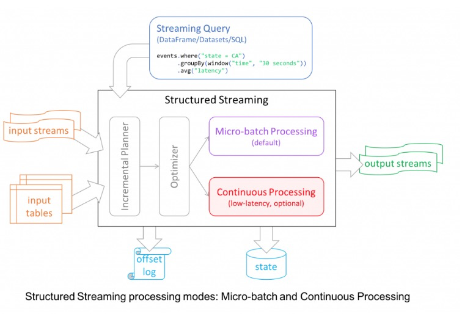

https://blog.csdn.net/guohecang/article/details/51736572

# Spark Structured Streaming和 Spark Streaming

## Spark Streaming

缺点：

- 使用 Processing Time 而不是 Event Time
- Complex, low-level api
- reason about end-to-end application
- 批流代码不统一

http://spark.coolplayer.net/?p=3647

## Spark Structured Streaming

- Incremental query model
- Support for end-to-end application
- 复用 Spark SQL 执行引擎

