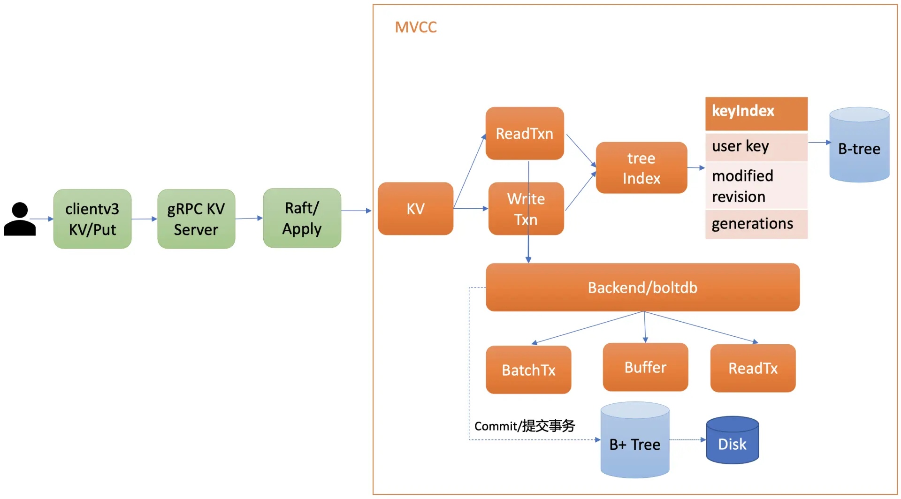

ETCD 具有强一致性、分布式、高性能的特点，但其对数据量有限制，单条数据不能大于1M，总数据量也不能超过8G左右。

故用于配置中心、分布式锁等场景。


## 性能

ETCD 从设计想要解决的场景问题就是分布式配置，配置场景一般都是读多写少，ETCD在写的方面相对比较薄弱一点，官方建议使用SSD硬盘方式。读写性能也可以通过多线程方式和增加分布式节点方式提高。

- 2CPU、4Mem 下，1K多TPS

### ETCD 与 Redis 对比

- etcd 的重点是利用 raft 算法做分布式一致性，强调各个节点之间的通信、同步，确保各节点数据和事务的一致性，使得服务发现工作更稳定；
- redis 也可以做主从同步和读写分离，但节点一致性强调的是数据，不是事务。redis 的注册和发现只能通过 pub 和 sub 实现，安全性不能保证（断线重连之后不会将历史信息推送给客户端，需要自己做一个定时轮询），延时也比 etcd v3 高。
- etcd v3 的底层采用 boltdb（基于B+ Tree） 做存储，value 直接持久化；redis 是一个内存数据库，它的持久化方案有 aof 和 rdb，在宕机时都或多或少会丢失数据。
- etcd v3 只能通过 gRPC 访问，而 redis 可以通过 http 访问，因此 etcd 的客户端开发工作量高很多。

- redis 的性能比 etcd 强。

- redis 的 value 支持多种数据类型。

- etcd 是用 go 开发的，和 k8s 在同一个生态下

## 事务

- 原子性，持久性：主要依靠 WAL + consistent index + blotdb，crash 后会根据 wal 重放保证数据不丢失
- 隔离性：主要依靠 MVCC
- 一致性：事务追求的最终目标，一致性的实现既需要数据库层面的保障，也需要应用层面的保障



http://www.jcxioo.com/2021/07/22/01_Kubernetes/etcd%20mvcc/

## 概述

- 支持事务
- 适合数据量小的场景，例如，元数据存储，不适合大数据量的业务场景
- 配置要求低
- 性能好，TPS高 https://doczhcn.gitbook.io/etcd/index/index-1/performance
- Raft 一致性算法来在成员之间复制请求并达成一致
- 部署建议使用SSD
- gRPC
- 网关可选
- 支持多版本
- 支持监控键值变化

## [Confd配合使用](https://github.com/kelseyhightower/confd)


## 命令

```
 # 查看所有keys
etcdctl get / --prefix --keys-only
 # 模糊查询
etcdctl get /services --prefix

etcdctl get /consumers --prefix
```

[其他命令](https://www.huweihuang.com/kubernetes-notes/etcd/etcdctl-v3.html)


