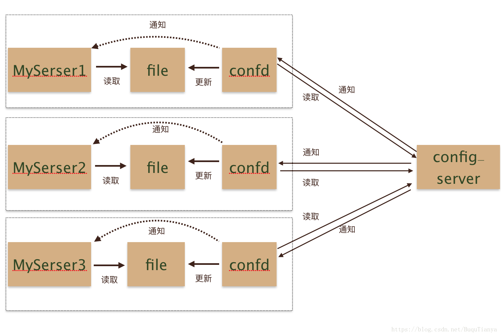

## 概述

- 支持事务
- 适合数据量小的场景，例如，元数据存储，不适合大数据量的业务场景
- 配置要求低
- 性能好，TPS高 https://doczhcn.gitbook.io/etcd/index/index-1/performance
- Raft 一致性算法来在成员之间复制请求并达成一致
- 部署建议使用SSD
- gRPC
- 网关可选
- 支持多版本
- 支持监控键值变化

## [Confd配合使用](https://github.com/kelseyhightower/confd)



## 命令

```
 # 查看所有keys
 etcdctl get / --prefix --keys-only
```

[其他命令](https://www.huweihuang.com/kubernetes-notes/etcd/etcdctl-v3.html)


