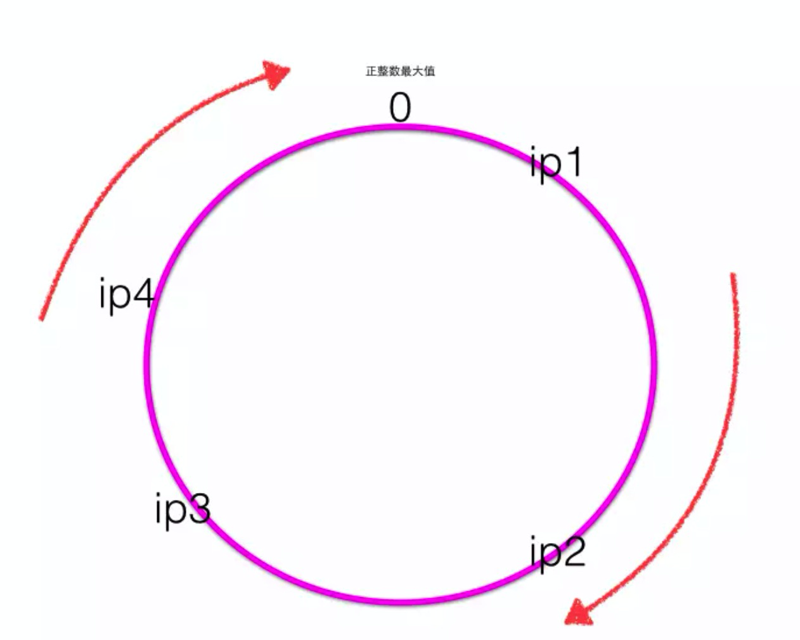
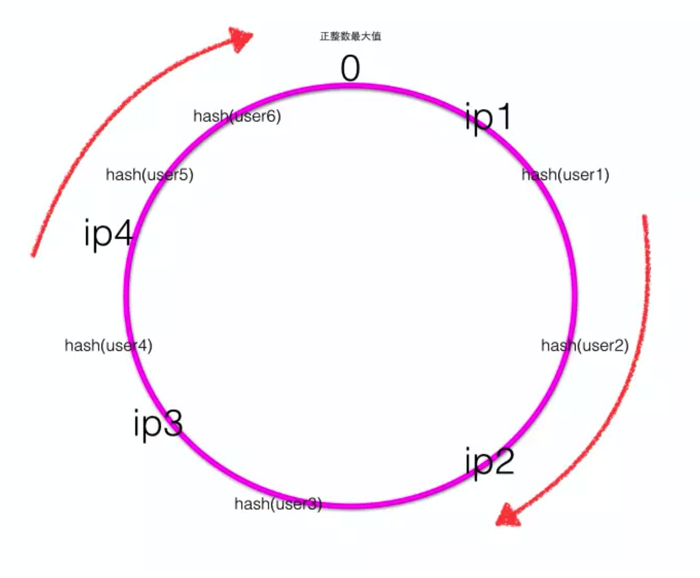
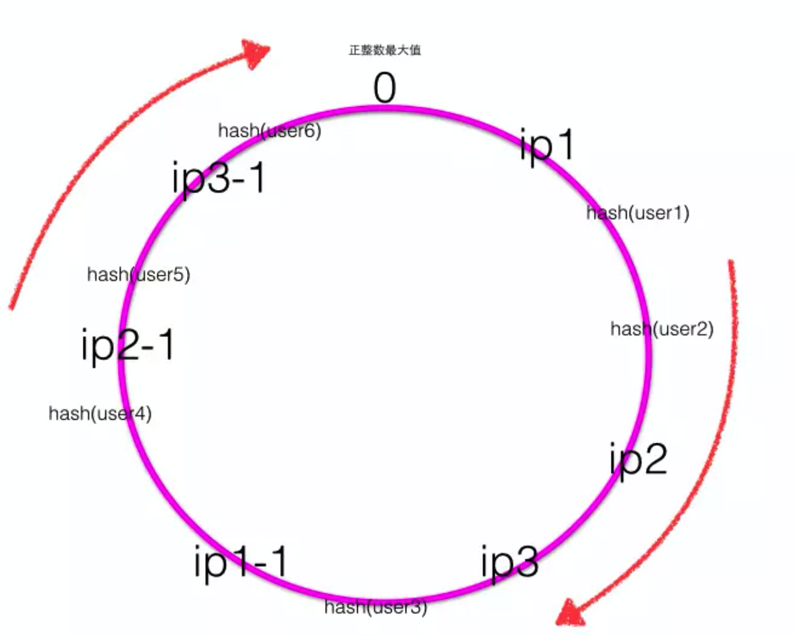

# 一致性Hash原理

传统的一致性Hash我们都是通过 hash 取模的方式实现的，但这个存在一个问题，**当服务节点存在下线和上线的时候，就会碰到所有的数据或者请求都要进行重新计算。**

## Hash 环

hash环上顺时针从整数0开始，一直到最大正整数，我们根据四个ip计算的hash值肯定会落到这个hash环上的某一个点，至此我们把服务器的四个ip映射到了一致性hash环

**当用户在客户端进行请求时候，首先根据hash(用户id)计算路由规则（hash值），然后看hash值落到了hash环的那个地方，根据hash值在hash环上的位置顺时针找距离最近的ip作为路由ip。**

当服务器出现宕机或者服务新增的时候，只会影响部分的客户端请求，例如，ip2宕机，user1、user2请求会放到ip3上。

## 一致性hash的特性

单调性(Monotonicity)：单调性是指如果已经有一些请求通过哈希分派到了相应的服务器进行处理，又有新的服务器加入到系统中时候，应保证原有的请求可以被映射到原有的或者新的服务器中去，而不会被映射到原来的其它服务器上去。  这个通过上面新增服务器ip5可以证明，新增ip5后，原来被ip1处理的user6现在还是被ip1处理，原来被ip1处理的user5现在被新增的ip5处理。

分散性(Spread)：分布式环境中，客户端请求时候可能不知道所有服务器的存在，可能只知道其中一部分服务器，在客户端看来他看到的部分服务器会形成一个完整的hash环。如果多个客户端都把部分服务器作为一个完整hash环，那么可能会导致，同一个用户的请求被路由到不同的服务器进行处理。这种情况显然是应该避免的，因为它不能保证同一个用户的请求落到同一个服务器。所谓分散性是指上述情况发生的严重程度。好的哈希算法应尽量避免尽量降低分散性。 一致性hash具有很低的分散性。

平衡性(Balance)：平衡性也就是说负载均衡，是指客户端hash后的请求应该能够分散到不同的服务器上去。一致性hash可以做到每个服务器都进行处理请求，但是不能保证每个服务器处理的请求的数量大致相同

## 增加平衡性方法

### 增加虚拟节点

当服务器节点比较少的时候会出现上节所说的一致性hash倾斜的问题，一个解决方法是多加机器，但是加机器是有成本的，那么就加虚拟节点

但如果hash算法不是特别的好的话，仍旧会存在，不均衡的情况存在。

## 参考阅读

https://www.jianshu.com/p/e968c081f563