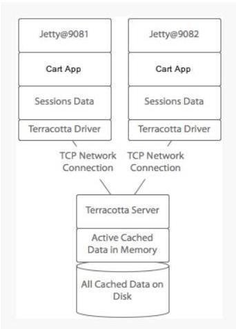

# 分布式面试

## 微服务与单体的根本区别

微服务是假设服务一定存在出错，我们怎么办？，而单体是追求服务不出现问题。

## 微服务与Service Mesh的关系

Service Mesh 让微服务应用可以更加专注于自身的业务实现上，对于公共的网络相关的 TCP/IP 通信、熔断、服务注册与发现、动态配置、限流、监控、追踪、超时/重试部分都由 Service Mesh 完成。

对微服务本身没有侵入性，相比于当前的 Spring Cloud 生态圈中的应用集成更加友好。将原先开发完成的活，移接到到运维侧。相比于 Spring  Cloud 生态只能支持 Java 语言，而Service Mesh是可以跨语言的。

Service Mesh 与 微服务不存在冲突，更多与 Spring Cloud 生态圈有着冲击，当使用 Service Mesh 时，例如 Config、Sleuth 之类的就可以被替代。

## 微服务相比于单体应用带来的优势与问题？

微服务相比于单体应用最直观的感受就是应用变小了，数量变多了，服务发布频率和性能变高了。微服务就是单体服务的横向扩展方案。

微服务随之带来了分布式中遇到的问题，例如事务、锁、服务治理、监控、部署效率等一系列的问题。那么如何去解决这些问题就成了微服务生态圈急需要解决的，从而产生了Spring Cloud生态圈中的优质应用和容器化部署方案。

## 单体应用相比于微服务架构存在什么问题？

- 更新迭代效率低，修改一行代码可能影响很多地方，导致测试回归工作量加大
- 可测性低，比如一个下单购买的链路，单体应用测试需要测试完整的下单支付的过程，但如果微服务架构下面，订单测试人员只需要关注订单这块，支付测试人员只需要关注支付这一块；
- 拓展性差
  - 表现不仅仅在新增一个功能上，还有语言上，一个单体应用往往对编程语言也做了相应的限制，一般都是一种语言模式，但每一种语言都有存在其强项的应用场景，例如：Python在机器学习和爬虫方面、Go在性能方面等，微服务对语言是没有限制的；
  - 单体聚合了应用所有的功能，有些还是跨业务的，还是以下单为例，一个支付下单包含了商品、支付、供应链等多个业务线，往往分别由不同的开发者进行维护，当一个人改了一行代码之后，由于对其他业务的不了解，可能就会出现连锁反应，导致诸多问题；
  - 拓展功能时一般都是以jar静态的形式，而不是服务化动态方式，一旦需要新增一个功能或者修复一个bug，需要重启服务，导致整个项目所有的功能都不可用；
  - 只能横向拓展，有时候服务的压力是集中在某一个或某些接口上，为了这些接口的性能问题，需要部署多台服务，浪费大量的资源。
- 沟通成本高，上面已经提到一个应用可能跨多个业务，更新一行代码势必需要知道其他业务线的业务情况，从而加大了沟通的成本；

## 微服务的好处

- 更新迭代速度快
  - 一个应用往往由多个微服务组成，服务与服务之间存在明显的边界，服务之间是解耦的，当一个服务需要更新时，不会导致其他服务也不可用；

## 微服务的问题

- 存在网络开销，单体应用时代，所有功能都集成在一起，不存在服务间的调用，微服务时代，一个应用往往都由多个微服务组成，服务之间一般都存在相互调用的可能性，相应的就存在调用的网络开销，不过这部分的开销非在极端环境下，性能损失可以忽略不计；
- 调用链路管理问题，服务间存在相互调用，从而存在调用环路的问题，不过已经存在 zeppkin和skywalking 这类治理工具，可以查看调用链路，及时发现调用中的问题；
- 运维压力增加，服务增多，势必增加部署的工作量，不过以K8s为首的容器化部署带来了解决方案，相应的CI/CD、DewOps 方法论解放运维压力；

分布式事务

指事务的每个操作步骤都位于不同的节点上，需要保证事务的 AICD 特性。

1. 产生原因

数据库分库分表；

SOA 架构，比如一个电商网站将订单业务和库存业务分离出来放到不同的节点上。

2. 应用场景

下单：减少库存同时更新订单状态。库存和订单不在不同一个数据库，因此涉及分布式事务。

支付：买家账户扣款同时卖家账户入账。买家和卖家账户信息不在同一个数据库，因此涉及分布式事务。

3. 解决方案

3.1 两阶段提交协议

两阶段提交协议可以很好得解决分布式事务问题，它可以使用 XA 来实现，XA 它包含两个部分：事务管理器和本地资源管理器。其中本地资源管理器往往由数据库实现，比如 Oracle、DB2 这些商业数据库都实现了 XA 接口，而事务管理器作为全局的协调者，负责各个本地资源的提交和回滚。

3.2 消息中间件

消息中间件也可称作消息系统 (MQ)，它本质上是一个暂存转发消息的一个中间件。在分布式应用当中，我们可以把一个业务操作转换成一个消息，比如支付宝的余额转如余额宝操作，支付宝系统执行减少余额操作之后向消息系统发一个消息，余额宝系统订阅这条消息然后进行增加账户金额操作。

3.2.1 消息处理模型

点对点

.

发布/订阅

.

3.2.2 消息的可靠性

消息的发送端的可靠性：发送端完成操作后一定能将消息成功发送到消息系统。

消息的接收端的可靠性：接收端仅且能够从消息中间件成功消费一次消息。

发送端的可靠性

在本地数据建一张消息表，将消息数据与业务数据保存在同一数据库实例里，这样就可以利用本地数据库的事务机制。事务提交成功后，将消息表中的消息转移到消息中间件，若转移消息成功则删除消息表中的数据，否则继续重传。

接收端的可靠性

保证接收端处理消息的业务逻辑具有幂等性：只要具有幂等性，那么消费多少次消息，最后处理的结果都是一样的。

保证消息具有唯一编号，并使用一张日志表来记录已经消费的消息编号。

负载均衡的算法与实现

1. 算法

1.1 轮询（Round Robin）

轮询算法把每个请求轮流发送到每个服务器上。下图中，一共有 6 个客户端产生了 6 个请求，这 6 个请求按 (1, 2, 3, 4, 5, 6) 的顺序发送。最后，(1, 3, 5) 的请求会被发送到服务器 1，(2, 4, 6) 的请求会被发送到服务器 2。

.

该算法比较适合每个服务器的性能差不多的场景，如果有性能存在差异的情况下，那么性能较差的服务器可能无法承担多大的负载。下图中，服务器 2 的性能比服务器 1 差，那么服务器 2 可能无法承担多大的负载。

.

1.2 加权轮询（Weighted Round Robbin）

加权轮询是在轮询的基础上，根据服务器的性能差异，为服务器赋予一定的权值。例如下图中，服务器 1 被赋予的权值为 5，服务器 2 被赋予的权值为 1，那么 (1, 2, 3, 4, 5) 请求会被发送到服务器 1，(6) 请求会被发送到服务器 2。

.

1.3 最少连接（least Connections）

由于每个请求的连接时间不一样，使用轮询或者加权轮询算法的话，可能会让一台服务器当前连接数多大，而另一台服务器的连接多小，造成负载不均衡。例如下图中，(1, 3, 5) 请求会被发送到服务器 1，但是 (1, 3) 很快就断开连接，此时只有 (5) 请求连接服务器 1；(2, 4, 6) 请求被发送到服务器 2，它们的连接都还没有断开，继续运行时，服务器 2 会承担多大的负载。

.

最少连接算法就是将请求发送给当前最少连接数的服务器上。例如下图中，服务器 1 当前连接数最小，那么请求 6 就会被发送到服务器 1 上。

.

1.4 加权最小连接（Weighted Least Connection）

在最小连接的基础上，根据服务器的性能为每台服务器分配权重，然后根据权重计算出每台服务器能处理的连接数。

.

1.5 随机算法（Random）

把请求随机发送到服务器上。和轮询算法类似，该算法比较适合服务器性能差不多的场景。

.

2. 实现

2.1 DNS 解析

使用 DNS 作为负载均衡器，会根据负载情况返回不同服务器的 IP 地址。大型网站基本使用了这种方式最为第一级负载均衡手段，然后在内部在第二级负载均衡。

.

2.2 修改 MAC 地址

使用 LVS（Linux Virtual Server）这种链路层负载均衡器，根据负载情况修改请求的 MAC 地址。

.

2.3 修改 IP 地址

在网络层修改请求的目的 IP 地址。

.

2.4 HTTP 重定向

HTTP 重定向负载均衡服务器收到 HTTP 请求之后会返回服务器的地址，并将该地址写入 HTTP 重定向响应中返回给浏览器，浏览器收到后再次发送请求。

.

2.5 反向代理

正向代理：发生在客户端，是由用户主动发起的。比如翻墙，客户端通过主动访问代理服务器，让代理服务器获得需要的外网数据，然后转发回客户端。

反向代理：发生在服务器端，用户不知道发生了代理。

.

分布式锁

Java 提供了两种内置的锁的实现，一种是由 JVM 实现的 synchronized 和 JDK 提供的 Lock，当你的应用是单机或者说单进程应用时，可以使用 synchronized 或 Lock 来实现锁。当应用涉及到多机、多进程共同完成时，那么这时候就需要一个全局锁来实现多个进程之间的同步。

1. 使用场景

例如一个应用有手机 APP 端和 Web 端，如果在两个客户端同时进行一项操作时，那么就会导致这项操作重复进行。

2. 实现方式

2.1 数据库分布式锁

基于 MySQL 锁表

该实现方式完全依靠数据库唯一索引来实现。当想要获得锁时，就向数据库中插入一条记录，释放锁时就删除这条记录。如果记录具有唯一索引，就不会同时插入同一条记录。这种方式存在以下几个问题：

锁没有失效时间，解锁失败会导致死锁，其他线程无法再获得锁。

只能是非阻塞锁，插入失败直接就报错了，无法重试。

不可重入，同一线程在没有释放锁之前无法再获得锁。

采用乐观锁增加版本号

根据版本号来判断更新之前有没有其他线程更新过，如果被更新过，则获取锁失败。

2.2 Redis 分布式锁

基于 SETNX、EXPIRE

使用 SETNX（set if not exist）命令插入一个键值对时，如果 Key 已经存在，那么会返回 False，否则插入成功并返回 True。因此客户端在尝试获得锁时，先使用 SETNX 向 Redis 中插入一个记录，如果返回 True 表示获得锁，返回 False 表示已经有客户端占用锁。

EXPIRE 可以为一个键值对设置一个过期时间，从而避免了死锁的发生。

RedLock 算法

ReadLock 算法使用了多个 Redis 实例来实现分布式锁，这是为了保证在发生单点故障时还可用。

尝试从 N 个相互独立 Redis 实例获取锁，如果一个实例不可用，应该尽快尝试下一个。

计算获取锁消耗的时间，只有当这个时间小于锁的过期时间，并且从大多数（N/2+1）实例上获取了锁，那么就认为锁获取成功了。

如果锁获取失败，会到每个实例上释放锁。

2.3 Zookeeper 分布式锁

Zookeeper 是一个为分布式应用提供一致性服务的软件，例如配置管理、分布式协同以及命名的中心化等，这些都是分布式系统中非常底层而且是必不可少的基本功能，但是如果自己实现这些功能而且要达到高吞吐、低延迟同时还要保持一致性和可用性，实际上非常困难。

抽象模型

Zookeeper 提供了一种树形结构级的命名空间，/app1/p_1 节点表示它的父节点为 /app1。

.

节点类型

永久节点：不会因为会话结束或者超时而消失；

临时节点：如果会话结束或者超时就会消失；

有序节点：会在节点名的后面加一个数字后缀，并且是有序的，例如生成的有序节点为 /lock/node-0000000000，它的下一个有序节点则为 /lock/node-0000000001，依次类推。

监听器

为一个节点注册监听器，在节点状态发生改变时，会给客户端发送消息。

分布式锁实现

创建一个锁目录 /lock。

在 /lock 下创建临时的且有序的子节点，第一个客户端对应的子节点为 /lock/lock-0000000000，第二个为 /lock/lock-0000000001，以此类推。

客户端获取 /lock 下的子节点列表，判断自己创建的子节点是否为当前子节点列表中序号最小的子节点，如果是则认为获得锁，否则监听自己的前一个子节点，获得子节点的变更通知后重复此步骤直至获得锁；

执行业务代码，完成后，删除对应的子节点。

会话超时

如果一个已经获得锁的会话超时了，因为创建的是临时节点，因此该会话对应的临时节点会被删除，其它会话就可以获得锁了。可以看到，Zookeeper 分布式锁不会出现数据库分布式锁的死锁问题。

羊群效应

在步骤二，一个节点未获得锁，需要监听监听自己的前一个子节点，这是因为如果监听所有的子节点，那么任意一个子节点状态改变，其它所有子节点都会收到通知，而我们只希望它的下一个子节点收到通知。

分布式 Session

如果不做任何处理的话，用户将出现频繁登录的现象，比如集群中存在 A、B 两台服务器，用户在第一次访问网站时，Nginx 通过其负载均衡机制将用户请求转发到 A 服务器，这时 A 服务器就会给用户创建一个 Session。当用户第二次发送请求时，Nginx 将其负载均衡到 B 服务器，而这时候 B 服务器并不存在 Session，所以就会将用户踢到登录页面。这将大大降低用户体验度，导致用户的流失，这种情况是项目绝不应该出现的。

1. 粘性 Session

原理

粘性 Session 是指将用户锁定到某一个服务器上，比如上面说的例子，用户第一次请求时，负载均衡器将用户的请求转发到了 A 服务器上，如果负载均衡器设置了粘性 Session 的话，那么用户以后的每次请求都会转发到 A 服务器上，相当于把用户和 A 服务器粘到了一块，这就是粘性 Session 机制。

优点

简单，不需要对 Session 做任何处理。

缺点

缺乏容错性，如果当前访问的服务器发生故障，用户被转移到第二个服务器上时，他的 Session 信息都将失效。

适用场景

发生故障对客户产生的影响较小；

服务器发生故障是低概率事件。

2. 服务器 Session 复制

原理

任何一个服务器上的 Session 发生改变，该节点会把这个 Session 的所有内容序列化，然后广播给所有其它节点，不管其他服务器需不需要 Session，以此来保证 Session 同步。

优点

可容错，各个服务器间 Session 能够实时响应。

缺点

会对网络负荷造成一定压力，如果 Session 量大的话可能会造成网络堵塞，拖慢服务器性能。

实现方式

设置 Tomcat 的 server.xml 开启 tomcat 集群功能。

在应用里增加信息：通知应用当前处于集群环境中，支持分布式，即在 web.xml 中添加 选项。

3. Session 共享机制

使用分布式缓存方案比如 Memcached、Redis，但是要求 Memcached 或 Redis 必须是集群。

使用 Session 共享也分两种机制，两种情况如下：

3.1 粘性 Session 共享机制

和粘性 Session 一样，一个用户的 Session 会绑定到一个 Tomcat 上。Memcached 只是起到备份作用。

.

3.2 非粘性 Session 共享机制

原理

Tomcat 本身不存储 Session，而是存入 Memcached 中。Memcached 集群构建主从复制架构。

.

优点

可容错，Session 实时响应。

实现方式

用开源的 msm 插件解决 Tomcat 之间的 Session 共享：Memcached_Session_Manager（MSM）

4. Session 持久化到数据库

原理

拿出一个数据库，专门用来存储 Session 信息。保证 Session 的持久化。

优点

服务器出现问题，Session 不会丢失

缺点

如果网站的访问量很大，把 Session 存储到数据库中，会对数据库造成很大压力，还需要增加额外的开销维护数据库。

5. Terracotta 实现 Session 复制

原理

Terracotta 的基本原理是对于集群间共享的数据，当在一个节点发生变化的时候，Terracotta 只把变化的部分发送给 Terracotta 服务器，然后由服务器把它转发给真正需要这个数据的节点。它是服务器 Session 复制的优化。

.

优点

这样对网络的压力就非常小，各个节点也不必浪费 CPU 时间和内存进行大量的序列化操作。把这种集群间数据共享的机制应用在 Session 同步上，既避免了对数据库的依赖，又能达到负载均衡和灾难恢复的效果。

分库与分表带来的分布式困境与应对之策

.

1. 事务问题

使用分布式事务。

2. 查询问题

使用汇总表。

3. ID 唯一性

使用全局唯一 ID：GUID；

为每个分片指定一个 ID 范围。