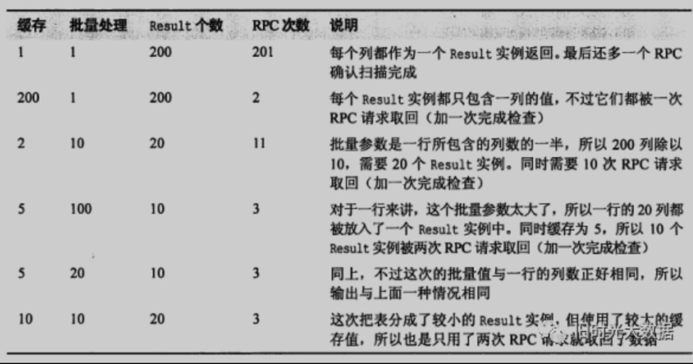
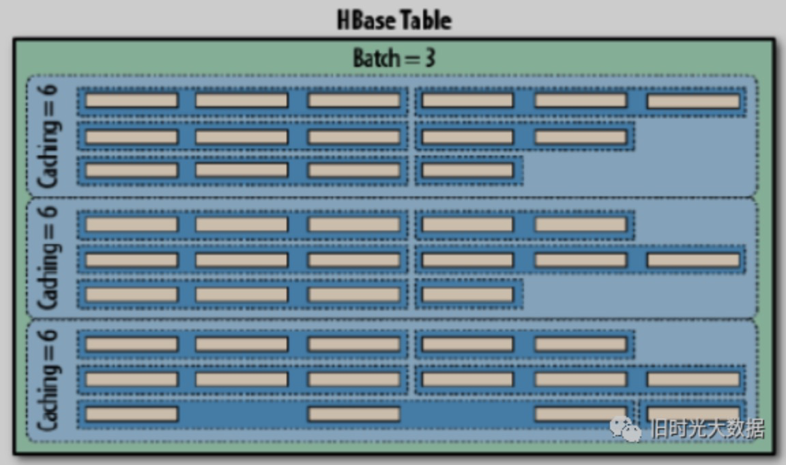

# HBase 面试题

### HBase的特点是什么？

1. hbase是一个分布式的，基于列式存储的数据库，基于hadoop的hdfs存储，zookeeper进行管理。

2. hbase 适合存储半结构化或非结构化的数据，比如数据结构字段不够确定或者杂乱无章很难按照一个概念去抽取的数据。

3. hbase的存储效率比较高，为null的数据不会被存储。

4. hbase的表包含rowKey、列族和列，存储数据的最小单元是单元格，单元格包含数据及其对应的写入时间戳，新写入数据时，附带写入时间戳，可以查询到之前写入的多个版本。

5. hbase是主从结构，hmaster作为主节点，hregionServer作为从节点。

### Hbase的数据存储模型

答：Hbase 中的每张表都通过行键(rowkey)按照一定的范围被分割成多个子表（HRegion），默认一个 HRegion 超过 256M 就要被分割成两个，由 HRegionServer 管理，管理哪些 HRegion由 Hmaster 分配。HRegion 存取一个子表时，会创建一个 HRegion 对象，然后对表的每个列族（Column Family）创建一个 store 实例，每个 store 都会有 0 个或多个 StoreFile 与之对应，每个 StoreFile 都会对应一个 HFile， HFile 就是实际的存储文件；一个 HRegion 还拥有一个 MemStore 实例。 

### 简述compact

**简述HBASE中compact用途是什么，什么时候触发，分为哪两种，有什么区别，有哪些相关配置参数?**

答：在 hbase 中每当有 memstore 数据 flush 到磁盘之后，就形成一个 storefile，当 storeFile 的数量达到一定程度后，就需要将 storefile 文件来进行 compaction 操作。

Compact 的作用：     

1>.合并文件     

2>.清除过期，多余版本的数据    

 3>.提高读写数据的效率 HBase 中实现了两种 

compaction 的方式：

minor and major。

**这两种 compaction 方式的区别是：** 

 1、 Minor 操作只用来做部分文件的合并操作以及包括 minVersion=0，并且设置 ttl 的过期版本清理，不做任何删除数据、多版本数据的清理工作。 

 2、 Major 操作是对 Region 下的 HStore 下的所有 StoreFile 执行合并操作，最终的结果是整理合并出一个文件。

### 描述HBase HMaster HA故障转移过程？

答：宕机分为 HMaster 宕机和 HRegisoner 宕机，如果是 HRegisoner 宕机， HMaster 会将其所管理的 region 重新分布到其他活动的 RegionServer 上，由于数据和日志都持久在 HDFS中，该操作不会导致数据丢失。所以数据的一致性和安全性是有保障的。如果是 HMaster 宕机，会通过Zookeeper 的 Master Election 机制重新选出一个正在运行的Master 进程作为活跃节点，继续提供服务。

### HBase适用于怎样的情景？

1.半结构化或非结构化数据：

对于数据结构字段不够确定或杂乱无章非常难按一个概念去进行抽取的数据适合用HBase，因为HBase支持动态添加列。

2.记录很稀疏：

关系型数据库的列的数量是相对稳定的，null值也会占据存储位，为null的列浪费了存储空间。HBase为null的Column不会被存储，这样既节省了空间又提高了读性能。

3.多版本数据：

依据Row key和Column key定位到的Value能够有随意数量的版本号值，因此对于需要存储变动历史记录的数据，用HBase是很方便的。比如某个用户的Address变更，其变更记录也许也是具有研究意义的。

4.仅要求最终一致性：

对于数据存储事务的要求不像金融行业和财务系统这么高，只要保证最终一致性就行。

5.要求高可用性和支持海量数据以及很大的瞬间写入量：

 1）WAL解决高可用，支持PB级数据，写入性能高。

 2）索引插入比查询操作更频繁的情况。比如，对于历史记录表和日志文件。（HBase的写操作更加高效）。

### HBase的rowkey 设计原则

① Rowkey 长度原则

Rowkey 是一个二进制码流，一般是10~100个字节，建议越短越好，不超过16字节为宜。Rowkey 长度要保持一致。

② Rowkey 散列原则

如果Rowkey 是按时间戳的方式递增，不要将时间放在二进制码的前面，建议将Rowkey的高位作为散列字段，由程序循环生成，低位放时间字段，这样将提高数据均衡分布在每个Regionserver 实现负载均衡的几率。如果没有散列字段，首字段直接是时间信息将产生所有新数据都在一个 RegionServer 上堆积的热点现象，这样在做数据检索的时候负载将会集中在个别 RegionServer，降低查询效率。

③ Rowkey 唯一原则

必须在设计上保证其唯一性。 

### 如何提高HBase集群的读写性能

1. 开启 bloomfilter 过滤器，开启 bloomfilter 比没开启查询要快 3、4 倍。

2. Hbase 对于内存有特别的需求，在硬件允许的情况下配足够多的内存给它。

3. 增大 RPC 数量，通过修改 hbase-site.xml 中的 hbase.regionserver.handler.count 属性，可以适当的放大RPC 数量，默认值为 10 有点小。

### HRegionServer宕机后，此台机器的region数据的转移过程？

1. ZooKeeper 会监控 HRegionServer 的上下线情况，当 ZK 发现某个 HRegionServer 宕机之后会通知 HMaster 进行失效备援；

2. HRegionServer 会停止对外提供服务，就是它所负责的 region 暂时停止对外提供服务；

3. HMaster 会将该 HRegionServer 所负责的 region 转移到其他 HRegionServer 上，并且会对 HRegionServer 上存在 memstore 中还未持久化到磁盘中的数据进行恢复；

**这个恢复的工作是由 WAL重播 来完成，这个过程如下：**

wal实际上就是一个文件，存在/hbase/WAL/对应RegionServer路径下，宕机发生时，读取该RegionServer所对应的路径下的wal文件，然后根据不同的region切分成不同的临时文件recover.edits。当region被分配到新的RegionServer中，RegionServer读取region时会判断是否存在recover.edits，如果有则进行恢复。

### 请描述HBase中scan对象的setCache和setBatch方法的使用？

   setCache用于设置缓存，即设置一次RPC请求可以获取多行数据。对于缓存操作，如果行的数据量非常大，多行数据有可能超过客户端进程的内存容量，由此引入批量处理这一解决方案。 

   setBatch 用于设置批量处理，批量可以让用户选择每一次ResultScanner实例的next操作要取回多少列，例如，在扫描中设置setBatch(5)，则一次next()返回的Result实例会包括5列。如果一行包括的列数超过了批量中设置的值，则可以将这一行分片，每次next操作返回一片，当一行的列数不能被批量中设置的值整除时，最后一次返回的Result实例会包含比较少的列，如，一行17列，batch设置为5，则一共返回4个Result实例，这4个实例中包括的列数分别为5、5、5、2。 

   组合使用扫描器缓存和批量大小，可以让用户方便地控制扫描一个范围内的行键所需要的RPC调用次数。**Cache设置了服务器一次返回的行数，而Batch设置了服务器一次返回的列数**。

   假如我们建立了一张有两个列族的表，添加了10行数据，每个行的每个列族下有10列，这意味着整个表一共有200列（或单元格，因为每个列只有一个版本），其中每行有20列。



① Batch参数决定了一行数据分为几个Result，它只针对一行数据，Batch再大，也只能将一行的数据放入一个Result中。所以当一行数据有10列，而Batch为100时，也只能将一行的所有列都放入一个Result，不会混合其他行；

② 缓存值决定一次RPC返回几个Result，根据Batch划分的Result个数除以缓存个数可以得到RPC消息个数（之前定义缓存值决定一次返回的行数，这是不准确的，准确来说是决定一次RPC返回的Result个数，由于在引入Batch之前，一行封装为一个Result，因此定义缓存值决定一次返回的行数，但引入Batch后，更准确的说法是缓存值决定了一次RPC返回的Result个数）；

  RPC请求次数 = （行数 * 每行列数） / Min（每行的列数，批量大小） / 扫描器缓存

   下图展示了缓存和批量两个参数如何联动，下图中有一个包含9行数据的表，每行都包含一些列。使用了一个缓存为6、批量大小为3的扫描器，需要三次RPC请求来传送数据：



### 描述HBase中region太小和region太大带来的问题？

答：Region过小会发生多次compaction，将数据读一遍并重写一遍到hdfs上，占用io，region过大会造成多次split，region 会下线，影响访问服务。

### 在HBase中什么是列族？

ColumnFamily: 列族, HBase引入的概念：

将多个列聚合成一个列族。可以理解成MySQL的垂直分区（将一张宽表，切分成几张不那么宽的表）。此机制引入的原因，是因为HBase相信，查询可能并不需要将一整行的所有列数据全部返回。（就像我们往往在写SQL时不太会写select *一样）。列族会对应到文件存储结构（不同的ColumnFamily会写入不同的文件）。

### 解释Hbase如何实际删除一行

在Hbase中的删除过程中，major过程删除标记，而minor则不会。在正常删除中，它会导致删除逻辑删除标记 - 它们表示的这些删除数据在压缩过程中被删除。

此外，假如删除数据并增加更多数据，但时间戳早于逻辑删除时间戳，则删除/逻辑删除标记可能会掩盖进一步的获取，因而在major之前您将不会收到插入的值。

### 介绍下RowFilter

参考答案：RowFilter就是对rowkey进行过滤，那么rowkey的过滤无非就是相等（EQUAL）、大于(GREATER)、小于(LESS)，大于等于(GREATER_OR_EQUAL)，小于等于(LESS_OR_EQUAL)和不等于(NOT_EQUAL)几种过滤方式。Hbase中的RowFilter采用比较符结合比较器的方式来进行过滤。

比较器的类型有：BinaryComparator、BinaryPrefixComparator、NullComparator、BitComparator、RegexStringComparator、SubStringComparator

### 简述下HBASE中split机制

参考答案：HBase中为了使得HRegion不至于太大（默认是10G），那么当HRegion太大的时候，就需要对HRegion进行切分（split）。

split有三种方式：

1）pre-split（预切分），可以根据传入的参数计算出HBase表需要存储多大的数据，在创建表的时候预先给表切分好HRegion。如下面的例子：

```shell
//根据参数给表预先切分4个HRegion
create 'test_pre_split','f',split => ['10','20','30']
```

2）Auto-split（自动切分），当一个Region达到一定的大小的时候，这个Region会自动切分成两个Region。

3）Force-split（手工切分），通过命令手动的去切分某个需要切分的HRegion。可以在hbase shell中通过命令split table_name，rowkey；还可以在HBase的Web UI上进行切分。

### 为什么 HBase 不适合做批量扫描数据？

HBase是LSM-Tree架构的数据库，这导致了HBase读取数据路径比较长，从内存到磁盘，可能还需要读多个HFile文件做版本合并。

### 如何解决热点问题？

- 使用 UUID
- 时间戳倒序

### HBase 查数据

① HRegionServer 保存着 meta 表以及表数据，要访问表数据，首先 Client 先去访问zookeeper，从 zookeeper 里面获取 meta 表所在的位置信息，即找到这个 meta 表在哪个HRegionServer 上保存着。

② 接着 Client 通过刚才获取到的 IP 访问对应的HRegionServer，获取到 Meta 表中存放的元数据。

③ Client 通过元数据中存储的信息，访问对应的 HRegionServer，然后扫描所在HRegionServer 的 Memstore 和 Storefile 来查询数据。

④ 最后 HRegionServer 把查询到的数据响应给 Client。

### HBase 写入的过程

① Client 先访问 zookeeper，找到 Meta 表，并获取 Meta 表元数据。

② 确定当前将要写入的数据所对应的 HRegion 和 HRegionServer 服务器。

③ Client 向该 HRegionServer 服务器发起写入数据请求，然后 HRegionServer 收到请求并响应。 

④ Client 先把数据写入到 HLog，以防止数据丢失。

⑤ 然后将数据写入到 Memstore。

⑥ 如果 HLog 和 Memstore 均写入成功，则这条数据写入成功

⑦ 如果 Memstore 达到阈值，会把 Memstore 中的数据 flush 到 Storefile 中。

⑧ 当 Storefile 越来越多，会触发 Compact 合并操作，把过多的 Storefile 合并成一个大的 Storefile。

⑨ 当 Storefile 越来越大，Region 也会越来越大，达到阈值后，会触发 Split 操作，将Region 一分为二。

### HBase 如何保障写的速度快

- 数据客户端进行缓冲，批量提交
- 客户端缓存 Meta 元数据信息，不用每次HBase操作都查询一遍
- 每次 memStore 刷写数据，都会**新创建一个文件**
- 不在原有数据上进行修改

### HBase 是什么时候进行数据的排序的

MemStore

### HBase 的删除操作

**delete 数据并不是把原有的数据立即删除**，而仅仅是做一个标记操作，真实的数据会在后面的 `Major Compaction` 过程中删除的。

### HBase 如何防止存在小文件？

数据不直接存储到 HFile ，而是先存储到 memStore 中，数据量达到一定数量级之后，刷写到一个新的 HFile 中。

### MemStore 的特点

- 一个列族一个 MemStore
- 纯内存
- **同一个 Region 里面可能会包含多个 MemStore**。
- 会对数据进行排序，再刷写到 HFile 中
- 当一个 MemStore flush 发生时，**属于同一个 region 的 memStore 会一起 flush** 。
- 在持久化写入之前，在内存中对 Rows/Cells 可以做某些优化。比如，当数据的 version 被设为1的时候，对于某些 CF 的一些数据，Memstore 缓存了数个对该 Cell 的更新，在写入 HFile 的时候，仅需要保存一个最新的版本就好了，其他的都可以直接抛弃。

### MemStore Flush 触发情况

- MemStore 的大小达到单个 MemStore 阀值
- RegionServer 中所有 MemStore 使用率超过 RegionServer 中 MemStore 上限值，**该 Server 上所有 MemStore 会执行 flush** ，从资源占用最大的 MemStore 开始 flush，直到完成或者小于 RegionServer 中 MemStore 安全值
- RegionServer 中WAL 超过 WAL 阀值

#### 频繁 Flush 导致的小文件问题如何解决？

HBase 有专门的 HFile 合并处理 (HFile Compaction Process)。HBase 会周期性的合并数个小HFile为一个大的 HFile。

> 这里的HFile 合并处理与 Region合并是两个不同的操作。

### HBase 如何防止 MemStore 异常导致数据丢失？

HBase 中加入了 WAL，在追加数据到 MemStore 前，数据线存储到 WAL 中，WAL 是直接写入磁盘中。

### 关于 WAL？

- WAL 文件里面包含一系列的修改，包含当前修改是对应哪个 Region 的
- 数据是按照修改时间进行追加
- 当 WAL 文件越来越大，这个文件最终是会被关闭的，然后再创建一个新的 active WAL 文件用于存储后面的更新
- 一个 RegionServer 里面的 Regions 共用一个 WAL 日志
- **只有一个 WAL 文件处于 active 状态**
- WAL 进行 Rolled 时，会触发当前 RegionServer 中的 MemStore Flush 

### 什么时候会触发 WAL 的 Rolled操作？

- WAL 文件的大小达到了 HDFS 块大小的 50%（HBase 2.0.0 之前是 95%，详见 [HBASE-19148](https://www.iteblog.com/redirect.php?url=aHR0cHM6Ly9pc3N1ZXMuYXBhY2hlLm9yZy9qaXJhL2Jyb3dzZS9IQkFTRS0xOTE0OA==&article=true)）
- HBase 也会定时去 Rolling WAL 文件，默认是一小时。

### WAL 对恢复数据的影响？

 HBase 在使用 WAL 文件恢复数据的时候，对应的 Region 是无法提供服务的，所以**尽量保持少一些的 WAL 文件**。

### Region 的特点？

可以理解为一张表的有序数据切片。

- 一个 Region 只能属于 HBase 一张表
- 一个 Region 可以包含多列族（HStore ）

### 每个 region 有三个主要要素:

- 它所属于哪张表
- 它所包含的的第一行(第一个 region 没有首行，StartKey)
- 它所包含的最后一行(末一个 region 没有末行，EndKey)

### HStore 的特点？

- 一个 HStore 一个列族
- 

### HFile 的特点？

- 数据有序
- 底层就是 HDFS
- 不支持修改

### Region 分裂？

- 分裂操作由 RegionServer 单独执行，Master 并不参与 
- HBase 支持手动触发分裂操作

### Region 合并？

有时候存在乐观预估，为表提前创建多个空 Region（预分区）以避免 Region 分裂的性能开销。减少 Region 可以节约资源，空 Region 也是消耗资源的。**支持跨 RegionServer。**

### Region Balance？

- HMaster 要花大量的时间来分配和移动 Region
- 过多 Region 会增加 ZooKeeper的负担
- 每个 Region 会对应一个 MapReduce 任务，过多 Region 会产生太多任务

当 region 分裂之后，RegionServer 之间的region数量差距变大时，HMaster 便会执行负载均衡来调整部分 region 的位置，使得每个 RegionServer 的 region 数量保持在合理范围之内，负载均衡会引起 region 的重新定位，使得涉及的 region 不具备数据本地性，即 HFile 和 region 不在同一个 DataNode。这种情况会在 major compaction 之后得到解决。

### Region Balance 会导致什么问题？

使得涉及的 region 不具备数据本地性，即 HFile 和 region 不在同一个 DataNode。这种情况会在 major compaction 之后得到解决。

### 如何解决 region 不具备数据本地性？

HFile 在每一个 DataNode 上都有副本。

### HBase 在提升查询效率方面的优化？

- Region 分裂，不同的 Region 分配到不同的 RegionServer 上，分别查询，在将结果聚合

### 当 一台RegionServer 发生宕机时，为什么不会出现数据丢失？

- 客户端存在重试机制
- WAL 的数据也是存储在 HDFS 上，一般都会做备份

### 在什么时候知道当前put数据落到那个RegionServer中？

在写入 WAL 之前就确定了。

### WAL 数据同步方式？

**Pipeline 和 n-Way Writes**，也就是串行和并行，只有最后一个节点同步完成，才算同步结束。Pipeline 串行相应的时间上比较慢，n-Way Writes 通过并行度提高的效率，但需要更多的资源消耗，在实际生产中，根据实际情况选择一种方案。

如果被设置每次不同步，则写操作会被 RegionServer 缓存，并启动一个 LogSyncer 线程来定时同步日志，定时时间默认是1秒，也可由 `hbase.regionserver.optionallogflushinterval` 设置。

### Log Split？

一个 RegionServer 中只有一个 HLog，该 RegionServer 中的所有 Region 数据都会往该 HLog 进行 Append 操作，导致数据是不连续的。当 RegionServer 宕机之后，对 Region 数据进行还原，需要使用 HLog，因此需要**把 HLog 中的更新按照 region 分组**，这一把 HLog 中更新日志分组的过程就称为 log split。

log split 由 Master 分配不同的任务给不同的 RegionServer 处理，提升速度，相应的操作信息通过 zk 进行记录和分发。

分布式日志分割可以通过配置项 `hbase.master.distributed.log.splitting` 来控制，默认为 true, 即默认情况下分布式日志分割是打开的。

### WAL滚动

WAL是一个环状的滚动日志结构，这样可以保证写入效果最高并且保证空间不会持续变大。 触发滚动的条件：

- WAL的检查间隔：`hbase.regionserver.logroll.period` 。默认一小时，上面说了，通过 sequenceid，把当前WAL的操作和 HDFS 对比，看哪些操作已经被持久化了。就被移动到oldWAL目录中。
- 当 WAL 文件所在的块 block 快要满了
- 当 WAL 所占的空间大于或者等于某个阈值（hbase.regionserver.hlog.blocksize乘hbase.regionserver.logroll.multiplier）blocksize是存储系统的块大小，如果你是基于HDFS只要设定为HDFS的块大小即可，multiplier是一个百分比，默认0.95，即WAL所占的空间大于或者等于95%的块大小，就被归到oldWAL文件中。

### oldWAL 什么时候被彻底删除呢？

Master会定期的去清理这个文件，如果当这个WAL不需要作为用来恢复数据的备份，那么就可以删除

### 一个 Region下 相同列族会有多个 store 吗？

不会，同一个 Region 下一个列族对应有且只有一个 Store。

### HFile 合并触发条件

**1.Memstore Flush:**

应该说compaction操作的源头就来自flush操作，memstore flush会产生HFile文件，文件越来越多就需要compact。因此在每次执行完Flush操作之后，都会对当前Store中的文件数进行判断，一旦文件数大于配置，就会触发compaction。需要说明的是，compaction都是以Store为单位进行的，而在Flush触发条件下，整个Region的所有Store都会执行compact，所以会在短时间内执行多次compaction。

**2.后台线程周期性检查：**

后台线程定期触发检查是否需要执行compaction，检查周期可配置。线程先检查文件数是否大于配置，一旦大于就会触发compaction。如果不满足，它会接着检查是否满足major compaction条件，简单来说，如果当前store中hfile的最早更新时间早于某个值mcTime，就会触发major compaction（默认7天触发一次，可配置手动触发），HBase预想通过这种机制定期删除过期数据。

**3.手动触发：**

一般来讲，手动触发compaction通常是为了执行major compaction，一般有这些情况需要手动触发合并是因为很多业务担心自动major compaction影响读写性能，因此会选择低峰期手动触发；也有可能是用户在执行完alter操作之后希望立刻生效，执行手动触发major compaction；是HBase管理员发现硬盘容量不够的情况下手动触发major compaction删除大量过期数据

### 请列举几个HBase优化方法？

1）减少调整 

   减少调整这个如何理解呢？HBase中有几个内容会动态调整，如region（分区）、HFile，所以通过一些方法来减少这些会带来I/O开销的调整。

  ① Region

   如果没有预建分区的话，那么随着region中条数的增加，region会进行分裂，这将增加I/O开销，所以解决方法就是根据你的RowKey设计来进行预建分区，减少region的动态分裂。 

  ② HFile   

   HFile是数据底层存储文件，在每个memstore进行刷新时会生成一个HFile，当HFile增加到一定程度时，会将属于一个region的HFile进行合并，这个步骤会带来开销但不可避免，但是合并后HFile大小如果大于设定的值，那么HFile会重新分裂。为了减少这样的无谓的I/O开销，建议估计项目数据量大小，给HFile设定一个合适的值。

2）减少启停

   数据库事务机制就是为了更好地实现批量写入，较少数据库的开启关闭带来的开销，那么HBase中也存在频繁开启关闭带来的问题。 

  ① 关闭Compaction，在闲时进行手动Compaction。

   因为HBase中存在Minor Compaction和Major Compaction，也就是对HFile进行合并，所谓合并就是I/O读写，大量的HFile进行肯定会带来I/O开销，甚至是I/O风暴，所以为了避免这种不受控制的意外发生，建议关闭自动Compaction，在闲时进行compaction。 

  ② 批量数据写入时采用BulkLoad。  

   如果通过HBase-Shell或者JavaAPI的put来实现大量数据的写入，那么性能差是肯定并且还可能带来一些意想不到的问题，所以当需要写入大量离线数据时建议使用BulkLoad。

3）减少数据量

   虽然我们是在进行大数据开发，但是如果可以通过某些方式在保证数据准确性同时减少数据量，何乐而不为呢？ 

  ① 开启过滤，提高查询速度   

   开启BloomFilter，BloomFilter是列族级别的过滤，在生成一个StoreFile同时会生成一个MetaBlock，用于查询时过滤数据    

  ② 使用压缩

   一般推荐使用Snappy和LZO压缩

4）合理设计

   在一张HBase表格中RowKey和ColumnFamily的设计是非常重要，好的设计能够提高性能和保证数据的准确性

  ① RowKey设计：应该具备以下几个属性

   散列性：散列性能够保证相同相似的rowkey聚合，相异的rowkey分散，有利于查询。  

   简短性：rowkey作为key的一部分存储在HFile中，如果为了可读性将rowKey设计得过长，那么将会增加存储压力。  

   唯一性：rowKey必须具备明显的区别性。

   业务性：举例来说：

   假如我的查询条件比较多，而且不是针对列的条件，那么rowKey的设计就应该支持多条件查询。 

   如果我的查询要求是最近插入的数据优先，那么rowKey则可以采用叫上Long.Max-时间戳的方式，这样rowKey就是递减排列。 

  ② 列族的设计：列族的设计需要看应用场景   

   优势：HBase中数据时按列进行存储的，那么查询某一列族的某一列时就不需要全盘扫描，只需要扫描某一列族，减少了读I/O；其实多列族设计对减少的作用不是很明显，适用于读多写少的场景 

   劣势：降低了写的I/O性能。原因如下：数据写到store以后是先缓存在memstore中，同一个region中存在多个列族则存在多个store，每个store都一个memstore，当其实memstore进行flush时，属于同一个region的store中的memstore都会进行flush，增加I/O开销。

### 直接将时间戳作为行健，在写入单个region 时候会发生热点问题，为什么呢？

 region中的rowkey是有序存储，若时间比较集中。就会存储到一个region中，这样一个region的数据变多，其它的region数据很少，加载数据就会很慢，直到region分裂，此问题才会得到缓解。

### 请描述如何解决HBase中region太小和region太大带来的冲突？

 Region过大会发生多次compaction，将数据读一遍并重写一遍到hdfs 上，占用io，region过小会造成多次split，region 会下线，影响访问服务，最佳的解决方法是调整hbase.hregion.max.filesize 为256m。

