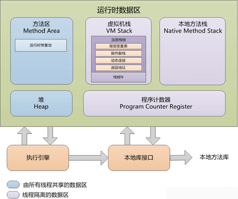

# 什么是虚拟机？


Java 虚拟机，是一个可以执行 Java 字节码的虚拟机进程。Java 源文件被编译成能被 Java 虚拟机执行的字节码文件( `.class` )。

Java 被设计成允许应用程序可以运行在任意的平台，而不需要程序员为每一个平台单独重写或者是重新编译。Java 虚拟机让这个变为可能，因为它知道底层硬件平台的指令长度和其他特性。

但是，跨平台的是 Java 程序(包括字节码文件)，而不是 JVM。JVM 是用 C/C++ 开发的，是编译后的机器码，不能跨平台，不同平台下需要安装不同版本的 JVM 。


- 也就是说，JVM 能够跨计算机体系结构来执行 Java 字节码，主要是由于 JVM 屏蔽了与各个计算机平台相关的软件或者硬件之间的差异，使得与平台相关的耦合统一由 JVM 提供者来实现。

## JVM 由哪些部分组成？


- **类加载器**，在 JVM 启动时或者类运行时将需要的 class 加载到 JVM 中。

- **运行时数据区**，将内存划分成若干个区以模拟实际机器上的存储、记录和调度功能模块，如实际机器上的各种功能的寄存器或者 PC 指针的记录器等。

- **执行引擎**，执行引擎的任务是负责执行 class 文件中包含的字节码指令，相当于实际机器上的 CPU 。

- **本地方法接口**，调用 C 或 C++ 实现的本地方法的代码返回结果。

### JVM 运行时数据区



- **程序计数器：** Java 线程私有，它可以看做是**当前线程所执行的字节码的行号指示器**。
  - 如果线程正在执行的是一个 Java 方法，这个计数器记录的是<u>正在执行的虚拟机字节码指令的地址</u>；
  - <u>如果正在执行的是 Native 方法，这个计数器值则为空（Undefined）；</u>
  - 此内存区域是**唯一一个**在 Java 虚拟机规范中没有规定任何 OutOfMemoryError 情况的区域；
- **虚拟机栈（栈内存）：**Java线程私有，虚拟机栈描述的是 Java 方法执行的内存模型。
- 每个方法在执行的时候，都会创建一个栈帧用于<u>存储局部变量、操作数、动态链接、方法出口</u>等信息。
  - 每个方法调用都意味着一个栈帧在虚拟机栈中<u>入栈到出栈</u>的过程。
- **本地方法栈 ：**和 Java 虚拟机栈的作用类似，区别是该区域为 JVM 提供使用 <u>Native 方法</u>的服务。
  - 本地方法栈也会抛出StackOverflowError和OutOfMemoryError异常
  - 接口方法由C语言方式实现
- **堆内存（线程共享）：**<u>所有线程共享</u>的一块区域，垃圾收集器管理的主要区域。
- 目前主要的垃圾回收算法都是分代收集算法，所以 Java 堆中还可以细分为：新生代和老年代；再细致一点的有 Eden 空间、From Survivor 空间、To Survivor 空间等，默认情况下新生代按照 `8:1:1` 的比例来分配。
  - 根据 Java 虚拟机规范的规定，<u>Java 堆可以处于物理上不连续的内存空间中</u>，只要逻辑上是连续的即可，就像我们的磁盘一样。
- **方法区（线程共享）：**各个线程共享的一个区域，用于存储虚拟机<u>加载的类信息、常量、静态变量、即时编译器编译后的代码等数据。</u>
  - **运行时常量池**：是方法区的一部分，用于存放编译器生成的各种**字面量和符号引用**。

#### 方法区有哪些构成

<u>类型信息和类的静态变量都存储在方法区中。</u>方法区中对于每个类存储了以下数据：

- 类及其父类的全限定名（java.lang.Object没有父类）
- 类的类型（Class or Interface）
- 访问修饰符（public, abstract, final）
- 实现的接口的全限定名的列表
- 常量池
- 字段信息
- 方法信息
- 静态变量
- ClassLoader引用
- Class引用

#### 常量池

常量池本身是方法区中的一个数据结构。**常量池中存储了如字符串、final变量值、类名和方法名常量**。常量池在编译期间就被确定，并保存在已编译的.class文件中。一般分为两类：**字面量和引用量**。字面量就是字符串、final变量等。类名和方法名属于引用量。引用量最常见的是在调用方法的时候，根据方法名找到方法的引用，并以此定为到函数体进行函数代码的执行。引用量包含：类和接口的权限定名、字段的名称和描述符，方法的名称和描述符。

#### 直接内存

直接内存(Direct Memory)，<u>并不是虚拟机运行时数据区的一部分</u>，也不是 Java 虚拟机规范中农定义的内存区域。在 JDK1.4 中新加入了 NIO(New Input/Output) 类，引入了一种基于通道(Channel)与缓冲区（Buffer）的 I/O 方式，它可以使用 native 函数库直接分配堆外内存，然后通过一个存储在 Java 堆中的 DirectByteBuffer 对象作为这块内存的引用进行操作。这样能在一些场景中显著提高性能，因为避免了在 Java 堆和 Native 堆中来回复制数据。

- 本机直接内存的分配不会受到 Java 堆大小的限制，受到本机总内存大小限制。
- 配置虚拟机参数时，不要忽略直接内存，防止出现 OutOfMemoryError 异常。

**直接内存（堆外内存）与堆内存比较？**

1. 直接内存申请空间耗费更高的性能，当频繁申请到一定量时尤为明显。
2. 直接内存 IO 读写的性能要优于普通的堆内存，在多次读写操作的情况下差异明显。

> 直接内存的优势是减少了垃圾回收的工作和在复制方面相比堆内存要快，堆内存将数据发送到远端的时候需要先复制到直接内存中，在发送到远端。

❓为什么在申请空间时，堆内存会更快？

堆内存的申请是直接从已分配的堆空间中取一块出来使用，不经过内存申请系统调用，而直接内存的申请则需要本地方法通过系统调用完成。

拓展阅读：[Java直接内存的分配和释放](https://yasinshaw.com/articles/59)

#### Java 内存堆和栈区别？

- 栈内存用来存储基本类型的变量和对象的引用变量；堆内存用来存储Java中的对象，无论是成员变量，局部变量，还是类变量，它们指向的对象都存储在堆内存中。
- 栈内存归属于单个线程，每个线程都会有一个栈内存，其存储的变量只能在其所属线程中可见，即栈内存可以理解成线程的私有内存；堆内存中的对象对所有线程可见。堆内存中的对象可以被所有线程访问。
- 如果栈内存没有可用的空间存储方法调用和局部变量，JVM 会抛出 `java.lang.StackOverFlowError` 错误；如果是堆内存没有可用的空间存储生成的对象，JVM 会抛出 `java.lang.OutOfMemoryError` 错误。
- 栈的内存要远远小于堆内存，如果你使用递归的话，那么你的栈很快就会充满。`-Xss` 选项设置栈内存的大小，`-Xms` 选项可以设置堆的开始时的大小。

当然，如果你记不住这个些，只要记住如下即可：

> JVM 中堆和栈属于不同的内存区域，使用目的也不同。栈常用于保存方法帧和局部变量，而对象总是在堆上分配。栈通常都比堆小，也不会在多个线程之间共享，而堆被整个 JVM 的所有线程共享。

## 类加载

### 对象被创建的过程

JAVA 对象创建的过程，如下图所示：


- Java 中对象的创建就是在堆上分配内存空间的过程，此处说的对象创建仅限于 new 关键字创建的普通 Java 对象，不包括数组对象的创建（数组）。

1）检测类是否被加载

当虚拟机遇到 `new` 指令时，首先先去检查这个指令的参数是否能在常量池中**定位到一个类的符号引用**，并且检查这个符号引用代表的类是否已被加载、解析和初始化过。如果没有，就执行类加载过程。

2）为对象分配内存

类加载完成以后，虚拟机就开始为对象分配内存，此时所需内存的大小就已经确定了。只需要在堆上分配所需要的内存即可。

具体的分配内存有两种情况：第一种情况是内存空间绝对规整，第二种情况是内存空间是不连续的。

- 对于内存绝对规整的情况相对简单一些，虚拟机只需要在被占用的内存和可用空间之间移动指针即可，这种方式被称为“**指针碰撞**”。
- 对于内存不规整的情况稍微复杂一点，这时候虚拟机需要维护一个列表，来记录哪些内存是可用的。分配内存的时候需要找到一个可用的内存空间，然后在列表上记录下已被分配，这种方式成为“**空闲列表**”。

多线程并发时会出现正在给对象 A 分配内存，还没来得及修改指针，对象 B 又用这个指针**分配内存**，这样就出现问题了。解决这种问题有两种方案：

- 第一种，是采用同步的办法，使用 CAS 来保证操作的原子性。
- 另一种，是每个线程分配内存都在自己的空间内进行，即是每个线程都在堆中预先分配一小块内存，称为本地线程分配缓冲（Thread Local Allocation Buffer, TLAB），分配内存的时候再TLAB上分配，互不干扰。可以通过 `-XX:+/-UseTLAB` 参数决定。

3）为分配的内存空间初始化零值

对象的内存分配完成后，还需要将对象的内存空间都初始化为零值，这样能保证对象即使没有赋初值，也可以直接使用。

4）对对象进行其他设置

分配完内存空间，初始化零值之后，虚拟机还需要对对象进行其他必要的设置，设置的地方都在**对象头**中，包括这个对象所属的类，类的元数据信息，对象的 hashcode ，GC 分代年龄等信息。

5）执行 init 方法

执行完上面的步骤之后，在虚拟机里这个对象就算创建成功了，但是对于 Java 程序来说还需要执行 init 方法才算真正的创建完成，因为这个时候对象只是被初始化零值了，还没有真正的去根据程序中的代码分配初始值，调用了 init 方法之后，这个对象才真正能使用。

到此为止一个对象就产生了，这就是 new 关键字创建对象的过程。过程如下：


### 类加载过程

类加载分为**装载、链接、初始化**三步。

```java
ClassLoader loader = TestClassLoader.class.getClassLoader();

System.out.println(loader.toString());

System.out.println(loader.getParent().toString());

System.out.println(loader.getParent().getParent());
```

#### 加载

通过类的全限定名和ClassLoader加载类，主要是将指定的.class文件加载至JVM。当类被加载以后，在JVM内部就以“类的全限定名+ClassLoader实例ID”来标明类。

**在内存中，ClassLoader实例和类的实例都位于堆中，它们的类信息都位于方法区**。

在加载阶段，虚拟机需要完成以下三件事情：

- 通过一个类的全限定名来获取其定义的二进制字节流。
- 将这个字节流所代表的**静态存储结构**转化为方法区的**运行时数据结构**。
- 在Java堆中生成一个代表这个类的 `java.lang.Class` 对象，作为对方法区中这些数据的访问入口。

##### ClassLoader 分类

- 启动类加载器（BootStrap Class Loader）：启动类加载器主要加载的是JVM自身需要的类，这个类加载使用C++语言实现的，是虚拟机自身的一部分，它负责将 **<JAVA_HOME>/lib** 路径下的核心类库或 -Xbootclasspath 参数指定的路径下的jar包加载到内存中，注意由于虚拟机是按照文件名识别加载jar包的，如 **rt.jar**，如果文件名不被虚拟机识别，即使把jar包丢到lib目录下也是没有作用的（出于安全考虑，Bootstrap启动类加载器只加载包名为java、javax、sun等开头的类），在 Sun JDK中，这个类加载器是由 **C++** 实现的，并且在 Java 语言中无法获得它的引用，因此在 Java 中只能用 null 来指代。除了启动类加载器之外，其他的类加载器都是 java.lang.ClassLoader 的子类，因此有对应的 Java 对象。**这些类加载器需要先由另一个类加载器，比如说启动类加载器，加载至 Java 虚拟机中，方能执行类加载。**
- 扩展类加载器（Extension Class Loader）：扩展类加载器是指Sun公司(已被Oracle收购)实现的**sun.misc.Launcher$ExtClassLoader** 类，由Java语言实现的，是Launcher的静态内部类，它负责加载**<JAVA_HOME>/lib/ext**目录下或者由系统变量 **-Djava.ext.dir** 指定位路径中的类库，开发者可以直接使用标准扩展类加载器。
- 应用类加载器（System Class Loader）：是指 Sun公司实现的**sun.misc.Launcher$AppClassLoader**。它负责加载系统类路径**java -classpath**或 **-Djava.class.path** 指定路径下的类库，也就是我们经常用到的classpath路径，开发者可以直接使用系统类加载器，一般情况下该类加载是程序中默认的类加载器，通过`ClassLoader#getSystemClassLoader()`方法可以获取到该类加载器。**通常我们自己写的Java类也是由该ClassLoader加载**。在Sun JDK中，系统类加载器的名字叫 AppClassLoader。
- 用户自定义类加载器（User Defined Class Loader）：由用户自定义类的加载规则，可以手动控制加载过程中的步骤。

Java 9 引入了模块系统，并且略微更改了上述的类加载器。扩展类加载器被改名为**平台类加载器**（platform class loader）。Java SE 中除了少数几个关键模块，比如说 java.base 是由启动类加载器加载之外，其他的模块均由平台类加载器所加载。

##### 双亲委派模型

装载过程采用了一种被称为“**双亲委派模型（Parent Delegation Model）**”的方式，当一个ClassLoader要加载类时，它会先请求它的双亲ClassLoader（其实这里只有两个ClassLoader，所以称为父ClassLoader可能更容易理解）加载类，而它的双亲ClassLoader会继续把加载请求提交再上一级的ClassLoader，直到启动类加载器。只有其双亲ClassLoader无法加载指定的类时，它才会自己加载类。而这种父子关系一般通过组合（Composition）关系来实现，而不是通过继承（Inheritance）。

双亲委派模型是JVM的第一道安全防线，它**保证了类的安全加载**，这里同时依赖了**类加载器隔离**的原理：不同类加载器加载的类之间是无法直接交互的，即使是同一个类，被不同的ClassLoader加载，它们也无法感知到彼此的存在。这样即使有恶意的类冒充自己在核心包（例如java.lang）下，由于它无法被启动类加载器加载，也造成不了危害。
由此也可见，如果用户自定义了类加载器，那就必须自己保障类加载过程中的安全。

#### 连接

##### 验证：确保被加载的类的正确性

验证是连接阶段的第一步，这一阶段的目的是为了确保 Class 文件的字节流中包含的信息符合当前虚拟机的要求，并且不会危害虚拟机自身的安全。

验证阶段大致会完成4个阶段的检验动作：

- 文件格式验证：验证字节流是否符合 Class 文件格式的规范。例如：是否以 `0xCAFEBABE` 开头、主次版本号是否在当前虚拟机的处理范围之内、常量池中的常量是否有不被支持的类型。
- 元数据验证：对字节码描述的信息进行语义分析（注意：对比 javac 编译阶段的语义分析），以保证其描述的信息符合 Java 语言规范的要求。例如：这个类是否有父类，除了 `java.lang.Object` 之外。
- 字节码验证：通过数据流和控制流分析，确定程序语义是合法的、符合逻辑的。
- 符号引用验证：确保解析动作能正确执行。

验证阶段是非常重要的，但不是必须的，它对程序运行期没有影响，如果所引用的类经过反复验证，那么可以考虑采用 `-Xverifynone` 参数来关闭大部分的类验证措施，以缩短虚拟机类加载的时间。

##### 准备：为类的静态变量分配内存，并将其初始化为默认值

准备阶段，是正式为类变量分配内存并设置类变量初始值的阶段，这些内存都将在方法区中分配。对于该阶段有以下几点需要注意：

1. 这时候进行内存分配的仅包括类变量(`static`)，而不包括实例变量，实例变量会在对象实例化时随着对象一块分配在 Java 堆中。

  > 思考下，对于类本身，静态变量就是其属性。
2. 这里所设置的初始值通常情况下是数据类型默认的零值(如 `0`、`0L`、`null`、`false` 等），而不是被在 Java 代码中被显式地赋予的值。

  假设一个类变量的定义为： `public static int value = 3`。那么静态变量 `value` 在准备阶段过后的初始值为 `0`，而不是 `3`。因为这时候尚未开始执行任何 Java 方法，而把 `value` 赋值为 `3` 的 `public static` 指令是在程序编译后，存放于**类构造器** `()` 方法之中的，所以把 `value` 赋值为 `3` 的动作将在初始化阶段才会执行。

这里还需要注意如下几点：

- 对基本数据类型来说，对于类变量(`static`)和全局变量，如果不显式地对其赋值而直接使用，则系统会为其赋予默认的零值，而对于局部变量来说，在使用前必须显式地为其赋值，否则编译时不通过。
- 对于同时被 `static` 和 `final` 修饰的常量，必须在声明的时候就为其显式地赋值，否则编译时不通过；而只被 `final` 修饰的常量则既可以在声明时显式地为其赋值，也可以在类初始化时显式地为其赋值，总之，在使用前必须为其显式地赋值，系统不会为其赋予默认零值。
- 对于引用数据类型 reference 来说，如数组引用、对象引用等，如果没有对其进行显式地赋值而直接使用，系统都会为其赋予默认的空值，即 `null` 。
- 如果在数组初始化时没有对数组中的各元素赋值，那么其中的元素将根据对应的数据类型而被赋予默认的“空”值。

3. 如果类字段的字段属性表中存在 ConstantValue 属性，即同时被 `final` 和 `static` 修饰，那么在准备阶段变量 `value` 就会被初始化为 ConstValue 属性所指定的值。

假设上面的类变量 `value` 被定义为： `public static final int value = 3` 。编译时， `javac` 将会为 `value` 生成 ConstantValue 属性。在准备阶段虚拟机就会根据 ConstantValue 的设置将 `value` 赋值为 3。我们可以理解为 `static final` 常量在编译期就将其结果放入了调用它的类的常量池中。

##### 解析：把类中的符号引用转换为直接引用

解析阶段，是虚拟机将常量池内的符号引用替换为直接引用的过程。解析动作，主要针对类或接口、字段、类方法、接口方法、方法类型、方法句柄和调用点限定符 7 类符号引用进行。

- 符号引用，就是一组符号来描述目标，可以是任何字面量。
- 直接引用，就是直接指向目标的指针、相对偏移量或一个间接定位到目标的句柄。

#### 初始化

初始化，为类的静态变量赋予正确的初始值，JVM 负责对类进行初始化，主要对类变量进行初始化。在 Java 中对类变量进行初始值设定有两种方式：

- 1、声明类变量是指定初始值。
- 2、使用静态代码块为类变量指定初始值。

JVM 初始化步骤：

- 1、假如这个类还没有被加载和连接，则程序先加载并连接该类。
- 2、假如该类的直接父类还没有被初始化，则先初始化其直接父类。
- 3、假如类中有初始化语句，则系统依次执行这些初始化语句。

**类构造器()与实例构造器()不同，它不需要程序员进行显式调用，虚拟机会保证在子类类构造器()执行之前，父类的类构造()执行完毕。**

那么，类的初始化何时会被触发呢？JVM 规范枚举了下述多种触发情况：

- 当虚拟机启动时，初始化用户指定的主类；
- 当遇到用以新建目标类实例的 new 指令时，初始化 new 指令的目标类；
- 当遇到调用静态方法的指令时，初始化该静态方法所在的类；
- 当遇到访问静态字段的指令时，初始化该静态字段所在的类；
- 子类的初始化会触发父类的初始化；
- 如果一个接口定义了 default 方法，那么直接实现或者间接实现该接口的类的初始化，会触发该接口的初始化；
- 使用反射 API 对某个类进行反射调用时，初始化这个类；
- 当初次调用 MethodHandle 实例时，初始化该 MethodHandle 指向的方法所在的类。

由于**类初始化是线程安全的，并且仅被执行一次**，因此程序可以确保多线程环境下有且仅有一个 Singleton 实例。

## 内存模型

### 对象的内存布局是怎样的？

对象的内存布局包括三个部分：

- 对象头：对象头包括两部分信息。
  - 第一部分，是存储对象自身的运行时数据，如哈希码，GC 分代年龄，锁状态标志，线程持有的锁等等。
  - 第二部分，是类型指针，即对象指向类元数据的指针。
- 实例数据：就是数据。
- 对齐填充：不是必然的存在，就是为了对齐。

### Java 内存模型（JMM）

Java内存模型（Java Memory Model）**描述了Java程序中各种变量（线程共享变量）的访问规则，以及在JVM中将变量存储到内存和从内存中读取出变量这样的底层细节。**

多个线程同时对主内存的一个共享变量进行读取和修改时，首先会读取这个变量到自己的工作内存中成为一个副本，对这个副本进行改动之后，再更新回主内存中变量所在的地方。

（由于CPU时间片是以线程为最小单位，所以这里的工作内存实际上就是指的物理缓存，CPU运算时获取数据的地方；而主内存也就是指的是内存，也就是原始的共享变量存放的位置）

JMM 关键技术点都是围绕多线程的**原子性、可见性、有序性**来建立的。

原子性：

原子性是指一个操作是不可中断的。即使是在多个线程一起执行的时候，一个操作一旦开始，就不会被其他线程干扰。

可见性：

可见性是指当一个线程修改了某一个共享变量的值，其他线程是否能够立即知道这个修改。在串行程序中是不存在可见性的问题，但在多线程场景就存在比较多的问题。

有序性：

按先后顺序执行。有序性问题的原因是因为程序在执行时，可能会进行指令重排，重排后的指令与原指令的顺序未必一致。


- 所有的变量都存储在主内存中
- 每个线程都有自己独立的工作内存，里面保存该线程使用到的变量的副本（主内存中该变量的一份拷贝）
- 两条规定
  - **线程对共享变量的所有操作都必须在自己的工作内存中进行，不能直接从主内存中读写**
  - **不同线程之间无法直接访问其他线程工作内存中的变量，线程间变量值的传递需要功过主内存来完成。**
- 共享变量可见性实现的原理

#### 可见性

一个线程对共享变量值的修改，能够及时地被其他线程看到。

线程1对共享变量的修改要想被线程2及时看到，必须要经过如下的两个步骤：

1. 把工作内存1中更新过的共享变量刷新到主内存中
2. 把内存中最新的共享变量的值更新到工作内存2中

##### 可见性分析

导致共享变量在**线程间不可见**的原因：

1. 线程的交叉执行
2. 重排序结合线程交叉执行
3. 共享变量更新后的值没有在工作内存与主内存间及时更新

##### synchronized实现可见性

- 线程解锁前，必须把共享变量的最新值刷新到主内存中。
- 线程加锁时，将**清空工作内存中共享变量的值,**从而使用共享变量时需要从主内存中重新读取最新的值（注意：加锁与解锁需要的是同一把锁）

这两点结合起来，就可以**保证线程解锁前对共享变量的修改在下次加锁时对其他的线程可见**，也就保证了线程之间共享变量的可见性。

#### 线程执行互斥代码的过程：

1. 获得互斥锁
2. 清空工作内存
3. 从主内存拷贝最新副本到工作内存中
4. 执行代码
5. 将更改过后的共享变量的值刷新到主内存中去。
6. 释放互斥锁

#### 重排序

重排序：代码书写的顺序与实际执行的顺序不同，指令重排序是编译器或**处理器为了提供程序的性能而做的优化**。

指令重排能保证串行语义一致，但没有义务保证多线程间的语义也一致。

之所以存在指令重排完全是为了提高性能。

问题：为什么指令重排可以提高性能呢？

减少执行流水线中断，从而提高了 CPU 处理性能。

分类：

1. 编译器优化的重排序（编译器优化）
2. 指令级并行重排序（处理器优化）
3. 内存系统的重排序（处理器优化）

##### as-if-serial

无论如何重排序，程序执行的结果应该和代码顺序执行的结果一致（Java编译器、运行时和处理器都会保证Java在**单线程下遵循as-if-serial语义**），重排序不会给单线程带来**内存可见性问题**。

```java
int num1=1;//第一行
int num2=2;//第二行
int sum=num1+num;//第三行
```

- 单线程：第一行和第二行可以重排序，但第三行不行
- 重排序不会给单线程带来内存可见性问题
- 多线程中程序交错执行时，重排序可能会照成内存可见性问题

指令重排是基于以下原则之上

- 程序顺序原则：一个线程内保证语义的串行性
- volatile 规则：volatile 变量的写，先发生于读，保证了 volatile 变量的可见性
- 锁规则：解锁必然发生在随后的加锁之前
- 传递性：A 先于 B，B 先于 C，那么 A 必然先于 C
- 线程的 start() 方法先于他的每一个动作
- 线程的所有操作先于线程的终结
- 线程的中断先于被中断线程的代码
- 对象的构造函数执行、结束先于 `finalize()` 方法

### volatile实现可见性

#### volatile 关键字

- 能够保证volatile变量的可见性
- 不能保证volatile变量的原子性

#### volatile如何实现内存可见性：

深入来说：通过加入**内存屏障和禁止重排序优化**来实现的。

通俗的讲：volatile 变量在每次被线程访问时，都强迫从主内存中重读该变量的值，而当变量发生变化时，又强迫线程将最新的值刷新到主内存。这样任何时刻，不同的线程总能看到该变量的最新的值。

- 对 volatile 变量执行写操作时，会在写操作后加入一条 store 屏障指令
  - store 指令会在写操作后把最新的值强制刷新到主内存中。同时还会禁止 cpu 对代码进行重排序优化。这样就保证了值在主内存中是最新的。
- 对 volatile 变量执行读操作时，会在读操作前加入一条 load 屏障指令
  - load 指令会在读操作前把工作内存缓存中的值清空后，再从主内存中读取最新的值。

##### 线程写volatile变量的过程：

1. 改变线程工作内存中volatile变量副本的值。
2. 将改变后的副本的值从工作内存刷新到主内存。

##### 线程读volatile变量的过程：

1. 从主内存中读取最新的volatile变量的值到工作内存中。
2. 从工作内存中读取volatile变量的副本。

#### volatile 不能保证原子性

```java
private int number=0;//原子性操作
number++;//不是原子性操作
```

从 Load 到store 到内存屏障，一共4步，其中最后一步jvm让这个最新的变量的值在所有线程可见，也就是最后一步让所有的CPU内核都获得了最新的值，但**中间的几步（从Load到Store）**是不安全的，中间如果其他的 CPU 修改了值将会丢失。

为 volatile 变量赋值的场景，不要存在依赖于 volatile 变量情况。

比如：

```java
public class Wrongsingleton {
    private static volatile Wrongsingleton _instance = null; 
 
    private wrongsingleton() {}
 
    public static wrongsingleton getInstance() {
 
        if (_instance == null) {
          // 可能执行下面的语句的时候，其他的线程已经执行 new 操作了
            _instance = new Wrongsingleton();
        }
 
        return _instance;
    }
}
```

#### 保证方法操作的原子性

解决方案：

- 使用synchronized关键字
- 使用ReentrantLock(java.until.concurrent.locks包下)
- 使用AtomicInterger(vava,util.concurrent.atomic包下)

#### volatile 适用场景

要在多线程总安全的使用volatile变量，必须同时满足：

1. **对变量的写入操作不依赖其当前值**
   - 不满足：number++、count=count*5
   - 满足：boolean变量、记录温度变化的变量等
2. 该变量没有包含在具有其他变量的不变式中
   - 不满足：不变式 ` low < up`

#### 内存屏障

内存屏障（[memory barrier](http://en.wikipedia.org/wiki/Memory_barrier)）是一个 CPU 指令。基本上，它是这样一条指令： a) 确保一些特定操作执行的顺序； b) 影响一些数据的可见性(可能是某些指令执行后的结果)。编译器和 CPU 可以在保证输出结果一样的情况下对指令重排序，使性能得到优化。插入一个内存屏障，**相当于告诉 CPU 和编译器先于这个命令的必须先执行，后于这个命令的必须后执行**。内存屏障另一个作用是**强制更新一次不同 CPU 之间的缓存**。例如，一个写屏障会把这个屏障前写入的数据刷新到缓存，这样任何试图读取该数据的线程将得到最新值，而不用考虑到底是被哪个 CPU 核心或者哪颗 CPU 执行的。

##### Store Barrier

Store屏障，是x86的”sfence“指令，强制所有在store屏障指令之前的store指令，都在该store屏障指令执行之前被执行，并把store缓冲区的数据都刷到CPU缓存。这会使得程序状态对其它CPU可见，这样其它CPU可以根据需要介入。一个实际的好例子是Disruptor中的BatchEventProcessor。当序列Sequence被一个消费者更新时，其它消费者(Consumers)和生产者（Producers）知道该消费者的进度，因此可以采取合适的动作。所以屏障之前发生的内存更新都可见了。

##### Load Barrier

Load屏障，是x86上的”ifence“指令，强制所有在load屏障指令之后的load指令，都在该load屏障指令执行之后被执行，并且一直等到load缓冲区被该CPU读完才能执行之后的load指令。这使得从其它CPU暴露出来的程序状态对该CPU可见，这之后CPU可以进行后续处理。一个好例子是上面的BatchEventProcessor的sequence对象是放在屏障后被生产者或消费者使用。

##### Full Barrier

Full屏障，是x86上的”mfence“指令，复合了load和save屏障的功能。

#### 对 64 位（long、double）变量的读写可能不是原子操作

Java 内存模型允许JVM将没有被 volatile 修饰的 64 位数据类型读写操作划分为两次 32 位的读写操作来进行，这就会导致有可能读取到“半个变量”的情况，解决办法就是加上 volatile 关键字。

#### final 也可以保证线程之间内存变量的可见性

Final 变量在并发当中，原理是通过禁止 cpu 的指令集重排序，来提供现成的可见性，来保证对象的安全发布，防止对象引用被其他线程在对象被完全构造完成前拿到并使用。

与锁和 volatile 相比较，对 final 域的读和写更像是普通的变量访问。对于 final 域，编译器和处理器要遵守两个重排序规则：

1. 在构造函数内对一个 final 域的写入，与随后把这个被构造对象的引用赋值给一个引用变量，这两个操作之间不能重排序。
2. 初次读一个包含 final 域的对象的引用，与随后初次读这个 final 域，这两个操作之间不能重排序。

## Java 8

**与8之前的有什么优化地方：**

- JDK8 后用元空间替代了 Perm Space ；字符串常量存放到堆内存中。
- MetaSpace 大小默认没有限制，一般根据系统内存的大小。JVM 会动态改变此值。
- 可以通过 JVM 参数配置
  - `-XX:MetaspaceSize` ： 分配给类元数据空间（以字节计）的初始大小（Oracle 逻辑存储上的初始高水位，the initial high-water-mark）。此值为估计值，MetaspaceSize 的值设置的过大会延长垃圾回收时间。垃圾回收过后，引起下一次垃圾回收的类元数据空间的大小可能会变大。
  - `-XX:MaxMetaspaceSize` ：分配给类元数据空间的最大值，超过此值就会触发Full GC 。此值默认没有限制，但应取决于系统内存的大小，JVM 会动态地改变此值。

**为什么要废弃永久代？**

1）现实使用中易出问题。

由于永久代内存经常不够用或发生内存泄露，爆出异常 `java.lang.OutOfMemoryError: PermGen` 。

- 字符串存在永久代中，容易出现性能问题和内存溢出。
- 类及方法的信息等比较难确定其大小，因此对于永久代的大小指定比较困难，太小容易出现永久代溢出，太大则容易导致老年代溢出。

2）永久代会为 GC 带来不必要的复杂度，并且回收效率偏低。

3）Oracle 可能会将HotSpot 与 JRockit 合二为一。

## 问题

*1、有哪些 OutOfMemoryError 异常？*

- Java 堆溢出
- 虚拟机栈和本地方法栈溢出
- 方法区和运行时常量池溢出

- 本机直接内存溢出

*2、当出现了内存溢出，你怎么排错？*

- 1、首先，控制台查看错误日志。
- 2、然后，使用 JDK 自带的 jvisualvm 工具查看系统的堆栈日志。
- 3、定位出内存溢出的空间：堆，栈还是永久代（JDK8 以后不会出现永久代的内存溢出）。
  - 如果是堆内存溢出，看是否创建了超大的对象。
  - 如果是栈内存溢出，看是否创建了超大的对象，或者产生了死循环。

<u>3、Java 虚拟机是如何判定两个 Java 类是相同的？</u>

Java 虚拟机不仅要看类的全名是否相同，还要看加载此类的类加载器是否一样。**只有两者都相同的情况，才认为两个类是相同的**。即便是同样的字节代码，被不同的类加载器加载之后所得到的类，也是不同的。

比如一个 Java 类 `com.example.Sample` ，编译之后生成了字节代码文件 `Sample.class` 。两个不同的类加载器 ClassLoaderA 和 ClassLoaderB 分别读取了这个 `Sample.class` 文件，并定义出两个 `java.lang.Class` 类的实例来表示这个类。这两个实例是不相同的。对于 Java 虚拟机来说，它们是不同的类。试图对这两个类的对象进行相互赋值，会抛出运行时异常 ClassCastException 。

<u>4、双亲委派模型的工作过程？</u>

- 1、当前 ClassLoader 首先从自己已经加载的类中，查询是否此类已经加载，如果已经加载则直接返回原来已经加载的类。

  > 每个类加载器都有自己的加载缓存，当一个类被加载了以后就会放入缓存，等下次加载的时候就可以直接返回了。

- 2、当前 ClassLoader 的缓存中没有找到被加载的类的时候

  - 委托父类加载器去加载，父类加载器采用同样的策略，首先查看自己的缓存，然后委托父类的父类去加载，一直到 bootstrap ClassLoader。
  - 当所有的父类加载器都没有加载的时候，再由当前的类加载器加载，并将其放入它自己的缓存中，以便下次有加载请求的时候直接返回。

<u>5、为什么优先使用父 ClassLoader 加载类？</u>

- 1、共享功能：可以避免重复加载，当父亲已经加载了该类的时候，子类不需要再次加载，一些 Framework 层级的类一旦被顶层的 ClassLoader 加载过就缓存在内存里面，以后任何地方用到都不需要重新加载。
- 2、隔离功能：主要是为了安全性，**避免用户自己编写的类动态替换 Java 的一些核心类**，比如 String ，同时也避免了重复加载，因为 JVM 中区分不同类，不仅仅是根据类名，相同的 class 文件被不同的 ClassLoader 加载就是不同的两个类，如果相互转型的话会抛 `java.lang.ClassCaseException` 。

<u>6、什么是破坏双亲委托模型？</u>

破坏双亲委托模型，需要做的是，`#loadClass(String name, boolean resolve)` 方法中，**不调用父 `parent` ClassLoader 方法去加载类，那么就成功了**。那么我们要做的仅仅是，错误的覆盖 `##loadClass(String name, boolean resolve)` 方法，不去使用父 `parent` ClassLoader 方法去加载类即可。

<u>7、JVM 由哪些组成？</u>

类加载器子系统、运行时数据区（内存空间）、执行引擎以及与本地方法接口。

<u>8、运行时数据区有哪些组成？</u>

由**方法区、堆、Java栈、程序计数器、本地方法栈**组成，其中内存空间中方法区和堆是所有Java线程共享的，而Java栈、本地方法栈、程序计数器则由每个线程私有。

4个部分组成：

- 程序计数器：线程私有，记录指令执行的位置，这里不会出现 OutOfMemoryError
- Java栈：线程私有，生命周期和线程一致，存储方法参数、局部变量、中间运算结果，会出现异常：如果线程请求的栈深度大于虚拟机所允许的深度，将抛出StackOverflowError异常；如果虚拟机可以动态扩展，如果扩展时无法申请到足够的内存，就会抛出OutOfMemoryError异常。
- 本地方法栈：存储了本地方法调用的状态。区别不过是Java栈为JVM执行Java方法服务，而本地方法栈为JVM执行Native方法服务。本地方法栈也会抛出StackOverflowError和OutOfMemoryError异常。在Sun JDK中，本地方法栈和Java栈是同一个。
- 堆：堆是JVM所管理的内存中最大的一块，**是被所有Java线程锁共享的，不是线程安全的**，也会有 StackOverflowError和OutOfMemoryError异常
- 方法区：线程共享；类型信息和类的静态变量都存储在方法区中。

<u>9、Java 是通过什么方式实现 Java 语言的本地方法调用？</u>

使用 JNI（Java Native Interface）方式实现。

<u>10、启动类加载器是通过什么方式初始化加载的？</u>

它不是Java类，因此它不需要被别人加载，它嵌套在Java虚拟机内核里面，也就是JVM启动的时候Bootstrap就已经启动，它是用C++写的二进制代码（不是字节码）

<u>11、sun.misc.Launcher$ExtClassLoader 与 java.lang.ClassLoader 关系？</u>

除了 启动类加载器 外其他都是继承自 java.lang.ClassLoader。

<u>9、其他类加载器如何初始化？</u>

其他的类加载器都是通过 `sun.misc.Launcher` 类下面的静态内部类实现，拓展类加载器就是 ExtClassLoader，应用加载器就是 AppClassLoader。

<u>12、说一下类加载的流程是怎么样的？</u>

装载、链接（校验、准备、解析）、初始化。

- 装载：通过类的全限定名和ClassLoader加载类，主要是将指定的.class文件加载至JVM
- 校验：校验.class文件的正确性，确保该文件是符合规范定义的，并且适合当前JVM使用
- 准备：为类分配内存，同时初始化类中的静态变量赋值为默认值
- 解析：主要是把类的常量池中的符号引用解析为直接引用，这一步可以在用到相应的引用时再解析
- 初始化：初始化类中的静态变量，并执行类中的static代码、构造函数

<u>13、JVM 中何时会触发类加载的行为？</u>

- 通过new关键字、反射、clone、反序列化机制实例化对象时。
- 调用类的静态方法时。
- 使用类的静态字段或对其赋值时。
- 通过反射调用类的方法时。
- 初始化该类的子类时（初始化子类前其父类必须已经被初始化）。
- JVM启动时被标记为启动类的类（简单理解为具有main方法的类）。

<u>17、什么叫可见性？</u>

一个线程对共享变量值的修改，能够及时地被其他线程看到。

<u>18、什么叫有序性？</u>

按先后顺序执行。有序性问题的原因是因为程序在执行时，可能会进行指令重排，重排后的指令与原指令的顺序未必一致。

<u>19、什么叫原子性？</u>

原子性是指一个操作是不可中断的。即使是在多个线程一起执行的时候，一个操作一旦开始，就不会被其他线程干扰。

<u>20、导致共享变量在线程间不可见的原因？</u>

1. 线程的交叉执行
2. 重排序结合线程交叉执行
3. 共享变量更新后的值没有在工作内存与主内存间及时更新

<u>21、synchronize 如何保证有序性？</u>

- 线程解锁前，必须把共享变量的最新值刷新到主内存中。
- 线程加锁时，将清空工作内存中共享变量的值,从而使用共享变量时需要从主内存中重新读取最新的值（注意：加锁与解锁需要的是同一把锁）

<u>22、线程执行互斥代码的过程？</u>

1. 获得互斥锁
2. 清空工作内存
3. 从主内存拷贝最新副本到工作内存中
4. 执行代码
5. 将更改过后的共享变量的值刷新到主内存中去。
6. 释放互斥锁

<u>23、指令重排序的价值是什么？</u>

指令重排序是编译器或**处理器为了提供程序的性能而做的优化**，

<u>24、为什么指令重排序可以提升性能？</u>

减少执行流水线中断，从而提高了 CPU 处理性能。

<u>25、重排序类别？</u>

1. 编译器优化的重排序（编译器优化）
2. 指令级并行重排序（处理器优化）
3. 内存系统的重排序（处理器优化）

<u>26、重排序规则？</u>

指令重排是基于以下原则之上

- 程序顺序原则：一个线程内保证语义的串行性
- volatile 规则：volatile 变量的写，先发生于读，保证了 volatile 变量的可见性
- 锁规则：解锁必然发生在随后的加锁之前
- 传递性：A 先于 B，B 先于 C，那么 A 必然先于 C
- 线程的 start() 方法先于他的每一个动作
- 线程的所有操作先于线程的终结
- 线程的中断先于被中断线程的代码
- 对象的构造函数执行、结束先于 `finalize()` 方法

<u>27、volatile如何实现内存可见性？</u>

通过加入**内存屏障和禁止重排序优化**来实现的。

volatile 变量在每次被线程访问时，都强迫从主内存中重读该变量的值，而当变量发生变化时，又强迫线程将最新的值刷新到主内存。这样任何时刻，不同的线程总能看到该变量的最新的值。

<u>28、什么是内存屏障？</u>

内存屏障（memory barrier）是一个 CPU 指令。基本上，它是这样一条指令： a) 确保一些特定操作执行的顺序； b) 影响一些数据的可见性(可能是某些指令执行后的结果)。

它们通过确保从另一个CPU来看屏障的两边的所有指令都是正确的程序顺序，而保持程序顺序的外部可见性；其次它们可以实现内存数据可见性，确保内存数据会同步到CPU缓存子系统。

<u>29、为什么内存屏障能保证可见性和禁止指令重排序？</u>

编译器和 CPU 可以在保证输出结果一样的情况下对指令重排序，使性能得到优化，**同时可能导致变量值不会及时刷新到主内存中**。插入一个内存屏障，**相当于告诉 CPU 和编译器先于这个命令的必须先执行，后于这个命令的必须后执行**。内存屏障另一个作用是**强制更新一次不同 CPU 之间的缓存**。

Java内存模型中**volatile**变量在**写操作之后会插入一个store屏障，在读操作之前会插入一个load屏障**。一个类的**final**字段会**在初始化后插入一个store屏障**，来确保final字段在构造函数初始化完成并可被使用时可见。

加了 store 屏障的变量，会被要求更新需要强制刷写到主内存中。

<u>30、重排序是怎么做到执行性能优化的？</u>

编译器优化重排序：在不影响结果的前提下，对执行顺序进行优化

指令级并行重排序：使用CPU核内部包含的多个执行单元，组合进行算术运算，提高计算并行度和执行效率，但这个过程中可能就会存在程序顺序的不确定性。

内存系统重排序：为了尽可能地避免处理器访问主内存的时间开销，处理器大多会利用缓存(cache)以提高性能。


在这种模型下会存在一个现象，即缓存中的数据与主内存的数据并不是实时同步的，各CPU（或CPU核心）间缓存的数据也不是实时同步的。这导致在同一个时间点，各CPU所看到同一内存地址的数据的值可能是不一致的。从程序的视角来看，就是在同一个时间点，各个线程所看到的共享变量的值可能是不一致的。

<u>31、CPU 读取缓存优先级？</u>

寄存器》高速缓存》内存

<u>32、为什么 JMM 中存在工作内存和主内存的设计模式呢？</u>

这与 CPU 读取内存有关，从内存中读取和写入数据的过程和CPU的执行速度比起来差距就会越来越大,这就导致CPU每次操作内存都要耗费很多等待时间。在CPU和内存之间增加高速缓存，以此来提高CPU的读写效率，从而也可想而知，使用volatile是存在性能损坏的。

<u>34、类加载过程中的验证步骤中，验证哪些内容？</u>

- 文件格式验证：验证字节流是否符合 Class 文件格式的规范。例如：是否以 `0xCAFEBABE` 开头、主次版本号是否在当前虚拟机的处理范围之内、常量池中的常量是否有不被支持的类型。
- 元数据验证：对字节码描述的信息进行语义分析，以保证其描述的信息符合 Java 语言规范的要求。例如：这个类是否有父类，除了 `java.lang.Object` 之外。
- 字节码验证：通过数据流和控制流分析，确定程序语义是合法的、符合逻辑的。
- 符号引用验证：确保解析动作能正确执行。

<u>35、什么场景会出现栈内存溢出？</u>

递归死循环

<u>36、什么场景会出现堆内存溢出？</u>

当程序不断地创建大量对象实例并且没有被GC回收时

<u>Metaspace 内存分配模型</u>

大部分类元数据都在**本地内存中**分配。不在共享内存中了，用于描述类元数据的“klasses”已经被移除。

<u>37、Metaspace 容量</u>

默认情况下，类元数据只受可用的本地内存限制（容量取决于是32位或是64位操作系统的可用虚拟内存大小）。
新参数（MaxMetaspaceSize）用于限制本地内存分配给类元数据的大小。如果没有指定这个参数，元空间会在运行时根据需要动态调整。

<u>38、Metaspace 垃圾回收</u>

对于僵死的类及类加载器的垃圾回收将在元数据使用到“MaxMetaspaceSize”参数的设定值时进行。
**适时地监控和调整元空间对于减小垃圾回收频率和减少延时是很有必要的**。持续的元空间垃圾回收说明，可能存在类、类加载器导致的内存泄漏或是大小设置不合适。

<u>39、为什么放弃持久代，而是用 Metaspace</u>

由于持久代的会导致内存溢出，而metaspace使用的是堆外内存，可以缓解或避免这方面问题。

