# JVM 垃圾回收

Java 的自动内存管理主要是针对对象内存的回收和对象内存的分配。同时，Java 自动内存管理最核心的功能是 **堆** 内存中对象的分配与回收。

Java 堆是垃圾收集器管理的主要区域，因此也被称作**GC 堆（Garbage Collected Heap）**.从垃圾回收的角度，由于现在收集器基本都采用分代垃圾收集算法，所以 Java 堆还可以细分为：新生代和老年代：再细致一点有：Eden 空间、From Survivor、To Survivor 空间等。**进一步划分的目的是更好地回收内存，或者更快地分配内存。**

### 什么是垃圾回收

垃圾回收是什么？简单的说垃圾回收就是回收内存中不再使用的对象。

垃圾回收的基本步骤

回收的步骤有2步：

1.查找内存中不再使用的对象

2.释放这些对象占用的内存

**堆空间的基本结构：**


上图所示的 eden 区、s0("From") 区、s1("To") 区都属于新生代，tentired 区属于老年代。大部分情况，对象都会首先在 Eden 区域分配，在一次新生代垃圾回收后，如果对象还存活，则会进入 s1("To")，并且对象的年龄还会加 1(Eden 区->Survivor 区后对象的初始年龄变为 1)，当它的年龄增加到一定程度（默认为 15 岁），就会被晋升到老年代中。对象晋升到老年代的年龄阈值，可以通过参数 `-XX:MaxTenuringThreshold` 来设置。经过这次GC后，Eden区和"From"区已经被清空。这个时候，"From"和"To"会交换他们的角色，也就是新的"To"就是上次GC前的“From”，新的"From"就是上次GC前的"To"。不管怎样，都会保证名为To的Survivor区域是空的。Minor GC会一直重复这样的过程，直到“To”区被填满，"To"区被填满之后，会将所有对象移动到年老代中。


### 对象优先在 eden 区分配

目前主流的垃圾收集器都会采用分代回收算法，因此需要将堆内存分为新生代和老年代，这样我们就可以根据各个年代的特点选择合适的垃圾收集算法。

大多数情况下，对象在新生代中 eden 区分配。当 eden 区没有足够空间进行分配时，虚拟机将发起一次 Minor GC.下面我们来进行实际测试以下。

在测试之前我们先来看看 **Minor GC 和 Full GC 有什么不同呢？**

- **新生代 GC（Minor GC）**:指发生新生代的的垃圾收集动作，Minor GC 非常频繁，回收速度一般也比较快。
- **老年代 GC（Major GC/Full GC）**:指发生在老年代的 GC，出现了 Major GC 经常会伴随至少一次的 Minor GC（并非绝对），Major GC 的速度一般会比 Minor GC 的慢 10 倍以上。

当给一个对象 allocation1 分配内存时，eden 区内存几乎已经被分配完了，我们刚刚讲了当 Eden 区没有足够空间进行分配时，虚拟机将发起一次 Minor GC.GC 期间虚拟机又发现 allocation1 无法存入 Survivor 空间，所以只好通过 **分配担保机制** 把新生代的对象提前转移到老年代中去，老年代上的空间足够存放 allocation1，所以不会出现 Full GC。执行 Minor GC 后，后面分配的对象如果能够存在 eden 区的话，还是会在 eden 区分配内存。

> 这里 allocation1 就是大对象，如果老年代中不存在足够的连续空间存储 allocation1 的话，就会出现 Full GC。

### 巨型对象直接进入老年代

巨型对象对象就是需要大量连续内存空间的对象（比如：字符串、数组）。

**为什么要这样呢？**

为了避免为大对象分配内存时由于分配担保机制带来的复制而降低效率。

**什么是分配担保机制？**

就是当在新生代无法分配内存的时候，把新生代的对象转移到老生代，然后把新对象放入腾空的新生代。

### 长期存活的对象将进入老年代

既然虚拟机采用了分代收集的思想来管理内存，那么内存回收时就必须能识别哪些对象应放在新生代，哪些对象应放在老年代中。为了做到这一点，虚拟机给每个对象一个对象年龄（Age）计数器。

如果对象在 Eden 出生并经过第一次 Minor GC 后仍然能够存活，并且能被 Survivor 容纳的话，将被移动到 Survivor 空间中，并将对象年龄设为 1.对象在 Survivor 中每熬过一次 MinorGC,年龄就增加 1 岁，当它的年龄增加到一定程度（默认为 15 岁），就会被晋升到老年代中。对象晋升到老年代的年龄阈值，可以通过参数 `-XX:MaxTenuringThreshold` 来设置。

### 动态对象年龄判定

为了更好的适应不同程序的内存情况，虚拟机不是永远要求对象年龄必须达到了某个值才能进入老年代，**如果 Survivor 空间中相同年龄所有对象大小的总和大于 Survivor 空间的一半，年龄大于或等于该年龄的对象就可以直接进入老年代**，无需达到要求的年龄。

## 对象已经死亡？

堆中几乎放着所有的对象实例，对堆垃圾回收前的第一步就是要判断那些对象已经死亡（即不能再被任何途径使用的对象）。

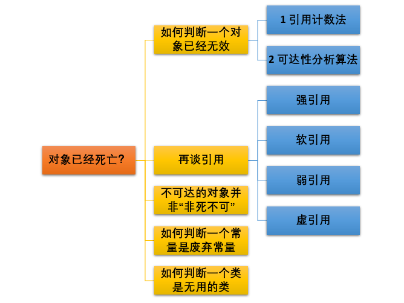

### 引用计数法

给对象中添加一个引用计数器，每当有一个地方引用它，计数器就加 1；当引用失效，计数器就减 1；任何时候计数器为 0 的对象就是不可能再被使用的。

**这个方法实现简单，效率高，但是目前主流的虚拟机中并没有选择这个算法来管理内存，其最主要的原因是它很难解决对象之间相互循环引用的问题。** 所谓对象之间的相互引用问题，如下面代码所示：除了对象 objA 和 objB 相互引用着对方之外，这两个对象之间再无任何引用。但是他们因为互相引用对方，导致它们的引用计数器都不为 0，于是引用计数算法无法通知 GC 回收器回收他们。

### 可达性分析算法

这个算法的基本思想就是通过一系列的称为 **“GC Roots”** 的对象作为起点，从这些节点开始向下搜索，节点所走过的路径称为引用链，**当一个对象到 GC Roots 没有任何引用链相连的话**，则证明此对象是不可用的。

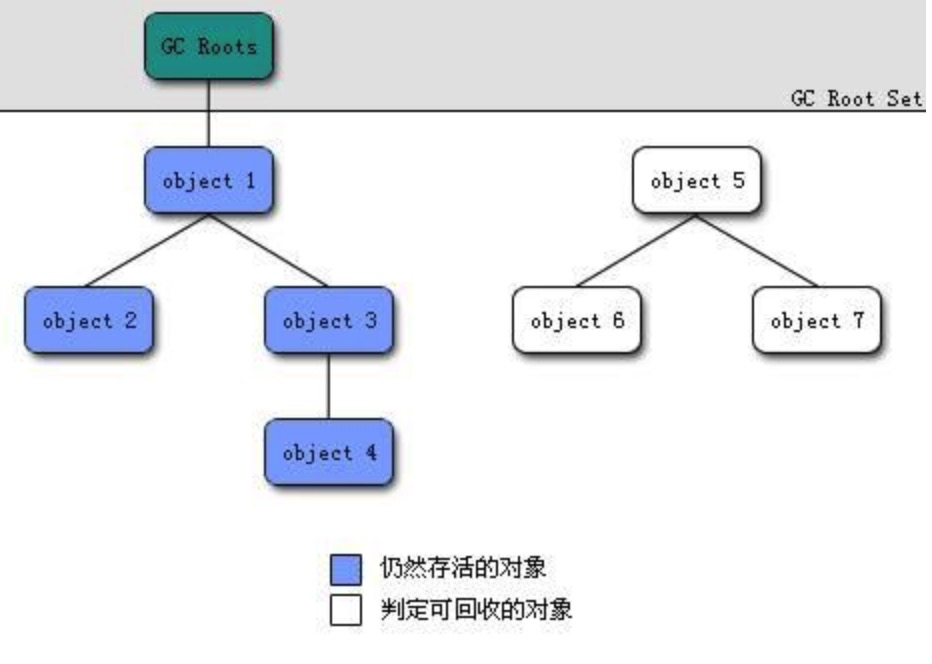

可以作为 GC Root 的对象

- 虚拟机栈中应用的对象
- 方法区中的类静态属性引用的对象
- 方法区中常量引用的对象
- 本地方法栈中 JNI（Native方法）引用的对象

### 再谈引用

无论是通过引用计数法判断对象引用数量，还是通过可达性分析法判断对象的引用链是否可达，判定对象的存活都与“引用”有关。

JDK1.2 之前，Java 中引用的定义很传统：如果 reference 类型的数据存储的数值代表的是另一块内存的起始地址，就称这块内存代表一个引用。

JDK1.2 以后，Java 对引用的概念进行了扩充，将引用分为强引用、软引用、弱引用、虚引用四种（引用强度逐渐减弱）

**1．强引用（StrongReference）**

以前我们使用的大部分引用实际上都是强引用，这是使用最普遍的引用。如果一个对象具有强引用，那就类似于**必不可少的生活用品**，垃圾回收器绝不会回收它。当内存空间不足，Java 虚拟机宁愿抛出 OutOfMemoryError 错误，使程序异常终止，也不会靠随意回收具有强引用的对象来解决内存不足问题。

**2．软引用（SoftReference）**

**如果内存空间足够，垃圾回收器就不会回收它，如果内存空间不足了，就会回收这些对象的内存。**只要垃圾回收器没有回收它，该对象就可以被程序使用。软引用可用来实现内存敏感的高速缓存。

软引用可以和一个引用队列（ReferenceQueue）联合使用，如果软引用所引用的对象被垃圾回收，JAVA 虚拟机就会把这个软引用加入到与之关联的引用队列中。

**3．弱引用（WeakReference）**

弱引用与软引用的区别在于：只具有弱引用的对象拥有更短暂的生命周期。在垃圾回收器线程扫描它所管辖的内存区域的过程中，**一旦发现了只具有弱引用的对象，不管当前内存空间足够与否，都会回收它的内存。**不过，由于垃圾回收器是一个优先级很低的线程， 因此不一定会很快发现那些只具有弱引用的对象。

弱引用可以和一个引用队列（ReferenceQueue）联合使用，如果弱引用所引用的对象被垃圾回收，Java 虚拟机就会把这个弱引用加入到与之关联的引用队列中。

**4．虚引用（PhantomReference）**

"虚引用"顾名思义，就是形同虚设，与其他几种引用都不同，虚引用并不会决定对象的生命周期。如果一个对象仅持有虚引用，**那么它就和没有任何引用一样，在任何时候都可能被垃圾回收**。

**虚引用主要用来跟踪对象被垃圾回收的活动**。

**虚引用与软引用和弱引用的一个区别在于：** 虚引用必须和引用队列（ReferenceQueue）联合使用。当垃圾回收器准备回收一个对象时，如果发现它还有虚引用，就会在回收对象的内存之前，把这个虚引用加入到与之关联的引用队列中。程序可以通过判断引用队列中是否已经加入了虚引用，来了解被引用的对象是否将要被垃圾回收。程序如果发现某个虚引用已经被加入到引用队列，那么就可以在所引用的对象的内存被回收之前采取必要的行动。

特别注意，在程序设计中一般很少使用弱引用与虚引用，使用软引用的情况较多，这是因为**软引用可以加速 JVM 对垃圾内存的回收速度，可以维护系统的运行安全，防止内存溢出（OutOfMemory）等问题的产生**。

### 不可达的对象并非“非死不可”

即使在可达性分析法中不可达的对象，也并非是“非死不可”的，这时候它们暂时处于“缓刑阶段”，要真正宣告一个对象死亡，至少要经历两次标记过程；可达性分析法中不可达的对象被第一次标记并且进行一次筛选，筛选的条件是此对象是否有必要执行 finalize 方法。当对象没有覆盖 finalize 方法或 finalize 方法已经被虚拟机调用过时，虚拟机将这两种情况视为没有必要执行。

被判定为需要执行的对象将会被放在一个队列中进行第二次标记，除非这个对象与GC Roots 引用链上的任何一个对象建立关联，否则就会被真的回收。

### 如何判断一个常量是废弃常量（常量池回收）

运行时常量池主要回收的是废弃的常量。那么，我们如何判断一个常量是废弃常量呢？

假如在常量池中存在字符串 "abc"，**如果当前没有任何 String 对象引用该字符串常量的话**，就说明常量 "abc" 就是废弃常量，如果这时发生内存回收的话而且有必要的话，"abc" 就会被系统清理出常量池。

注意：我们在 [可能是把 Java 内存区域讲的最清楚的一篇文章 ](https://mp.weixin.qq.com/s?__biz=MzU4NDQ4MzU5OA==&mid=2247484303&idx=1&sn=af0fd436cef755463f59ee4dd0720cbd&chksm=fd9855eecaefdcf8d94ac581cfda4e16c8a730bda60c3b50bc55c124b92f23b6217f7f8e58d5&token=506869459&lang=zh_CN#rd)也讲了 JDK1.7 及之后版本的 JVM 已经将运行时常量池从方法区中移了出来，在 Java 堆（Heap）中开辟了一块区域存放运行时常量池。

### 如何判断一个类是无用的类（类卸载）

方法区主要回收的是无用的类，那么如何判断一个类是无用的类的呢？

判定一个常量是否是“废弃常量”比较简单，而要判定一个类是否是“无用的类”的条件则相对苛刻许多。类需要同时满足下面 3 个条件才能算是 **“无用的类”** ：

- 该类所有的实例都已经被回收，也就是 Java 堆中不存在该类的任何实例。
- 加载该类的 ClassLoader 已经被回收。
- 该类对应的 java.lang.Class 对象没有在任何地方被引用，无法在任何地方通过反射访问该类的方法。

虚拟机可以对满足上述 3 个条件的无用类进行回收，这里说的**仅仅是“可以”**，而并不是和对象一样不使用了就会必然被回收。

## 垃圾收集算法

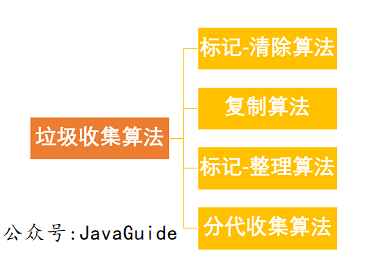

### 标记-清除算法

该算法分为“标记”和“清除”阶段：首先标记出所有需要回收的对象，在标记完成后统一回收所有被标记的对象。它是最基础的收集算法，后续的算法都是对其不足进行改进得到。这种垃圾收集算法会带来两个明显的问题：

1. **效率问题（占用大量的CPU）**
2. **空间问题（标记清除后会产生大量不连续的碎片）**


### 3.2 复制算法

为了解决效率问题，一种称为复制(Copying)的收集算法出现了，**它将可用内存按容量划分为大小相等的两块，每次只使用其中的一块。当这一块内存用完了，就将还存活着的对象复制到另外一块上，然后再把已经使用过的内存空间一次清理掉。**这样使得每次都是对整个半区进行内存回收，内存分配时也就不用考虑内存碎片等复杂情况，只要移动堆顶指针，按顺序分配内存即可，实现简单，运行高效。**代价是内存缩小为原来的一半。**

商业虚拟机用这个回收算法来回收新生代。IBM研究表明98%的对象是“朝生夕死“，不需要按照1-1的比例来划分内存空间，而是将内存分为一块较大的”Eden“空间和两块较小的Survivor空间，每次使用Eden和其中一块Survivor。当回收时，将Eden和Survivor中还存活的对象一次性复制到另外一个Survivor空间上，最后清理掉Eden和刚才用过的Survivor空间。Hotspot虚拟机默认Eden和Survivor的比例是8-1.即每次可用整个新生代的90%, 只有一个survivor，即1/10被”浪费“。当然，98%的对象回收只是一般场景下的数据，我们没有办法保证每次回收都只有不多于10%的对象存活，**当Survivor空间不够时，需要依赖其他内存(老年代)进行分配担保(Handle Promotion)。**

如果另外一块survivor空间没有足够空间存放上一次新生代收集下来的存活对象时，这些对象将直接通过分配担保机制进入老年代。

**复制算法适合绝大多数对象生命周期比较短的场景。**

#### eden survivor复制过程概述

Eden Space字面意思是伊甸园，对象被创建的时候首先放到这个区域，进行垃圾回收后，不能被回收的对象被放入到空的survivor区域。

Survivor Space幸存者区，用于保存在eden space内存区域中经过垃圾回收后没有被回收的对象。Survivor有两个，分别为To Survivor、 From Survivor，这个两个区域的空间大小是一样的。执行垃圾回收的时候Eden区域不能被回收的对象被放入到空的survivor（也就是To Survivor，同时Eden区域的内存会在垃圾回收的过程中全部释放），另一个survivor（即From Survivor）里不能被回收的对象也会被放入这个survivor（即To Survivor），然后To Survivor 和 From Survivor的标记会互换，始终保证一个survivor是空的。

为啥需要两个survivor？因为需要一个完整的空间来复制过来。当满的时候晋升。每次都往标记为to的里面放，然后互换，这时from已经被清空，可以当作to了。


- 优点：
  - 1、效率高，没有内存碎片。
- 缺点：
  - 1、浪费一半的内存空间。
  - 2、复制收集算法在对象存活率较高时就要进行较多的复制操作，效率将会变低。

### 3.3 标记-整理算法

复制收集算法在对象成活率较高时就要进行较多的复制操作，效率将会变低。更关键的是，如果不想浪费50%的空间，就需要有额外的空间进行分配担保，以应对被使用的内存中所有对象都100%存活的极端情况，所以，老年代一般不能直接选用这种算法。

根据老年代的特点提出的一种标记算法，标记过程仍然与“标记-清除”算法一样，但后续步骤不是直接对可回收对象回收，而是让所有存活的对象向一端移动，然后直接清理掉端边界以外的内存。


- 优点：
  - 1、相对标记清除算法，解决了内存碎片问题。
  - 2、没有内存碎片后，对象创建内存分配也更快速了（可以使用TLAB进行分配）。
- 缺点：
  - 1、效率问题，（同标记清除算法）标记和整理两个过程的效率都不高。

### 3.4 分代收集算法

当前虚拟机的垃圾收集都采用分代收集算法，这种算法没有什么新的思想，只是根据对象存活周期的不同将内存分为几块。一般将 java 堆分为新生代和老年代，这样我们就可以根据各个年代的特点选择合适的垃圾收集算法。

**比如在新生代中，每次收集都会有大量对象死去，所以可以选择复制算法，只需要付出少量对象的复制成本就可以完成每次垃圾收集。而老年代的对象存活几率是比较高的，而且没有额外的空间对它进行分配担保，所以我们必须选择“标记-清除”或“标记-整理”算法进行垃圾收集。**

**延伸面试问题：** HotSpot 为什么要分为新生代和老年代？

根据上面的对分代收集算法的介绍回答。

## 垃圾收集器


| 收集器                | 串行、并行or并发 | 新生代/老年代 | 算法               | 目标         | 适用场景                                  |
| --------------------- | ---------------- | ------------- | ------------------ | ------------ | ----------------------------------------- |
| **Serial**            | 串行             | 新生代        | 复制算法           | 响应速度优先 | 单CPU环境下的Client模式                   |
| **Serial Old**        | 串行             | 老年代        | 标记-整理          | 响应速度优先 | 单CPU环境下的Client模式、CMS的后备预案    |
| **ParNew**            | 并行             | 新生代        | 复制算法           | 响应速度优先 | 多CPU环境时在Server模式下与CMS配合        |
| **Parallel Scavenge** | 并行             | 新生代        | 复制算法           | 吞吐量优先   | 在后台运算而不需要太多交互的任务          |
| **Parallel Old**      | 并行             | 老年代        | 标记-整理          | 吞吐量优先   | 在后台运算而不需要太多交互的任务          |
| **CMS**               | ❗️并发            | 老年代        | 标记-清除          | 响应速度优先 | 集中在互联网站或B/S系统服务端上的Java应用 |
| **G1**                | ❗️并发            | both          | 标记-整理+复制算法 | 响应速度优先 | 面向服务端应用，将来替换CMS               |

**如果说收集算法是内存回收的方法论，那么垃圾收集器就是内存回收的具体实现。**

虽然我们对各个收集器进行比较，但并非要挑选出一个最好的收集器。因为直到现在为止还没有最好的垃圾收集器出现，更加没有万能的垃圾收集器，**我们能做的就是根据具体应用场景选择适合自己的垃圾收集器**。试想一下：如果有一种四海之内、任何场景下都适用的完美收集器存在，那么我们的 HotSpot 虚拟机就不会实现那么多不同的垃圾收集器了。

### Serial 收集器

Serial（串行）收集器收集器是最基本、历史最悠久的垃圾收集器了。大家看名字就知道这个收集器是一个单线程收集器了。它的 **“单线程”** 的意义不仅仅意味着它只会使用一条垃圾收集线程去完成垃圾收集工作，更重要的是它在进行垃圾收集工作的时候必须**暂停**其他所有的工作线程（ **"Stop The World"** ），直到它收集结束。

**新生代采用复制算法，老年代采用标记-整理算法。** 


虚拟机的设计者们当然知道 Stop The World 带来的不良用户体验，所以在后续的垃圾收集器设计中停顿时间在不断缩短（仍然还有停顿，寻找最优秀的垃圾收集器的过程仍然在继续）。

但是 Serial 收集器有没有优于其他垃圾收集器的地方呢？当然有，它**简单而高效（与其他收集器的单线程相比）**。Serial 收集器由于没有线程交互的开销，自然可以获得很高的单线程收集效率。Serial 收集器对于运行在 Client 模式下的虚拟机来说是个不错的选择。

### ParNew 收集器

**ParNew 收集器其实就是 Serial 收集器的多线程版本，除了使用多线程进行垃圾收集外，其余行为（控制参数、收集算法、回收策略等等）和 Serial 收集器完全一样。**

**新生代采用复制算法，老年代采用标记-整理算法。** 


它是许多运行在 Server 模式下的虚拟机的首要选择，除了 Serial 收集器外，只有它能与 CMS 收集器（真正意义上的并发收集器，后面会介绍到）配合工作。

**并行和并发概念补充：**

- **并行（Parallel）** ：指多条垃圾收集线程并行工作，但此时用户线程仍然处于等待状态。
- **并发（Concurrent）**：<u>指用户线程与垃圾收集线程同时执行（但不一定是并行，可能会交替执行）</u>，用户程序在继续运行，而垃圾收集器运行在另一个 CPU 上。

> CMS 与 G1是属于并发，Parallel New 属于并行。

### Parallel Scavenge 收集器

Parallel Scavenge 收集器也是使用复制算法的多线程收集器，它看上去几乎和ParNew都一样。 **那么它有什么特别之处呢？**

```
-XX:+UseParallelGC 

    使用 Parallel 收集器+ 老年代串行

-XX:+UseParallelOldGC

    使用 Parallel 收集器+ 老年代并行
```

**Parallel Scavenge 收集器关注点是吞吐量（高效率的利用 CPU）。CMS 等垃圾收集器的关注点更多的是用户线程的停顿时间（提高用户体验）。所谓吞吐量就是 CPU 中用于运行用户代码的时间与 CPU 总消耗时间的比值。** Parallel Scavenge 收集器提供了很多参数供用户找到最合适的停顿时间或最大吞吐量，如果对于收集器运作不太了解的话，手工优化存在困难的话可以选择把内存管理优化交给虚拟机去完成也是一个不错的选择。

**新生代采用复制算法，老年代采用标记-整理算法。** 


### Serial Old 收集器

**Serial 收集器的老年代版本**，它同样是一个单线程收集器。它主要有两大用途：一种用途是在 JDK1.5 以及以前的版本中与 Parallel Scavenge 收集器搭配使用，另一种用途是作为 CMS 收集器的后备方案。

### Parallel Old 收集器

**Parallel Scavenge 收集器的老年代版本**。使用多线程和“标记-整理”算法。在注重吞吐量以及 CPU 资源的场合，都可以优先考虑 Parallel Scavenge 收集器和 Parallel Old 收集器。

### CMS 收集器

**CMS（Concurrent Mark Sweep）收集器是一种以获取最短回收停顿时间为目标的收集器。它非常符合在注重用户体验的应用上使用。适合应用在互联网站或者B/S系统的服务器上。非常适合堆内存大、CPU核数多的服务器端应用。**

**CMS（Concurrent Mark Sweep）收集器是 HotSpot 虚拟机第一款真正意义上的*并发收集器*，<u>它第一次实现了让垃圾收集线程与用户线程（基本上）同时工作。</u>**

从名字中的**Mark Sweep**这两个词可以看出，CMS 收集器是一种 **“标记-清除”算法**实现的，它的运作过程相比于前面几种垃圾收集器来说更加复杂一些。整个过程分为四个步骤：

初始标记，重新标记这两个步骤仍然需要Stop The World, 初始标记仅仅标记以下 GC Roots 能直接关联的对象，速度很快。

- **初始标记：** 暂停所有的其他线程，并记录下**直接与 GC Roots 相连的对象**，速度很快 ；
- **并发标记：** 同时开启 GC 和用户线程，从第一部标记的对象出发，并发地标记可达对象。**并发标记就是进行GC Roots Tracing的过程**。
- **重新标记：** 重新标记阶段就是为了**修正并发标记期间因为用户程序继续运行而导致标记产生变动的那一部分对象**的标记记录，这个阶段的停顿时间一般会比初始标记阶段的时间稍长，远远比并发标记阶段时间短。
- **并发清除：** 开启用户线程，同时 GC 线程开始对为标记的区域做清扫。

**整个过程耗时最长的并发标记和并发清除过程**，收集器都可以与用户线程一起工作。总体上来说，CMS收集器的内存回收过程与用户线程一起并发执行的。


开启该收集器的 JVM 参数：`-XX:+UseConcMarkSweepGC` 开启该参数后会自动将 `-XX:+UserParNewGC` 打开。

开启`-XX:+UseConcMarkSweepGC` 参数后，使用 <u>ParNew（Young区用）+CMS（old区用）+Serial Old</u> 的收集器组合，Serial Old作为 CMS出错的后备收集器。也就是意味着开启CMS就开启了三个收集器。

从它的名字就可以看出它是一款优秀的垃圾收集器，主要优点：**并发收集、低停顿**。但是它有下面三个明显的缺点：

- **对 CPU 资源敏感；**
- **无法处理浮动垃圾；**
- **它使用的回收算法-“标记-清除”算法会导致收集结束时会有大量空间碎片产生。**

**浮动垃圾：**由于CMS并发清理时，用户线程还在运行，伴随产生新垃圾，而这一部分出现在标记之后，只能下次GC时再清理。这一部分垃圾就称为”浮动垃圾“。

<u>🍟 如何处理浮动垃圾呢？</u>

当出现 Concurrent Mode Failure 时候，会触发 Full GC 操作，进行浮动垃圾回收。

<u>🍟 为什么 CMS 选用标记清除，而不是标记整理呢？</u>

CMS主要关注低延迟，因而采用并发方式，清理垃圾时，应用程序还在运行，如何采用压缩算法，标记整理则涉及到<u>要移动应用程序的存活对象</u>，此时不停顿，是很难处理的，一般需要停顿下，移动存活对象，再让应用程序继续运行，但这样停顿时间变长，延迟变大

### CMS什么时候FUll GC

除直接调用System.gc外，触发Full GC执行的情况有如下四种。

#### 1. 旧生代空间不足

旧生代空间只有在新生代对象转入及创建为大对象、大数组时才会出现不足的现象，当执行Full GC后空间仍然不足，则抛出如下错误：
java.lang.OutOfMemoryError: Java heap space
为避免以上两种状况引起的FullGC，调优时应尽量做到让对象在Minor GC阶段被回收、让对象在新生代多存活一段时间及不要创建过大的对象及数组。

#### 2. Permanet Generation空间满

PermanetGeneration中存放的为一些class的信息等，当系统中要加载的类、反射的类和调用的方法较多时，Permanet Generation可能会被占满，在未配置为采用CMS GC的情况下会执行Full GC。如果经过Full GC仍然回收不了，那么JVM会抛出如下错误信息：
java.lang.OutOfMemoryError: PermGen space
为避免Perm Gen占满造成Full GC现象，可采用的方法为增大Perm Gen空间或转为使用CMS GC。

#### 3. CMS GC时出现promotion failed和concurrent mode failure

对于采用CMS进行旧生代GC的程序而言，尤其要注意GC日志中是否有promotion failed和concurrent mode failure两种状况，当这两种状况出现时可能会触发Full GC。
promotionfailed是在进行Minor GC时，survivor space放不下、对象只能放入旧生代，而此时旧生代也放不下造成的；concurrent mode failure是在执行CMS GC的过程中同时有对象要放入旧生代，而此时旧生代空间不足造成的。
应对措施为：增大survivorspace、旧生代空间或调低触发并发GC的比率，但在JDK 5.0+、6.0+的版本中有可能会由于JDK的bug29导致CMS在remark完毕后很久才触发sweeping动作。对于这种状况，可通过设置-XX:CMSMaxAbortablePrecleanTime=5（单位为ms）来避免。

#### 4. 统计得到的Minor GC晋升到旧生代的平均大小大于旧生代的剩余空间

这是一个较为复杂的触发情况，Hotspot为了避免由于新生代对象晋升到旧生代导致旧生代空间不足的现象，在进行Minor GC时，做了一个判断，如果之前统计所得到的Minor GC晋升到旧生代的平均大小大于旧生代的剩余空间，那么就直接触发Full GC。
例如程序第一次触发MinorGC后，有6MB的对象晋升到旧生代，那么当下一次Minor GC发生时，首先检查旧生代的剩余空间是否大于6MB，如果小于6MB，则执行Full GC。
当新生代采用PS GC时，方式稍有不同，PS GC是在Minor GC后也会检查，例如上面的例子中第一次Minor GC后，PS GC会检查此时旧生代的剩余空间是否大于6MB，如小于，则触发对旧生代的回收。
除了以上4种状况外，对于使用RMI来进行RPC或管理的Sun JDK应用而言，默认情况下会一小时执行一次Full GC。可通过在启动时通过- java-Dsun.rmi.dgc.client.gcInterval=3600000来设置Full GC执行的间隔时间或通过-XX:+ DisableExplicitGC来禁止RMI调用System.gc。

## G1

### 初衷

在G1提出之前，经典的垃圾收集器主要有三种类型：**串行收集器、并行收集器和并发标记清除收集器**，这三种收集器分别可以是满足Java应用三种不同的需求：**内存占用及并发开销最小化、应用吞吐量最大化和应用GC暂停时间最小化**，但是，上述三种垃圾收集器都有几个共同的问题：**（1）所有针对老年代的操作必须扫描整个老年代空间；（2）年轻代和老年代是独立的连续的内存块，必须先决定年轻代和老年代在虚拟地址空间的位置。**

### 设计目标

G1是一种服务端应用使用的垃圾收集器，目标是用在**多核、大内存**的机器上，它在大多数情况下可以实现指定的GC暂停时间，同时还能保持较高的吞吐量。

### 使用场景

G1适用于以下几种应用：

- 可以像CMS收集器一样，允许垃圾收集线程和应用线程并行执行，即需要额外的CPU资源；
- 压缩空闲空间不会延长GC的暂停时间；
- 需要更易预测的GC暂停时间；
- 不需要实现很高的吞吐量

被视为 JDK1.7 中 HotSpot 虚拟机的一个重要进化特征。它具备一下特点：

- **并行与并发**：G1 能充分利用 CPU、多核环境下的硬件优势，使用多个 CPU（CPU 或者 CPU 核心）来缩短 Stop-The-World 停顿时间。部分其他收集器原本需要停顿 Java 线程执行的 GC 动作，G1 收集器仍然可以通过并发的方式让 java 程序继续执行。
- **分代收集**：虽然 G1 可以不需要其他收集器配合就能独立管理整个 GC 堆，但是还是保留了分代的概念。
- **空间整合**：与 CMS 的“标记--清理”算法不同，G1 从整体来看是基于**“标记整理”**算法实现的收集器；从局部上来看是基于**“复制”**算法实现的。
- **可预测的停顿**：这是 G1 相对于 CMS 的另一个大优势，降低停顿时间是 G1 和 CMS 共同的关注点，但 G1 除了追求低停顿外，还能建立可预测的停顿时间模型，能让使用者明确指定在一个长度为 M 毫秒的时间片段内。如果我们需要调优，在内存大小一定的情况下，我们只需要修改最大暂停时间即可。

### G1 原理

#### 分区（Region）

**G1将新生代，老年代的物理空间划分取消了**。这样我们再也不用单独的空间对每个代进行设置了，不用担心每个代内存是否足够。取而代之的是，G1算法将堆划分为若干个区域（Region），它仍然属于分代收集器。不过，这些区域的一部分包含新生代，新生代的垃圾收集依然采用暂停所有应用线程的方式，将存活对象拷贝到老年代或者Survivor空间。老年代也分成很多区域，G1收集器通过将对象从一个区域复制到另外一个区域，完成了清理工作。这就意味着，在正常的处理过程中，G1完成了堆的压缩（至少是部分堆的压缩），这样也就不会有 cms 内存碎片问题的存在了。如下图所示。

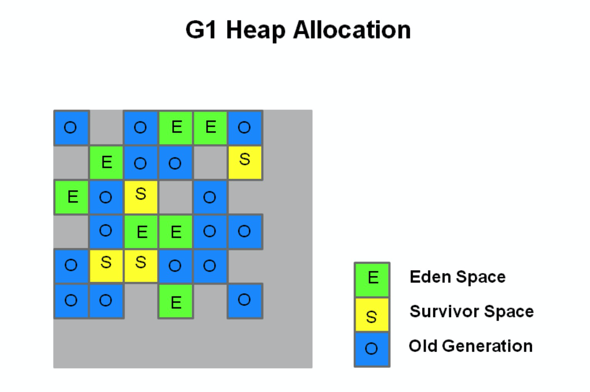

**每个分区都可能是年轻代也可能是老年代，但是在同一时刻只能属于某个代。** 年轻代、幸存区、老年代这些概念还存在，成为逻辑上的概念，这样方便复用之前分代框架的逻辑。**在物理上不需要连续**，则带来了额外的好处——有的分区内垃圾对象特别多，有的分区内垃圾对象很少，G1会优先回收垃圾对象特别多的分区，这样可以花费较少的时间来回收这些分区的垃圾，这也就是G1名字的由来，即**首先收集垃圾最多的分区。**

新生代其实并不是适用于这种算法的，依然是在新生代满了的时候，对整个新生代进行回收—— <u>整个新生代中的对象，要么被回收、要么晋升</u>，至于新生代也采取分区机制的原因，则是因为这样跟老年代的策略统一，方便调整代的大小。

G1还是一种带压缩的收集器，在回收老年代的分区时，是将存活的对象从一个分区拷贝到另一个可用分区，这个拷贝的过程就实现了局部的压缩。每个分区的大小从1M到32M不等，但是都是2的冥次方，能够支持的最大内存为：32M*2048=64G。

#### 巨型对象的管理

在G1中，还有一种特殊的区域，叫**Humongous区域**。 **如果一个对象占用的空间超过了分区容量50%以上**，G1收集器就认为这是一个巨型对象。这些巨型对象，默认直接会被分配在年老代，但是如果它是一个短期存在的巨型对象，就会对垃圾收集器造成负面影响。为了解决这个问题，G1**划分了一个Humongous区，它用来专门存放巨型对象**。如果一个H区装不下一个巨型对象，那么G1会寻找连续的H分区来存储。为了能找到连续的H区，有时候不得不启动Full GC。

由于巨型对象的存在，G1的堆中的分区就分成了三种类型：**新生代分区、老年代分区和巨型分区**。

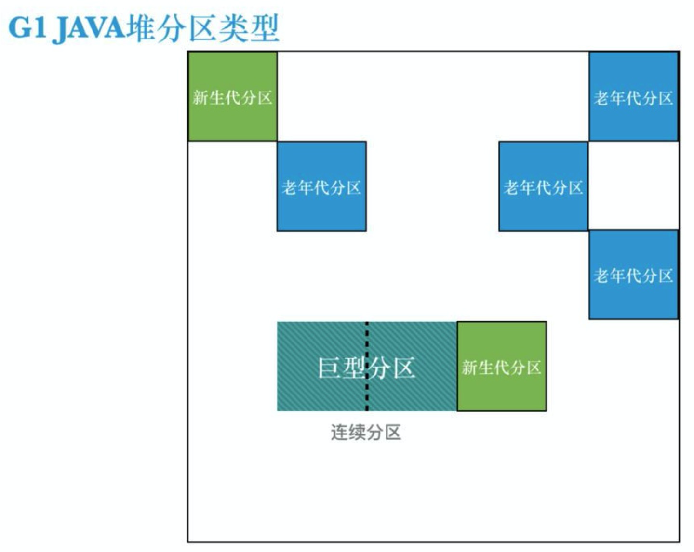

如果一个巨型对象跨越两个分区，开始的那个分区被称为“开始巨型”，后面的分区被称为“连续巨型”，这样最后一个分区的一部分空间是被浪费掉的，如果有很多巨型对象都刚好比分区大小多一点，就会造成很多空间的浪费，从而导致堆的碎片化。如果你发现有很多由于巨型对象分配引起的连续的并发周期，并且堆已经碎片化（明明空间够，但是触发了FULL GC），可以考虑调整 `-XX:G1HeapRegionSize`参数，减少或消除巨型对象的分配。

关于巨型对象的回收：在JDK8u40之前，巨型对象的回收只能在并发收集周期的**清除阶段或FULL GC**过程中过程中被回收，在JDK8u40（包括这个版本）之后，**一旦没有任何其他对象引用巨型对象，那么巨型对象也可以在年轻代收集中被回收**。

#### 对象分配策略

说起大对象的分配，我们不得不谈谈对象的分配策略。它分为3个阶段：

1.TLAB(Thread Local Allocation Buffer)线程本地分配缓冲区
2.Eden区中分配
3.Humongous区分配

TLAB为线程本地分配缓冲区，它的**目的为了使对象尽可能快的分配出来**。如果对象在一个共享的空间中分配，我们需要采用一些同步机制来管理这些空间内的空闲空间指针。在Eden空间中，每一个线程都有一个固定的分区用于分配对象，即一个TLAB。分配对象时，线程之间不再需要进行任何的同步。

对TLAB空间中无法分配的对象，JVM会尝试在Eden空间中进行分配。如果Eden空间无法容纳该对象，就只能在老年代中进行分配空间。

最后，G1提供了两种GC模式，Young GC和Mixed GC，两种都是Stop The World(STW)的。下面我们将分别介绍一下这2种模式。

### 两种模式

G1收集器的模式主要有两种：

- Young GC（新生代垃圾收集）
- Mixed GC（混合垃圾收集）

#### G1 Young GC

Young GC主要是对Eden区进行GC，它**在Eden空间耗尽时会被触发**。在这种情况下，Eden空间的数据移动到Survivor空间中，如果Survivor空间不够，Eden空间的部分数据会直接晋升到年老代空间。Survivor区的数据移动到新的Survivor区中，也有部分数据晋升到老年代空间中。最终Eden空间的数据为空，GC停止工作，应用线程继续执行。

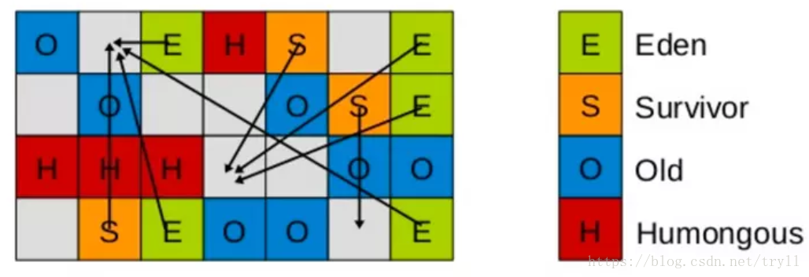

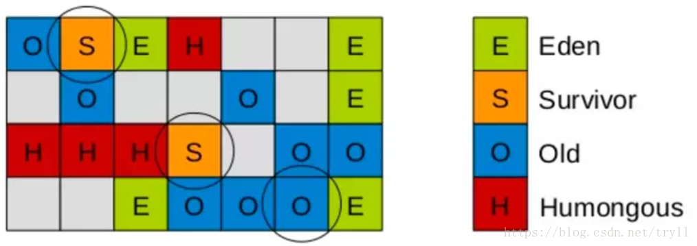

这时，我们需要考虑一个问题，如果仅仅GC 新生代对象，我们如何找到所有的根对象呢？ 老年代的所有对象都是根么？那这样扫描下来会耗费大量的时间。于是，<u>G1引进了RSet的概念。它的全称是Remembered Set，作用是跟踪指向某个heap区内的对象引用。</u>

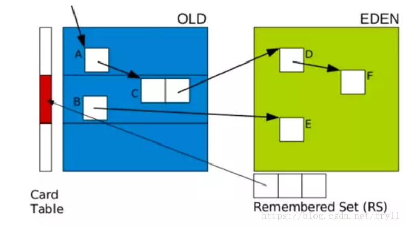

在CMS中，也有RSet的概念，**在老年代中有一块区域用来记录指向新生代的引用**。这是一种point-out，在进行Young GC时，扫描根时，仅仅需要扫描这一块区域，而不需要扫描整个老年代。

但在G1中，并没有使用point-out，这是由于一个分区太小，分区数量太多，如果是用point-out的话，会造成大量的扫描浪费，有些根本不需要GC的分区引用也扫描了。于是G1中使用point-in来解决。point-in的意思是**哪些分区引用了当前分区中的对象**。这样，仅仅将这些对象当做根来扫描就避免了无效的扫描。由于新生代有多个，那么我们需要在新生代之间记录引用吗？这是不必要的，**原因在于每次GC时，所有新生代都会被扫描，所以只需要记录老年代到新生代之间的引用即可。**

需要注意的是，如果引用的对象很多，赋值器需要对每个引用做处理，赋值器开销会很大，为了解决赋值器开销这个问题，在G1 中又引入了另外一个概念，卡表（Card Table）。一个Card Table将一个分区在逻辑上划分为固定大小（512B）的连续区域，每个区域称之为卡。卡通常较小，介于128到512字节之间。Card Table通常为字节数组，由Card的索引（即数组下标）来标识每个分区的对象地址。默认情况下，每个卡都会被引用。当一个地址空间被引用时，这个地址空间对应的数组索引的值被标记为”0″，即标记为脏对被引用，此外RSet也将这个数组下标记录下来。一般情况下，这个RSet其实是一个Hash Table，Key是别的Region的起始地址，Value是一个集合，里面的元素是Card Table的Index。

Card Table 与 RS 的关系：https://bbs.huaweicloud.com/blogs/248749

**Young GC 阶段**：

**阶段1：根扫描**

静态和本地对象被扫描

**阶段2：更新RS**

<u>处理dirty card队列更新RS</u>

**阶段3：处理RS**

检测从年轻代指向年老代的对象

**阶段4：对象拷贝**

拷贝存活的对象到survivor/old区域

**阶段5：处理引用队列**

软引用，弱引用，虚引用处理

#### G1 Mix GC

Mix GC不仅进行正常的新生代垃圾收集，同时也回收部分后台扫描线程标记的老年代分区。

它的GC步骤分2步：

1.全局并发标记（global concurrent marking）
2.拷贝存活对象（evacuation）

在进行Mix GC之前，会先进行global concurrent marking（全局并发标记）。 global concurrent marking的执行过程是怎样的呢？

在G1 GC中，它主要是为Mixed GC提供标记服务的，并不是一次GC过程的一个必须环节。global concurrent marking的执行过程分为五个步骤：

**初始标记（initial mark，STW）**

在此阶段，只标记GC Roots能直接关联到的对象。存在 STW 暂停。

**并发标记（Concurrent Marking）**

进行 GC Roots Tracing 的过程。该阶段与应用程序同时运行。

**最终标记（Fin Mark，STW）**

该阶段是 STW 回收，修正并发标记期间，因程序运行导致标记发生变化的那一部分对象。

**清除垃圾（Cleanup，STW）**

在这个最后阶段，G1 GC 执行统计和 RSet 净化的 STW 操作。在统计期间，G1 GC 会识别完全空闲的区域和可供进行混合垃圾回收的区域。清理阶段在将空白区域重置并返回到空闲列表时为部分并发。

#### 三色标记算法

提到并发标记，我们不得不了解并发标记的三色标记算法。它是描述追踪式回收器的一种有用的方法，利用它可以推演回收器的正确性。 首先，我们将对象分成三种类型的。

黑色:根对象，或者该对象与它的子对象都被扫描（已扫描）

灰色:对象本身被扫描,但还没扫描完该对象中的子对象（正在扫描）

白色:未被扫描对象，扫描完成所有对象之后，最终为白色的为不可达对象，即垃圾对象（需要被删除）

当GC开始扫描对象时，按照如下图步骤进行对象的扫描：
根对象被置为黑色，子对象被置为灰色。

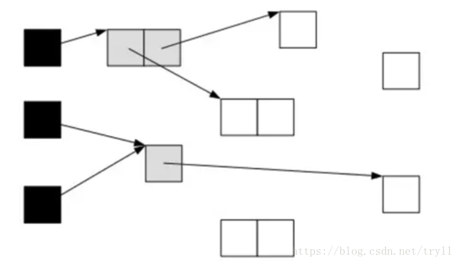

继续由灰色遍历,将已扫描了子对象的对象置为黑色。

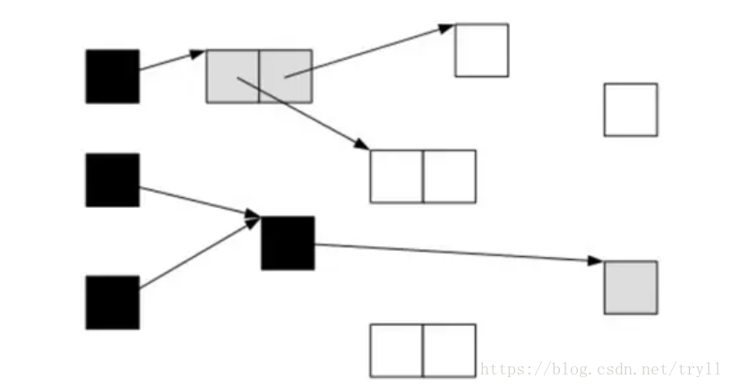

遍历了所有可达的对象后，所有可达的对象都变成了黑色。不可达的对象即为白色，需要被清理。

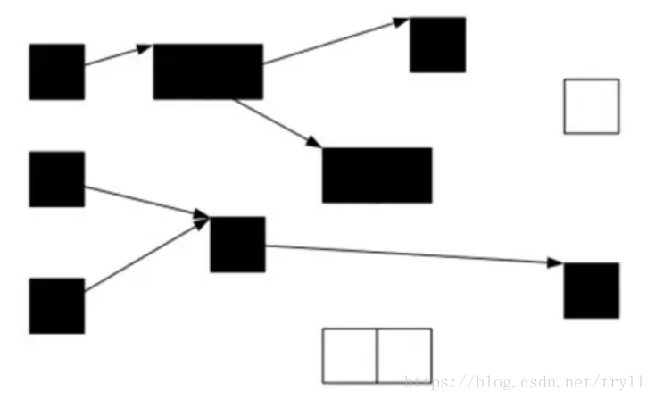

这看起来很美好，但是如果在标记过程中，应用程序也在运行，那么对象的指针就有可能改变。这样的话，我们就会遇到一个问题：对象丢失问题
我们看下面一种情况，当垃圾收集器扫描到下面情况时：


这时候应用程序执行了以下操作：
A.c=CB.c=null

这样，对象的状态图变成如下情形：

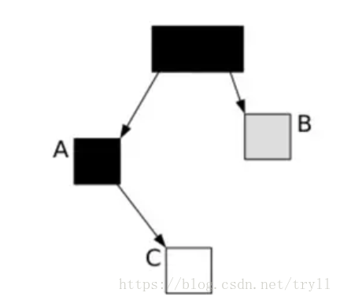

这时候垃圾收集器再标记扫描的时候就会下图成这样：

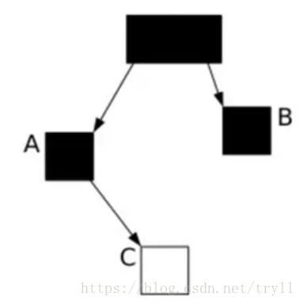

很显然，此时C是白色，被认为是垃圾需要清理掉，显然这是不合理的。那么我们如何保证应用程序在运行的时候，GC标记的对象不丢失呢？有如下2中可行的方式：
在插入的时候记录对象
在删除的时候记录对象

刚好这对应CMS和G1的2种不同实现方式：

在CMS采用的是增量更新（Incremental update），只要在写屏障（write barrier）里发现要有一个白对象的引用被赋值到一个黑对象 的字段里，那就把这个白对象变成灰色的。即插入的时候记录下来。

在G1中，使用的是STAB（snapshot-at-the-beginning）的方式，删除的时候记录所有的对象，它有3个步骤：

1、在开始标记的时候生成一个快照图标记存活对象
2、在并发标记的时候所有被改变的对象入队（在write barrier里把所有旧的引用所指向的对象都变成非白的）
3、可能存在游离的垃圾，将在下次被收集

这样，G1到现在可以知道哪些老的分区可回收垃圾最多。 当全局并发标记完成后，在某个时刻，就开始了Mix GC。这些垃圾回收被称作“混合式”是因为他们不仅仅进行正常的新生代垃圾收集，同时也回收部分后台扫描线程标记的分区。混合式垃圾收集如下图：

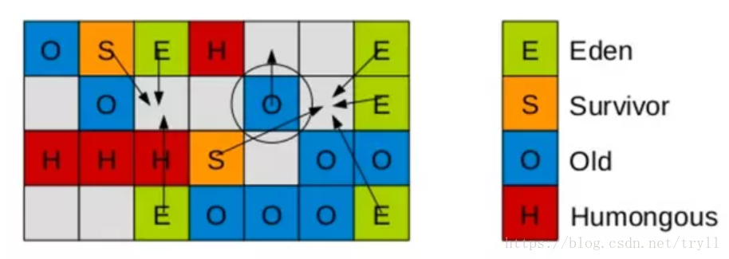

混合式GC也是采用的复制的清理策略，当GC完成后，会重新释放空间。

当S和E分区满的时候，会向空闲的区域复制，复制完成就清空原先的E和S区。

当S区满的时候，会向空闲的区域复制，升级为老年区。

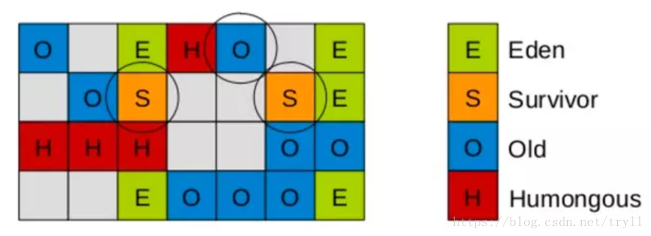

#### 收集集合（CSet）

**一组可被回收的分区的集合**。在CSet中存活的数据会在GC过程中被移动到另一个可用分区，CSet中的分区可以来自Eden空间、survivor空间、或者老年代。CSet会占用不到整个堆空间的1%大小。

#### 已记忆集合（RSet）

**RSet记录了其他Region中的对象引用本Region中对象的关系**，属于points-into结构（谁引用了我的对象）。RSet的价值在于使得垃圾收集器不需要扫描整个堆找到谁引用了当前分区中的对象，只需要扫描RSet即可。

> 摘一段R大的解释：G1 GC则是在points-out的card table之上再加了一层结构来构成points-into RSet：每个region会记录下到底哪些别的region有指向自己的指针，而这些指针分别在哪些card的范围内。 这个RSet其实是一个hash table，key是别的region的起始地址，value是一个集合，里面的元素是card table的index。 举例来说，如果region A的RSet里有一项的key是region B，value里有index为1234的card，它的意思就是region B的一个card里有引用指向region A。所以对region A来说，该RSet记录的是points-into的关系；而card table仍然记录了points-out的关系。

#### SATB

SATB 是维持并发GC的正确性的一个手段，G1 GC 并发理论基础就是 SATB，SATB是由 Taiichi Yuasa 为增量式**标记清除垃圾收集器**设计的一个标记算法。Yuasa的 SATB 的标记优化主要针对**标记-清除垃圾收集器**的**并发标记**阶段。

SATB是一个**快照标记算法**，在并发标记进行的过程中，垃圾收集器（Collecotr）和应用程序（Mutator）都在活动，如果一个对象还没被mark到，这时候Mutator就修改了它的引用，那么这时候拿到的快照就是不完整的了，如何解决这个问题呢？G1 GC使用了 **SATB write barrier**来解决这个问题。

#### G1 回收过程

G1的并发标记周期包括多个阶段： **并发标记**周期采用的算法是我们前文提到的 **SATB 标记算法**，产出是找出一些垃圾对象最多的老年代分区。

- **初始标记**
- **并发标记**
- **最终标记**
- **筛选回收**

**G1 收集器在后台维护了一个优先列表，每次根据允许的收集时间，优先选择回收价值最大的 Region(这也就是它的名字 Garbage-First 的由来)**。这种使用 Region 划分内存空间以及有优先级的区域回收方式，保证了 GF 收集器在有限时间内可以尽可能高的收集效率（把内存化整为零）。

> 在混合收集周期中，对于要回收的分区，会将该分区中存活的数据拷贝到另一个分区，这也是为什么G1收集器最终出现碎片化的频率比CMS收集器小得多的原因——以这种方式回收对象，实际上伴随着针对当前分区的压缩。

### 常见问题

1. Young GC、Mixed GC和Full GC的区别？ 答：Young GC的CSet中只包括年轻代的分区，Mixed GC的CSet中除了包括年轻代分区，还包括老年代分区；Full GC会暂停整个引用，同时对新生代和老年代进行收集和压缩。
2. ParallelGCThreads和ConcGCThreads的区别？ 答：ParallelGCThreads指得是在STW阶段，并行执行垃圾收集动作的线程数，ParallelGCThreads的值一般等于逻辑CPU核数，如果CPU核数大于8，则设置为 `5/8*cpus`，在SPARC等大型机上这个系数是5/16。；ConcGCThreads指的是在并发标记阶段，并发执行标记的线程数，一般设置为ParallelGCThreads的四分之一。
3. write barrier在GC中的作用？如何理解G1 GC中write barrier的作用？ 写屏障是一种内存管理机制，用在这样的场景——当代码尝试修改一个对象的引用时，在前面放上写屏障就意味着将这个对象放在了写屏障后面。
4. 什么时候出发老年代的 Full GC？当缺少足够的连续空间存储对象时。

参考文献：

[最全面的JVM G1学习笔记](https://blog.csdn.net/zl1zl2zl3/article/details/85078558)

[深入理解JVM垃圾收集机制(JDK1.8)](https://www.cnblogs.com/woshimrf/p/jvm-garbage.html)

[深入理解java G1 垃圾回收器](https://blog.csdn.net/tryll/article/details/83242495)

[Java : 对象不再使用时，为什么要赋值为 null ？](https://mp.weixin.qq.com/s/Zv139Qoy0skSYm_gLk4CfA)

## 问题

**4、GC 设计背后逻辑有哪些？**

- STW时间低
- 减少GC次数
- 减少CPU资源损耗

**5、内存碎片的影响是什么？**

空间碎片太多可能导致以后在程序运行过程需要分配较大对象时，无法找到足够的连续内存而不得不提前触发另一个的垃圾收集动作，比如：FULL GC。

**6、为什么要分新生代和老年代呢？**

这样就可以根据各个年代的特点采用最适当的收集算法。对于存活时间长的对象，**减少被gc的次数可以避免不必要的开销**。

**7、新生代使用什么收集算法，老年代时候什么收集算法？**

在新生代，每次垃圾收集时都发现大批对象死去，只有少量存活，那就选用复制算法，只需要付出少量存活对象的复制成本就可以完成收集。而老年代中因为对象存活率较高，没有额外的空间对它进行分配担保，就必须使用”标记-清理“和”标记-整理“算法来进行回收。

**8、垃圾回收算法是什么？**

可达性分析法和引用计数法。

**9、可以作为GC Roots的对象有哪些？**

- 虚拟机栈(栈帧中的本地变量表)中引用的对象（当前所有正在被调用的方法的引用类型的参数/局部变量/临时值）
- 方法区中类静态属性引用的对象
- 方法区中常量引用的对象
- 本地方法栈中JNI(即一般说的Native方法)引用的对象

是一组必须活跃的**引用**，不是对象。

**10、为什么 GC 时必须停顿？**

可达性分析对执行时间的敏感还体现在GC停顿上，因为**这项分析工作必须在一个能确保一致性的快照**中进行--这里”一致性“的意思是**指整个分析期间整个执行系统看起来就像被冻结在某个时间点，不可以出现分析过程中对象引用关系还在不断变化的情况**，该点不满足的话分析结果**准确性**就无法得到保证。这点是导致GC进行时必须停顿所有Java执行线程(Sun公司将这件事情称为”Stop The World“)的一个重要原因，即使是在号称(几乎)不会发生停顿的CMS收集器中，枚举根节点时也必须停顿的。

**11、引用计数法有什么缺点？**

它很难解决**对象之间相互循环引用**的问题。所谓对象之间的相互引用问题，如下面代码所示：除了对象 objA 和 objB 相互引用着对方之外，这两个对象之间再无任何引用。但是他们因为互相引用对方，导致它们的引用计数器都不为 0，于是引用计数算法无法通知 GC 回收器回收他们。

**12、CMS一共会有几次STW**

首先，回答两次，初始标记和重新标记需要。

然后，CMS并发的代价是预留空间给用户，预留不足的时候触发FUllGC，这时Serail Old会STW.

然后，CMS是标记-清除算法，导致空间碎片，则没有连续空间分配大对象时，FUllGC, 而FUllGC会开始碎片整理， STW.

即2次或多次。

**13、什么时候触发 CMS FUll GC？**

- 旧生代空间不足
- Permanet Generation空间满
- CMS GC时出现promotion failed和concurrent mode failure
- 统计得到的Minor GC晋升到旧生代的平均大小大于旧生代的剩余空间

**14、System.gc()与Runtime.gc()的区别？**

System.gc 是通知 JVM 可以进行GC 操作了，但实际有没有执行GC是不确定的，java.lang.System.gc()只是java.lang.Runtime.getRuntime().gc()的简写，两者其实是等价的。

**15、为什么需要对不用的变量进行置为NULL？**

```java
public static void main(String[] args) {
    if (true) {
        byte[] placeHolder = new byte[64 * 1024 * 1024];
        System.out.println(placeHolder.length / 1024);
    }
    System.gc();
}
```

在这个例子中，placeHolder 没有被设置为 null 结尾，触发GC时，main()方法的运行时栈中，还存在有对args和placeHolder的引用，GC判断这两个对象都是存活的，不进行回收。

```java
public static void main(String[] args) {
    if (true) {
        byte[] placeHolder = new byte[64 * 1024 * 1024];
        System.out.println(placeHolder.length / 1024);
    }
    int replacer = 1;
    System.gc();
}
```

我们在 System.gc() 之前再声明一个变量，这里涉及Java的栈优化，这个变量会重用placeHolder的索引。由于placeHolder作用域前后发生了变动，byte[] placeHolder 占用了栈索引1位置，当超过其作用域之后，由于Java 栈优化，placeHolder 被回收了，int replacer 变量占用栈索引1位置。这才使得 GC 认为 byte数组不再被引用了，进行了垃圾回收。

**17、Minor GC ，Full GC 触发条件？**

Minor GC触发条件：当Eden区满时，触发Minor GC。

Full GC触发条件：

（1）调用System.gc时，系统建议执行Full GC，但是不必然执行

（2）老年代空间不足

（3）方法去空间不足

（4）通过Minor GC后进入老年代的平均大小大于老年代的可用内存

（5）由Eden区、From Space区向To Space区复制时，对象大小大于To Space可用内存，则把该对象转存到老年代，且老年代的可用内存小于该对象大小

**18、CMS 标记过程概述？**

- **初始标记：** 暂停所有的其他线程，并记录下**直接与 GC Roots 相连的对象**，速度很快 ；
- **并发标记：** 同时开启 GC 和用户线程，从第一部标记的对象出发，并发地标记可达对象。**并发标记就是进行GC Roots Tracing的过程**。
- **重新标记：** 重新标记阶段就是为了**修正并发标记期间因为用户程序继续运行而导致标记产生变动的那一部分对象**的标记记录，这个阶段的停顿时间一般会比初始标记阶段的时间稍长，远远比并发标记阶段时间短。
- **并发清除：** 开启用户线程，同时 GC 线程开始对未标记的区域做清扫。

**19、CMS 标记过程中哪些不需要STW（Stop the world）？**

并发标记和并发清除是和用户线程一起工作的。

**19、CMS优缺点？**

优点：并发收集低停顿

缺点：

- 并发执行，对CPU资源压力大

由于并发进行，CMS在收集与应用线程会同时会增加对堆内存的占用，也就是说，CMS必须要在老年代对内存用尽之前完成垃圾回收，否者CMS回收失败时，将触发担保机制，串行老年代收集器将会以STW的方式进行一次GC，从而造成较大停顿时间。

- 采用的标记清除算法会导致大量碎片

标记清除算法无法整理空间碎片，老年代空间会随着应用时长被逐步耗尽，最后将不得不通过担保机制对堆内存进行压缩。CMS也是提供了参数`-XX:CMSFullGCsBeforeCompaction`(默认0，即每次都进行内存整理)来指定多少次CMS收集之后，进行一次FULL GC

**20、开启CMS意味着什么？**

开启该收集器的 JVM 参数：`-XX:+UseConcMarkSweepGC` 开启该参数后会自动将 `-XX:+UserParNewGC` 打开。

开启`-XX:+UseConcMarkSweepGC` 参数后，使用 ParNew（Young区用）+CMS（old区用）+Serial Old 的收集器组合，Serial Old作为 CMS出错的后背收集器。也就是意味着开启CMS就开启了三个收集器。

**21、G1 对比 CMS的优势？**

- G1不会产生内存碎片
- G1可以精确的控制停顿，该收集器是吧整个堆（新生代、老年代）划分成多个固定大小的区域，每次根据运行停顿的时间去收集**垃圾最多**的区域

**22、有关 G1的一些 JVM 参数？**

`-XX:+UseG1GC` 使用G1

`-XX:MaxGCPauseMillis ` 最大GC停顿时间。

**23、G1的标记过程描述？**

**初始标记（initial mark，STW）**

在此阶段，只标记GC Roots能直接关联到的对象。存在 STW 暂停。

**并发标记（Concurrent Marking）**

进行 GC Roots Tracing 的过程。该阶段与应用程序同时运行。

**最终标记（Finally Mark，STW）**

该阶段是 STW 回收，修正并发标记期间，因程序运行导致标记发生变化的那一部分对象。

**清除垃圾（Cleanup，STW）**

根据时间来进行价值最大化的回收。

**24、G1 关于Region描述？**

G1 算法将堆划分为若干个区域（Region），它仍然属于分代收集器，每个分区不会固定的为每个代服务，可以按需在年轻代和老年代之间切换。

这些Region的一部分包含新生代，新生代的垃圾收集依然采用暂停所有应用线程的方式，将存活对象拷贝到老年代或者Survivor空间。

这些Region的一部分包含老年代，G1收集器通过将对象从一个区域复制到另一个区域，完成了清理工作。这就意味着，在正常的处理过程中，G1完成了堆的压缩（至少是部分堆的压缩），这也就不会有CMS内存碎片问题的存在。

在G1中，还有一种特殊的区域，叫Humongous区域。如果一个对象占用的空间超过了分区容量50%以上，G1收集器就认为这是一个巨型对象。这些巨型对象默认直接会被分配到老年代，但是如果他是一个短期存在的巨型对象，就会对垃圾回收造成负面影响。为了解决这个问题，G1划分了一个Humongous区，它用来专门存放巨型对象。如果一个H区装不下一个巨型对象，那么G1会寻找连续的H分区来存储。为了能找到连续（逻辑上连续）的H区，有时候不得不启动Full GC。

**25、WeakReference 与 SoftReference的区别？**

虽然 WeakReference 与 SoftReference 都有利于提高 GC 和 内存的效率。

- 但是 WeakReference 一旦失去最后一个强引用，就会被 GC 回收
- 而 SoftReference 虽然不能阻止被回收，但是可以延迟到 JVM 内存不足的时候。

**26、为什么要有不同的引用类型？**

不像 C 语言，我们可以控制内存的申请和释放，在 Java 中有时候我们需要适当的控制对象被回收的时机，因此就诞生了不同的引用类型，可以说不同的引用类型实则是对 GC 回收时机不可控的妥协。有以下几个使用场景可以充分的说明：

- 利用软引用和弱引用解决 OOM 问题。用一个 HashMap 来保存图片的路径和相应图片对象关联的软引用之间的映射关系，在内存不足时，JVM 会自动回收这些缓存图片对象所占用的空间，从而有效地避免了 OOM 的问题.
- 通过软引用实现 Java 对象的高速缓存。比如我们创建了一 Person 的类，如果每次需要查询一个人的信息，哪怕是几秒中之前刚刚查询过的，都要重新构建一个实例，这将引起大量 Person 对象的消耗，并且由于这些对象的生命周期相对较短，会引起多次 GC 影响性能。此时，通过软引用和 HashMap 的结合可以构建高速缓存，提供性能。

**27、如何使用指定的垃圾收集器**

| 配置                    | 描述                                     |
| ----------------------- | ---------------------------------------- |
| -XX:+UserSerialGC       | 串行垃圾收集器                           |
| -XX:+UserParrallelGC    | 并行垃圾收集器                           |
| -XX:+UseConcMarkSweepGC | 并发标记扫描垃圾回收器                   |
| -XX:ParallelCMSThreads  | 并发标记扫描垃圾回收器 =为使用的线程数量 |
| -XX:+UseG1GC            | G1垃圾回收器                             |

**29、CMS 下垃圾回收的过程**

1. 对象优先分配在 Eden 区。
2. 如果 Eden 区无法分配，那么尝试把活着的对象放到 Survivor0 中去（Minor GC）
3. 如果 Survivor0 可以放入，那么放入之后清除 Eden 区。
4. 如果 Survivor0 不可以放入，那么尝试把 Eden 和 Survivor0 的存活对象放到 Survivor1 中。
5. 如果 Survivor1 可以放入，那么放入 Survivor1 之后清除 Eden 和 Survivor0 ，之后再把 Survivor1 中的对象复制到 Survivor0 中，保持 Survivor1 一直为空。
6. 如果 Survivor1 不可以放入，那么直接把它们放入到老年代中，并清除 Eden 和 Survivor0 ，这个过程也称为**分配担保**。

> ps：清除 Eden、Survivor 区，就是 Minor GC 。

总结来说，分配的顺序是：新生代（Eden => Survivor0 => Survivor1）=> 老年代

7. 大对象直接进入老年代（大对象是指需要大量连续内存空间的对象）。
   - 这样做的目的是，避免在 Eden 区和两个 Survivor 区之间发生大量的内存拷贝（新生代采用复制算法收集内存）。
8. 长期存活的对象进入老年代。
   - 虚拟机为每个对象定义了一个年龄计数器，如果对象经过了 1 次 Minor GC 那么对象会进入 Survivor 区，之后每经过一次 Minor GC 那么对象的年龄加 1 ，直到达到阀值对象进入老年区。
9. 动态判断对象的年龄。
   - 为了更好的适用不同程序的内存情况，虚拟机并不是永远要求对象的年龄必须达到 MaxTenuringThreshold 才能晋升老年代。
   - 如果 Survivor 区中相同年龄的所有对象大小的总和大于 Survivor 空间的一半，年龄大于或等于该年龄的对象可以直接进入老年代。

10. 空间分配担保。
    - 每次进行 Minor GC 时，JVM 会计算 Survivor 区移至老年区的对象的平均大小，如果这个值大于老年区的剩余值大小则进行一次 Full GC ，如果小于检查 HandlePromotionFailure 设置，如果 `true` 则只进行 Minor GC ，如果 `false` 则进行 Full GC 。

**30、为什么要设置两个Survivor区**

设置两个Survivor区最大的好处就是解决了碎片化

**31、年轻代与老年代空间比例？**

默认新生代(Young)与老年代(Old)的比例的值为 `1:2` (该值可以通过参数 `–XX:NewRatio` 来指定)。

默认的 `Eden:from:to=8:1:1` (可以通过参数 `–XX:SurvivorRatio` 来设定)。

**32、都有哪些GC？**

**新生代GC（MinorGC/YoungGC）**：指发生在新生代的垃圾收集动作，因为 Java 对象大多都具备朝生夕灭的特性，所以 MinorGC 非常频繁，一般回收速度也比较快。

**老年代GC（MajorGC/FullGC）**：指发生在老年代的 GC，出现了 MajorGC，经常会伴随至少一次的 MinorGC（但非绝对的，在 Parallel Scavenge 收集器的收集策略里就有直接进行 MajorGC 的策略选择过程）。MajorGC 的速度一般会比 MinorGC 慢 10 倍以上。

**33、什么情况下会出现 Young GC？**

对象优先在新生代 Eden 区中分配，如果 Eden 区没有足够的空间时，就会触发一次 Young GC 。

**34、什么情况下回出现 Full GC？**

1、在执行 Young GC 之前，JVM 会进行空间分配担保——如果老年代的连续空间小于新生代对象的总大小（或历次晋升的平均大小），则触发一次 Full GC 。

2、大对象直接进入老年代，从年轻代晋升上来的老对象，尝试在老年代分配内存时，但是老年代内存空间不够。

3、显式调用 `System#gc()` 方法时。

**35、JDK 的命令行工具有哪些可以监控虚拟机？**

- jstat ：虚拟机统计信息监控工具

  > JVM statistics Monitoring ，是用于监视虚拟机运行时状态信息的命令，它可以显示出虚拟机进程中的类装载、内存、垃圾收集、JIT编译等运行数据。

- jinfo ：Java 配置信息工具

  > JVM Configuration info ，这个命令作用是实时查看和调整虚拟机运行参数。

- jmap ：Java 内存映射工具

  > JVM Memory Map ，命令用于生成 heap dump 文件。

- jhat ：虚拟机堆转储快照分析工具

  > JVM Heap Analysis Tool ，命令是与 jmap 搭配使用，用来分析 jmap 生成的 dump 文件。jhat 内置了一个微型 的HTTP/HTML 服务器，生成 dump 的分析结果后，可以在浏览器中查看。

- jstack ：Java 堆栈跟踪工具

  > Java Stack Trace ，用于生成 Java 虚拟机当前时刻的线程快照。


- VisualVM：生成和分析海量数据、跟踪内存泄漏、监控垃圾回收器、执行内存和 CPU 分析的可视化工具

- MAT ：内存分析工具

  > Memory Analyzer Tool ，一个基于 Eclipse 的内存分析工具，是一个快速、功能丰富的 Java heap 分析工具，它可以帮助我们查找内存泄漏和减少内存消耗。

**36、常见 GC 的优化配置？**

| 配置              | 描述                                     |
| ----------------- | ---------------------------------------- |
| -Xms              | 初始化堆内存大小                         |
| -Xmx              | 堆内存最大值                             |
| -Xmn              | 新生代大小                               |
| -XX:PermSize      | 初始化永久代大小                         |
| -XX:MaxPermSize   | 永久代最大容量                           |
| -XX:SurvivorRatio | 设置年轻代中 Eden 区与 Survivor 区的比值 |
| -XX:Xmn           | 设置年轻代大小                           |

**37、什么样的对象是巨型对象？**

如果一个对象占用的空间超过了分区容量50%以上。

**38、巨型对象垃圾回收？**

在JDK8u40之前，巨型对象的回收只能在并发收集周期的**清除阶段或FULL GC**过程中过程中被回收，在JDK8u40（包括这个版本）之后，**一旦没有任何其他对象引用巨型对象，那么巨型对象也可以在年轻代收集中被回收**。

**39、HotSpot 为什么要分为新生代和老年代？**

减少 STW 的频率和时间，提高资源的利用率。

**40、垃圾回收如何避免多线程问题？**

使用 TLAB，本地分配缓存区，每一个线程都有自己的 TLAB。

**41、JVM 存在哪些代？**

- 新生代：Minor GC 发生的地方
- 老年代：Full GC 发生的地方
- 永久代：是方法区的一种实现，在Java8之后用元空间替换了

