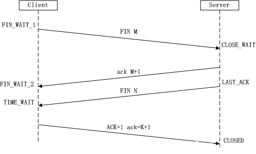
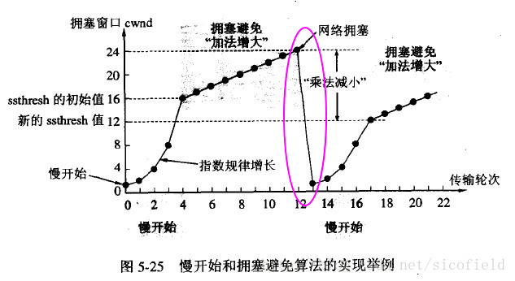

# 网络面试题

## 网络分层

OSI 七层体系结构是一个理论上的国际标准。

TCP/IP 四层体系结构是应用标准。

五层体系结构综合了OSI 和 TCP/IP 的优点，但只是学术研究而提出的。

### OSI 七层体系结构

- 应用层（数据）：确定进程之间通信的性质以满足用户需要以及提供网络与用户应用
- 表示层（数据）：主要解决用户信息的语法表示问题，如加密解密
- 会话层（数据）：提供包括访问验证和会话管理在内的建立和维护应用之间通信的机制，如服务器验证用户登录便是由会话层完成的
- 传输层（段）：实现网络不同主机上用户进程之间的数据通信，可靠
  与不可靠的传输，传输层的错误检测，流量控制等
- 网络层（包）：提供逻辑地址（IP）、选路，数据从源端到目的端的
  传输
- 数据链路层（帧）：将上层数据封装成帧，用MAC地址访问媒介，错误检测与修正
- 物理层（比特流）：设备之间比特流的传输，物理接口，电气特性等

### 简述 TCP/IP 四层体系结构

#### 应用层

HTTP、TELNET、FTP、SMTP

#### 传输层

TCP、UDP

#### 网络层

IP、ICMP

#### 网络接口层

PPP

### 详细说明 Keepalived 的故障切换工作原理？

https://www.huweihuang.com/linux-notes/keepalived/keepalived-introduction.html

Keepalived一个基于VRRP协议来实现的LVS服务高可用方案，可以利用其来避免单点故障。一个LVS服务会有2台服务器运行Keepalived，一台为主服务器（MASTER），一台为备份服务器（BACKUP），但是对外表现为一个虚拟IP，主服务器会发送特定的消息给备份服务器，当备份服务器收不到这个消息的时候，即主服务器宕机的时候， 备份服务器就会接管虚拟IP，继续提供服务，从而保证了高可用性。

这种故障切换，是通过 **VRRP** 协议来实现的。

- **主节点**会按一定的时间间隔发送心跳信息的广播包，告诉备节点自己的存活状态信息。
- 当主节点发生故障时，备节点在一段时间内就收不到广播包，从而判断主节点出现故障，因此会调用自身的接管程序来接管主节点的 IP 资源及服务。
- 当主节点恢复时，备节点会主动释放资源，恢复到接管前的状态，从而来实现主备故障切换

**Keepalived 工作于哪一层？**

网络层、传输层、应用层

### IP 地址与物理地址的区别？

- 物理地址(MAC 地址)，是数据链路层和物理层使用的地址。
- IP 地址是网络层和以上各层使用的地址，是一种逻辑地址。
- 其中 ARRP 协议用于 IP 地址与物理地址的对应。

### 网络层的 ARRP 协议工作原理？

ARRP（虚拟路由冗余协议）

网络层的 ARRP 协议完成了 IP 地址与物理地址的映射。

- 首先，每台主机都会在自己的 ARRP 缓冲区中建立一个 ARRP 列表，以表示 IP 地址和 MAC 地址的对应关系。
- 当源主机需要将一个数据包要发送到目的主机时，会首先检查自己 ARRP 列表中是否存在该 IP 地址对应的 MAC 地址：
  - 如果有，就直接将数据包发送到这个 MAC 地址。
  - 如果没有，就向本地网段发起一个ARRP 请求的广播包，查询此目的主机对应的 MAC 地址。此 ARRP 请求数据包里包括源主机的 IP 地址、硬件地址、以及目的主机的 IP 地址。网络中所有的主机收到这个 ARRP 请求后，会检查数据包中的目的 IP 是否和自己的 IP地址一致。
    - 如果不相同，就忽略此数据包。
    - 如果相同，该主机首先将发送端的 MAC 地址和 IP 地址添加到自己的 ARRP 列表中(如果 ARRP 表中已经存在该 IP 的信息，则将其覆盖)，然后给源主机发送一个 ARRP 响应数据包，告诉对方自己是它需要查找的 MAC 地址。
      - 源主机收到这个 ARRP 响应数据包后，将得到的目的主机的 IP 地址和 MAC 地址添加到自己的 ARRP 列表中，并利用此信息开始数据的传输。
      - 如果源主机一直没有收到 ARRP 响应数据包，表示 ARRP 查询失败。

> 在 OSI 模型中 ARRP 协议属于链路层；而在 TCP/IP 模型中，ARRP 协议属于网络层。

❓**ARRP与keepalived的关系？**

Keepalived 类似于 Heartbeat，Keepalived 是基于 ARRP 实现的。

keepalived是以VRRP协议为实现基础的，VRRP全称Virtual Router Redundancy Protocol，即[虚拟路由冗余协议](http://en.wikipedia.org/wiki/VRRP)。

虚拟路由冗余协议，可以认为是实现路由器高可用的协议，即将N台提供相同功能的路由器组成一个路由器组，这个组里面有一个master和多个backup，master上面有一个对外提供服务的vip（该路由器所在局域网内其他机器的默认路由为该vip），master会发组播，当backup收不到vrrp包时就认为master宕掉了，这时就需要根据[VRRP的优先级](http://tools.ietf.org/html/rfc5798#section-5.1)来[选举一个backup当master](http://en.wikipedia.org/wiki/Virtual_Router_Redundancy_Protocol#Elections_of_master_routers)。这样的话就可以保证路由器的高可用了。

## TCP

TCP(Transmission Control Protocol)，传输控制协议，是一种面向连接的、可靠的、基于字节流的传输层通信协议。主要特点如下：

- TCP 是面向连接的。

- 每一条 TCP 连接只能有两个端点，每一条TCP连接只能是点对点的（一对一）。
- TCP 提供可靠交付的服务。通过TCP连接传送的数据，无差错、不丢失、不重复、并且按序到达。
- TCP 提供**全双工通信**。TCP 允许通信双方的应用进程在**任何时候都能发送数据**。TCP 连接的两端都设有发送缓存和接收缓存，用来临时存放双方通信的数据。
- 面向字节流。

### TCP 对应的应用层协议？

- FTP ：定义了文件传输协议，使用 21 端口。常说某某计算机开了 FTP 服务便是启动了文件传输服务。下载文件，上传主页，都要用到 FTP 服务。
- Telnet ：它是一种用于远程登陆的端口，用户可以以自己的身份远程连接到计算机上，通过这种端口可以提供一种基于 DOS 模式下的通信服务。如以前的 BBS 是纯字符界面的，支持 BBS 的服务器将 23 端口打开，对外提供服务。
- 邮箱
  - SMTP ：定义了简单邮件传送协议，现在很多邮件服务器都用的是这个协议，用于发送邮件。如常见的免费邮件服务中用的就是这个邮件服务端口，所以在电子邮件设置-中常看到有这么 SMTP 端口设置这个栏，服务器开放的是 25 号端口。
  - POP3 ：它是和 SMTP 对应，POP3 用于接收邮件。通常情况下，POP3 协议所用的是 110 端口。也是说，只要你有相应的使用 POP3 协议的程序（例如 Foxmail 或 Outlook），就可以不以 Web 方式登陆进邮箱界面，直接用邮件程序就可以收到邮件（如是 163 邮箱就没有必要先进入网易网站，再进入自己的邮箱来收信）。
- HTTP ：从 Web 服务器传输超文本到本地浏览器的传送协议。

### 什么是 TCP 三次握手？

三次握手，简单来说，就是：

- 发送方：我要和你建立链接？
- 接收方：你真的要和我建立链接么？
- 发送方：我真的要和你建立链接，成功。

第一次握手：Client 将标志位 SYN=1 ，随机产生一个值 seq=J ，并将该数据包发送给 Server 。此时，Client 进入SYN_SENT 状态，等待 Server 确认。

第二次握手：Server 收到数据包后由标志位 SYN=1 知道Client请求建立连接，Server 将标志位 SYN 和 ACK 都置为 1 ，ack=J+1，随机产生一个值 seq=K ，并将该数据包发送给 Client 以确认连接请求，Server 进入 SYN_RCVD 状态。此时，Server 进入 SYC_RCVD 状态。

第三次握手：Client 收到确认后，检查 ack 是否为 J+1 ，ACK 是否为 1 。

如果正确，则将标志位 ACK 置为 1 ，ack=K+1 ，并将该数据包发送给 Server 。此时，Client 进入 ESTABLISHED 状态。

Server 检查 ack 是否为 K+1 ，ACK 是否为 1 ，如果正确则连接建立成功。此时 Server 进入 ESTABLISHED 状态，完成三次握手，随后 Client 与 Server 之间可以开始传输数据了。

仔细看来，Client 会发起两次数据包，分别是 SYNC 和 ACK ；Server 会发起一次数据包，包含 SYNC 和 ACK 。也就是说，三次握手的过程中，Client 和 Server 互相做了一次 SYNC 和 ACK 。

### 为什么 TCP 连接需要三次握手，两次不可以么，为什么？

为了防止**已失效的连接请求**报文突然又传送到了服务端，因而产生错误。

### 客户端不断进行请求链接会怎样？

服务器端准备为每个请求创建一个链接，并向其发送确认报文，然后等待客户端进行确认后创建。如果此时客户端一直不确认，会造成 SYN 攻击，即：

SYN 攻击，英文为 SYN Flood ，是一种典型的 DoS/DDoS 攻击。

- 客户端向服务端发送请求连接数据包。
- 服务端向客户端发送确认数据包。
- 客户端不向服务端发送确认数据包，服务器一直等待来自客户端的确认。

### 如何检测 SYN 攻击？

检测 SYN 攻击非常的方便，当你在服务器上看到大量的半连接状态时，特别是源 IP 地址是随机的，基本上可以断定这是一次 SYN 攻击。在 Linux/Unix 上可以使用系统自带的 netstat 命令来检测 SYN 攻击。

### 怎么解决 SYN 攻击呢？

答案是**只能预防**，没有彻底根治的办法，除非不使用 TCP 。

- 限制同时打开 SYN 半链接的数目
- 缩短 SYN 半链接的 Timeout 时间
- 关闭不必要的服务
- 增加最大半连接数

### 什么是 TCP 四次挥手？

- 发送方：我要和你断开连接！
- 接收方：好的，断吧。
- 接收方：我也要和你断开连接！
- 发送方：好的，断吧。

> 图片有问题，最后是 ACK=N+1

第一次挥手：Client 发送一个 FIN=M ，用来关闭 Client 到 Server 的数据传送。此时，Client 进入 FIN_WAIT_1 状态。

第二次挥手，Server 收到 FIN 后，发送一个 ACK 给 Client ，确认序号为 M+1（与 SYN 相同，一个 FIN 占用一个序号）。此时，Server 进入 CLOSE_WAIT 状态。注意，**TCP 链接处于半关闭状态，即客户端已经没有要发送的数据了，但服务端若发送数据，则客户端仍要接收。**

第三次挥手，Server 发送一个 FIN=N ，用来关闭 Server 到 Client 的数据传送。此时 Server 进入 LAST_ACK 状态。

第四次挥手，Client 收到 FIN 后，此时 Client 进入 TIME_WAIT 状态。接着，Client 发送一个 ACK 给 Server ，确认序号为 N+1 。Server 接收到后，此时 Server 进入 CLOSED 状态，完成四次挥手。

### 为什么要四次挥手？

TCP 协议是一种面向连接的、可靠的、基于字节流的运输层通信协议。**TCP 是全双工模式**，这就意味着：

- 当主机 1 发出 `FIN` 报文段时，只是表示主机 1 已经没有数据要发送了，主机 1 告诉主机 2 ，它的数据已经全部发送完毕了；**但是，这个时候主机 1 还是可以接受来自主机 2 的数据；**当主机 2 返回 `ACK` 报文段时，表示它已经知道主机 1 没有数据发送了，但是主机 2 还是可以发送数据到主机 1 的。

**因为主机 2 此时可能还有数据想要发送给主机 1** ，所以挥手不能像握手只有三次，而是多了那么“一次”！

- 当主机 2 也发送了 `FIN` 报文段时，这个时候就表示主机 2 也没有数据要发送了，就会告诉主机 1 ，我也没有数据要发送了，之后彼此就会愉快的中断这次 TCP 连接。

  ### TCP 数据如何传输？

上图给出了主机 A 分 2 次（分 2 个数据包）向主机 B 传递 200 字节的过程。

- 首先，主机 A 通过 1 个数据包发送 100 个字节的数据，数据包的 Seq 号设置为 1200 。主机 B 为了确认这一点，向主机 A 发送 ACK 包，并将 Ack 号设置为 1301 。
- 为了保证数据准确到达，目标机器在收到数据包（包括 SYN 包、FIN 包、普通数据包等）包后必须立即回传 ACK 包，这样发送方才能确认数据传输成功。
- 此时 Ack 号为 1301 而不是 1201，原因在于 Ack 号的增量为传输的数据字节数。假设每次 Ack 号不加传输的字节数，这样虽然可以确认数据包的传输，但无法明确 100 字节全部正确传递还是丢失了一部分，比如只传递了 80 字节。因此按如下的公式确认 Ack 号：Ack 号 = Seq 号 + 传递的字节数 + 1 。
- 与三次握手协议相同，最后加 1 是为了告诉对方要传递的 Seq 号。

**如何排查？**

可以通过 netstat -n 结合 awk 打印这两个数值

### TCP 数据传输丢失怎么办？

上图表示通过 `Seq` 1301 数据包向主机 B 传递 100 字节的数据，但中间发生了错误，主机 B 未收到。经过一段时间后，主机 A 仍未收到对于 `Seq` 1301 的 `ACK` 确认，因此尝试重传数据。为了完成数据包的重传，TCP 套接字每次发送数据包时都会**启动定时器**，如果在一定时间内没有收到目标机器传回的 `ACK` 包，那么定时器超时，数据包会重传。上图演示的是数据包丢失的情况，也会有 `ACK` 包丢失的情况，一样会重传。

**重传超时时间(RTO，Retransmission Time Out)**

这个值太大了会导致不必要的等待，太小会导致不必要的重传，理论上最好是网络 RTT 时间，但又受制于网络距离与瞬态时延变化，所以实际上使用自适应的动态算法（例如 Jacobson 算法和 Karn 算法等）来确定超时时间。

往返时间（RTT，Round-Trip Time）表示从发送端发送数据开始，到发送端收到来自接收端的 ACK 确认包（接收端收到数据后便立即确认），总共经历的时长。

**重传次数**

TCP 数据包重传次数，根据系统设置的不同而有所区别。有些系统，一个数据包只会被重传 3 次，如果重传 3 次后还未收到该数据包的 `ACK` 确认，就不再尝试重传。但有些要求很高的业务系统，会不断地重传丢失的数据包，以尽最大可能保证业务数据的正常交互。

最后需要说明的是，发送端只有在收到对方的 `ACK` 确认包后，才会清空输出缓冲区中的数据。

### 什么是 TCP 滑动窗口？

**背景**

将 TCP 与 UDP 这样的简单传输协议区分开来的是，它传输数据的质量。TCP 对于发送数据进行跟踪，这种数据管理需要协议有以下两大关键功能：

- 可靠性：保证数据确实到达目的地。如果未到达，能够发现并重传。
- 数据流控：管理数据的发送速率，以使接收设备不致于过载。

要完成这些任务，整个协议操作是围绕**滑动窗口** + **确认机制**来进行的。因此，理解了滑动窗口，也就是理解了 TCP 。

**到底什么是 TCP 滑动窗口呢？**

滑动窗口协议，是传输层进行流控的一种措施，**接收方通过通告发送方自己的窗口大小**，从而控制发送方的发送速度，从而达到防止发送方发送速度过快而导致自己被淹没的目的。

🥤TCP 的滑动窗口解决了端到端的**流量控制**问题，允许接受方对传输进行限制，直到它拥有足够的缓冲空间来容纳更多的数据。

### TCP 协议如何来保证传输的可靠性？

对于可靠性，TCP 通过以下方式进行保证：

- 数据包校验：目的是检测数据在传输过程中的任何变化，若校验出包有错，则丢弃报文段并且不给出响应，这时 TCP 发送数据端超时后会重发数据。
- 对失序数据包重排序：既然 TCP 报文段作为 IP 数据报来传输，而 IP 数据报的到达可能会失序，因此 TCP报文段的到达也可能会失序。TCP 将对失序数据进行重新排序，然后才交给应用层。
- 丢弃重复数据：对于重复数据，能够丢弃重复数据。
- 应答机制：当 TCP 收到发自 TCP 连接另一端的数据，它将发送一个确认。这个确认不是立即发送，通常将推迟几分之一秒。
- 超时重发：当 TCP 发出一个段后，它启动一个定时器，等待目的端确认收到这个报文段。如果不能及时收到一个确认，将重发这个报文段。
- 流量控制：TCP 连接的每一方都有固定大小的缓冲空间。TCP 的接收端只允许另一端发送接收端缓冲区所能接纳的数据，这可以防止较快主机致使较慢主机的缓冲区溢出，这就是流量控制。TCP 使用的流量控制协议是可变大小的**滑动窗口协议**。

### 怎么解决 TCP 拥堵？

通过拥塞控制来解决。拥堵控制，就是防止过多的数据注入网络中，这样可以使网络中的路由器或链路不致过载。注意，拥塞控制和流量控制不同，前者是一个**全局性**的过程，而后者指**点对点**通信量的控制。

拥塞控制的方法主要有以下四种：

- 1、慢开始。
- 2、拥塞避免。
- 3、快重传。
- 4、快恢复。

**1）慢开始**

不要一开始就发送大量的数据，先探测一下网络的拥塞程度，也就是说由小到大逐渐增加拥塞窗口的大小。

**2）拥塞避免**

拥塞避免算法，让拥塞窗口缓慢增长，即每经过一个往返时间 RTT 就把发送方的拥塞窗口 cwnd 加 1 ，而不是加倍，这样拥塞窗口按线性规律缓慢增长。

**3）快重传**

快重传，要求接收方在收到一个**失序的报文段**后就立即发出**重复确认**（为的是使发送方及早知道有报文段没有到达对方），而不要等到自己发送数据时捎带确认。

快重传算法规定，发送方只要一连收到三个重复确认，就应当立即重传对方尚未收到的报文段，而不必继续等待设置的重传计时器时间到期。

**4）快恢复**

快重传配合使用的还有快恢复算法，当发送方连续收到三个重复确认时，就执行“乘法减小”算法，把 ssthresh 门限减半。

- 但是接下去并不执行慢开始算法：因为如果网络出现拥塞的话就不会收到好几个重复的确认，所以发送方现在认为网络可能没有出现拥塞。
- 所以此时不执行慢开始算法，而是将 cwnd 设置为 ssthresh 的大小，然后执行拥塞避免算法。

### UDP 是什么？

UDP（User Data Protocol，用户数据报协议），是与 TCP 相对应的协议。它是面向非连接的协议，它不与对方建立连接，而是直接就把数据包发送过去。

主要特点如下：

- UDP 是无连接的。
- UDP 使用尽最大努力交付，即不保证可靠交付，因此主机不需要维持复杂的链接状态（这里面有许多参数）。
- UDP 是面向报文的。
- UDP 没有拥塞控制，因此网络出现拥塞不会使源主机的发送速率降低。
- UDP 支持一对一、一对多、多对一和多对多的交互通信。
- UDP 的首部开销小，只有 8 个字节，比 TCP 的 20 个字节的首部要短。

### TCP 与 UDP 的区别

- TCP 是可靠的；UDP 是不可靠的。
- TCP 只支持点对点通信；UDP 支持一对一、一对多、多对一、多对多的通信模式。
- TCP 是面向字节流的；UDP 是面向报文的。
- TCP 有拥塞控制机制；UDP 没有拥塞控制，适合媒体通信。
- TCP 首部开销(20 个字节)，比 UDP 的首部开销(8 个字节)要大。

- TCP协议可靠；UDP协议不可靠
- TCP协议是面向连接；UDP协议采用无连接
- TCP协议负载高，适合传输大量数据
- TCP协议的发送方要确认接收方是否收到数据段
- TCP协议采用窗口技术和流控制
- TCP保证数据正确性，UDP可能丢包
- TCP保证数据顺序，UDP不保证
- UDP程序结构较简单

| 协议名称 | 复杂性 | 连接建立时间 | 可靠性 | 是否确保数据报发送和接受顺序 | 实时性 | 适用范围           | 是否支持组播 |
| -------- | ------ | ------------ | ------ | ---------------------------- | ------ | ------------------ | ------------ |
| RTP/RTCP | 低     | 少           | 低     | 否                           | 是     | 实时音视频媒体传输 | 支持         |
| TCP      | 高     | 多           | 高     | 是                           | 否     | 数据和控制信令传输 | 不支持       |
| UDP      | 低     | 少           | 低     | 否                           | 否     | 音视频媒体传输     | 支持         |

### UDP有拥塞控制吗？如何解决？

使用 RTP ，基于 UDP，提供 QOS 服务质量控制。

QoS （ Quality of Service，服务质量）指一个网络能够利用各种基础技术，为指定的网络通信提供更好的服务能力，是网络的一种安全机制， 是用来解决网络延迟和阻塞等问题的一种技术。

说白了就是在网络拥堵的时候运营商会直接把一些不重要的流量包丢掉，至于啥是“不重要的”就要去问运营商了。对被 qos 的用户来说，表现就是丢包、网速降低、ping 值极不稳定

https://blog.csdn.net/hrbeuwhw/article/details/8135103

### 为什么 TCP 叫数据流模式？ UDP 叫数据报模式？

所谓的**“流模式”**，是指**TCP 发送端发送几次数据和接收端接收几次数据是没有必然联系的**。

- 比如你通过 TCP 连接给另一端发送数据，你只调用了一次 write ，发送了 100 个字节，但是对方可以分 10 次收完，每次 10 个字节；你也可以调用 10 次 write ，每次 10 个字节，但是对方可以一次就收完。
- 原因：这是因为 TCP 是面向连接的，一个 Socket 中收到的数据都是由同一台主机发出，且有序地到达，所以每次读取多少数据都可以。

所谓的**“数据报模式”**，是指 **UDP 发送端调用了几次 write ，接收端必须用相同次数的 read 读完**。

- UDP 是基于报文的，在接收的时候，每次最多只能读取一个报文，报文和报文是不会合并的，**如果缓冲区小于报文长度，则多出的部分会被丢弃**。
- 原因：这是因为 UDP 是无连接的，只要知道接收端的 IP 和端口，任何主机都可以向接收端发送数据。这时候，如果一次能读取超过一个报文的数据，则会乱套。

### 主机解析域名的顺序？

1. 浏览器缓存
2. 找本机的 hosts 文件
3. 路由缓存
4. 找 DNS 服务器(本地域名、顶级域名、根域名)

### TCP的包是否都是等长度的

是，由最大链路层帧长度来设置（MTU）

### DNS 使用什么协议？

既使用 TCP 又使用 UDP 。

- 区域传送时使用 TCP 协议。
- 域名解析时使用 UDP 协议。

### HTTP 是什么？

HTTP 协议，是 Hyper Text Transfer Protocol（超文本传输协议）的缩写，是用于从万维网（WWW:World Wide Web ）服务器传输超文本到本地浏览器的传送协议。

主要特点如下：

- 简单快速：客户向服务器请求服务时，只需传送请求方法和路径。请求方法常用的有 GET、HEAD、POST 等等。每种方法规定了客户与服务器联系的类型不同。由于 HTTP 协议简单，使得 HTTP 服务器的程序规模小，因而通信速度很快。
- 数据格式灵活：HTTP 允许传输任意类型的数据对象。正在传输的类型由Content-Type 加以标记。
- 无连接：无连接的含义是限制每次连接只处理一个请求。服务器处理完客户的请求，并收到客户的应答后，即断开连接。采用这种方式可以节省传输时间。
- 无状态：HTTP 协议是无状态协议。无状态，是指协议对于事务处理没有记忆能力。无状态意味着如果后续处理需要前面的信息，则它必须重传，这样可能导致每次连接传送的数据量增大。另一方面，在服务器不需要先前信息时它的应答就较快。
- 支持 B/S 及 C/S 模式。

### HTTP、TCP、Socket 的关系是什么？

- TCP/IP 代表传输控制协议/网际协议，指的是一系列协议族。
- HTTP 本身就是一个协议，是从 Web 服务器传输超文本到本地浏览器的传送协议。
- Socket 是 TCP/IP 网络的 API ，其实就是一个门面模式，它把复杂的 TCP/IP 协议族隐藏在 Socket 接口后面。对用户来说，一组简单的接口就是全部，让 Socket 去组织数据，以符合指定的协议。

### 一次完整的 HTTP 请求所经历的步骤

- 1、DNS 解析(通过访问的域名找出其 IP 地址，递归搜索)。
- 2、HTTP 请求，当输入一个请求时，建立一个 Socket 连接发起 TCP的 3 次握手。
- 3.1、客户端向服务器发送请求命令（一般是 GET 或 POST 请求）。
- 3.2、客户端发送请求头信息和数据。
- 4.1、服务器发送应答头信息。
- 4.2、服务器向客户端发送数据。
- 5、服务器关闭 TCP 连接（4次挥手）。
- 6、客户端根据返回的 HTML、CSS、JS 进行渲染。

### HTTP1.0 和 HTTP1.1 有什么区别？

主要是如下 8 点：

- 1、可扩展性
- 2、缓存
- 3、带宽优化
- 【最重要】4、长连接
- 5、消息传递
- 6、Host 头域
- 7、错误提示
- 8、内容协商

### HTTPS 是什么？

HTTPS ，实际就是在 TCP 层与 HTTP 层之间加入了 SSL/TLS 来为上层的安全保驾护航，主要用到对称加密、非对称加密、证书，等技术进行客户端与服务器的数据加密传输，最终达到保证整个通信的安全性。

一句话概括：**HTTP + 加密 + 认证 + 完整性保护 = HTTPS** 。

HTTPS 可以有效的防止运营商劫持，解决了防劫持的一个大问题。

### 设计HTTP协议，A端发送 AAAA，至少让B端知道AAAA已发送完成

- 用 Content-Length 告诉B传输的数据长度
- Content-Length = chunked 的话，最后一个块大小为0，说明本次数据发送完成