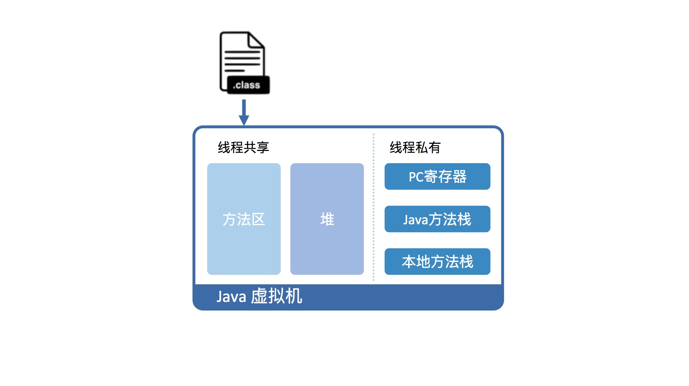

## Java代码是怎么运行的？

Java 虚拟机将运行时内存区域划分为五个部分，分别为**方法区、堆、PC 寄存器、方法栈和本地方法栈**。Java 程序编译而成的 class 文件，需要先加载至方法区中，方能在 Java 虚拟机中运行。

### Java虚拟机的意义

Java 作为一门高级程序语言，它的语法非常复杂，抽象程度也很高。因此，直接在硬件上运行这种复杂的程序并不现实。所以呢，在运行 Java 程序之前，我们需要对其进行一番**转换**。

Java 虚拟机可以由硬件实现 [1]，但更为常见的是在各个现有平台（如 Windows_x64、Linux_aarch64）上提供软件实现。这么做的意义在于，一旦一个程序被转换成 Java 字节码，那么它便可以在不同平台上的虚拟机实现里运行。这也就是我们经常说的“**一次编写，到处运行**”。

虚拟机的另外一个好处是它带来了一个托管环境（Managed Runtime）。这个托管环境能够代替我们处理一些代码中冗长而且容易出错的部分。其中最广为人知的当属**自动内存管理与垃圾回收**，这部分内容甚至催生了一波垃圾回收调优的业务。

使用虚拟机还有一个好处，可以在编译的过程中对代码进行优化，对代码进行精简，以提高执行效率。

### Java字节码

通过编译器将 Java 程序转换成该虚拟机所能识别的指令序列，也称 Java 字节码。这里顺便说一句，之所以这么取名，是因为 Java 字节码指令的操作码（opcode）被固定为一个字节。

**Java 虚拟机具体是怎么运行 Java 字节码的？**

从虚拟机视角来看，执行 Java 代码首先需要将它编译而成的 class 文件加载到 Java 虚拟机中。加载后的 Java 类会被存放于方法区（Method Area）中。实际运行时，虚拟机会执行方法区内的代码。

而且，Java 虚拟机在内存中划分出堆和栈来存储运行时数据。Java 虚拟机会将**栈**细分**为面向 Java 方法的 Java 方法栈**，**面向本地方法（用 C++ 写的 native 方法）的本地方法栈，以及存放各个线程执行位置的 PC 寄存器**。

### 

在运行过程中，每当调用进入一个 Java 方法，Java 虚拟机会在**当前线程的 Java 方法栈中生成一个栈帧，用以存放局部变量以及字节码的操作数**。这个栈帧的大小是提前计算好的，而且 Java 虚拟机不要求栈帧在内存空间里连续分布。

当退出当前执行的方法时，不管是正常返回还是异常返回，Java 虚拟机均会弹出当前线程的当前栈帧，并将之舍弃。

从硬件视角来看，Java 字节码无法直接执行。因此，Java 虚拟机需要将字节码翻译成机器码。

在 HotSpot 里面，上述翻译过程有两种形式：第一种是解释执行，即逐条将字节码翻译成机器码并执行；第二种是即时编译（Just-In-Time compilation，JIT），即将一个方法中包含的所有字节码编译成机器码后再执行。

前者的优势在于无需等待编译，而后者的优势在于实际运行速度更快。HotSpot 默认采用混合模式，综合了解释执行和即时编译两者的优点。它会先解释执行字节码，而后将其中反复执行的热点代码，以方法为单位进行即时编译。

### Java虚拟机的运行效率

HotSpot 采用了多种技术来提升启动性能以及峰值性能，刚刚提到的即时编译便是其中最重要的技术之一。

即时编译建立在程序符合二八定律的假设上，也就是百分之二十的代码占据了百分之八十的计算资源。

对于占据大部分的不常用的代码，我们无需耗费时间将其编译成机器码，而是采取解释执行的方式运行；另一方面，对于仅占据小部分的热点代码，我们则可以将其编译成机器码，放入内存中，以达到理想的运行速度。

为了满足不同用户场景的需要，HotSpot 内置了多个即时编译器：**C1、C2 和 Graal。Graal 是 Java 10 正式引入的实验性即时编译器**。

之所以引入多个即时编译器，是为了在编译时间和生成代码的执行效率之间进行取舍。C1 又叫做 Client 编译器，面向的是对启动性能有要求的客户端 GUI 程序，采用的优化手段相对简单，因此编译时间较短。

C2 又叫做 Server 编译器，面向的是对峰值性能有要求的服务器端程序，采用的优化手段相对复杂，因此编译时间较长，但同时生成代码的执行效率较高。

**从 Java 7 开始，HotSpot 默认采用分层编译的方式：热点方法首先会被 C1 编译，而后热点方法中的热点会进一步被 C2 编译。**

为了不干扰应用的正常运行，HotSpot 的即时编译是放在额外的编译线程中进行的。HotSpot 会根据 CPU 的数量设置编译线程的数目，并且按 1:2 的比例配置给 C1 及 C2 编译器。

在计算资源充足的情况下，字节码的解释执行和即时编译可同时进行。编译完成后的机器码会在下次调用该方法时启用，以替换原本的解释执行。

### Q&A

1、文中提到虚拟机会把部分热点代码编译成机器码，我有个疑问，为什么不把java代码全部编译成机器码？很多服务端应用发布频率不会太频繁，但是对运行时的性能和吞吐量要求较高。如果发布或启动时多花点时间编译，能够带来运行时的持久性能收益，不是很合适么？

事实上JVM确实有考虑做AOT (ahead of time compilation) 这种事情。AOT能够在线下将Java字节码编译成机器码，主要是用来解决启动性能不好的问题。

对于这种发布频率不频繁(也就是长时间运行吧？)的程序，其实选择线下编译和即时编译都一样，因为至多一两个小时后该即时编译的都已经编译完成了。另外，即时编译器因为有程序的运行时信息，优化效果更好，也就是说**峰值性能更好**。

2、我现在所在的项目经常堆外内存占用非常多，超过总内存的70%，请问一下有没有什么方法能观察一下堆外内存有什么内容？

堆外内存的话，就把JVM当成普通进程来查找内存泄漏。可以看下Google Performance Tools相关资料。http://goog-perftools.sourceforge.net/

