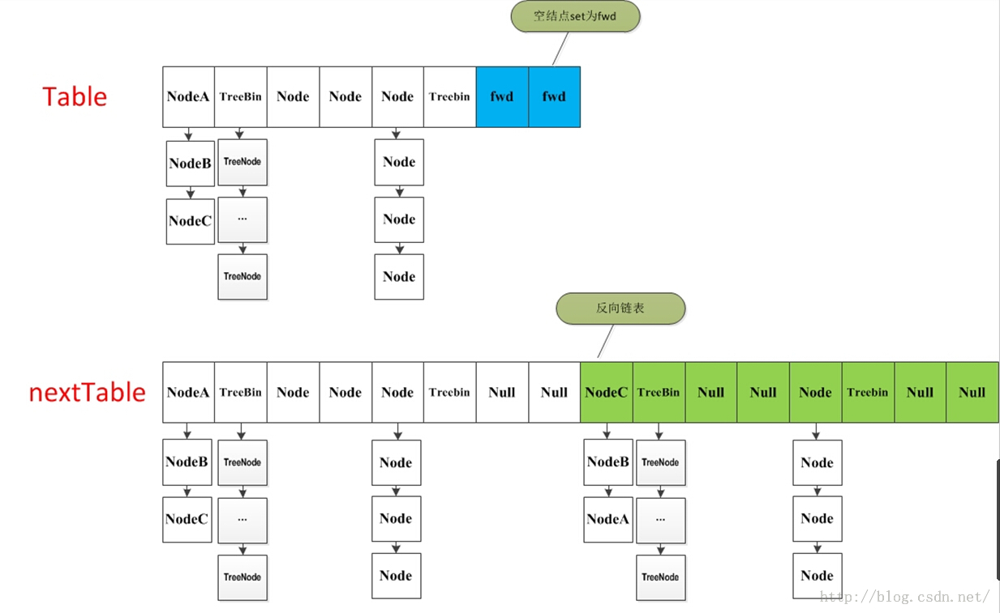

# ConcurrentHashMap

JDK 1.8中，Hash家族有这么一些存在，HashMap,HashTable,LinkedHashMap,ConcurrentHashMap。这里面支持线程安全的有HashTable以及ConcurrentHashMap。对Hash有一个基本了解可以参考本人的[从Hash到一致性Hash原理(深度好文) 。](https://my.oschina.net/u/3768341/blog/2251129)

那既然说到ConcurrentHashMap，自然要讨论的就是它的线程安全性和效能。我们先来看一下HashTable的线程安全性以及效能的低下。

```
public synchronized V put(K key, V value) {
    // Make sure the value is not null
    if (value == null) {
        throw new NullPointerException();
    }

    // Makes sure the key is not already in the hashtable.
    Entry<?,?> tab[] = table;
    int hash = key.hashCode();
    int index = (hash & 0x7FFFFFFF) % tab.length;
    @SuppressWarnings("unchecked")
    Entry<K,V> entry = (Entry<K,V>)tab[index];
    for(; entry != null ; entry = entry.next) {
        if ((entry.hash == hash) && entry.key.equals(key)) {
            V old = entry.value;
            entry.value = value;
            return old;
        }
    }

    addEntry(hash, key, value, index);
    return null;
}
public synchronized V get(Object key) {
    Entry<?,?> tab[] = table;
    int hash = key.hashCode();
    int index = (hash & 0x7FFFFFFF) % tab.length;
    for (Entry<?,?> e = tab[index] ; e != null ; e = e.next) {
        if ((e.hash == hash) && e.key.equals(key)) {
            return (V)e.value;
        }
    }
    return null;
}
```

我们对比一下HashMap 1.7的这两个方法(因为1.8点HashMap会生成红黑树，我们暂时先不考虑红黑树的问题)

```
public V put(K key, V value) {
        if (key == null)
            return putForNullKey(value);
        int hash = hash(key);
        int i = indexFor(hash, table.length);
        for (Entry<K,V> e = table[i]; e != null; e = e.next) {
            Object k;
            if (e.hash == hash && ((k = e.key) == key || key.equals(k))) {
                V oldValue = e.value;
                e.value = value;
                e.recordAccess(this);
                return oldValue;
            }
        }

        modCount++;
        addEntry(hash, key, value, i);
        return null;
    }
public V get(Object key) {
        if (key == null)
            return getForNullKey();
        Entry<K,V> entry = getEntry(key);

        return null == entry ? null : entry.getValue();
    }
final int hash(Object k) {
        int h = 0;
        if (useAltHashing) {
            if (k instanceof String) {
                return sun.misc.Hashing.stringHash32((String) k);
            }
            h = hashSeed;
        }

        h ^= k.hashCode();

        // This function ensures that hashCodes that differ only by
        // constant multiples at each bit position have a bounded
        // number of collisions (approximately 8 at default load factor).
        //一种算法，进行4次位移，得到相对比较分散的链表
        h ^= (h >>> 20) ^ (h >>> 12);
        return h ^ (h >>> 7) ^ (h >>> 4);
    }
```

在这里我们可以看到，他们除了key的hash算法不同，HashTable的比较简单，只是用key的哈希值与0x7FFFFFFF(十进制2147483647，二进制1111111111111111111111111111111)进行一次与运算，即为只要相同二进制位上不论0，1全部都变成1，再对table数组的长度取模。而HashMap 1.7则为key的哈希值进行各位无符号位移加异或运算，取得最终哈希值。然后是**HashTable不接收null的key**,而HashMap接受。**他们最大的区别就在于synchronized显示器锁了。**

synchronized的本质是所有对象的字节码中有一个monitor的对象头，任何线程拿到了这个monitor的对象头就可以对这个对象进行操作，而拿不到monitor对象头的线程就只能等待，直到拿到了monitor的线程放弃，其他线程才能争夺这个对象头来对对象进行操作。那么问题来了，当大量线程高并发的时候，只要有一个线程拿到了这个对象头，其他线程对这个对象是既不能读也不能写。而对于HashMap来说，如果多线程对其进行操作，那么任意线程都可以胡乱修改里面值的内容造成脏读，所以HashMap是线程不安全的。

那么我们今天的主角登场了ConcurrentHashMap。我们同样来看一下这两个方法。以下是1.8的源码，首先我们要清楚的是1.8跟1.7已经完全不同，1.7是使用segements(16个segement)，每个segement都有一个table(Map.Entry数组)，相当于16个HashMap，同步机制为分段锁，每个segment继承ReentrantLock；而1.8只有1个table(Map.Entry数组)，同步机制为CAS + synchronized保证并发更新。如果不搞清楚这个问题，那么你看1.8的源码可能会很懵逼。

```
public V put(K key, V value) {
    return putVal(key, value, false);
}
final V putVal(K key, V value, boolean onlyIfAbsent) {
    //无论key还是value,不允许空
    if (key == null || value == null) throw new NullPointerException();
    //此处获取hash值的方法与HashTable类似
    int hash = spread(key.hashCode());
    int binCount = 0;
    //无限循环
    for (Node<K,V>[] tab = table;;) {
        Node<K,V> f; int n, i, fh;
        //如果节点数组为null，或者长度为0，初始化节点数组
        if (tab == null || (n = tab.length) == 0)
            tab = initTable();
        //如果节点数组的某个节点为null，则put的时候就会采用无锁竞争来获取该节点的头把交椅
        else if ((f = tabAt(tab, i = (n - 1) & hash)) == null) {
            if (casTabAt(tab, i, null,
                         new Node<K,V>(hash, key, value, null)))
                break;                   // no lock when adding to empty bin
        }
        //需要扩容的时候先扩容，再写入
        else if ((fh = f.hash) == MOVED)
            tab = helpTransfer(tab, f);
        else { //如果hash冲突的时候，即多线程操作时，大家都有一样的hash值
            V oldVal = null;
            synchronized (f) { //锁定节点数组的该节点
                if (tabAt(tab, i) == f) {
                    //如果当前该节点为链表形态
                    if (fh >= 0) {
                        binCount = 1;
                        for (Node<K,V> e = f;; ++binCount) {
                            K ek;
                            //找链表中找到相同的key，把新value替代老value
                            if (e.hash == hash &&
                                ((ek = e.key) == key ||
                                 (ek != null && key.equals(ek)))) {
                                oldVal = e.val;
                                if (!onlyIfAbsent)
                                    e.val = value;
                                break;
                            }
                            Node<K,V> pred = e;
                            //如果找不到key，就添加到链表到末尾
                            if ((e = e.next) == null) {
                                pred.next = new Node<K,V>(hash, key,
                                                          value, null);
                                break;
                            }
                        }
                    }
                    //如果当前为红黑树形态，进行红黑树到查找和替代(存在相同的key)，或者放入红黑树到新叶节点上(key不存在)
                    else if (f instanceof TreeBin) {
                        Node<K,V> p;
                        binCount = 2;
                        if ((p = ((TreeBin<K,V>)f).putTreeVal(hash, key,
                                                       value)) != null) {
                            oldVal = p.val;
                            if (!onlyIfAbsent)
                                p.val = value;
                        }
                    }
                }
            }
            if (binCount != 0) {
                //如果链表长度超过了8，链表转红黑树
                if (binCount >= TREEIFY_THRESHOLD)
                    treeifyBin(tab, i);
                if (oldVal != null)
                    return oldVal;
                break;
            }
        }
    }
    //统计节点个数，检查是否需要扩容
    addCount(1L, binCount);
    return null;
}
public V get(Object key) {
    Node<K,V>[] tab; Node<K,V> e, p; int n, eh; K ek;
    int h = spread(key.hashCode());
    if ((tab = table) != null && (n = tab.length) > 0 &&
        (e = tabAt(tab, (n - 1) & h)) != null) {
        if ((eh = e.hash) == h) {
            if ((ek = e.key) == key || (ek != null && key.equals(ek)))
                return e.val;
        }
        else if (eh < 0)
            return (p = e.find(h, key)) != null ? p.val : null;
        while ((e = e.next) != null) {
            if (e.hash == h &&
                ((ek = e.key) == key || (ek != null && key.equals(ek))))
                return e.val;
        }
    }
    return null;
}
```

读取的时候，我们没有看见锁到存在，说明读不受多线程影响。

对比ConcurrentHashMap和HashTable,我们可以明显的看到，ConcurrentHashMap在写的时候，并没有锁住整个节点数组，**在新节点上使用的是无锁竞争，在老节点上锁住的仅仅是一个节点，读的时候如果不是恰好读到写线程写入相同Hash值的位置**，不受影响(可以认为我们的操作一般是读多写少，这种几率也比较低)。而HashTable是对整个节点数组进行锁定，读到时候不能写，写的时候不能读，这么一对比就可以明显感觉到性能差距是巨大的。

虽然ConcurrentHashMap的并发性能还算比较优异，但在亿级计算中，却依然会成为性能瓶颈，具体可以参考本人的[Fork/Join框架原理和使用探秘](https://my.oschina.net/u/3768341/blog/3095732)

至于这里为什么会慢，我认为在这种超高并发下，节点数组的单节点的的写写竞争是互斥的，其次，由于红黑树具有读快写慢的特性，它要不断保持树的平衡而不断返转，所以才会使得高并发写的性能急剧下降。

## 扩容 

在JDK8中彻底抛弃了JDK7的分段锁的机制，新的版本主要使用了Unsafe类的**CAS自旋赋值+synchronized同步+LockSupport阻塞**等手段实现的高效并发，代码可读性稍差。 

ConcurrentHashMap的JDK8与JDK7版本的并发实现相比，**最大的区别在于JDK8的锁粒度更细**，理想情况下talbe数组元素的大小就是其支持并发的最大个数，在JDK7里面最大并发个数就是Segment的个数，默认值是16，可以通过构造函数改变一经创建不可更改，这个值就是并发的粒度，每一个segment下面管理一个table数组，加锁的时候其实锁住的是整个segment，这样设计的好处在于数组的扩容是不会影响其他的segment的，简化了并发设计，不足之处在于并发的粒度稍粗，所以在JDK8里面，去掉了分段锁，将锁的级别控制在了更细粒度的table元素级别，也就是说只需要**锁住这个链表的head节点**，并不会影响其他的table元素的读写，好处在于并发的粒度更细，影响更小，从而并发效率更好，但不足之处在于并发扩容的时候，由于操作的table都是同一个，不像JDK7中分段控制，所以这里需要等扩容完之后，所有的读写操作才能进行，所以扩容的效率就成为了整个并发的一个瓶颈点，好在Doug lea大神对扩容做了优化，**本来在一个线程扩容的时候，如果影响了其他线程的数据，那么其他的线程的读写操作都应该阻塞，但Doug lea说你们闲着也是闲着，不如来一起参与扩容任务，这样人多力量大，办完事你们该干啥干啥，别浪费时间**，于是在JDK8的源码里面就引入了一个ForwardingNode类，在一个线程发起扩容的时候，就会改变sizeCtl这个值，其含义如下： 

```
sizeCtl ：默认为0，用来控制table的初始化和扩容操作，具体应用在后续会体现出来。  
-1 代表table正在初始化  
-N 表示有N-1个线程正在进行扩容操作  
其余情况：  
1、如果table未初始化，表示table需要初始化的大小。  
2、如果table初始化完成，表示table的容量，默认是table大小的0.75倍  
```

整个扩容操作分为两个部分

-  第一部分是构建一个nextTable,它的容量是原来的两倍，这个操作是单线程完成的。这个单线程的保证是通过RESIZE_STAMP_SHIFT这个常量经过一次运算来保证的，这个地方在后面会有提到；
- 第二个部分就是将原来table中的元素复制到nextTable中，这里允许多线程进行操作。

先来看一下单线程是如何完成的：

它的大体思想就是遍历、复制的过程。首先根据运算得到需要遍历的次数i，然后利用tabAt方法获得i位置的元素：

- 如果这个位置为空，就在原table中的i位置放入forwardNode节点，这个也是触发并发扩容的关键点；

- 如果这个位置是Node节点（fh>=0），如果它是一个链表的头节点，就构造一个反序链表，把他们分别放在nextTable的i和i+n的位置上

- 如果这个位置是TreeBin节点（fh<0），也做一个反序处理，并且判断是否需要untreefi，把处理的结果分别放在nextTable的i和i+n的位置上

- 遍历过所有的节点以后就完成了复制工作，这时让nextTable作为新的table，并且更新sizeCtl为新容量的0.75倍 ，完成扩容。

再看一下多线程是如何完成的：

在代码的69行有一个判断，如果遍历到的节点是forward节点，就向后继续遍历，再加上给节点上锁的机制，就完成了多线程的控制。多线程遍历节点，处理了一个节点，就把对应点的值set为forward，另一个线程看到forward，就向后遍历。这样交叉就完成了复制工作。而且还很好的解决了线程安全的问题。 这个方法的设计实在是让我膜拜。 



扩容源码如下： 

```java
  /**
     * 一个过渡的table表  只有在扩容的时候才会使用
     */
    private transient volatile Node<K,V>[] nextTable;
 
 /**
     * Moves and/or copies the nodes in each bin to new table. See
     * above for explanation.
     */
    private final void transfer(Node<K,V>[] tab, Node<K,V>[] nextTab) {
        int n = tab.length, stride;
        if ((stride = (NCPU > 1) ? (n >>> 3) / NCPU : n) < MIN_TRANSFER_STRIDE)
            stride = MIN_TRANSFER_STRIDE; // subdivide range
        if (nextTab == null) {            // initiating
            try {
                @SuppressWarnings("unchecked")
                Node<K,V>[] nt = (Node<K,V>[])new Node<?,?>[n << 1];//构造一个nextTable对象 它的容量是原来的两倍
                nextTab = nt;
            } catch (Throwable ex) {      // try to cope with OOME
                sizeCtl = Integer.MAX_VALUE;
                return;
            }
            nextTable = nextTab;
            transferIndex = n;
        }
        int nextn = nextTab.length;
        ForwardingNode<K,V> fwd = new ForwardingNode<K,V>(nextTab);//构造一个连节点指针 用于标志位
        boolean advance = true;//并发扩容的关键属性 如果等于true 说明这个节点已经处理过
        boolean finishing = false; // to ensure sweep before committing nextTab
        for (int i = 0, bound = 0;;) {
            Node<K,V> f; int fh;
            //这个while循环体的作用就是在控制i--  通过i--可以依次遍历原hash表中的节点
            while (advance) {
                int nextIndex, nextBound;
                if (--i >= bound || finishing)
                    advance = false;
                else if ((nextIndex = transferIndex) <= 0) {
                    i = -1;
                    advance = false;
                }
                else if (U.compareAndSwapInt
                         (this, TRANSFERINDEX, nextIndex,
                          nextBound = (nextIndex > stride ?
                                       nextIndex - stride : 0))) {
                    bound = nextBound;
                    i = nextIndex - 1;
                    advance = false;
                }
            }
            if (i < 0 || i >= n || i + n >= nextn) {
                int sc;
                if (finishing) {
                	//如果所有的节点都已经完成复制工作  就把nextTable赋值给table 清空临时对象nextTable
                    nextTable = null;
                    table = nextTab;
                    sizeCtl = (n << 1) - (n >>> 1);//扩容阈值设置为原来容量的1.5倍  依然相当于现在容量的0.75倍
                    return;
                }
                //利用CAS方法更新这个扩容阈值，在这里面sizectl值减一，说明新加入一个线程参与到扩容操作
                if (U.compareAndSwapInt(this, SIZECTL, sc = sizeCtl, sc - 1)) {
                    if ((sc - 2) != resizeStamp(n) << RESIZE_STAMP_SHIFT)
                        return;
                    finishing = advance = true;
                    i = n; // recheck before commit
                }
            }
            //如果遍历到的节点为空 则放入ForwardingNode指针
            else if ((f = tabAt(tab, i)) == null)
                advance = casTabAt(tab, i, null, fwd);
            //如果遍历到ForwardingNode节点  说明这个点已经被处理过了 直接跳过  这里是控制并发扩容的核心
            else if ((fh = f.hash) == MOVED)
                advance = true; // already processed
            else {
            		//节点上锁
                synchronized (f) {
                    if (tabAt(tab, i) == f) {
                        Node<K,V> ln, hn;
                        //如果fh>=0 证明这是一个Node节点
                        if (fh >= 0) {
                            int runBit = fh & n;
                            //以下的部分在完成的工作是构造两个链表  一个是原链表  另一个是原链表的反序排列
                            Node<K,V> lastRun = f;
                            for (Node<K,V> p = f.next; p != null; p = p.next) {
                                int b = p.hash & n;
                                if (b != runBit) {
                                    runBit = b;
                                    lastRun = p;
                                }
                            }
                            if (runBit == 0) {
                                ln = lastRun;
                                hn = null;
                            }
                            else {
                                hn = lastRun;
                                ln = null;
                            }
                            for (Node<K,V> p = f; p != lastRun; p = p.next) {
                                int ph = p.hash; K pk = p.key; V pv = p.val;
                                if ((ph & n) == 0)
                                    ln = new Node<K,V>(ph, pk, pv, ln);
                                else
                                    hn = new Node<K,V>(ph, pk, pv, hn);
                            }
                            //在nextTable的i位置上插入一个链表
                            setTabAt(nextTab, i, ln);
                            //在nextTable的i+n的位置上插入另一个链表
                            setTabAt(nextTab, i + n, hn);
                            //在table的i位置上插入forwardNode节点  表示已经处理过该节点
                            setTabAt(tab, i, fwd);
                            //设置advance为true 返回到上面的while循环中 就可以执行i--操作
                            advance = true;
                        }
                        //对TreeBin对象进行处理  与上面的过程类似
                        else if (f instanceof TreeBin) {
                            TreeBin<K,V> t = (TreeBin<K,V>)f;
                            TreeNode<K,V> lo = null, loTail = null;
                            TreeNode<K,V> hi = null, hiTail = null;
                            int lc = 0, hc = 0;
                            //构造正序和反序两个链表
                            for (Node<K,V> e = t.first; e != null; e = e.next) {
                                int h = e.hash;
                                TreeNode<K,V> p = new TreeNode<K,V>
                                    (h, e.key, e.val, null, null);
                                if ((h & n) == 0) {
                                    if ((p.prev = loTail) == null)
                                        lo = p;
                                    else
                                        loTail.next = p;
                                    loTail = p;
                                    ++lc;
                                }
                                else {
                                    if ((p.prev = hiTail) == null)
                                        hi = p;
                                    else
                                        hiTail.next = p;
                                    hiTail = p;
                                    ++hc;
                                }
                            }
                            //如果扩容后已经不再需要tree的结构 反向转换为链表结构
                            ln = (lc <= UNTREEIFY_THRESHOLD) ? untreeify(lo) :
                                (hc != 0) ? new TreeBin<K,V>(lo) : t;
                            hn = (hc <= UNTREEIFY_THRESHOLD) ? untreeify(hi) :
                                (lc != 0) ? new TreeBin<K,V>(hi) : t;
                             //在nextTable的i位置上插入一个链表    
                            setTabAt(nextTab, i, ln);
                            //在nextTable的i+n的位置上插入另一个链表
                            setTabAt(nextTab, i + n, hn);
                             //在table的i位置上插入forwardNode节点  表示已经处理过该节点
                            setTabAt(tab, i, fwd);
                            //设置advance为true 返回到上面的while循环中 就可以执行i--操作
                            advance = true;
                        }
                    }
                }
            }
        }
    }
```

### 在扩容时读写操作如何进行

(1)对于get读操作，如果当前节点有数据，还没迁移完成，此时不影响读，能够正常进行。 

如果当前链表已经迁移完成，那么头节点会被设置成fwd节点，此时get线程会帮助扩容。 

(2)对于put/remove写操作，如果当前链表已经迁移完成，那么头节点会被设置成fwd节点，此时写线程会帮助扩容，如果扩容没有完成，当前链表的头节点会被锁住，所以写线程会被阻塞，直到扩容完成。 

### Put方法

前面的所有的介绍其实都为这个方法做铺垫。ConcurrentHashMap最常用的就是put和get两个方法。现在来介绍put方法，这个put方法依然沿用HashMap的put方法的思想，根据hash值计算这个新插入的点在table中的位置i，如果i位置是空的，直接放进去，否则进行判断，如果i位置是树节点，按照树的方式插入新的节点，否则把i插入到链表的末尾。ConcurrentHashMap中依然沿用这个思想，有一个最重要的不同点就是ConcurrentHashMap不允许key或value为null值。另外由于涉及到多线程，put方法就要复杂一点。在多线程中可能有以下两个情况

1. 如果一个或多个线程正在对ConcurrentHashMap进行扩容操作，当前线程也要进入扩容的操作中。这个扩容的操作之所以能被检测到，是因为transfer方法中在空结点上插入forward节点，如果检测到需要插入的位置被forward节点占有，就帮助进行扩容；
2. 如果检测到要插入的节点是非空且不是forward节点，就对这个节点加锁，这样就保证了线程安全。尽管这个有一些影响效率，但是还是会比hashTable的synchronized要好得多。

整体流程就是首先定义不允许key或value为null的情况放入 对于每一个放入的值，首先利用spread方法对key的hashcode进行一次hash计算，由此来确定这个值在table中的位置。

如果这个位置是空的，那么直接放入，而且不需要加锁操作。

 如果这个位置存在结点，说明发生了hash碰撞，首先判断这个节点的类型。如果是链表节点（fh>0）,则得到的结点就是hash值相同的节点组成的链表的头节点。需要依次向后遍历确定这个新加入的值所在位置。如果遇到hash值与key值都与新加入节点是一致的情况，则只需要更新value值即可。否则依次向后遍历，直到链表尾插入这个结点。如果加入这个节点以后链表长度大于8，就把这个链表转换成红黑树。如果这个节点的类型已经是树节点的话，直接调用树节点的插入方法进行插入新的值。

```java
public V put(K key, V value) {
        return putVal(key, value, false);
    }

    /** Implementation for put and putIfAbsent */
    final V putVal(K key, V value, boolean onlyIfAbsent) {
    		//不允许 key或value为null
        if (key == null || value == null) throw new NullPointerException();
        //计算hash值
        int hash = spread(key.hashCode());
        int binCount = 0;
        //死循环 何时插入成功 何时跳出
        for (Node<K,V>[] tab = table;;) {
            Node<K,V> f; int n, i, fh;
            //如果table为空的话，初始化table
            if (tab == null || (n = tab.length) == 0)
                tab = initTable();
            //根据hash值计算出在table里面的位置 
            else if ((f = tabAt(tab, i = (n - 1) & hash)) == null) {
            	//如果这个位置没有值 ，直接放进去，不需要加锁
                if (casTabAt(tab, i, null,
                             new Node<K,V>(hash, key, value, null)))
                    break;                   // no lock when adding to empty bin
            }
            //当遇到表连接点时，需要进行整合表的操作
            else if ((fh = f.hash) == MOVED)
                tab = helpTransfer(tab, f);
            else {
                V oldVal = null;
                //结点上锁  这里的结点可以理解为hash值相同组成的链表的头结点
                synchronized (f) {
                    if (tabAt(tab, i) == f) {
                        //fh〉0 说明这个节点是一个链表的节点 不是树的节点
                        if (fh >= 0) {
                            binCount = 1;
                            //在这里遍历链表所有的结点
                            for (Node<K,V> e = f;; ++binCount) {
                                K ek;
                                //如果hash值和key值相同  则修改对应结点的value值
                                if (e.hash == hash &&
                                    ((ek = e.key) == key ||
                                     (ek != null && key.equals(ek)))) {
                                    oldVal = e.val;
                                    if (!onlyIfAbsent)
                                        e.val = value;
                                    break;
                                }
                                Node<K,V> pred = e;
                                //如果遍历到了最后一个结点，那么就证明新的节点需要插入 就把它插入在链表尾部
                                if ((e = e.next) == null) {
                                    pred.next = new Node<K,V>(hash, key,
                                                              value, null);
                                    break;
                                }
                            }
                        }
                        //如果这个节点是树节点，就按照树的方式插入值
                        else if (f instanceof TreeBin) {
                            Node<K,V> p;
                            binCount = 2;
                            if ((p = ((TreeBin<K,V>)f).putTreeVal(hash, key,
                                                           value)) != null) {
                                oldVal = p.val;
                                if (!onlyIfAbsent)
                                    p.val = value;
                            }
                        }
                    }
                }
                if (binCount != 0) {
                	//如果链表长度已经达到临界值8 就需要把链表转换为树结构
                    if (binCount >= TREEIFY_THRESHOLD)
                        treeifyBin(tab, i);
                    if (oldVal != null)
                        return oldVal;
                    break;
                }
            }
        }
        //将当前ConcurrentHashMap的元素数量+1
        addCount(1L, binCount);
        return null;
    }
```

### get方法

get方法比较简单，给定一个key来确定value的时候，必须满足两个条件 key相同 hash值相同，对于节点可能在链表或树上的情况，需要分别去查找。

```
public V get(Object key) {
        Node<K,V>[] tab; Node<K,V> e, p; int n, eh; K ek;
        //计算hash值
        int h = spread(key.hashCode());
        //根据hash值确定节点位置
        if ((tab = table) != null && (n = tab.length) > 0 &&
            (e = tabAt(tab, (n - 1) & h)) != null) {
            //如果搜索到的节点key与传入的key相同且不为null,直接返回这个节点	
            if ((eh = e.hash) == h) {
                if ((ek = e.key) == key || (ek != null && key.equals(ek)))
                    return e.val;
            }
            //如果eh<0 说明这个节点在树上 直接寻找
            else if (eh < 0)
                return (p = e.find(h, key)) != null ? p.val : null;
             //否则遍历链表 找到对应的值并返回
            while ((e = e.next) != null) {
                if (e.hash == h &&
                    ((ek = e.key) == key || (ek != null && key.equals(ek))))
                    return e.val;
            }
        }
        return null;
    }
```

### 对于size和迭代器是弱一致性

volatile修饰的数组引用是强可见的，但是其元素却不一定，所以，这导致size的根据sumCount的方法并不准确。 

同理Iteritor的迭代器也一样，并不能准确反映最新的实际情况 

## 拓展

[深入理解HashMap+ConcurrentHashMap的扩容策略](https://www.cnblogs.com/lfs2640666960/p/9621461.html)

推荐：[为并发而生的 ConcurrentHashMap（Java 8）](https://www.jianshu.com/p/e99e3fcface4)

https://www.cnblogs.com/yuluoxingkong/p/9265730.html

## 问题

**1、为什么 ConcurrentHashMap 能保证线程安全？**

ConcurrentHashMap使用了同步机制为CAS + synchronized保证并发更新，在 get 操作时，不存在相应的锁，从而保证了一定的性能。

**2、ConcurrentHashMap 在扩容中做了哪些优化？**

引入了一个ForwardingNode类，在一个线程发起扩容的时候，就会改变sizeCtl这个值，在此期间如果其他线程的有读写操作都会判断head节点是否为forwardNode节点，如果是就帮助扩容。

(1)对于get读操作，如果当前节点有数据，还没迁移完成，此时不影响读，能够正常进行。 

如果当前链表已经迁移完成，那么头节点会被设置成fwd节点，此时get线程会帮助扩容。 

(2)对于put/remove写操作，如果当前链表已经迁移完成，那么头节点会被设置成fwd节点，此时写线程会帮助扩容，如果扩容没有完成，当前链表的头节点会被锁住，所以写线程会被阻塞，直到扩容完成。 

**3、多线程下如何保证 get 时不需要使用锁？**

get操作可以无锁是由于Node的元素val和指针next是用volatile修饰的。保证在数组扩容的时候保证可见性。

**4、如何实现高效扩容？**

在JDK8里面，去掉了分段锁，将锁的级别控制在了更细粒度的table元素级别，也就是说只需要锁住这个链表的head节点，并不会影响其他的table元素的读写，好处在于并发的粒度更细，影响更小，从而并发效率更好，但不足之处在于并发扩容的时候，由于操作的table都是同一个，不像JDK7中分段控制，所以这里需要等扩容完之后，所有的读写操作才能进行，所以扩容的效率就成为了整个并发的一个瓶颈点，好在Doug lea大神对扩容做了优化，本来在一个线程扩容的时候，如果影响了其他线程的数据，那么其他的线程的读写操作都应该阻塞，但Doug lea说你们闲着也是闲着，不如来一起参与扩容任务，这样人多力量大，办完事你们该干啥干啥，别浪费时间，于是在JDK8的源码里面就引入了一个ForwardingNode类，在一个线程发起扩容的时候，就会改变sizeCtl这个值。

**5、forwardNode 被插入到节点头部是什么时候？**

**当前链表已经迁移完成时**，如果之后存在其他线程操作涉及该链表数据，该线程会阻塞原目标操作，而帮助其他线程进行扩容。

