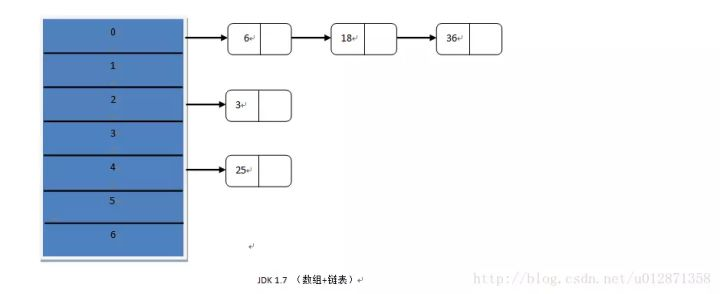
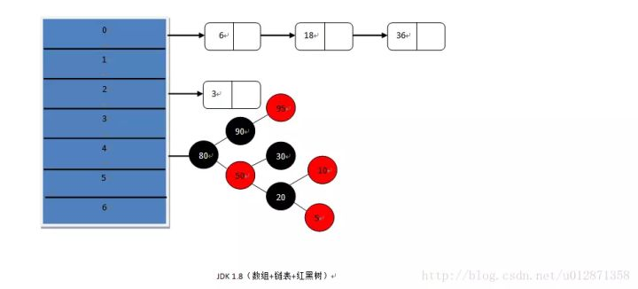
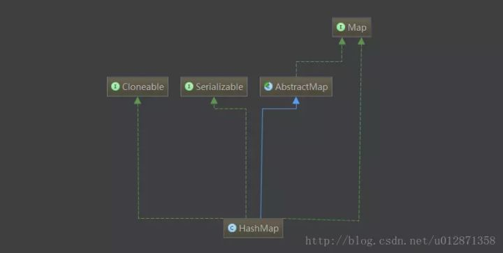
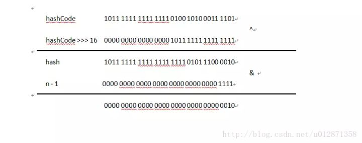
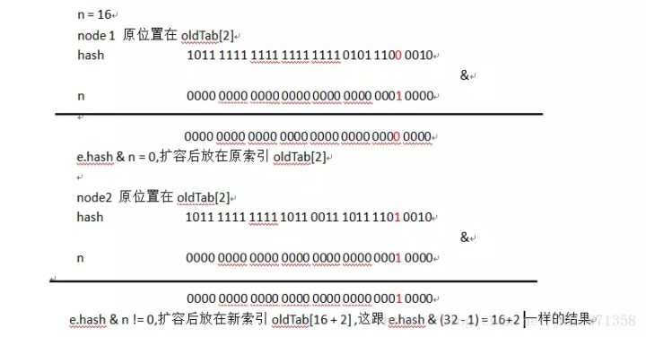
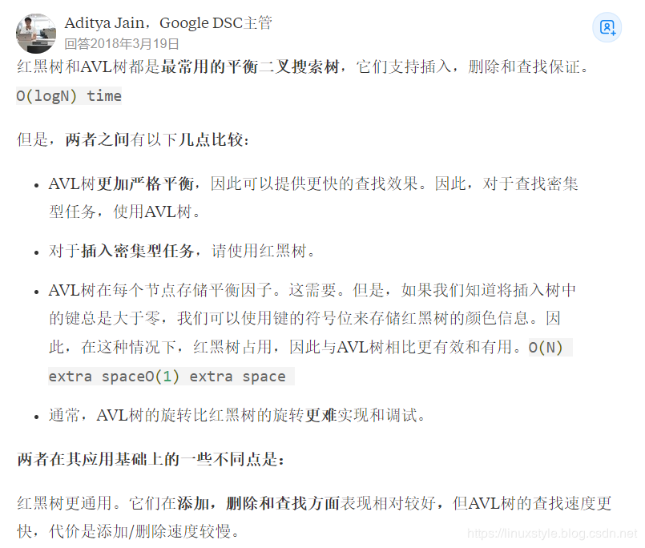
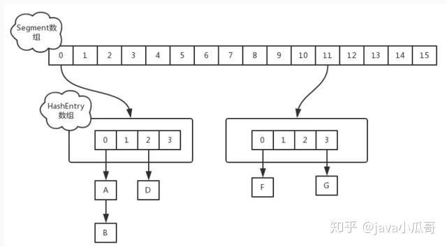

# HashMap

## 哈希

**Hash，一般翻译做“散列”，也有直接音译为“哈希”的，就是把任意长度的输入，通过散列算法，变换成固定长度的输出，该输出就是散列值。**这种转换是一种压缩映射，也就是，散列值的空间通常远小于输入的空间，不同的输入可能会散列成相同的输出，所以不可能从散列值来唯一的确定输入值。简单的说就是一种将任意长度的消息压缩到某一固定长度的消息摘要的函数。

所有散列函数都有如下一个基本特性：**根据同一散列函数计算出的散列值如果不同，那么输入值肯定也不同。但是，根据同一散列函数计算出的散列值如果相同，输入值不一定相同。**

**两个不同的输入值，根据同一散列函数计算出的散列值相同的现象叫做碰撞。**

常见的Hash函数有以下几个：

> 直接定址法：直接以关键字k或者k加上某个常数（k+c）作为哈希地址。
>
> 数字分析法：提取关键字中取值比较均匀的数字作为哈希地址。
>
> 除留余数法：用关键字k除以某个不大于哈希表长度m的数p，将所得余数作为哈希表地址。
>
> 分段叠加法：按照哈希表地址位数将关键字分成位数相等的几部分，其中最后一部分可以比较短。然后将这几部分相加，舍弃最高进位后的结果就是该关键字的哈希地址。
>
> 平方取中法：如果关键字各个部分分布都不均匀的话，可以先求出它的平方值，然后按照需求取中间的几位作为哈希地址。
>
> 伪随机数法：采用一个伪随机数当作哈希函数。

上面介绍过碰撞。衡量一个哈希函数的好坏的重要指标就是**发生碰撞的概率以及发生碰撞的解决方案**。任何哈希函数基本都无法彻底避免碰撞，常见的解决碰撞的方法有以下几种：

- 开放定址法：
  - 开放定址法就是一旦发生了冲突，就去寻找下一个空的散列地址，只要散列表足够大，空的散列地址总能找到，并将记录存入。
- 链地址法
  - 将哈希表的每个单元作为链表的头结点，所有哈希地址为i的元素构成一个同义词链表。即发生冲突时就把该关键字链在以该单元为头结点的链表的尾部。
- 再哈希法
  - 当哈希地址发生冲突用其他的函数计算另一个哈希函数地址，直到冲突不再产生为止。
- 建立公共溢出区
  - 将哈希表分为基本表和溢出表两部分，发生冲突的元素都放入溢出表中。

## Map


(1) HashMap：它根据键的hashCode值存储数据，大多数情况下可以直接定位到它的值，因而具有很快的访问速度，但遍历顺序却是不确定的。 **HashMap最多只允许一条记录的键为null，允许多条记录的值为null**。HashMap**非线程安全**，即任一时刻可以有多个线程同时写HashMap，可能会导致数据的不一致。如果需要满足线程安全，可以用 Collections的synchronizedMap方法使HashMap具有线程安全的能力，或者使用ConcurrentHashMap。

(2) Hashtable：Hashtable是遗留类，很多映射的常用功能与HashMap类似，不同的是它承自Dictionary类，并且是**线程安全**的，任一时间只有一个线程能写Hashtable，并发性不如ConcurrentHashMap，因为ConcurrentHashMap引入了分段锁。Hashtable不建议在新代码中使用，不需要线程安全的场合可以用HashMap替换，需要线程安全的场合可以用ConcurrentHashMap替换。

(3) LinkedHashMap：LinkedHashMap是HashMap的一个子类，保存了记录的插入顺序，在用Iterator遍历LinkedHashMap时，先得到的记录肯定是先插入的，也可以在构造时带参数，按照访问次序排序。

(4) TreeMap：TreeMap实现SortedMap接口，能够把它保存的记录根据键排序，默认是按键值的升序排序，也可以指定排序的比较器，当用Iterator遍历TreeMap时，得到的记录是排过序的。如果使用排序的映射，建议使用TreeMap。在使用TreeMap时，key必须实现Comparable接口或者在构造TreeMap传入自定义的Comparator，否则会在运行时抛出java.lang.ClassCastException类型的异常。

对于上述四种Map类型的类，要求映射中的key是不可变对象。不可变对象是该对象在创建后它的哈希值不会被改变。如果对象的哈希值发生变化，Map对象很可能就定位不到映射的位置了。

在Java中，保存数据有两种比较简单的数据结构：数组和链表。**数组的特点是：寻址容易，插入和删除困难；而链表的特点是：寻址困难，插入和删除容易。**上面我们提到过，常用的哈希函数的冲突解决办法中有一种方法叫做链地址法，其实就是将数组和链表组合在一起，发挥了两者的优势，我们可以将其理解为链表的数组。

## 一、概述

HashMap是我们在编程中遇到极其频繁、非常重要的一个集合类，如果能对HashMap做进一步的性能优化是非常有价值的而JDK 1.8做到了，所以非常有必要学习HashMap的重点源码，了解大师的手法。

二、底层数据结构





画图真的是个累活，好的画图工具很重要啊，上面这两张图分别画出了JDK 1.7、1.8底层数据结构，在JDK 1.7、1.8中都使用
了散列算法，但是在JDK 1.8中引入了红黑树，**在链表的长度大于等于8并且hash桶的长度大于等于64的时候，会将链表进行树化。**这里的树使用的数据结构是红黑树，红黑树是一个自平衡的二叉查找树，查找效率会从链表的o(n)降低为o(logn)，效率是非常大的提高。

**那为什么不将链表全部换成二叉树呢？这里主要有两个方面。**

- 第一个是链表的结构比红黑树简单，构造红黑树要比构造链表复杂，所以在链表的节点不多的情况下，从整体的性能看来，
  数组+链表+红黑树的结构不一定比数组+链表的结构性能高。
- 第二个是HashMap频繁的resize（扩容），扩容的时候需要重新计算节点的索引位置，也就是会将红黑树进行拆分和重组其实这是很复杂的，这里涉及到红黑树的**着色和旋转**，有兴趣的可以看看红黑树的原理，这又是一个比链表结构耗时的操作，所以为链表树化设置一个阀值是非常有必要的。
- 为什么要将链表替换为红黑树呢？红黑树插入为O(lgn),查询为O(lgn)，链表插入为O(1)，查询为O(n)，当链表长度过大的时候，查询性能就不是特别的好。

## 三、源码分析

3.1 类结构



上图是HashMap的类结构，大家看看有个概念

3.2 类注释

我建议大家在读源码时可以先看看类注释，往往类注释会给我们一些重要的信息，这里LZ给大家总结一下。

（1）**允许NULL值，NULL键**

（2）不要轻易改变负载因子，负载因子过高会导致链表过长，查找键值对时间复杂度就会增高，负载因子过低会导致hash桶的数量过多，空间复杂度会增高

（3）**Hash表每次会扩容长度为以前的2倍**

（4）**HashMap是多线程不安全的**，我在JDK1.7进行多线程put操作，之后遍历，直接死循环，CPU飙到100%，在JDK 1.8中进行多线程操作会出现节点和value值丢失，为什么JDK1.7与JDK1.8多线程操作会出现很大不同，是因为JDK 1.8的作者对resize方法进行了优化不会产生链表闭环。这也是本章的重点之一，具体的细节大家可以去查阅资料。这里我就不解释太多了

https://www.cnblogs.com/wen-he/p/11496050.html

（5）尽量设置HashMap的初始容量，尤其在数据量大的时候，防止多次resize

3.3 类常量

```java
  //默认hash桶初始长度16
  static final int DEFAULT_INITIAL_CAPACITY = 1 << 4; 

  //hash表最大容量2的30次幂
  static final int MAXIMUM_CAPACITY = 1 << 30;

  //默认负载因子 0.75
  static final float DEFAULT_LOAD_FACTOR = 0.75f;

  //链表的数量大于等于8个并且桶的数量大于等于64时链表树化 
  static final int TREEIFY_THRESHOLD = 8;

  //hash表某个节点链表的数量小于等于6时树拆分
  static final int UNTREEIFY_THRESHOLD = 6;

  //树化时最小桶的数量
  static final int MIN_TREEIFY_CAPACITY = 64;
```

3.4 实例变量

```java
 //hash桶
  transient Node<K,V>[] table;                         

  //键值对的数量
  transient int size;

  //HashMap结构修改的次数
  transient int modCount;

  //扩容的阀值，当键值对的数量超过这个阀值会产生扩容
  int threshold;

  //负载因子
  final float loadFactor;
```

3.5 构造函数

```java
public HashMap(int initialCapacity, float loadFactor) {                                                                   
        if (initialCapacity < 0)
            throw new IllegalArgumentException("Illegal initial capacity: " +
                                               initialCapacity);
        if (initialCapacity > MAXIMUM_CAPACITY)
            initialCapacity = MAXIMUM_CAPACITY;
        if (loadFactor <= 0 || Float.isNaN(loadFactor))
            throw new IllegalArgumentException("Illegal load factor: " + loadFactor);
        this.loadFactor = loadFactor;
        //下面介绍一下这行代码的作用
        this.threshold = tableSizeFor(initialCapacity);
    }

    public HashMap(int initialCapacity) {
        this(initialCapacity, DEFAULT_LOAD_FACTOR);
    }

    public HashMap() {
        this.loadFactor = DEFAULT_LOAD_FACTOR; // all other fields defaulted
    }

    public HashMap(Map<? extends K, ? extends V> m) {
        this.loadFactor = DEFAULT_LOAD_FACTOR;
        putMapEntries(m, false);
    }
```

HashMap有4个构造函数。

hash桶没有在构造函数中初始化，而是在第一次存储键值对的时候进行初始化。 这里重点看下tableSizeFor(initialCapacity)方法，这个方法的作用是，将你传入的initialCapacity做计算，返回一个大于等于initialCapacity 最小的2的幂次方。

所以这个操作保证无论你传入的初始化Hash桶长度参数是多少，最后hash表初始化的长度都是2的幂次方。比如你输入的是6，计算出来结果就是8。

下面贴出源码。

```java
static final int tableSizeFor(int cap) {                                                                      
        int n = cap - 1;
        n |= n >>> 1;
        n |= n >>> 2;
        n |= n >>> 4;
        n |= n >>> 8;
        n |= n >>> 16;
        return (n < 0) ? 1 : (n >= MAXIMUM_CAPACITY) ? MAXIMUM_CAPACITY : n + 1;
    }
```

3.6 插入


```java
public V put(K key, V value) {
    return putVal(hash(key), key, value, false, true);
}
final V putVal(int hash, K key, V value, boolean onlyIfAbsent,                                     
               boolean evict) {
    Node<K,V>[] tab; Node<K,V> p; int n, i;
    //当table为空时，这里初始化table，不是通过构造函数初始化，而是在插入时通过扩容初始化，有效防止了初始化HashMap没有数据插入造成空间浪费可能造成内存泄露的情况
    if ((tab = table) == null || (n = tab.length) == 0)
        n = (tab = resize()).length;
    //存放新键值对
    if ((p = tab[i = (n - 1) & hash]) == null)
        tab[i] = newNode(hash, key, value, null);
    else {
        Node<K,V> e; K k;
        //旧键值对的覆盖
        if (p.hash == hash &&
            ((k = p.key) == key || (key != null && key.equals(k))))
          // e 为旧值，e为需要被找到的旧值
            e = p;
        //在红黑树中查找旧键值对更新
        else if (p instanceof TreeNode)
            e = ((TreeNode<K,V>)p).putTreeVal(this, tab, hash, key, value);
        else {
            //将新键值对放在链表的最后
            for (int binCount = 0; ; ++binCount) {
              // 以后列表中找不到相应的key，进行创建
                if ((e = p.next) == null) {
                    p.next = newNode(hash, key, value, null);
                    //当链表的长度大于等于树化阀值，并且hash桶的长度大于等于MIN_TREEIFY_CAPACITY，链表转化为红黑树
                    if (binCount >= TREEIFY_THRESHOLD - 1) // -1 for 1st
                        treeifyBin(tab, hash);
                    break;
                }
                //链表中包含键值对
                if (e.hash == hash &&
                    ((k = e.key) == key || (key != null && key.equals(k))))
                    break;
                p = e;
            }
        }
        //map中含有旧key，返回旧值
        if (e != null) { 
            V oldValue = e.value;
            if (!onlyIfAbsent || oldValue == null)
                e.value = value;
            afterNodeAccess(e);
            return oldValue;
        }
    }
    //map调整次数加1
    ++modCount;
    //键值对的数量达到阈值需要扩容
    if (++size > threshold)
        resize();
    afterNodeInsertion(evict);
    return null;
}
```

HashMap插入跟我们平时使用时的感觉差不多，下面总结一下。

（1）插入的键值对是新键值对，如果hash表没有初始化会进行初始化，否则将键值对插入链表**尾部**，可能需要链表树化和
扩容

（2）插入的键值对中的key已经存在，更新键值对在put的方法里我们注意看下hash(key)方法，这是计算键值对hash值的方法，下面给出源码

```java
static final int hash(Object key) {                                                                          
        int h;
        return (key == null) ? 0 : (h = key.hashCode()) ^ (h >>> 16);
    }
```

hashCode()是一个int类型的本地方法，也就将key的hashCode无符号右移16位然后与hashCode异或从而得到hash值在putVal方法中（n - 1）& hash计算得到桶的索引位置 ，那么现在有两个疑问，为什么要计算hash值？为什么不用 hash % n?

- 为什么要计算hash值，而不用hashCode，因为通常n是很小的，而hashCode是32位，如果（n - 1）& hashCode那么当n大于2的16次方加1，也就是65537后(n - 1)的高位数据才能与hashCode的高位数据相与，当n很小时只能使用上hashCode低
  16位的数据，这会产生一个问题，既键值对在hash桶中分布不均匀，导致链表过长，而把hashCode>>>16无符号右移16位让高16位间接的与（n - 1）参加计算，从而让键值对分布均匀。降低hash碰撞。
- 为什么使用（n - 1）& hash 而不使用hash% n呢？其实这两种结果是等价的，但是&的效率比%高，原因因为&运算是二
  进制直接运算，而计算机天生就认得二进制。下面画图说明一下



上图 hash&(n - 1)的结果是2，而其实hash%n 的结果也是2, hash&(n - 1)与hash%n的结果是等价的。

Put 时数据是**尾插法**。

3.7 扩容

```java
final Node<K,V>[] resize() {
        Node<K,V>[] oldTab = table;
        int oldCap = (oldTab == null) ? 0 : oldTab.length;
        int oldThr = threshold;
        int newCap, newThr = 0;
        //如果旧hash桶不为空
        if (oldCap > 0) {
            //超过hash桶的最大长度，将阀值设为最大值
            if (oldCap >= MAXIMUM_CAPACITY) {
                threshold = Integer.MAX_VALUE;
                return oldTab;
            }
            //新的hash桶的长度2被扩容没有超过最大长度，将新容量阀值扩容为以前的2倍
            else if ((newCap = oldCap << 1) < MAXIMUM_CAPACITY &&
                     oldCap >= DEFAULT_INITIAL_CAPACITY)
                newThr = oldThr << 1; // double threshold
        }
        //如果hash表阈值已经初始化过
        else if (oldThr > 0) // initial capacity was placed in threshold
            newCap = oldThr;
        //如果旧hash桶，并且hash桶容量阈值没有初始化，那么需要初始化新的hash桶的容量和新容量阀值
        else {              
            newCap = DEFAULT_INITIAL_CAPACITY;
            newThr = (int)(DEFAULT_LOAD_FACTOR * DEFAULT_INITIAL_CAPACITY);
        }
        //新的局部变量阀值赋值
        if (newThr == 0) {
            float ft = (float)newCap * loadFactor;
            newThr = (newCap < MAXIMUM_CAPACITY && ft < (float)MAXIMUM_CAPACITY ?
                      (int)ft : Integer.MAX_VALUE);
        }
        //为当前容量阀值赋值
        threshold = newThr;
        @SuppressWarnings({"rawtypes","unchecked"})
            //初始化hash桶
            Node<K,V>[] newTab = (Node<K,V>[])new Node[newCap];
        table = newTab;
        //如果旧的hash桶不为空，需要将旧的hash表里的键值对重新映射到新的hash桶中
        if (oldTab != null) {
            for (int j = 0; j < oldCap; ++j) {
                Node<K,V> e;
                if ((e = oldTab[j]) != null) {
                    oldTab[j] = null;
                    //只有一个节点，通过索引位置直接映射
                    if (e.next == null)
                        newTab[e.hash & (newCap - 1)] = e;
                    //如果是红黑树，需要进行树拆分然后映射
                    else if (e instanceof TreeNode)
                        ((TreeNode<K,V>)e).split(this, newTab, j, oldCap);
                    else { 
                    //如果是多个节点的链表，将原链表拆分为两个链表，两个链表的索引位置，一个为原索引，一个为原索引加上旧Hash桶长度的偏移量       
                        Node<K,V> loHead = null, loTail = null;
                        Node<K,V> hiHead = null, hiTail = null;
                        Node<K,V> next;
                        do {
                            next = e.next;
                            //链表1
                            if ((e.hash & oldCap) == 0) {
                                if (loTail == null)
                                    loHead = e;
                                else
                                    loTail.next = e;
                                loTail = e;
                            }
                            //链表2
                            else {
                                if (hiTail == null)
                                    hiHead = e;
                                else
                                    hiTail.next = e;
                                hiTail = e;
                            }
                        } while ((e = next) != null);
                        //链表1存于原索引
                        if (loTail != null) {
                            loTail.next = null;
                            newTab[j] = loHead;
                        }
                        //链表2存于原索引加上原hash桶长度的偏移量
                        if (hiTail != null) {
                            hiTail.next = null;
                            newTab[j + oldCap] = hiHead;
                        }
                    }
                }
            }
        }
        return newTab;
    }
```

那么什么时候回产生扩容呢？

（1）初始化HashMap时，第一次进行put操作

（2）当键值对的个数大于threshold阀值时产生扩容，threshold=size*loadFactor

上面就是HashMap扩容的源代码，我已经加上了注释，相信大家都能看懂了。总结一下，**HaspMap扩容就是就是先计算新的hash表容量和新的容量阀值，然后初始化一个新的hash表，将旧的键值对重新映射在新的hash表里。**这里实现的细节当然没有我说的那么简单，如果在旧的hash表里涉及到红黑树，那么在映射到新的hash表中还涉及到红黑树的拆分。

在扩容的源代码中作者有一个使用很巧妙的地方，是键值对分布更均匀，不知道读者是否有看出来。在遍历原hash桶时的一个链表时，因为扩容后长度为原hash表的2倍，假设把扩容后的hash表分为两半，分为低位和高位，如果能把原链表的键值对， 一半放在低位，一半放在高位，这样的索引效率是最高的。那看看源码里是怎样写的。大师通过e.hash & oldCap == 0来判断， 这和e.hash & (oldCap - 1) 有什么区别呢。下面我通过画图来解释一下。



**因为n是2的整次幂，二进制表示除了最高位为1外，其他低位全为0**，那么e.hash & oldCap 是否等于0,取决于n对应最高位. 相对于e.hash那一位是0还是1，比如说n = 16，二进制为10000，第5位为1，e.hash & oldCap 是否等于0就取决于e.hash第5
位是0还是1，这就相当于有50%的概率放在新hash表低位，50%的概率放在新hash表高位。大家应该明白了e.hash & oldCap == 0的好处与作用了吧。

其实，到这里基本上HashMap的核心内容都讲完了，相信大家对HashMap的源码有一定了解了。在源码中还有键值对的查询和删除都比较简单，这里就不在过多赘述了，对于红黑树的构造、旋转、着色，我觉得大家有兴趣可以了解一下，毕竟我们不
是HashMap的开发者，不用了解过多的细节，钻墙角。知道大致的原理即可。

3.8 清除

本来到这里就要结束了，但是LZ还是想跟大家聊一下HashMap总的clear()方法，下面贴出源码。

```java
public void clear() {
        Node<K,V>[] tab;
        modCount++;
        if ((tab = table) != null && size > 0) {
            size = 0;
            for (int i = 0; i < tab.length; ++i)
                tab[i] = null;
        }
    }
```

HashMap其实这段代码特别简单，为什么贴出来呢，是因为我在看过别的博客里产生过疑问，到底是clear好还是新建一个HashMap好。我认为clear()比新建一个HashMap好。下面从空间复杂度和时间复杂度来解释一下。

从时间角度来看，这个循环是非常简单无复杂逻辑，并不十分耗资源。而新建一HashMap，首先他在在堆内存中年轻代中查看是否有足够空间能够存储，如果能够存储，那么创建顺利完成，但如果HashMap非常大，年轻代很难有足够的空间存储，如果老年代中有足够空间存储这个HashMap，那么jvm会将HashMap直接存储在老年代中，如果老年代中空间不够，这时候会触发一次minor gc，会产生小规模的gc停顿，如果发生minor gc之后仍不能存储HashMap，那么会发生整个堆的gc，也就是full gc，这个gc停顿是很恐怖的。实际上的gc顺序就是这样的，并且可能发生多次minor gc和full gc,如果发现年轻代和老年代均不能存储HashMap，那么就会触发OOM，而clear()是肯定不会触发OOM的，所以数据里特别大的情况下，千万不要创建一个新的HashMap代替clear()方法。

从空间角度看，原HashMap虽然不用，如果数据未被清空，是不可能被jvm回收的，因为HashMap是强引用类型的，从而造成内存泄漏。所以综上所述我
是不建议新建一个HashMap代替clear()的，并且很多源码中clear()方法很常用，这就是最好的证明。

## 四、总结

（1）HashMap允许NULL值，NULL键

（2）不要轻易改变负载因子，负载因子过高会导致链表过长，查找键值对时间复杂度就会增高，负载因子过低会导致hash桶的数量过多，空间复杂度会增高

（3）Hash表每次会扩容长度为以前的2倍

（4）HashMap是多线程不安全的，我在JDK 1.7进行多线程put操作，之后遍历，直接死循环，CPU飙到100%，在JDK 1.8中
进行多线程操作会出现节点和value值丢失，为什么JDK1.7与JDK1.8多线程操作会出现很大不同，是因为JDK 1.8的作者对resize
方法进行了优化不会产生链表闭环。这也是本章的重点之一，具体的细节大家可以去查阅资料。这里我就不解释太多了

（5）尽量设置HashMap的初始容量，尤其在数据量大的时候，防止多次resize

（6）HashMap在JDK 1.8在做了很好性能的提升，我看到过在JDK1.7和JDK1.8get操作性能对比JDK1.8是要优于JDK 1.7的，大家感兴趣的可以自己做个测试，所以还没有升级到JDK1.8的小伙伴赶紧的吧。

总结就把类注释的给搬过来了，其实在本篇文章中有一个知识点没有详细分析，就是HashMap在多线程不安全的原因，尤其扩容在JDK 1.7 会产生链表闭环。

## 拓展

[Java 8系列之重新认识HashMap](https://tech.meituan.com/2016/06/24/java-hashmap.html)

[全网把Map中的hash()分析的最透彻的文章，别无二家。](https://www.hollischuang.com/archives/2091)

## 问题

**1、为什么 HashMap 一开始不使用红黑树？**

链表的结构比红黑树简单，构造红黑树要比构造链表复杂，所以在链表的节点不多的情况下，从整体的性能看来，数组+链表+红黑树的结构不一定比数组+链表的结构性能高。

**2、为什么hash冲突使用红黑树而不是AVL树呢？**

红黑树在添加、查询、删除方面都有比较好的性能，AVL 为了查询效率比较快，牺牲了添加和删除的速度。



https://blog.csdn.net/carson_ho/article/details/79373134

https://www.jianshu.com/p/c0642afe03e0

**3、那为什么不将链表全部换成二叉树呢？**

这里主要有两个方面：

- *第一个是链表的结构比红黑树简单*，构造红黑树要比构造链表复杂，所以在链表的节点不多的情况下，从整体的性能看来，
  数组+链表+红黑树的结构不一定比数组+链表的结构性能高。
- *第二个是HashMap频繁的resize（扩容）*，扩容的时候需要重新计算节点的索引位置，也就是会将红黑树进行拆分和重组其实这是很复杂的，这里涉及到红黑树的着色和旋转，有兴趣的可以看看红黑树的原理，这又是一个比链表结构耗时的操作，所以为链表树化设置一个阀值是非常有必要的。

**4、tableSizeFor(initialCapacity) 方法的作用？**

将你传入的initialCapacity做计算，返回一个大于等于initialCapacity 最小的2的幂次方。

**5、为什么使用 `(n - 1) & hash` ，而不是直接使用 hashcode？**

为什么要计算hash值，而不用hashCode，因为通常n是很小的，而hashCode是32位，如果（n - 1）& hashCode那么当n大于2的16次方加1，也就是65537后(n - 1)的高位数据才能与hashCode的高位数据相与，当n很小是只能使用上hashCode低
16位的数据，这会产生一个问题，既键值对在hash桶中分布不均匀，导致链表过长，而把hashCode>>>16无符号右移16位让高16位间接的与（n - 1）参加计算，从而让键值对分布均匀。主要是从速度，功效和质量来考虑的，减少系统的开销，降低hash碰撞。

**6、为什么（n - 1）& hash，而不是使用取模方式？**

为什么使用（n - 1）& hash 而不使用hash% n呢？其实这两种结果是等价的，但是&的效率比%高，原因因为&运算是二
进制直接运算，而**计算机天生就认得二进制**。

**7、resize 步骤说一下？**

HaspMap扩容就是就是先计算新的hash表容量和新的容量阀值，然后初始化一个新的hash表，将旧的键值对重新映射在新的hash表里。这里实现的细节当然没有我说的那么简单，如果在旧的hash表里涉及到红黑树，那么在映射到新的hash表中还涉及到红黑树的拆分。

在扩容的源代码中作者有一个使用很巧妙的地方，是键值对分布更均匀，不知道读者是否有看出来。在遍历原hash桶时的一个链表时，因为扩容后长度为原hash表的2倍，假设把扩容后的hash表分为两半，分为低位和高位，如果能把原链表的键值对， 一半放在低位，一半放在高位，这样的索引效率是最高的。那看看源码里是怎样写的。大师通过e.hash & oldCap == 0来判断， 这和e.hash & (oldCap - 1) 有什么区别呢。

**8、是否了解HashMap在并发使用时可能发生死循环，导致cpu100%，在get数据的时候？（1.7版本中的问题）**

在多线程场景，可能会存在get 操作时，触发了rehash操作，从而形成了环形链表，形成死循环的情况。

https://juejin.im/post/5a66a08d5188253dc3321da0

解决方案：比较low的可以使用HashTable和调用Collections工具类的synchronizedMap()方法达到线程安全的目的。但由于synchronized是串行执行，在访问量很大的情况下效率很低，不推荐使用。
另外一种方式就是使用JUC包下的ConcurrentHashMap类，这个类很好的解决了多线程环境下的并发问题。

**9、数组和链表的区别？**

数组的特点是：寻址容易，插入和删除困难；而链表的特点是：寻址困难，插入和删除容易。

**10、HashMap 是先扩容呢还是先put操作呢？**

如果没有初始化，先扩容，如果初始化了，是先put操作，再扩容。

- “调用哈希函数获取Key对应的hash值，再计算其数组下标；
- 如果没有出现哈希冲突，则直接放入数组；如果出现哈希冲突，则以链表的方式放在链表后面；
- 如果链表长度超过阀值( TREEIFY THRESHOLD==8)，就把链表转成红黑树，链表长度低于6，就把红黑树转回链表;
- 如果结点的key已经存在，则替换其value即可；
- 如果集合中的键值对大于12，调用resize方法进行数组扩容。”

**11、HashMap 是怎么解决Hash 冲突的？**

Java中HashMap采用了链地址法。链地址法，简单来说，就是数组加链表的结合。在每个数组元素上都一个链表结构，当数据被Hash后，得到数组下标，把数据放在对应下标元素的链表上。Hash算法计算结果越分散均匀，Hash碰撞的概率就越小，map的存取效率就会越高

**12、使用2的N次方有什么优势和缺点？**

针对在*取模和扩容时做优化*，缺点就是相对来说素数导致冲突的概率要小于合数。

**13、为什么线程不安全**

个人觉得 HashMap 在并发时可能出现的问题主要是两方面,首先如果多个线程同时使用put方法添加元素，而且假设正好存在两个 put 的 key 发生了碰撞(根据 hash 值计算的 bucket 一样)，那么根据 HashMap 的实现，这两个 key 会添加到数组的同一个位置，这样最终就会发生其中一个线程的 put 的数据被覆盖。第二就是如果多个线程同时检测到元素个数超过数组大小* loadFactor ，这样就会发生多个线程同时对 Node 数组进行扩容，都在重新计算元素位置以及复制数据，但是最终只有一个线程扩容后的数组会赋给 table，也就是说其他线程的都会丢失，并且各自线程 put 的数据也丢失。

**14、HashMap了解么吗？说一下put方法过程**

**15、HashMap 的 key 可以为空吗？**

可以

**16、HashMap jdk1.7 中的问题，在 1.8 中如何解决？**

在 jdk1.7 会出现环链的问题，在 1.8 则通过 `(e.hash & oldCap) == 0` 不改变迁移的顺序，保证了不会出现 ABA 的问题。

**17、1.8 中线程不安全的原因是什么？**

多线程场景下，hashmap 进行扩容可能出现数据的丢失，A 线程 put 新值，在 B 线程扩容时，出现了丢失。

https://blog.csdn.net/swpu_ocean/article/details/88917958

18、**HashMap 的数据结构？**

哈希表结构（链表散列：数组+链表）实现，结合数组和链表的优点。当链表超过8且数据总量超过64才会转红黑树。

19、**HashMap 的工作原理？**

HashMap 底层是 hash 数组和单向链表实现，数组中的每个元素都是链表，由 Node 内部类（实现 `Map.Entry<K,V>`接口）实现，HashMap 通过 put & get 方法存储和获取。

存储对象时，将 K/V 键值传给 put() 方法：

1. 调用 hash(K) 方法计算 K 的 hash 值，然后结合数组长度，计算得数组下标；

2. 调整数组大小（当容器中的元素个数大于 capacity * loadfactor 时，容器会进行扩容resize 为 2n）；

3. i.如果 K 的 hash 值在 HashMap 中不存在，则执行插入，若存在，则发生碰撞；

   ii.如果 K 的 hash 值在 HashMap 中存在，且它们两者 equals 返回 true，则更新键值对；

   iii. 如果 K 的 hash 值在 HashMap 中存在，且它们两者 equals 返回 false，则插入链表的尾部（尾插法）或者红黑树中（树的添加方式）。

（JDK 1.7 之前使用头插法、JDK 1.8 使用尾插法）

（注意：当碰撞导致链表大于 TREEIFY_THRESHOLD = 8 时，就把链表转换成红黑树）

获取对象时，将 K 传给 get() 方法：①、调用 hash(K) 方法（计算 K 的 hash 值）从而获取该键值所在链表的数组下标；②、顺序遍历链表，equals()方法查找相同 Node 链表中 K 值对应的 V 值。

hashCode 是定位的，存储位置；equals是定性的，比较两者是否相等。

20、**为什么要用异或运算符？**

保证了对象的 hashCode 的 32 位值只要有一位发生改变，整个 hash() 返回值就会改变。尽可能的减少碰撞。

21、**HashMap 的 table 的容量如何确定？loadFactor 是什么？ 该容量如何变化？这种变化会带来什么问题？**

1. table 数组大小是由 capacity 这个参数确定的，默认是16，也可以构造时传入，最大限制是1<<30；

2. loadFactor 是装载因子，主要目的是用来确认table 数组是否需要动态扩展，默认值是0.75，比如table 数组大小为 16，装载因子为 0.75 时，threshold 就是12，当 table 的实际大小超过 12 时，table就需要动态扩容；

3. 扩容时，调用 resize() 方法，将 table 长度变为原来的两倍（注意是 table 长度，而不是 threshold）

4. 如果数据很大的情况下，扩展时将会带来性能的损失，在性能要求很高的地方，这种损失很可能很致命。

22、**数组扩容的过程？**

创建一个新的数组，其容量为旧数组的两倍，并重新计算旧数组中结点的存储位置。结点在新数组中的位置只有两种，原下标位置或原下标+旧数组的大小。

23、**拉链法导致的链表过深问题为什么不用二叉查找树代替，而选择红黑树？为什么不一直使用红黑树？**

之所以选择红黑树是为了解决二叉查找树的缺陷，二叉查找树在特殊情况下会变成一条线性结构（这就跟原来使用链表结构一样了，造成很深的问题），遍历查找会非常慢。而红黑树在插入新数据后可能需要通过左旋，右旋、变色这些操作来保持平衡，引入红黑树就是为了查找数据快，解决链表查询深度的问题，我们知道红黑树属于平衡二叉树，但是为了保持“平衡”是需要付出代价的，但是该代价所损耗的资源要比遍历线性链表要少，所以当长度大于8的时候，会使用红黑树，如果链表长度很短的话，根本不需要引入红黑树，引入反而会慢。

24、**说说你对红黑树的见解？**

- 每个节点非红即黑
- 根节点总是黑色的
- 如果节点是红色的，则它的子节点必须是黑色的（反之不一定）
- 每个叶子节点都是黑色的空节点（NIL节点）
- 从根节点到叶节点或空子节点的每条路径，必须包含相同数目的黑色节点（即相同的黑色高度）

25、**jdk8中对HashMap做了哪些改变？**

- 在java 1.8中，如果链表的长度超过了8，那么链表将转换为红黑树。（桶的数量必须大于64，小于64的时候只会扩容）
- 发生hash碰撞时，java 1.7 会在链表的头部插入，而java 1.8会在链表的尾部插入
- 在java 1.8中，Entry被Node替代(换了一个马甲)。

26、**HashMap，LinkedHashMap，TreeMap 有什么区别？**

HashMap 参考其他问题；

LinkedHashMap 保存了记录的插入顺序，在用 Iterator 遍历时，先取到的记录肯定是先插入的；遍历比 HashMap 慢；

TreeMap 实现 SortMap 接口，能够把它保存的记录根据键排序（默认按键值升序排序，也可以指定排序的比较器）

27、**HashMap & TreeMap & LinkedHashMap 使用场景？**

一般情况下，使用最多的是 HashMap。

HashMap：在 Map 中插入、删除和定位元素时；

TreeMap：在需要按自然顺序或自定义顺序遍历键的情况下；

LinkedHashMap：在需要输出的顺序和输入的顺序相同的情况下。

28、**HashMap 和 HashTable 有什么区别？**

1. HashMap 是线程不安全的，HashTable 是线程安全的；

2. 由于线程安全，所以 HashTable 的效率比不上 HashMap；

3. HashMap最多只允许一条记录的键为null，允许多条记录的值为null，而 HashTable不允许；

4. HashMap 默认初始化数组的大小为16，HashTable 为 11，前者扩容时，扩大两倍，后者扩大两倍+1；

5. HashMap 需要重新计算 hash 值，而 HashTable 直接使用对象的 hashCode

29、**Java 中的另一个线程安全的与 HashMap 极其类似的类是什么？同样是线程安全，它与 HashTable 在线程同步上有什么不同？**

ConcurrentHashMap 类（是 Java并发包 java.util.concurrent 中提供的一个线程安全且高效的 HashMap 实现）。

HashTable 是使用 synchronize 关键字加锁的原理（就是对对象加锁）；

而针对 ConcurrentHashMap，在 JDK 1.7 中采用 分段锁的方式；JDK 1.8 中直接采用了CAS（无锁算法）+ synchronized。

30、**HashMap & ConcurrentHashMap 的区别？**

除了加锁，原理上无太大区别。另外，HashMap 的键值对允许有null，但是ConCurrentHashMap 都不允许。

31、**为什么 ConcurrentHashMap 比 HashTable 效率要高？**

HashTable 使用一把锁（锁住整个链表结构）处理并发问题，多个线程竞争一把锁，容易阻塞；

ConcurrentHashMap

- JDK 1.7 中使用分段锁（ReentrantLock + Segment + HashEntry），相当于把一个 HashMap 分成多个段，每段分配一把锁，这样支持多线程访问。锁粒度：基于 Segment，包含多个 HashEntry。
- JDK 1.8 中使用 CAS + synchronized + Node + 红黑树。锁粒度：Node（首结点）（实现 Map.Entry<K,V>）。锁粒度降低了。

32、**针对 ConcurrentHashMap 锁机制具体分析（JDK 1.7 VS JDK 1.8）？**

JDK 1.7 中，采用分段锁的机制，实现并发的更新操作，底层采用数组+链表的存储结构，包括两个核心静态内部类 Segment 和 HashEntry。

1. Segment 继承 ReentrantLock（重入锁） 用来充当锁的角色，每个 Segment 对象守护每个散列映射表的若干个桶；

HashEntry 用来封装映射表的键-值对；

3. 每个桶是由若干个 HashEntry 对象链接起来的链表



JDK 1.8 中，采用Node + CAS + Synchronized来保证并发安全。取消类 Segment，直接用 table 数组存储键值对；当 HashEntry 对象组成的链表长度超过 TREEIFY_THRESHOLD 时，链表转换为红黑树，提升性能。底层变更为数组 + 链表 + 红黑树。


33、**ConcurrentHashMap 在 JDK 1.8 中，为什么要使用内置锁 synchronized 来代替重入锁 ReentrantLock？**

1. 粒度降低了；

2. JVM 开发团队没有放弃 synchronized，而且基于 JVM 的 synchronized 优化空间更大，更加自然。

3. 在大量的数据操作下，对于 JVM 的内存压力，基于 API 的 ReentrantLock 会开销更多的内存。

34、**ConcurrentHashMap 简单介绍？**

①、重要的常量：

private transient volatile int sizeCtl;

当为负数时，-1 表示正在初始化，-N 表示 N - 1 个线程正在进行扩容；

当为 0 时，表示 table 还没有初始化；

当为其他正数时，表示初始化或者下一次进行扩容的大小。

②、数据结构：

Node 是存储结构的基本单元，继承 HashMap 中的 Entry，用于存储数据；

TreeNode 继承 Node，但是数据结构换成了二叉树结构，是红黑树的存储结构，用于红黑树中存储数据；

TreeBin 是封装 TreeNode 的容器，提供转换红黑树的一些条件和锁的控制。

③、存储对象时（put() 方法）：

1.如果没有初始化，就调用 initTable() 方法来进行初始化；

2.如果没有 hash 冲突就直接 CAS 无锁插入；

3.如果需要扩容，就先进行扩容；

4.如果存在 hash 冲突，就加锁来保证线程安全，两种情况：一种是链表形式就直接遍历到尾端插入，一种是红黑树就按照红黑树结构插入；

5.如果该链表的数量大于阀值 8，就要先转换成红黑树的结构，break 再一次进入循环

6.如果添加成功就调用 addCount() 方法统计 size，并且检查是否需要扩容。

④、扩容方法 transfer()：默认容量为 16，扩容时，容量变为原来的两倍。

helpTransfer()：调用多个工作线程一起帮助进行扩容，这样的效率就会更高。

⑤、获取对象时（get()方法）：

1.计算 hash 值，定位到该 table 索引位置，如果是首结点符合就返回；

2.如果遇到扩容时，会调用标记正在扩容结点 ForwardingNode.find()方法，查找该结点，匹配就返回；

3.以上都不符合的话，就往下遍历结点，匹配就返回，否则最后就返回 null。

35、**ConcurrentHashMap 的并发度是什么？**

程序运行时能够同时更新 ConccurentHashMap 且不产生锁竞争的最大线程数。默认为 16，且可以在构造函数中设置。当用户设置并发度时，ConcurrentHashMap 会使用大于等于该值的最小2幂指数作为实际并发度（假如用户设置并发度为17，实际并发度则为32）。