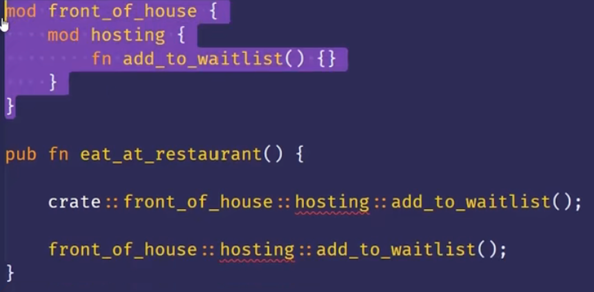
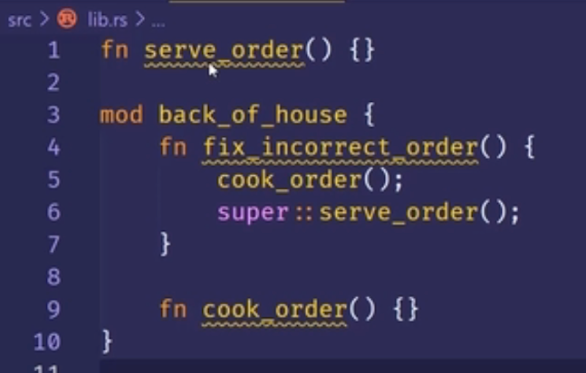
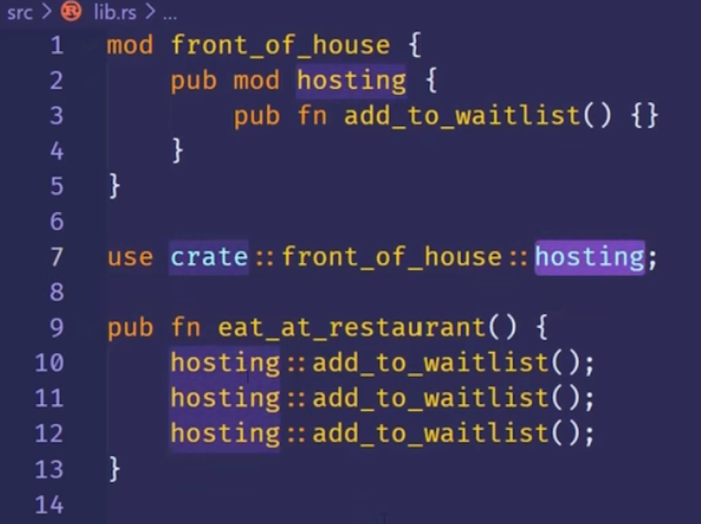
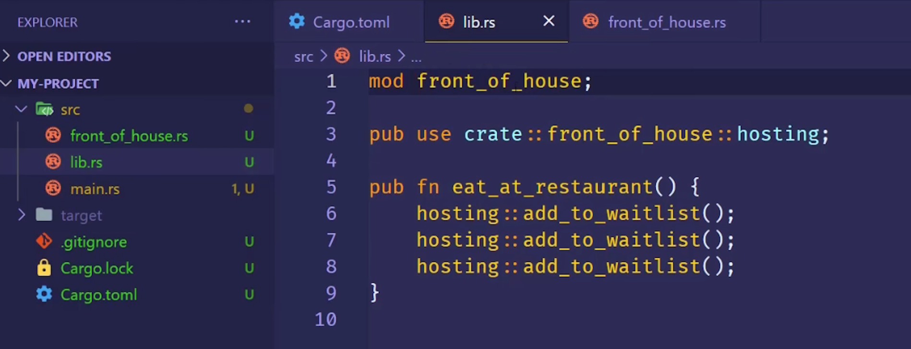
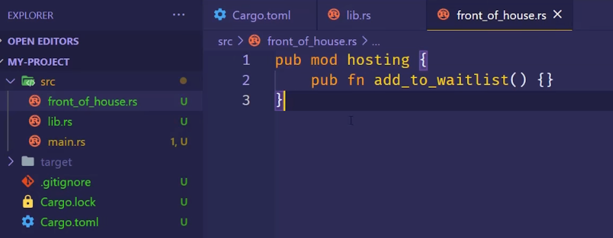
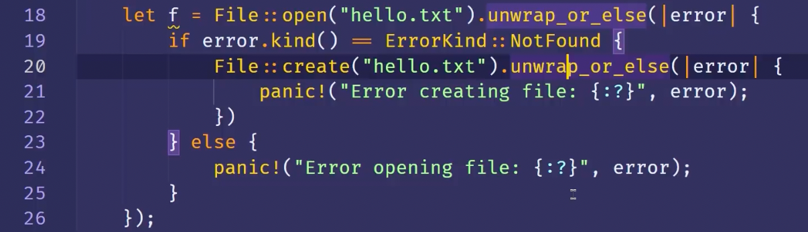
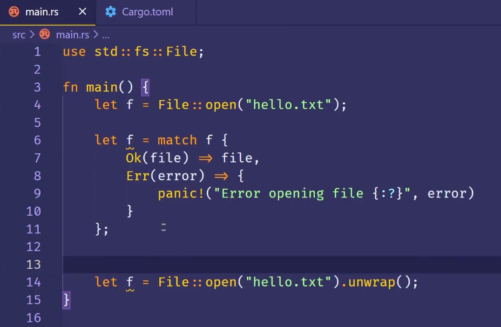
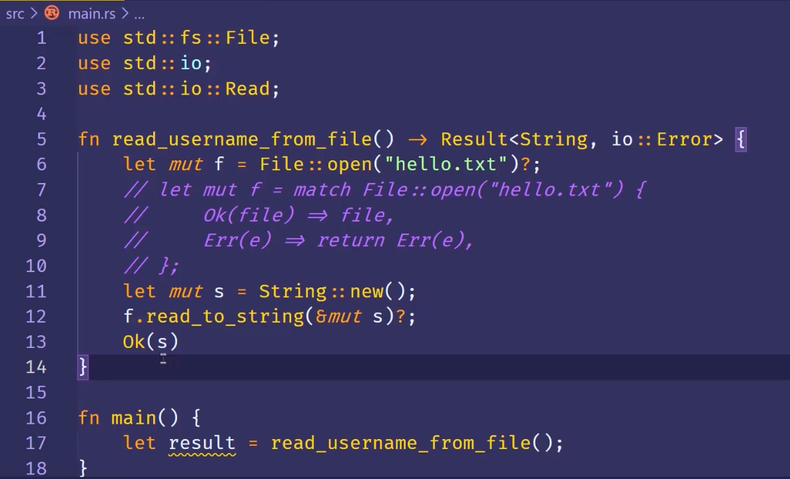
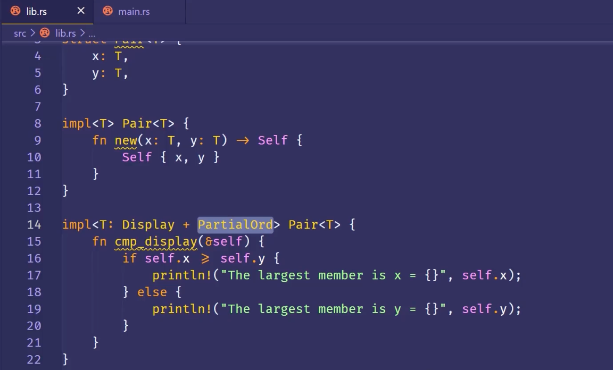

# Rust

read：https://kaisery.github.io/trpl-zh-cn/foreword.html

文档：https://course.rs/cargo/reference/specify-deps.html

宏：https://cloud.tencent.com/developer/article/1594094

使用场景

- 需要运行是的速度
- 内存安全
- 更好的多线程

与其他对比

- 无需 GC
- 安全

擅长领域

- 高性能 web Service
- WebAssembly
- 命令行工具
- 网络编程
- 嵌入式设备
- 系统编程

安装

https://www.rust-lang.org/zh-CN/learn/get-started

```toml
[package]
name = "hello-rust"
version = "0.1.0"
authors = ["zoeminghong <617405347@qq.com>"]
edition = "2018" // rust 版本

# See more keys and their definitions at https://doc.rust-lang.org/cargo/reference/manifest.html

[dependencies]
rand = "^0.3.14"
```

在 Rust 里面，代码的包称作 crate。

在线使用：https://play.rust-lang.org/

Cargo

```
cargo --version，查看版本。

cargo new 【hello_cargo】，新建项目。

cargo new 【hello_cargo】--vcs=git，新建拥有git的项目

cargo run，编译代码+执行结果。

cargo check，检查代码，他比 cargo buid 快，提高编码效率。

cargo build --release，为了发布构建，在编译的时候会进行优化，但编译时间长。

cargo update 会更新 Cargo.toml 文件中的内容。cargo.lock 使别人跟自己使用的依赖版本一致

cargo doc --open 命令来构建所有本地依赖提供的文档，并在浏览器中打开

```

代理源

```
# 放到 `$HOME/.cargo/config` 文件中
[source.crates-io]
registry = "https://github.com/rust-lang/crates.io-index"

# 替换成你偏好的镜像源
replace-with = 'sjtu'

# 清华大学
[source.tuna]
registry = "https://mirrors.tuna.tsinghua.edu.cn/git/crates.io-index.git"

# 中国科学技术大学
[source.ustc]
registry = "git://mirrors.ustc.edu.cn/crates.io-index"

# 上海交通大学
[source.sjtu]
registry = "https://mirrors.sjtug.sjtu.edu.cn/git/crates.io-index"

# rustcc社区
[source.rustcc]
registry = "git://crates.rustcc.cn/crates.io-index"
```

idea 插件及使用说明

https://plugins.jetbrains.com/plugin/8182-rust/docs/cargo-command-configuration.html

Cargo 

http://llever.com/cargo-book-zh/getting-started/installation.zh.html

## 语法

:: 静态变量

调用方法用点号

变量使用下划线分隔

expect() 当前面执行的结果报错时，会调用 expect 中的提示语。

&表示对象引用。

Rust 是类型推断语言

```rust
loop{

// 循环
}
```

```
match []
[] =>
```

变量

我们可以定义一个与之前变量同名的新变量。Rustacean 们称之为第一个变量被第二个 **隐藏** 了

```rust
let x=5;//不可变
println!("{}",x);

let mut x=5;// 可变
```

常量

常量用券大写字母，和每个单词之间用下划线分开。

- 必须指定类型
- 可以在任何作用域中声明

```rust
const MAX:u32=1000;
```

隐藏

类型可以跟之前的不一样。

```rust
let x=5;
let x=x+1;
```

第二个 x 替换了第一个 x。

标量类型

- 整数类型：u32（无符号类型），i32（有符号类型）、isize、usize 由计算机的架构决定
- 浮点类型：f32，f64（默认）
- 布尔类型：bool
- 字符类型：char，<u>单引号</u>

数据类型溢出的情况，在 release 时不会校验，运行时会循环覆盖。

复合类型

Tuple

创建之后，不能修改

除了使用模式匹配解构外，也可以使用点号（`.`）后跟值的索引来直接访问它们。

```rust
let tup:(i32,f64,u8)=(23,34.23,1);
let (x,y,z)=tup;
println!("{},{},{}",tup.0,tup.1,tup.2);

fn main() {
    let x: (i32, f64, u8) = (500, 6.4, 1);

    let five_hundred = x.0;

    let six_point_four = x.1;

    let one = x.2;
}
```

String

[String与&str的区别](https://www.dyike.com/2018/09/22/rust-string-vs-str/#:~:text=%E9%A6%96%E5%85%88%E7%9C%8B%E4%B8%80%E4%B8%8Bstr%20%E5%92%8C,%E9%9D%A2%E5%80%BC%EF%BC%8C%E5%88%99%E6%8C%87%E5%90%91%E9%9D%99%E6%80%81%E5%86%85%E5%AD%98%E3%80%82)

String 可以等于 &str，&str是String的切片。

数组

数组中的每个元素的类型必须相同

```rust
let a:[i32;5]=[1,2,3,4,5];
let a:[3;5]=[3,3,3,3,3];
a[0]
```

超出数组的范围的时候，编译不会报错，运行会报错。

函数

所有字母都小写，用下划线分开

函数参数的类型必须指明

```rust
fn another_fun(x:i32){
	println!("another function");
}

fn another_fun(x:i32)-> i32{
	println!("another function");
}

let y={
  let x=1;
  x+2 // 不要加分号，否则就是一个空tuple {}
};
```

主函数

```rust
fn main() {
    let x:i32 ={
        3+2
    };

    println!("输出：{}",x)

}
```

if 语句

``` rust
if num>5 {

}else {

}

let num=if true {}else{}
```

循环语句

```rust
loop{
break; // break 可以有返回值
}

fn main() {
     let mut count = 0;
    'counting_up: loop {
        println!("count = {}", count);
        let mut remaining = 10;

        loop {
            println!("remaining = {}", remaining);
            if remaining == 9 {
                break; // 跳出当前循环
            }
            if count == 2 {
                break 'counting_up; // break 'counting_up; 跳出 counting_up 循环
            }
            remaining -= 1;
        }

        count += 1;
    }
    println!("End count = {}", count);
}
// 返回值
fn main() {
    let mut counter = 0;

    let result = loop {
        counter += 1;

        if counter == 10 {
            break counter * 2;
        }
    };

    println!("The result is {}", result);
}
```

```rust
while [] {

}

fn main() {
    let mut number = 3;

    while number != 0 {
        println!("{}!", number);

        number -= 1;
    }

    println!("LIFTOFF!!!");
}

fn main() {
    let a = [10, 20, 30, 40, 50];
    let mut index = 0;

    while index < 5 {
        println!("the value is: {}", a[index]);

        index += 1;
    }
}
```

```rust
for e in es.iter(){
	printlin!({},e)
}

fn main() {
    let a = [10, 20, 30, 40, 50];

    for element in a {
        println!("the value is: {}", element);
    }
}
```

```rust
for num in (1..4).rev(){

}
// rev 反向	
```


Rust 与 Java 一样都有堆和栈内容。


当变量离开作用域之后，就会释放内存空间。

```rust
str.clone()// 克隆
```

任何简单标量的组合类型都是可以是 Copy 的

引用

```rust
fn main() {
    let s:String=String::from("ceshi");
    println!("输出：{}-{}",s,get_test(&s))
}

fn get_test(s:&String)-> usize{
    s.len()
}
```

```rust
fn main() {
    let mut s:String=String::from("ceshi");
    get_test(&mut s);
    println!("输出：{}",s);

}

fn get_test(s:&mut String)-> usize{
    s.push_str("sss");
    s.len()
}
```


```rust
let mut s = String::from("hello");

let r1 = &mut s;
let r2 = &mut s;

println!("{}, {}", r1, r2);

error[E0499]: cannot borrow `s` as mutable more than once at a time
 --> src/main.rs:5:14
  |
4 |     let r1 = &mut s;
  |              ------ first mutable borrow occurs here
5 |     let r2 = &mut s;
  |              ^^^^^^ second mutable borrow occurs here
6 |
7 |     println!("{}, {}", r1, r2);
  |                        -- first borrow later used here
```

切片

```rust
fn main() {
    let s:String=String::from("ceshi");
    let a=&s[1..3];
    let a=&s[1..];
    let a=&s[..3];
    println!("输出：{}",a);
}


```

方法返回值

```
&str
usize
```

Struct

```rust
struct Test{
	name:String,
	age:u32
}

let s:Test={
	name:"zhangsan",
	age:11
}

let user2 = User {
    email: String::from("another@example.com"),
    username: String::from("anotherusername567"),
    ..user1
};

struct Color(i32, i32, i32);
struct Point(i32, i32, i32);

let black = Color(0, 0, 0);
let origin = Point(0, 0, 0);
```

struct 声明方法或者关联函数（类似于 java 静态方法）

Rust **确实** 包含了打印出调试信息的功能，在结构体定义之前加上 `#[derive(Debug)]` 注解。

impl 为 struct 中的方法。

`impl` 块的另一个有用的功能是：允许在 `impl` 块中定义 **不** 以 `self` 作为参数的函数。这被称为 **关联函数**（*associated functions*），因为它们与结构体相关联。它们仍是函数而不是方法，因为它们并不作用于一个结构体的实例。你已经使用过 `String::from` 关联函数了。

```rust
#[derive(Debug)]
struct Ract {
    width: u32,
    length: u32,
}

impl Ract {
  // 使用 &self 来替代 ract: &Ract
    fn area(&self) -> u32 {
        self.length * self.width
    }
    // 关联函数，没有self
    fn square(size: u32) -> Ract {
        Ract {
            width: size,
            length: size,
        }
    }
}

fn main() {
    let rect = Ract {
        width: 20,
        length: 50,
    };
    println!("{}", rect.area());
    println!("{:#?}", rect);
    // 关联函数
    let sq = Ract::square(20);
    println!("{}", sq.area());
}

```

impl 可以是多个相同的代码块。

debug

```rust
#[derive(Debug)]

{:?}
{:#?}
```

枚举

```
#[derive(Debug)]
enum IPAddr{
    Ip4,
    Ip6
}

fn main() {
    println!("{:?}", IPAddr::Ip4);
}
```

Option

`_`作为通配符。

```rust
fn plus_one(x: Option<i32>) -> Option<i32> {
    match x {
        None => None,
        Some(i) => Some(i + 1),
    }
}

let five = Some(5);
let six = plus_one(five);
let none = plus_one(None);

let some_u8_value = 0u8;
match some_u8_value {
    1 => println!("one"),
    3 => println!("three"),
    5 => println!("five"),
    7 => println!("seven"),
    _ => (),
}
```

if let

`if let` 语法让我们以一种不那么冗长的方式结合 `if` 和 `let`，来处理只匹配一个模式的值而忽略其他模式的情况。

```rust
let some_u8_value = Some(0u8);
match some_u8_value {
    Some(3) => println!("three"),
    _ => (),
}

if let Some(3) = some_u8_value {
    println!("three");
}

let mut count = 0;
if let Coin::Quarter(state) = coin {
    println!("State quarter from {:?}!", state);
} else {
    count += 1;
}
```

模块系统：

- Package（包)：Cargo 的特性，让你构建、测试、共享 crate
- Crate （单元包)：一个模块树，它可产生一个library 或可执行文件
- module（模块）、use：让你控制代码的组织、作用域、私有路径
- Path(路径）：为struct、function 或module 等项命名的方式

Pacakge 和 Crate

Crate 的类型：

- binary
- library

Crate Root:

- 是源代码文件
- Rust编译器从这里开始，组成你的 Crate 的根 Module

一个 Package :

- 包含1个Cargo.toml，它描述了如何构建这些 Crates
- 只能包含0-1个library crate
- 可以包含任意数量的 binary crate
- 但必须至少包含一个crate cibrary 或 binary)

src/main.rs:
- binary crate 的 crate root
- crate名与package名相同

src/lib.rs:

- package 包含一个 ibrary crate
- library crate 的 crate root
- crate 名与 package 名相同
- Cargo 把 crate root 文件交给 rustc 来构建 library 或 binary

Cargo 的惯例

- 一个Package 可以同时包含src/main.rs 和 src/ib.rs：
  - 一个 binary crate，一个 lrary crate
  - 名称与 package 名相同
- 一个Package可以有多个binary crate：
  - 文件放在src/bin
  - 每个文件是单独的 binary crate

定义 module 来控制作用域和私有性

Module:

- 在一个crate 内，将代码进行分组
- 增加可读性，易于复用
- 控制项目 （item）的私有性。public、private

建立 module:

- mod 关键字
- 可嵌貸
- 可包含其它项(struct、enum、常量、trait、函数等）的定义



私有边界 (privacy boundary)

- 模块不仅可以组织代码，还可以定义私有边界。
- 如果想把 函数 或struct 等设为私有，可以将它放到某个模块中
- Rust 中所有的条目（函数，方法，struct, enum，模块，常量，默认是私有的。
- 父级模块无法访问子模块中的私有条目
- 子模块里可以使用所有祖先模块中的条目



pub struct

pub 放在 struct 前:

- struct 是公共的
- struct 的字段默认是私有的

struct 的字段需要单独设置pub来变成共有。

use 关键字

可以使用 use 关键字将路径导入到作用域内

- 仍遵循私有性规则



use 的习惯用法

- 函数：将函数的父级模块引入作用域（指定到父级）
- struct，enum，其它：指定完整路径（指定到本身）
- 同名条目：指定到父级

使用 pub use 重新导出名称

使用 use 将路径（名称）导入到作用域内后，该名称在此作用域内是私有的。

pub use：重导出

- 将条目引入作用域
- 该条目可以被外部代码引入到它们的作用域





包

```rust
use crate::front_of_house::hosting;
use std::io::Result as IoResult;
use std::{cmp::Ordering, io};
use std::collections::*;
use std::{cmp::Ordering, io, self}
```

pub use

```rust
mod front_of_house {
    pub mod hosting {
        pub fn add_to_waitlist() {}
    }
}

pub use crate::front_of_house::hosting;

pub fn eat_at_restaurant() {
    hosting::add_to_waitlist();
    hosting::add_to_waitlist();
    hosting::add_to_waitlist();
}
```

通过 `pub use`，现在可以通过新路径 `hosting::add_to_waitlist` 来调用 `add_to_waitlist` 函数。如果没有指定 `pub use`，`eat_at_restaurant` 函数可以在其作用域中调用 `hosting::add_to_waitlist`，但外部代码则不允许使用这个新路径。

```

```

vector

vector 只能储存相同类型的值。

```rust
let v: Vec<i32> = Vec::new();
let v = vec![1, 2, 3]; // 不用显式具体的值
let mut v = Vec::new();

v.push(5);
v.push(6);
v.push(7);
v.push(8);

let third: &i32 = &v[2];
println!("The third element is {}", third);

match v.get(2) {
    Some(third) => println!("The third element is {}", third),
    None => println!("There is no third element."),
}
let v = vec![100, 32, 57];
for i in &v {
    println!("{}", i);
}
let mut v = vec![100, 32, 57];
// 为了修改可变引用所指向的值，在使用 += 运算符之前必须使用解引用运算符（*）获取 i 中的值
for i in &mut v {
    *i += 50;
}
```

单独文件使用

```rust
// 文件名：src/front_of_house.rs
pub mod hosting {
    pub fn add_to_waitlist() {}
}

mode front_of_house;
use front_of_house::hosting;
```

HashMap

HashMap保存在堆内存中，所有的key和Value都必须是相同类型。

```rust
let mut scores:HashMap<String,String>= HashMap::new();
scores.insert(String::from("key"),String::from("value"));

let score=scores.get(&String::from("key"));
match score {
	Some(s)=>println!("{}",s),
	None=>println!("team not existed"),
};

// 更新
scores.insert(String::from("key"),String::from("NewValue"));

//不存在才插入
let e = scores.entry(String::from("Yellow"));
e.or_insert(30);
scores.entry(String::from("Blue")).or_insert(50);
```

Painc

```rust
set RUST_BACKTRACE=0 && cargo run

!painc("xxxx")

# 不带调试信息
cargo run --release
// 显示回溯信息
set RUST_BACKTRACE=1 && cargo run
// 显示详细的回溯信息
set RUST_BACKTRACE=full && cargo run

```

Result 枚举

```rust
enum Result<T,E>{
OK(T),
Err(E)
}

match f{
	Ok(file)=> file,
	Error(error)=>{
		panic!("Error");
	}
}

match f{
	Ok(file)=> file,
	Error(error)=>match error.kind(){
		ErrorKind::NotFound => match File::create("helo.txt"){
			Ok(file)=> file,
      Error(error)=>{
        panic!("Error");
      }
		}
	}
}

# unwrap 相当于match的快捷方式
File::create("helo.txt").unwrap();
File::create("helo.txt").expect();

// 如果文件存在就继续执行，不存在就直接返回错误信息
？运算符只能用于返回Result的函数
let mut f= File::open("hello.txt")?;

// from 转换错误类型

```



unwrap/expect

当返回OK时，就直接返回值，如果Err时，则之间panic，错误信息不能自定义，如果想要错误信息自定义，使用expect。



问号（?）的作用

问号与from转换函数，from函数可以用于不同的错误异常转换为相同的。



泛型

```
fn largest<T>(list: &[T]) -> T {

}

struct Point<T> {
    x: T,
    y: T,
}

impl<T> Point<T> {
    fn x(&self) -> &T {
        &self.x
    }
}

enum Result<T, E> {
    Ok(T),
    Err(E),
}
```

接口

```
pub trait Summary {
    fn summarize(&self) -> String;
}

pub struct NewsArticle {
    pub headline: String,
    pub location: String,
    pub author: String,
    pub content: String,
}

impl Summary for NewsArticle {
    fn summarize(&self) -> String {
        format!("{}, by {} ({})", self.headline, self.author, self.location)
    }
}	

// 默认实现
pub trait Summary {
    fn summarize(&self) -> String {
        String::from("(Read more...)")
    }
}
// trait 作为参数
pub fn notify(item: impl Summary) {
    println!("Breaking news! {}", item.summarize());
}
// Trait Bound 语法
pub fn notify<T: Summary>(item: T) {
    println!("Breaking news! {}", item.summarize());
}

// 通过 + 指定多个 trait bound
pub fn notify(item: impl Summary + Display) {}
pub fn notify<T: Summary + Display>(item: T) {}
// 作用与上面一样
fn some_function<T, U>(t: T, u: U) -> i32
    where T: Display + Clone,
          U: Clone + Debug
{}
// 注意：函数返回值的实现只能有一种
```




单元测试

asset!/assert_eq!/assert_ne!

```rust
// 测试模块的 #[cfg(test)] 注解告诉 Rust 只在执行 cargo test 时才编译和运行测试代码，而在运行 cargo build 时不这么做
#[cfg(test)]
mod tests {
    #[test]
    fn it_works() {
        assert_eq!(2 + 2, 4);
    }
}	

#[test]
#[ignore]
fn add_test() {
    assert_eq!(add(),12);
}

 cargo test -- --test-threads=1

#[test]
#[should_panic] // 应该发生错误
fn add_test() {
    assert_eq!(add(),12);
}

#[test]
#[should_panic(expected="期待错误的信息中包含的内容")] // 应该发生错误
fn add_test() {
    assert_eq!(add(),12);
}
```

测试私有方法

```
pub fn add_two(a: i32) -> i32 {
    internal_adder(a, 2)
}

fn internal_adder(a: i32, b: i32) -> i32 {
    a + b
}

#[cfg(test)]
mod tests {
    use super::*;

    #[test]
    fn internal() {
        assert_eq!(4, internal_adder(2, 2));
    }
}
```

集成测试

并不需要将 test s文件夹中的任何代码标注为 `#[cfg(test)]`。 `tests` 文件夹在 Cargo 中是一个特殊的文件夹， Cargo 只会在运行 `cargo test` 时编译这个目录中的文件

```
// 指定某个文件测试
cargo test --test integration_test
```

闭包

```rust
let expensive_closure = |num| {
    println!("calculating slowly...");
    thread::sleep(Duration::from_secs(2));
    num
};

let expensive_closure = |num: u32| -> u32 {
    println!("calculating slowly...");
    thread::sleep(Duration::from_secs(2));
    num
};
```

```rust
fn generate_workout(intensity: u32, random_number: u32) {
    let expensive_closure = |num| {
        println!("calculating slowly...");
        thread::sleep(Duration::from_secs(2));
        num
    };

    if intensity < 25 {
        println!(
            "Today, do {} pushups!",
            expensive_closure(intensity)
        );
        println!(
            "Next, do {} situps!",
            expensive_closure(intensity)
        );
    } else {
        if random_number == 3 {
            println!("Take a break today! Remember to stay hydrated!");
        } else {
            println!(
                "Today, run for {} minutes!",
                expensive_closure(intensity)
            );
        }
    }
}
```

迭代器

```rust
let v1 = vec![1, 2, 3];

let v1_iter = v1.iter();

for val in v1_iter {
    println!("Got: {}", val);
}
```

函数式编程

```rust
let buffer: &mut [i32];
let coefficients: [i64; 12];
let qlp_shift: i16;

for i in 12..buffer.len() {
    let prediction = coefficients.iter()
                                 .zip(&buffer[i - 12..i])
                                 .map(|(&c, &s)| c * s as i64)
                                 .sum::<i64>() >> qlp_shift;
    let delta = buffer[i];
    buffer[i] = prediction as i32 + delta;
}
```

注释

`//!` 的最后一行之后没有任何代码。因为他们以 `//!` 开头而不是 `///`，这是属于包含此注释的项而不是注释之后项的文档。在这个情况中，包含这个注释的项是 *src/lib.rs* 文件，也就是 crate 根文件。这些注释描述了整个 crate。

```
//! # My Crate
//!
//! `my_crate` is a collection of utilities to make performing certain
//! calculations more convenient.
```

多模式匹配

```rust
let x = 1;

match x {
    1 | 2 => println!("one or two"),
    3 => println!("three"),
    _ => println!("anything"),
}
```

```rust
// 区间范围
let x = 5;

match x {
    1..=5 => println!("one through five"),
    _ => println!("something else"),
}
```

### 引用和所有权

Rust 通过所有权系统管理内存，编译器在编译时会根据一系列的规则进行检查。如果违反了任何这些规则，程序都不能编译。在运行时，所有权系统的任何功能都不会减慢程序。

什么是指针

表示数据存放在堆上的地址

什么事所有权

1. Rust 中的每一个值都有一个 **所有者**（*owner*）。
2. 值在任一时刻有且只有一个所有者。
3. **当所有者（变量）离开作用域，这个值将被丢弃。**

```rust
let s1 = String::from("hello");
let s2 = s1;
```


**当执行 `s2 = s1` 后，s1将不再可用，s2获取了内存数据所有权，该过程称之为“转移”**。

执行如下代码就会报错，因为println!时，s1已经不再可用。

```rust
    let s1 = String::from("hello");
    let s2 = s1;

    println!("{}, world!", s1);
```

如果希望s1和s2各自都有一份数据，使用clone方法

```rust
    let s1 = String::from("hello");
    let s2 = s1.clone();

    println!("s1 = {}, s2 = {}", s1, s2);
```

如果只是保存在栈上的数据，rust就不需要调用clone来复制一份了，因为栈上的数据大小都是已知的。

都有哪些类型呢？

- 所有整数类型，比如 `u32`。
- 布尔类型，`bool`，它的值是 `true` 和 `false`。
- 所有浮点数类型，比如 `f64`。
- 字符类型，`char`。
- 元组，当且仅当其包含的类型也都实现 `Copy` 的时候。比如，`(i32, i32)` 实现了 `Copy`，但 `(i32, String)` 就没有。

这些类型之所以能实现拷贝，是由于实现了`Copy trait `，如果一个类型实现了 `Copy` trait，那么一个旧的变量在将其赋值给其他变量后仍然可用。Rust 不允许自身或其任何部分实现了 `Drop` trait 的类型使用 `Copy` trait。如果我们对其值离开作用域时需要特殊处理的类型使用 `Copy` 注解。

什么是引用

**引用**（*reference*）像一个指针，因为它是一个地址，我们可以由此访问储存于该地址的属于其他变量的数据。 与指针不同，引用确保指向某个特定类型的有效值。

**使用引用方式不会移交所有权，这个就是有别于“转移”。**

```rust
fn main() {
    let s1 = String::from("hello");

    let len = calculate_length(&s1);

    println!("The length of '{}' is {}.", s1, len);
}

fn calculate_length(s: &String) -> usize {
    s.len()
}

```


变量 `s` 有效的作用域与函数参数的作用域一样，不过当 `s` 停止使用时并不丢弃引用指向的数据，因为 `s` 并没有所有权。当函数使用引用而不是实际值作为参数，无需返回值来交还所有权，因为就不曾拥有所有权。

这些 & 符号就是 **引用**，它们允许你使用值但不获取其所有权。

与使用 `&` 引用相反的操作是 **解引用**（*dereferencing*），它使用解引用运算符，`*`。

我们将创建一个引用的行为称为 **借用**（*borrowing*）。正如现实生活中，如果一个人拥有某样东西，你可以从他那里借来。当你使用完毕，必须还回去。我们并不拥有它。

**正如变量默认是不可变的，引用也一样。（默认）不允许修改引用的值。**

```rust
fn main() {
    let s = String::from("hello");

    change(&s);
}

fn change(some_string: &String) {
    some_string.push_str(", world");
}
// 报错，不能更改引用的值
```

可变引用

```rust
fn main() {
    let mut s = String::from("hello");

    change(&mut s);
}

fn change(some_string: &mut String) {
    some_string.push_str(", world");
}

```

可变引用有一个很大的限制：如果你有一个对该变量的可变引用，你就不能再创建对该变量的引用。这些尝试创建两个 `s` 的可变引用的代码会失败：

```rust
fn main() {
    let mut s = String::from("hello");

    let r1 = &mut s; // 这个可以引用
    let r2 = &mut s; // 第二个引用就不行了

    println!("{}, {}", r1, r2);
}

```

**因为我们不能在同一时间多次将 `s` 作为可变变量借用。**

这一限制以一种非常小心谨慎的方式允许可变性，防止同一时间对同一数据存在多个可变引用。新 Rustacean 们经常难以适应这一点，因为大部分语言中变量任何时候都是可变的。这个限制的好处是 Rust 可以在编译时就避免数据竞争。**数据竞争**（*data race*）类似于竞态条件，它可由这三个行为造成：

- 两个或更多指针同时访问同一数据。
- 至少有一个指针被用来写入数据。
- 没有同步数据访问的机制。

```rust
fn main() {
    let mut s = String::from("hello");

    {
        let r1 = &mut s;
    } // r1 在这里离开了作用域，所以我们完全可以创建一个新的引用

    let r2 = &mut s;//此时，r1已经不存在了
}
```

```rust
fn main() {
    let mut s = String::from("hello");

    let r1 = &s; // 没问题
    let r2 = &s; // 没问题
    let r3 = &mut s; // 大问题

    println!("{}, {}, and {}", r1, r2, r3);
}

```

**我们 也 不能在拥有不可变引用的同时拥有可变引用。**

不可变引用的用户可不希望在他们的眼皮底下值就被意外的改变了！然而，多个不可变引用是可以的，因为没有哪个只能读取数据的人有能力影响其他人读取到的数据。

**注意一个引用的作用域从声明的地方开始一直持续到最后一次使用为止。**例如，因为最后一次使用不可变引用（`println!`)，发生在声明可变引用之前，所以如下代码是可以编译的：

```rust
fn main() {
    let mut s = String::from("hello");

    let r1 = &s; // 没问题
    let r2 = &s; // 没问题
    println!("{} and {}", r1, r2);
    // 此位置之后 r1 和 r2 不再使用

    let r3 = &mut s; // 没问题
    println!("{}", r3);
}

```

悬垂引用

所谓悬垂指针是其指向的内存可能已经被分配给其它持有者。

相比之下，在 Rust 中编译器确保引用永远也不会变成悬垂状态：当你拥有一些数据的引用，编译器确保数据不会在其引用之前离开作用域。

```rust
fn main() {
    let reference_to_nothing = dangle();
}

fn dangle() -> &String {
    let s = String::from("hello");
// 悬垂引用，
    &s
}

```

引用的生命周期

```rust
fn main() {
    {
        let r;
        {
            let x = 5;
            r = &x;
        }
        println!("r: {}", r);// x不存在了，所以要报错
    }
}
```

Rust使用借用检查器来检查，它比较作用域来确保所有的借用都是有效的。

```rust
fn main() {
    {
        let r;                // ---------+-- 'a
                              //          |
        {                     //          |
            let x = 5;        // -+-- 'b  |
            r = &x;           //  |       |
        }                     // -+       |
                              //          |
        println!("r: {}", r); //          |
    }                         // ---------+
}
```

生命周期注解

**生命周期注解并不改变任何引用的生命周期的长短。**与当函数签名中指定了泛型类型参数后就可以接受任何类型一样，当指定了泛型生命周期后函数也能接受任何生命周期的引用。生命周期注解描述了多个引用生命周期相互的关系，而不影响其生命周期。

生命周期注解有着一个不太常见的语法：生命周期参数名称必须以撇号（`'`）开头，其名称通常全是小写，类似于泛型其名称非常短。`'a` 是大多数人默认使用的名称。生命周期参数注解位于引用的 `&` 之后，并有一个空格来将引用类型与生命周期注解分隔开。

```rust
fn main() {
    let string1 = String::from("long string is long");

    {
        let string2 = String::from("xyz");
        let result = longest(string1.as_str(), string2.as_str());
        println!("The longest string is {}", result); // 如果这个语句放在块外面，就报错
    }
}

fn longest<'a>(x: &'a str, y: &'a str) -> &'a str {
    if x.len() > y.len() {
        x
    } else {
        y
    }
}
```

悬垂引用问题

```rust
fn main() {
    let string1 = String::from("abcd");
    let string2 = "xyz";

    let result = longest(string1.as_str(), string2);
    println!("The longest string is {}", result);
}

fn longest<'a>(x: &str, y: &str) -> &'a str {
    let result = String::from("really long string");
    result.as_str()
}

```

最好的解决方案是返回一个有所有权的数据类型而不是一个引用，这样函数调用者就需要负责清理这个值了。

结构体中引用

```rust
struct ImportantExcerpt<'a> {
    part: &'a str,
}

fn main() {
    let novel = String::from("Call me Ishmael. Some years ago...");
    let first_sentence = novel.split('.').next().expect("Could not find a '.'");
    let i = ImportantExcerpt {
        part: first_sentence,
    };
}
```

**这个注解意味着 `ImportantExcerpt` 的实例不能比其 `part` 字段中的引用存在的更久。**

生命周期省略

有些场景中Rust会自动识别生命周期，不需要显式指定生命周期。

```rust
fn first_word(s: &str) -> &str {
    let bytes = s.as_bytes();

    for (i, &item) in bytes.iter().enumerate() {
        if item == b' ' {
            return &s[0..i];
        }
    }

    &s[..]
}

fn main() {
    let my_string = String::from("hello world");

    // first_word works on slices of `String`s
    let word = first_word(&my_string[..]);

    let my_string_literal = "hello world";

    // first_word works on slices of string literals
    let word = first_word(&my_string_literal[..]);

    // Because string literals *are* string slices already,
    // this works too, without the slice syntax!
    let word = first_word(my_string_literal);
}
```

被编码进 Rust 引用分析的模式被称为 **生命周期省略规则**（*lifetime elision rules*）。这并不是需要程序员遵守的规则；这些规则是一系列特定的场景，此时编译器会考虑，如果代码符合这些场景，就无需明确指定生命周期。

函数或方法的参数的生命周期被称为 **输入生命周期**（*input lifetimes*），而返回值的生命周期被称为 **输出生命周期**（*output lifetimes*）。

编译器采用三条规则来判断引用何时不需要明确的注解。第一条规则适用于输入生命周期，后两条规则适用于输出生命周期。如果编译器检查完这三条规则后仍然存在没有计算出生命周期的引用，编译器将会停止并生成错误。这些规则适用于 `fn` 定义，以及 `impl` 块。

第一条规则是每一个是引用的参数都有它自己的生命周期参数。换句话说就是，有一个引用参数的函数有一个生命周期参数：`fn foo<'a>(x: &'a i32)`，有两个引用参数的函数有两个不同的生命周期参数，`fn foo<'a, 'b>(x: &'a i32, y: &'b i32)`，依此类推。

第二条规则是如果只有一个输入生命周期参数，那么它被赋予所有输出生命周期参数：`fn foo<'a>(x: &'a i32) -> &'a i32`。

第三条规则是如果方法有多个输入生命周期参数并且其中一个参数是 `&self` 或 `&mut self`，说明是个对象的方法(method)(译者注： 这里涉及rust的面向对象参见17章), 那么所有输出生命周期参数被赋予 `self` 的生命周期。第三条规则使得方法更容易读写，因为只需更少的符号。

Slice

slice 是一类引用，所以它没有所有权。

### 元组

不带任何值的元组有个特殊的名称，叫做 **单元（unit）** 元组。这种值以及对应的类型都写作 `()`，表示空值或空的返回类型。如果表达式不返回任何其他值，则会隐式返回单元值。

### 结构体

```rust
fn main() {
    // --snip--

    let user2 = User {
        active: user1.active,
        username: user1.username,
        email: String::from("another@example.com"),
        sign_in_count: user1.sign_in_count,
    };
}

fn main() {
    // --snip--

    let user2 = User {
        email: String::from("another@example.com"),
        ..user1
    };
}

// 元组结构体
struct User(i32,String);

fn main(){
    let user=User(12,String::from("232"));
}

struct Color(i32, i32, i32);
struct Point(i32, i32, i32);

fn main() {
    let black = Color(0, 0, 0);
    let origin = Point(0, 0, 0);
}
```

没有任何字段的类单元结构体

我们也可以定义一个没有任何字段的结构体！它们被称为 类单元结构体（unit-like structs）因为它们类似于 ()，即“元组类型”一节中提到的 unit 类型。类单元结构体常常在你想要在某个类型上实现 trait 但不需要在类型中存储数据的时候发挥作用。

```
struct AlwaysEqual;

fn main() {
    let subject = AlwaysEqual;
}
```


`dbg!` 宏：这个输出使用了更为易读的 `Debug` 格式。

```
#[derive(Debug)]
struct Rectangle {
    width: u32,
    height: u32,
}

fn main() {
    let scale = 2;
    let rect1 = Rectangle {
        width: dbg!(30 * scale),
        height: 50,
    };

    dbg!(&rect1);
}
```

我们可以把 `dbg!` 放在表达式 `30 * scale` 周围，因为 `dbg!` 返回表达式的值的所有权，所以 `width` 字段将获得相同的值，就像我们在那里没有 `dbg!` 调用一样。我们不希望 `dbg!` 拥有 `rect1` 的所有权，所以我们在下一次调用 `dbg!` 时传递一个引用。

```
$ cargo run
   Compiling rectangles v0.1.0 (file:///projects/rectangles)
    Finished dev [unoptimized + debuginfo] target(s) in 0.61s
     Running `target/debug/rectangles`
[src/main.rs:10] 30 * scale = 60
[src/main.rs:14] &rect1 = Rectangle {
    width: 60,
    height: 50,
}
```

### 包路径

- mod：用于声明包路径，只有被声明了，才能被引用；
- use：用于引用包路径；
- 文件：本身就是一个包路径；

Mod

你用`mod garden`声明了一个叫做`garden`的模块。编译器会在下列路径中寻找模块代码：

- 内联，在大括号中，当`mod garden`后方不是一个分号而是一个大括号
- 在文件 *src/garden.rs*
- 在文件 *src/garden/mod.rs*

子模块

声明子模块: 在除了crate根节点以外的其他文件中，你可以定义子模块。比如，你可能在 `src/garden.rs`

中定义了 `mod vegetables;`。编译器会在以父模块命名的目录中寻找子模块代码：

- 内联, 在大括号中，当`mod vegetables`后方不是一个分号而是一个大括号
- 在文件 `*src/garden/vegetables.rs`
- 在文件 `*src/garden/vegetables/mod.rs`

Use

在一个作用域内，`use`关键字创建了一个成员的快捷方式，用来减少长路径的重复。在任何可以引用`crate::garden::vegetables::Asparagus`的作用域, 你可以通过 `use crate::garden::vegetables::Asparagus;`创建一个快捷方式，然后你就可以在作用域中只写`Asparagus`来使用该类型。
