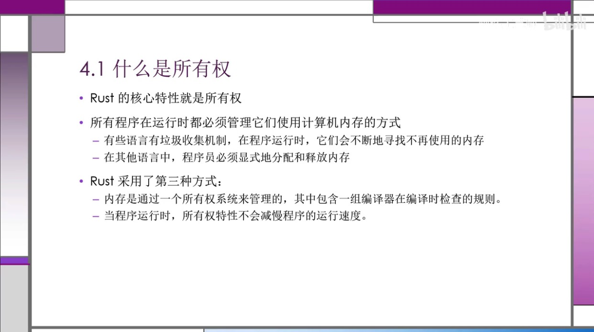
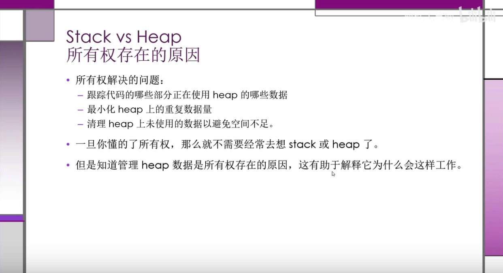
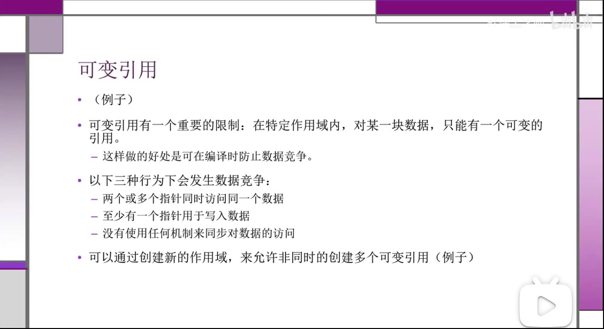

# Rust

使用场景

- 需要运行是的速度
- 内存安全
- 更好的多线程

与其他对比

- 无需 GC
- 安全

擅长领域

- 高性能 web Service
- WebAssembly
- 命令行工具
- 网络编程
- 嵌入式设备
- 系统编程

安装

https://www.rust-lang.org/zh-CN/learn/get-started

```toml
[package]
name = "hello-rust"
version = "0.1.0"
authors = ["zoeminghong <617405347@qq.com>"]
edition = "2018" // rust 版本

# See more keys and their definitions at https://doc.rust-lang.org/cargo/reference/manifest.html

[dependencies]
rand = "^0.3.14"
```

在 Rust 里面，代码的包称作 crate。

在线使用：https://play.rust-lang.org/

Cargo

```
cargo --version，查看版本。

cargo new 【hello_cargo】，新建项目。

cargo new 【hello_cargo】--vcs=git，新建拥有git的项目

cargo run，编译代码+执行结果。

cargo check，检查代码，他比 cargo buid 快，提高编码效率。

cargo build --release，为了发布构建，在编译的时候会进行优化，但编译时间长。

cargo update 会更新 Cargo.toml 文件中的内容。cargo.lock 使别人跟自己使用的依赖版本一致

cargo doc --open 命令来构建所有本地依赖提供的文档，并在浏览器中打开

```

## 语法

:: 静态变量

调用方法用点号

变量使用下划线分隔

expect() 当前面执行的结果报错时，会调用 expect 中的提示语。

&表示对象引用。

Rust 是类型推断语言

```rust
loop{

// 循环
}
```

```
match []
[] =>
```

变量

我们可以定义一个与之前变量同名的新变量。Rustacean 们称之为第一个变量被第二个 **隐藏** 了

```rust
let x=5;//不可变
println!("{}",x);

let mut x=5;// 可变
```

常量

常量用券大写字母，和每个单词之间用下划线分开。

- 必须指定类型
- 可以在任何作用域中声明

```rust
const MAX:u32=1000;
```

隐藏

类型可以跟之前的不一样。

```rust
let x=5;
let x=x+1;
```

第二个 x 替换了第一个 x。

标量类型

- 整数类型：u32（无符号类型），i32（有符号类型）、isize、usize 由计算机的架构决定
- 浮点类型：f32，f64（默认）
- 布尔类型：bool
- 字符类型：char，<u>单引号</u>

数据类型溢出的情况，在 release 时不会校验，运行时会循环覆盖。

复合类型

Tuple

创建之后，不能修改

除了使用模式匹配解构外，也可以使用点号（`.`）后跟值的索引来直接访问它们。

```rust
let tup:(i32,f64,u8)=(23,34.23,1);
let (x,y,z)=tup;
println!("{},{},{}",tup.0,tup.1,tup.2);

fn main() {
    let x: (i32, f64, u8) = (500, 6.4, 1);

    let five_hundred = x.0;

    let six_point_four = x.1;

    let one = x.2;
}
```

数组

数组中的每个元素的类型必须相同

```rust
let a:[i32;5]=[1,2,3,4,5];
let a:[3;5]=[3,3,3,3,3];
a[0]
```

超出数组的范围的时候，编译不会报错，运行会报错。

函数

所有字母都小写，用下划线分开

函数参数的类型必须指明

```rust
fn another_fun(x:i32){
	println!("another function");
}

fn another_fun(x:i32)-> i32{
	println!("another function");
}

let y={
  let x=1;
  x+2 // 不要加分号，否则就是一个空tuple {}
};
```

主函数

```rust
fn main() {
    let x:i32 ={
        3+2
    };

    println!("输出：{}",x)

}
```

if 语句

``` rust
if num>5 {

}else {

}

let num=if true {}else{}
```

循环语句

```rust
loop{
break; // break 可以有返回值
}
```

```rust
while [] {

}
```

```rust
for e in es.iter(){
	printlin!({},e)
}
```

```rust
for num in (1..4).rev(){

}
// rev 反向	
```



Rust 与 Java 一样都有堆和栈内容。



当变量离开作用域之后，就会释放内存空间。

```rust
str.clone()// 克隆
```

任何简单标量的组合类型都是可以是 Copy 的

引用

```rust
fn main() {
    let s:String=String::from("ceshi");
    println!("输出：{}-{}",s,get_test(&s))
}

fn get_test(s:&String)-> usize{
    s.len()
}
```

```rust
fn main() {
    let mut s:String=String::from("ceshi");
    get_test(&mut s);
    println!("输出：{}",s);

}

fn get_test(s:&mut String)-> usize{
    s.push_str("sss");
    s.len()
}
```




切片

```rust
fn main() {
    let s:String=String::from("ceshi");
    let a=&s[1..3];
    let a=&s[1..];
    let a=&s[..3];
    println!("输出：{}",a);
}
```

方法返回值

```
&str
usize
```

Struct

```rust
struct Test{
	name:String,
	age:u32
}

let s:Test={
	name:"zhangsan",
	age:11
}

let user2 = User {
    email: String::from("another@example.com"),
    username: String::from("anotherusername567"),
    ..user1
};

struct Color(i32, i32, i32);
struct Point(i32, i32, i32);

let black = Color(0, 0, 0);
let origin = Point(0, 0, 0);
```

struct 声明方法或者关联函数（类似于 java 静态方法）

Rust **确实** 包含了打印出调试信息的功能，在结构体定义之前加上 `#[derive(Debug)]` 注解。

impl 为 struct 中的方法。

`impl` 块的另一个有用的功能是：允许在 `impl` 块中定义 **不** 以 `self` 作为参数的函数。这被称为 **关联函数**（*associated functions*），因为它们与结构体相关联。它们仍是函数而不是方法，因为它们并不作用于一个结构体的实例。你已经使用过 `String::from` 关联函数了。

```rust
#[derive(Debug)]
struct Ract {
    width: u32,
    length: u32,
}

impl Ract {
  // 使用 &self 来替代 ract: &Ract
    fn area(&self) -> u32 {
        self.length * self.width
    }
    // 关联函数，没有self
    fn square(size: u32) -> Ract {
        Ract {
            width: size,
            length: size,
        }
    }
}

fn main() {
    let rect = Ract {
        width: 20,
        length: 50,
    };
    println!("{}", rect.area());
    println!("{:#?}", rect);
    // 关联函数
    let sq = Ract::square(20);
    println!("{}", sq.area());
}

```

impl 可以是多个相同的代码块。

debug

```rust
#[derive(Debug)]

{:?}
{:#?}
```

枚举

```
#[derive(Debug)]
enum IPAddr{
    Ip4,
    Ip6
}

fn main() {
    println!("{:?}", IPAddr::Ip4);
}
```

Option

`_`作为通配符。

```rust
fn plus_one(x: Option<i32>) -> Option<i32> {
    match x {
        None => None,
        Some(i) => Some(i + 1),
    }
}

let five = Some(5);
let six = plus_one(five);
let none = plus_one(None);

let some_u8_value = 0u8;
match some_u8_value {
    1 => println!("one"),
    3 => println!("three"),
    5 => println!("five"),
    7 => println!("seven"),
    _ => (),
}
```

if let

`if let` 语法让我们以一种不那么冗长的方式结合 `if` 和 `let`，来处理只匹配一个模式的值而忽略其他模式的情况。

```rust
let some_u8_value = Some(0u8);
match some_u8_value {
    Some(3) => println!("three"),
    _ => (),
}

if let Some(3) = some_u8_value {
    println!("three");
}

let mut count = 0;
if let Coin::Quarter(state) = coin {
    println!("State quarter from {:?}!", state);
} else {
    count += 1;
}
```

包

```rust
use crate::front_of_house::hosting;
use std::io::Result as IoResult;
use std::{cmp::Ordering, io};
use std::collections::*;
```

pub use

```rust
mod front_of_house {
    pub mod hosting {
        pub fn add_to_waitlist() {}
    }
}

pub use crate::front_of_house::hosting;

pub fn eat_at_restaurant() {
    hosting::add_to_waitlist();
    hosting::add_to_waitlist();
    hosting::add_to_waitlist();
}
```

通过 `pub use`，现在可以通过新路径 `hosting::add_to_waitlist` 来调用 `add_to_waitlist` 函数。如果没有指定 `pub use`，`eat_at_restaurant` 函数可以在其作用域中调用 `hosting::add_to_waitlist`，但外部代码则不允许使用这个新路径。

vector

vector 只能储存相同类型的值。

```rust
let v: Vec<i32> = Vec::new();
let v = vec![1, 2, 3];
let mut v = Vec::new();

v.push(5);
v.push(6);
v.push(7);
v.push(8);

let third: &i32 = &v[2];
println!("The third element is {}", third);

match v.get(2) {
    Some(third) => println!("The third element is {}", third),
    None => println!("There is no third element."),
}
let v = vec![100, 32, 57];
for i in &v {
    println!("{}", i);
}
let mut v = vec![100, 32, 57];
// 为了修改可变引用所指向的值，在使用 += 运算符之前必须使用解引用运算符（*）获取 i 中的值
for i in &mut v {
    *i += 50;
}
```

单独文件使用

```rust
// 文件名：src/front_of_house.rs
pub mod hosting {
    pub fn add_to_waitlist() {}
}

mode front_of_house;
use front_of_house::hosting;
```

HashMap

```
let mut scores:HashMap<String,String>= HashMap::new();
scores.insert();

//不存在才插入
let e = scores.entry(String::from("Yellow"));
e.or_insert(30);
scores.entry(String::from("Blue")).or_insert(50);
```

Painc

```
set RUST_BACKTRACE=0 && cargo run

!painc("xxxx")

# 不带调试信息
cargo run --release
```

Result 枚举

```
enum Result<T,E>{
OK(T),
Err(E)
}

match f{
	Ok(file)=> file,
	Error(error)=>{
		panic!("Error");
	}
}

match f{
	Ok(file)=> file,
	Error(error)=>match error.kind(){
		ErrorKind::NotFound => match File::create("helo.txt"){
			Ok(file)=> file,
      Error(error)=>{
        panic!("Error");
      }
		}
	}
}

# unwrap 相当于match的快捷方式
File::create("helo.txt").unwrap();
File::create("helo.txt").expect();

// 如果文件存在就继续执行，不存在就直接返回错误信息
？运算符只能用于返回Result的函数
let mut f= File::open("hello.txt")?;

// from 转换错误类型

```

泛型

```
fn largest<T>(list: &[T]) -> T {

}

struct Point<T> {
    x: T,
    y: T,
}

impl<T> Point<T> {
    fn x(&self) -> &T {
        &self.x
    }
}

enum Result<T, E> {
    Ok(T),
    Err(E),
}
```

接口

```
pub trait Summary {
    fn summarize(&self) -> String;
}

pub struct NewsArticle {
    pub headline: String,
    pub location: String,
    pub author: String,
    pub content: String,
}

impl Summary for NewsArticle {
    fn summarize(&self) -> String {
        format!("{}, by {} ({})", self.headline, self.author, self.location)
    }
}	

// 默认实现
pub trait Summary {
    fn summarize(&self) -> String {
        String::from("(Read more...)")
    }
}
// trait 作为参数
pub fn notify(item: impl Summary) {
    println!("Breaking news! {}", item.summarize());
}
// Trait Bound 语法
pub fn notify<T: Summary>(item: T) {
    println!("Breaking news! {}", item.summarize());
}

// 通过 + 指定多个 trait bound
pub fn notify(item: impl Summary + Display) {}
pub fn notify<T: Summary + Display>(item: T) {}

fn some_function<T, U>(t: T, u: U) -> i32
    where T: Display + Clone,
          U: Clone + Debug
{}
```

单元测试

```rust
// 测试模块的 #[cfg(test)] 注解告诉 Rust 只在执行 cargo test 时才编译和运行测试代码，而在运行 cargo build 时不这么做
#[cfg(test)]
mod tests {
    #[test]
    fn it_works() {
        assert_eq!(2 + 2, 4);
    }
}	

#[test]
#[ignore]
fn add_test() {
    assert_eq!(add(),12);
}

 cargo test -- --test-threads=1
```

测试私有方法

```
pub fn add_two(a: i32) -> i32 {
    internal_adder(a, 2)
}

fn internal_adder(a: i32, b: i32) -> i32 {
    a + b
}

#[cfg(test)]
mod tests {
    use super::*;

    #[test]
    fn internal() {
        assert_eq!(4, internal_adder(2, 2));
    }
}
```

集成测试

并不需要将 test s文件夹中的任何代码标注为 `#[cfg(test)]`。 `tests` 文件夹在 Cargo 中是一个特殊的文件夹， Cargo 只会在运行 `cargo test` 时编译这个目录中的文件

```
// 指定某个文件测试
cargo test --test integration_test
```

闭包

```rust
let expensive_closure = |num| {
    println!("calculating slowly...");
    thread::sleep(Duration::from_secs(2));
    num
};

let expensive_closure = |num: u32| -> u32 {
    println!("calculating slowly...");
    thread::sleep(Duration::from_secs(2));
    num
};
```

```rust
fn generate_workout(intensity: u32, random_number: u32) {
    let expensive_closure = |num| {
        println!("calculating slowly...");
        thread::sleep(Duration::from_secs(2));
        num
    };

    if intensity < 25 {
        println!(
            "Today, do {} pushups!",
            expensive_closure(intensity)
        );
        println!(
            "Next, do {} situps!",
            expensive_closure(intensity)
        );
    } else {
        if random_number == 3 {
            println!("Take a break today! Remember to stay hydrated!");
        } else {
            println!(
                "Today, run for {} minutes!",
                expensive_closure(intensity)
            );
        }
    }
}
```

迭代器

```rust
let v1 = vec![1, 2, 3];

let v1_iter = v1.iter();

for val in v1_iter {
    println!("Got: {}", val);
}
```

函数式编程

```rust
let buffer: &mut [i32];
let coefficients: [i64; 12];
let qlp_shift: i16;

for i in 12..buffer.len() {
    let prediction = coefficients.iter()
                                 .zip(&buffer[i - 12..i])
                                 .map(|(&c, &s)| c * s as i64)
                                 .sum::<i64>() >> qlp_shift;
    let delta = buffer[i];
    buffer[i] = prediction as i32 + delta;
}
```

注释

`//!` 的最后一行之后没有任何代码。因为他们以 `//!` 开头而不是 `///`，这是属于包含此注释的项而不是注释之后项的文档。在这个情况中，包含这个注释的项是 *src/lib.rs* 文件，也就是 crate 根文件。这些注释描述了整个 crate。

```
//! # My Crate
//!
//! `my_crate` is a collection of utilities to make performing certain
//! calculations more convenient.
```

多模式匹配

```rust
let x = 1;

match x {
    1 | 2 => println!("one or two"),
    3 => println!("three"),
    _ => println!("anything"),
}
```

```rust
// 区间范围
let x = 5;

match x {
    1..=5 => println!("one through five"),
    _ => println!("something else"),
}
```

