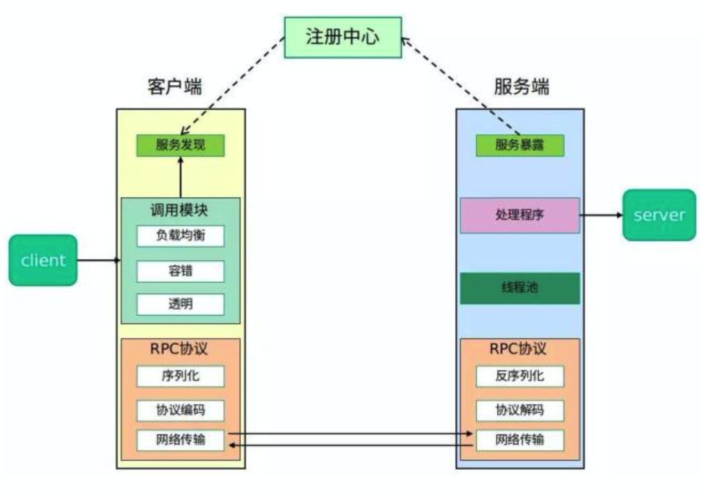
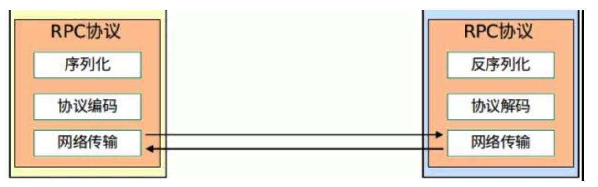
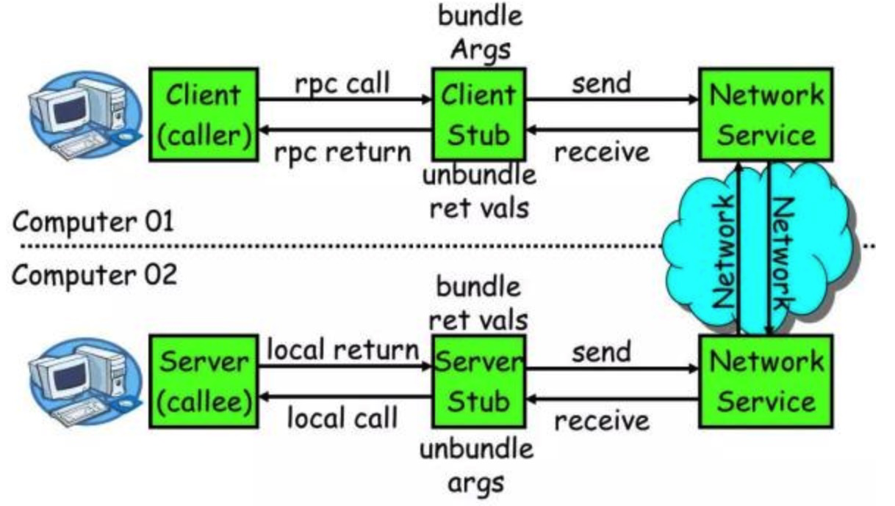

RPC 是一种技术思想而非一种规范或协议，在一个典型 RPC 的使用场景中，包含了服务发现、负载、容错、网络传输、序列化等组件，其中“RPC 协议”就指明了程序如何进行网络传输和序列化。

**RPC 核心功能**

RPC 的核心功能是指实现一个 RPC 最重要的功能模块，就是上图中的”RPC 协议”部分：

一个 RPC 的核心功能主要有 5 个部分组成，分别是：客户端、客户端 Stub、网络传输模块、服务端 Stub、服务端等。

下面分别介绍核心 RPC 框架的重要组成：

- 客户端(Client)：服务调用方。
- 客户端存根(Client Stub)：存放服务端地址信息，将客户端的请求参数数据信息打包成网络消息，再通过网络传输发送给服务端。这个过程中就需要进行序列化
- 服务端存根(Server Stub)：接收客户端发送过来的请求消息并进行解包，然后再调用本地服务进行处理。这个过程中需要反序列化。
- 服务端(Server)：服务的真正提供者。
- Network Service：底层传输，可以是 TCP 或 HTTP。

