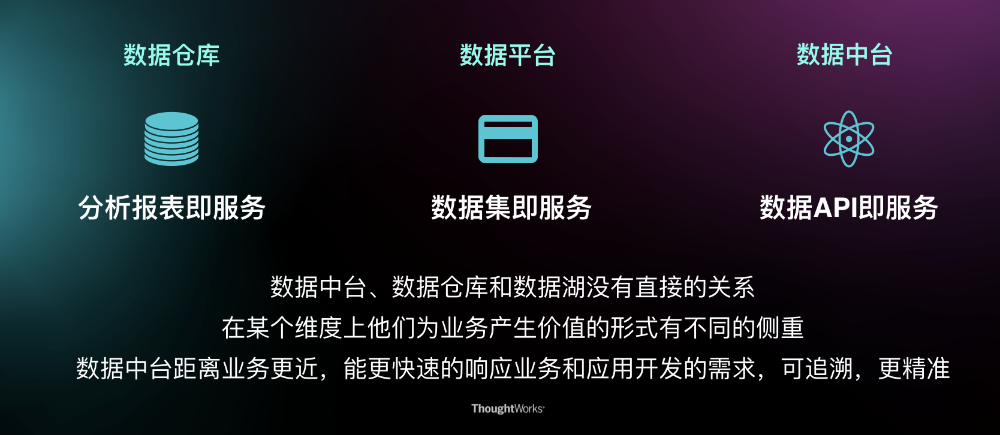

# 数据中台

数据中台是企业级的可复用的能力平台。通过数据技术，对海量数据进行采集、计算、存储、加工，同时统一标准和口径。数据中台把数据统一之后，会形成标准数据，再进行存储，形成大数据资产层，进而为客户提供高效服务。

## 数据中台产生背景

“中台”这一概念最早源于阿里巴巴于2015年提出的“大中台、小前台”战略。比较流行的说法是这一战略来源于一家芬兰的小公司：Supercell，该公司仅300名（当年）员工却开发诸如《部落战争》、《海岛骑兵》、《卡通农场》等知名的游戏，是全球最会赚钱的明星游戏公司之一。分析其成功的“秘诀”在于它将员工分成一个个独立的开发团队，每2个、5个，最多不超过7个员工组成独立的团队，称之为Cell（细胞团队），每个团队可以自己决定做什么样的产品，**快速试错**，及时过滤掉不被市场接受的产品再进行总结反思开始尝试新的产品，而这种开发模式之所以能运作是因为**该公司有一个强大的技术平台**支持各细胞团队进行游戏研发，**各个细胞团队只要专注业务创新，不用关心基础技术支撑**，对于该公司而言每个细胞团队就是“小前台”，技术平台就是其“大中台”。

### 阿里数据中台

阿里巴巴的中台主要包含业务中台、数据中台两大中台，将淘宝、天猫、聚划算、盒马、支付宝等共性的能力沉淀到业务中台，由后者提供统一的业务能力支撑，数据中台实现各业务场景的需求采集、存储、分析与服务，**以OneData体系为指导实现了数据体系化建设**，除了这两大中台外，阿里还有移动中台、AI中台、算法中台等多种类型的技术中台。

为保障中台的建设，组织架构也做了相应的变革，成立了中台事业群负责统一的中台管控，下辖多个组织部门负责不同中台的建设。

阿里对中台建设路径总结提炼如下：

1.   决心变革：企业内达成战略共识，**一把手牵头**，做总体规划、分步实施，找准切入点，解决具体业务问题

2. 成功试点：通过分析调研，明确业务目标和范围，完成技术平台引入、中台建设方法论宣导，进行试点，梳理标杆，积累经验

3. 持续融合：总结出适合企业自身的理念和规范，优化组织、提升中台效率

## 什么是数据中台

中台服务于前台，为前台提供核心的技术能力、业务能力的支撑，使前台团队可以聚焦各自产品特有的、差异化的能力研发，实现“短平快”的业务需求响应。

中台通过**降低资源消耗、提升服务稳定性、支持个性化、提高开发效率为目标，实现快速响应用户，服务用户**。

中台具有**聚合、复用、协调**的能力：

- 复用：抽取各业务的共性需求进行统一的设计、研发与管控。这是各大中台建设最多提及的中台能力。

- 聚合：将各个应用系统/组织单位的能力做场景化的聚合，提供给前台。这种能力对互联网企业而言场景不多，但对企业中台建设上却非常重要，比如各地政府搞的“最多跑一次”就是把各个部门的各个后台系统做聚合的产物， 传统企业在《传统企业资源业务中台框架设计方案》也有类似的提法，叫做“业务一条线、传统企业一张图、数据一个源、物理一张网”这些强调都是中台的能力聚合。

- 协调：对应有后台的企业，用于协调前后台的矛盾。这种矛盾一方面是大家熟知的做变速齿轮，解决前台的快与后台的稳，另一方面是为去后台化，前些年大型企业大搞ERP，采购了SAP等成熟的产品，但这些产品价格高、维护成本大、业务灵活性差，所以有些企业想的是借中台化逐步去SAP。去SAP可能会与去IOE一样成为接下来的主流共识，与去IOE的初衷不同的是去SAP不是因为价格、安全等因素，而是以SAP为代表的大而全的ERP系统在云化、场景化、智能化、物联网化的当下，面对复杂的技术与业务场景，以用户为中心的经营理念下显得过于呆板，不适应，不灵活。

与中台、前台呼应，某些企业的某些场景还会有“后台”，关于这三者的界定可参考知名咨询公司Gartner的“Gartner's PACE Layered Application Strategy”（“Gartner的分层应用程序策略”），它提出了将应用程序分成三层，如下图所示：

- Systems Of Record （SoR）：由记录建立的应用程序或遗留的支持核心事务处理和管理组织**关键主数据的系统**组成的系统。这一层的系统变化率很低、生命周期长，对变化的响应慢

- Systems of Differentiation（SoD）：差异化系统，支持特定流程或行业特定功能的应用程序。这一层的系统生命周期通长为1到3年，**在保持功能稳定的前提下又可响应一定的变化**

- Systems of Innovation（SoI）：创新系统，构建于特定业务上的应用程序，以满足新的业务需求的变化。这一层的系统生命周期短，面向复杂多变的业务

这种分层策略正好与“后台（SoR）、中台（SoD）、前台（SoI）”形成一一映射。Thoughtworks技术雷达于2015年对“Gartner's PACE Layered Application Strategy”提出过质疑（由ASSESS改为HOLD），指出这一策略过分关注分层而缺乏不同层间系统的交互，而中台强调服务于前台，做前台与后台的“变速齿轮”，因此**中台建设会更关注于不同层系统的交互**，这点与前者有本质的区别。

## 数据中台建设的必要性

### 现状与问题

#### 痛点一：企业前方市场与企业内部支撑的冲突

用户永远都是在出于变化之中，或者在变化的路上。企业永远不要企图用一招，吃遍天。为了顺应时代和用户的变化，企业需要随之快速的做出响应，以满足用户的要求，提升用户满意度，已成为企业生存之根本。观之企业内部希望趋于稳定有序，缺乏灵活性和快速反应的能力。到达一定阶段，两者必然会遇到冲突。

#### 痛点二：前台与后台的冲突

企业前方市场和企业内部支撑的冲突，必定带来在系统层级上的前台和后台的冲突。

- 前台：企业前方市场的管理平台，是企业的终端用户直接使用或交互的系统。比如像微信、QQ、淘宝这样的APP；

后台：企业内部支撑的管理平台，是企业管理核心能力的系统。比如像企业ERP管理平台、企业财务管理平台等系统。

前台是对接用户的，所以系统**需要快速响应前端用户的需求，快速创新、快速迭代**。简而言之：**快速建设、错了就推翻重来、不能耗费太大成本**。

后台是企业对内的，为了支撑前台越来越多的业务，后台不断地建设，系统随之庞大起来。后台系统在绝大多数企业中更多的是**提供业务简单配置能力**，在架构设计之初，并没有把拓展性和性能作为重点考虑，后台系统更加侧重于**扎实稳定**，建成之后往往不能随意改动。简而言之，是需要耗费大力成本建设的基础能力、不能轻易推翻、改动成本极大。前台系统和后台系统的特点决定了，两者的冲突不可避免。

#### 痛点三：大企业的通病（各占山头、重复建设）

企业发展到一定程度，组织架构和层级必然不断膨胀扩张。各大事业部下各大部门，就像一个小型组织一样，各占山头，势必会出现屁股决定脑袋的现象：**这事就算对公司有好处，但对我们部门KPI没好处啊，那我不做。**

大企业内部各处都是墙——部门墙、业务墙、数据墙。更不用说那些一味的内部赛马的绩效考核机制，势必更加加剧部门间的相互封闭。

而一些原本可以快速提供的用户服务，却需要多重对接，无法快速拿出产品方案，耗费很大的成本和极长的时间。一个原本可以共用的服务，被不同部门重复建设。

### 小结

为了适应市场的快速变化，快速做出反应，有助于抢占市场，作为离用户最近的前台，必须及时做出响应，帮助前台尽可能的快速做出响应就是中台要解决的问题，因而中台更多的是起到前台和后台之间的连接作用。

## 平台服务与中台

在解决上文提到的痛点三问题时，自然而然的会想到平台服务，因为平台服务就是抽取共性的服务，那么是不是平台服务就等价于中台呢？我的理解中台的范围相比平台服务更大一些，尽管中台也重视服务的复用，但更侧重服务于业务，观之平台服务还停留在技术层面，提炼技术共性。举个例子用户中心的例子，作为平台服务的用户中心，可以提供企业登录与注册之类的能力，没错，这样的能力是所有的业务都需要的，如果现在业务要求增加邀请码相关能力，站在平台服务的视角，用户中心更多的可能是要求业务方自行研发，由于这具有业务属性，不够纯粹。但在中台的视角，则会先考察是否存在两个或两个以上的业务方都存在这样的需求呢？如果答案是肯定的，中台就会考虑去做这件事。

### 数据中台和数据仓库、数据平台的关键区别

## 搭建中台有什么价值

由于中台集成了众多的可复用的能力，在面临新项目开发或者项目迭代过程中，根据中台对接文档，短时间内上线业务内容，帮助企业快速抢占市场，实现投入产出比最大化。

同时，中台也提供通过简单的配置方式，实现业务的个性化定制能力，以降低业务开发成本，可以花更多的精力专注于自身业务。

总体可以概况为如下三个方面：

1. 效率：为什么应用开发增加一个报表，就要十几天时间？为什么不能实时获得用户推荐清单？当业务人员对数据产生一点疑问的时候，需要花费很长的时间，结果发现是数据源的数据变了，最终影响上线时间。
2. 协作问题：当业务应用开发的时候，虽然和别的项目需求大致差不多，但因为是别的项目组维护的，所以数据还是要自己再开发一遍。
3. 能力问题：数据的处理和维护是一个相对独立的技术，需要相当专业的人来完成，但是很多时候，我们有一大把的应用开发人员，而数据开发人员很少。

### 数据中台意义

- 组织优化：聚合大数据相关经验的人员，集中进行数据相关的功能
- 数据价值化：业务全面数据化，基于数据构建数据应用，用数据支撑业务发展
- 降低成本：避免重复搭建大数据环境，导致资源浪费和利用率低
- 提升效率：数据集中，降低沟通成本，规范统一，开发效率提升

## 建设中台最佳时机

中台存在的价值就是帮助企业快速响应用户，以最快的速度占领市场。未被效率问题困扰的企业，比如：微小企业，中台不需要作为企业建设目标，反而，建设中台劳费心力，得不偿失。

当响应业务过程中，横跨多个部门或者项目组，扯皮时间大于本职工作时，投入产出比不再客观时，企业就要开始考虑中台战略了。但需要注意，并不是所有的效率低下，都应该上马中台，毕竟有些效率低下是可以通过流程控制去改善的。还有中台也不是万能的银弹，启动中台战略前，需要有一个公司级的业务评估、需要最高级别领导授权、大面积的宣讲，以提高中台落地的可能性。

同时，并不是所有的内容都应该放到中台去实现。只有存在两个或两个以上的业务方存在相同的需求时，才应该考虑将其放到中台中对外提供服务。但中台的思想应该在功能开发之初就应该考虑进去，方便之后，移植到中台服务中去。

*现在有一个需求，业务方自行开发可能一个星期就能完成了，交给中台团队负责由于排期冲突，可能要两个星期才能实现，这个时候怎么办呢？*

中台能力扎根于业务，业务源于各个业务线，有些显而易见的共性能力，中台可能早早的就实现了，但我相信绝大多数的业务能力需要伴随业务而产生。如果出现上述问题时，我觉得可以先由业务方自行实现，当该业务能力共性越发明显之时，通过中台进行实现和维护，但这种方式要求业务线其要基于中台思想开发实现，这样移植效率和稳定性是最好的。

> TODO 需要构建中台的表现是什么？

## 建设过程中的需要解决的问题

- **避免为了建中台而建**：从18年以来，以阿里为首的企业大肆宣传“中台战略”，盲目跟风，虎头蛇尾，最终草草收场的企业太多了，所以在建中台前一定要想清楚，中台能为其带来什么，而且所带来的是否是企业未来首要解决的，如果答案是否定的，就放弃它吧
- **业务数据混乱** 
  - 数据杂乱无章：没有统一的文档
  - 不成系统：各个业务自知道自己负责的那一块内容，若出现离职等变更，信息准确性又会大打折扣
  - 数据断层：例如现在业务需要知道浙江省每日口罩生产总量这个指标数据，但是业务没有一张表记录每个口罩厂的生产数据，从而导致这个指标数据结果无法渠道。
- **中台概念的落地**：虽然中台很多企业都在做，但真正做好的屈指可数，尽管阿里云也提供了很多的中台产品，但更多的还是停留在离线层面，而且对平台依赖度高，定制化可能性低的问题存在。落地环节，企业要结合自身情况，因地制宜进行建设，具体思想之后分享。

## 数据中台的特性

- 通过 API 的方式提供数据服务，而不是直接把数据库给前台、让前台开发自行使用数据
- 从业务的角度对数据进行规划

