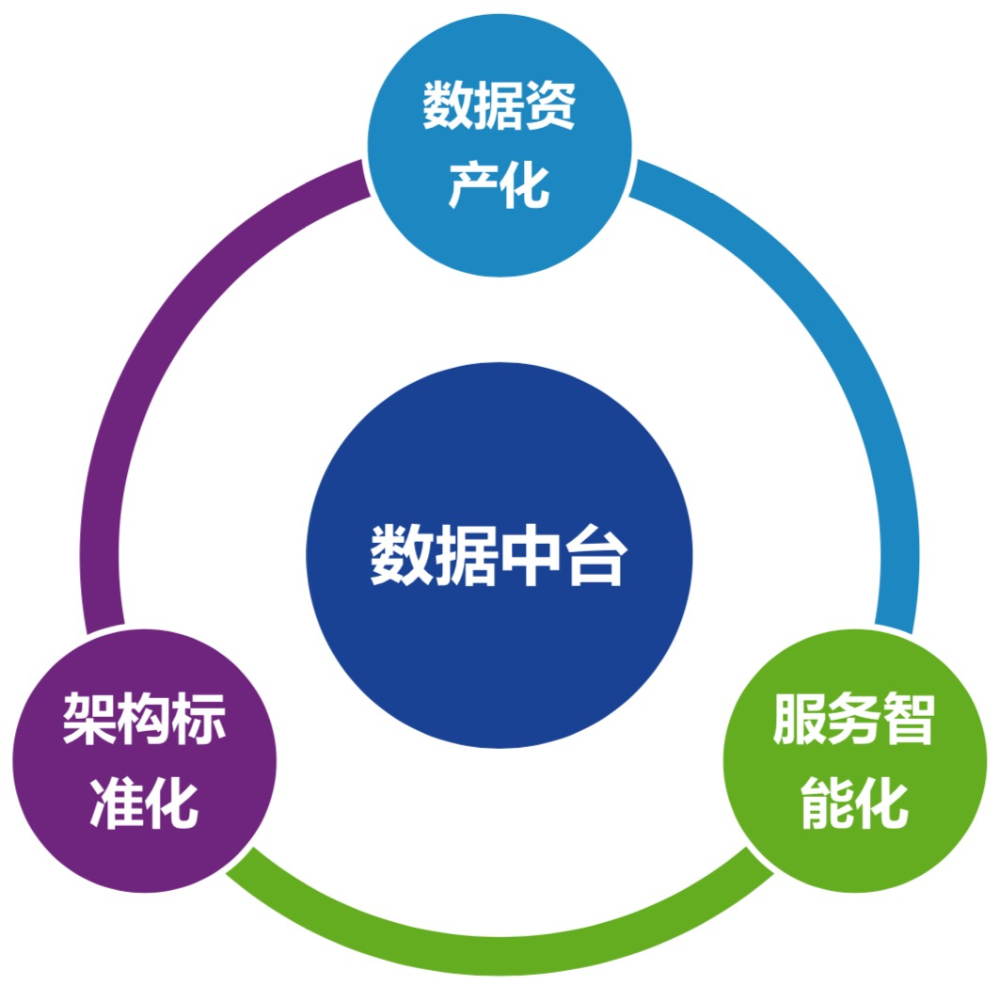
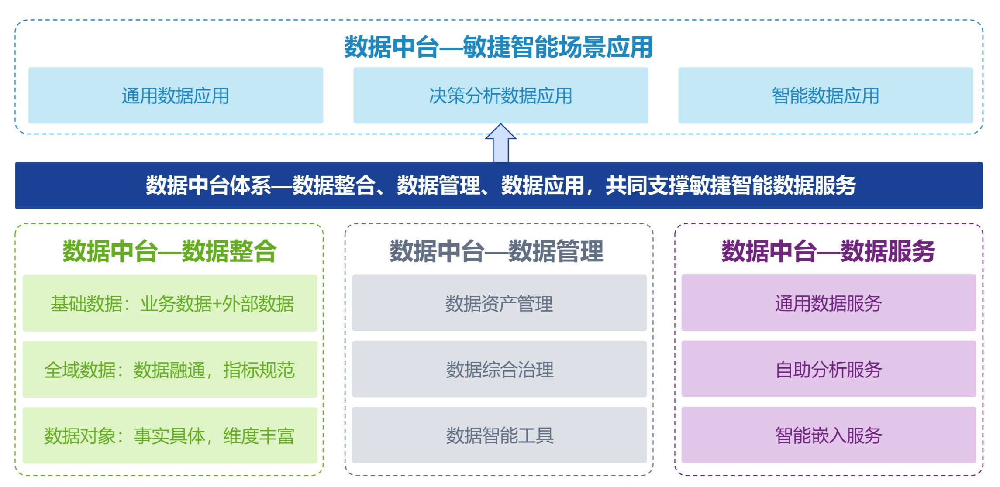
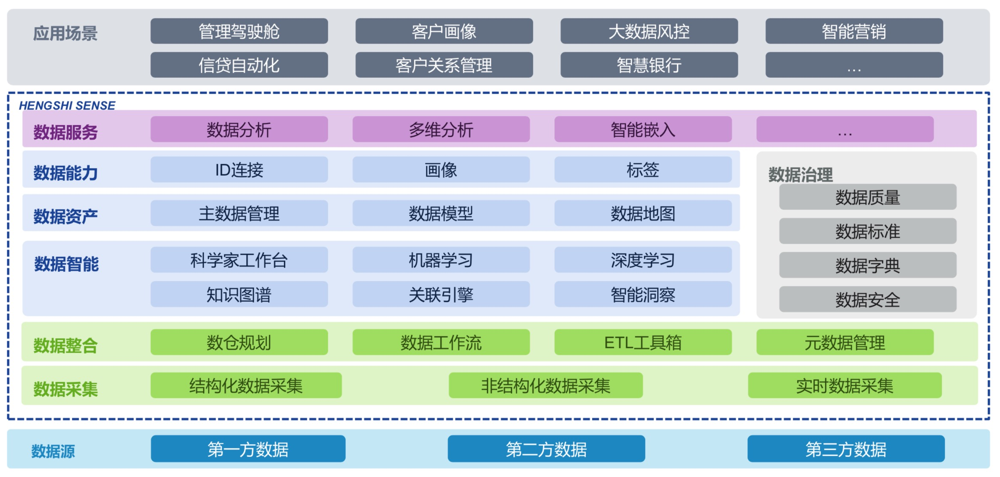

# 数据中台技术落地

有一定抽象的数据仓库中间层模型能缓解业务变化对数据模型的冲击；数据规范定义能有效避免数据的重复设计、存储降低省直消除业务人员的困惑；合理的数据生命周期管理能避免数据计算特别是数据存储的浪费。

数据公共层：ODS数据层、DWS+DWD数据中间层（统一性和可复用性）。

流程

现状梳理

确定问题

寻找解决方案

确立项目计划

明确关键产出内容

## 核心方法论

## 数据架构

## 数据资产

一切能为产品和公司带来经济效益的数据，就叫数据资产。

数据中台的建设过程中，就会原本不被重视、不被加以利用的数据进行组合或者在生产，实现数据资产化。

## 底线

任何操作不能影响业务方

不能出现数据丢失

尽可能不要出现服务器奔溃

## 标签

临时性标签：商品A突然销售额大涨

[指标管理体系设计](https://zhuanlan.zhihu.com/p/59272558)