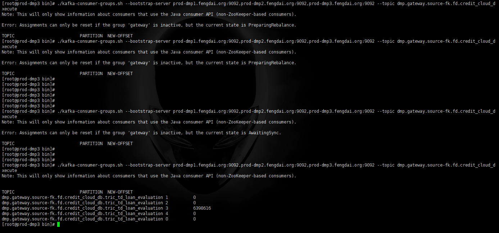

## QA

### Kafka Offset 无法进行重置

**现象**



**原因**

kafka 需要进行多节点数据的同步

**解决方案**

停止相应的 consumer 组，同时等待一段时间之后，再次执行该命令

### 是什么保证了 Kafka 的高吞吐量

Kafka 的 Partition 提高数据的并行能力。每一条消息被追加到相应的分区中，是顺序写磁盘，因此效率非常高。那么什么是顺序写磁盘呢？ 硬盘最耗时的是寻址操作，存在随机 I/O 和顺序 I/O 两种，明显顺序 I/O 是比较高效的一种，但其缺点就是不能删除，所以 Kafka 的消息是不能主动删除的。

### 文件打开数太多

```
[2017-10-03 09:21:35,446] ERROR Error while accepting connection (kafka.network.Acceptor)
java.io.IOException: Too many open files
at sun.nio.ch.ServerSocketChannelImpl.accept0(Native Method)
at sun.nio.ch.ServerSocketChannelImpl.accept(ServerSocketChannelImpl.java:422)
at sun.nio.ch.ServerSocketChannelImpl.accept(ServerSocketChannelImpl.java:250)
at kafka.network.Acceptor.accept(SocketServer.scala:323)
at kafka.network.Acceptor.run(SocketServer.scala:268)
at java.lang.Thread.run(Thread.java:745)
[2017-10-03 09:21:35,446] ERROR Error while accepting connection (kafka.network.Acceptor)
java.io.IOException: Too many open files
at sun.nio.ch.ServerSocketChannelImpl.accept0(Native Method)
at sun.nio.ch.ServerSocketChannelImpl.accept(ServerSocketChannelImpl.java:422)
at sun.nio.ch.ServerSocketChannelImpl.accept(ServerSocketChannelImpl.java:250)
at kafka.network.Acceptor.accept(SocketServer.scala:323)
at kafka.network.Acceptor.run(SocketServer.scala:268)
at java.lang.Thread.run(Thread.java:745)

```

**解决方案**
To resolve this issue, set the following and restart the Kafka broker
Edit the /etc/security/limits.d/kafka.conf file.
Increase the value for kafka - nofile to twice the current setting in the file. For example, if the current value is the following:

```
kafka - nofile 128000
Increase it to the following:
kafka - nofile 256000
```

The kafka.conf file specifies the limits to be used on start of the Kafka service.
Setting the value in the limits.conf file does not affect the limits used by the Kafka service on startup.
