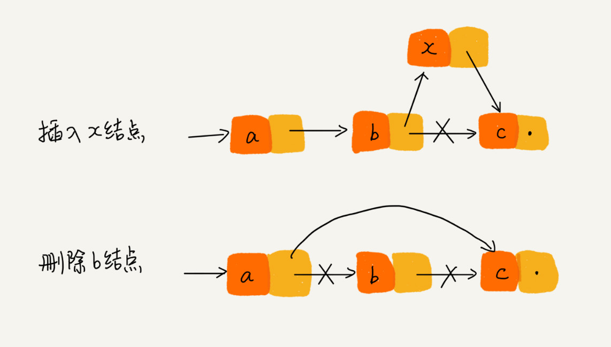

## 复杂度分析

我们需要一个不用具体的测试数据来测试，就可以粗略地估计算法的执行效率的方法。

### 大 O 复杂度表示法

```java
 int cal(int n) {
   int sum = 0;
   int i = 1;
   for (; i <= n; ++i) {
     sum = sum + i;
   }
   return sum;
 }
```

第 2、3 行代码分别需要 1 个 unit_time 的执行时间，第 4、5 行都运行了 n 遍，所以需要 2n*unit_time 的执行时间，所以这段代码总的执行时间就是 (2n+2)*unit_time。

```java
 int cal(int n) {
   int sum = 0;
   int i = 1;
   int j = 1;
   for (; i <= n; ++i) {
     j = 1;
     for (; j <= n; ++j) {
       sum = sum +  i * j;
     }
   }
 }
```

第 2、3、4 行代码，每行都需要 1 个 unit_time 的执行时间，第 5、6 行代码循环执行了 n 遍，需要 2n * unit_time 的执行时间，第 7、8 行代码循环执行了 n2遍，所以需要 2n2* unit_time 的执行时间。所以，整段代码总的执行时间 T(n) = (2n2+2n+3)*unit_time。

第一个例子中的 T(n) = O(2n+2)，第二个例子中的 T(n) = O(2n2+2n+3)。这就是大 O 时间复杂度表示法。大 O 时间复杂度实际上并不具体表示代码真正的执行时间，而是表示代码执行时间随数据规模增长的变化趋势，所以，也叫作渐进时间复杂度（asymptotic time complexity），简称时间复杂度。

### 时间复杂度

1. **只关注循环执行次数最多的一段代码：**我们在分析一个算法、一段代码的时间复杂度的时候，也只关注循环执行次数最多的那一段代码就可以了。
2. **加法法则：总复杂度等于量级最大的那段代码的复杂度：** 总的时间复杂度就等于量级最大的那段代码的时间复杂度。
3. **乘法法则：嵌套代码的复杂度等于嵌套内外代码复杂度的乘积：** 可以把乘法法则看成是嵌套循环。

```java
// 1
 int cal(int n) {
   int sum = 0;
   int i = 1;
   for (; i <= n; ++i) {
     sum = sum + i;
   }
   return sum;
 }
```

```java
// 2
int cal(int n) {
   int sum_1 = 0;
   int p = 1;
   for (; p < 100; ++p) {
     sum_1 = sum_1 + p;
   }

   int sum_2 = 0;
   int q = 1;
   for (; q < n; ++q) {
     sum_2 = sum_2 + q;
   }
 
   int sum_3 = 0;
   int i = 1;
   int j = 1;
   for (; i <= n; ++i) {
     j = 1; 
     for (; j <= n; ++j) {
       sum_3 = sum_3 +  i * j;
     }
   }
 
   return sum_1 + sum_2 + sum_3;
 }
```

```java
// 3
int cal(int n) {
   int ret = 0; 
   int i = 1;
   for (; i < n; ++i) {
     ret = ret + f(i);
   } 
 } 
 
 int f(int n) {
  int sum = 0;
  int i = 1;
  for (; i < n; ++i) {
    sum = sum + i;
  } 
  return sum;
 }
```

### 几种常见时间复杂度实例分析


对于刚罗列的复杂度量级，我们可以粗略地分为两类，**多项式量级和非多项式量级**。其中，非多项式量级只有两个：O(2^n) 和 O(n!)。

我们把时间复杂度为非多项式量级的算法问题叫作 NP（Non-Deterministic Polynomial，非确定多项式）问题。

当数据规模 n 越来越大时，非多项式量级算法的执行时间会急剧增加，求解问题的执行时间会无限增长。所以，非多项式时间复杂度的算法其实是非常低效的算法。因此，关于 NP 时间复杂度我就不展开讲了。我们主要来看几种常见的多项式时间复杂度。

### 空间复杂度分析

空间复杂度全称就是渐进空间复杂度（asymptotic space complexity），表示**算法的存储空间与数据规模之间的增长关系**。

```java
void print(int n) {
  int i = 0;
  int[] a = new int[n];
  for (i; i <n; ++i) {
    a[i] = i * i;
  }

  for (i = n-1; i >= 0; --i) {
    print out a[i]
  }
}
```

我们常见的空间复杂度就是 O(1)、O(n)、O(n^2)，像 O(logn)、O(nlogn) 这样的对数阶复杂度平时都用不到。


### 四个复杂度分析

- 最好情况时间复杂度（best case time complexity）: 最好情况时间复杂度就是，在最理想的情况下，执行这段代码的时间复杂度
- 最坏情况时间复杂度（worst case time complexity）: 最坏情况时间复杂度就是，在最糟糕的情况下，执行这段代码的时间复杂度
- 平均情况时间复杂度（average case time complexity）
- 均摊时间复杂度（amortized time complexity）

```java

// n表示数组array的长度
int find(int[] array, int n, int x) {
  int i = 0;
  int pos = -1;
  for (; i < n; ++i) {
    if (array[i] == x) {
       pos = i;
       break;
    }
  }
  return pos;
}
```

我们知道，要查找的变量 x，要么在数组里，要么就不在数组里。这两种情况对应的概率统计起来很麻烦，为了方便你理解，我们假设在数组中与不在数组中的概率都为 1/2。另外，要查找的数据出现在 0～n-1 这 n 个位置的概率也是一样的，为 1/n。所以，根据概率乘法法则，要查找的数据出现在 0～n-1 中任意位置的概率就是 1/(2n)。


得到的平均时间复杂度就是 O(n)。

这个值就是概率论中的加权平均值，也叫作期望值，所以平均时间复杂度的全称应该叫加权平均时间复杂度或者期望时间复杂度。

```java

 // array表示一个长度为n的数组
 // 代码中的array.length就等于n
 int[] array = new int[n];
 int count = 0;
 
 void insert(int val) {
    if (count == array.length) {
       int sum = 0;
       for (int i = 0; i < array.length; ++i) {
          sum = sum + array[i];
       }
       array[0] = sum;
       count = 1;
    }

    array[count] = val;
    ++count;
 }
```

那平均时间复杂度是多少呢？答案是 O(1)。我们还是可以通过前面讲的概率论的方法来分析。

假设数组的长度是 n，根据数据插入的位置的不同，我们可以分为 n 种情况，每种情况的时间复杂度是 O(1)。除此之外，还有一种“额外”的情况，就是在数组没有空闲空间时插入一个数据，这个时候的时间复杂度是 O(n)。而且，这 n+1 种情况发生的概率一样，都是 1/(n+1)。所以，根据加权平均的计算方法，我们求得的平均时间复杂度就是：


每一次 O(n) 的插入操作，都会跟着 n-1 次 O(1) 的插入操作，所以**把耗时多的那次操作均摊到接下来的 n-1 次耗时少的操作上**，均摊下来，这一组连续的操作的均摊时间复杂度就是 O(1)。这就是均摊分析的大致思路。

## 数组

数组（Array）是一种线性表数据结构。它用一组连续的内存空间，来存储一组具有相同类型的数据。除了数组，链表、队列、栈等也是线性表结构。


而与它相对立的概念是非线性表，比如二叉树、堆、图等。之所以叫非线性，是因为，在非线性表中，数据之间并不是简单的前后关系。


### 数组的特点

- 数组随机访问是 O(1)
- 数组删除和插入是 O(n)
- 数组对象申请的是连续的内存空间

### 数组与 ArrayList 比较

我个人觉得，ArrayList 最大的优势就是可以将很多数组操作的细节封装起来。比如前面提到的数组插入、删除数据时需要搬移其他数据等。另外，它还有一个优势，就是支持动态扩容。

## 链表

今天我重点给你介绍三种最常见的链表结构，它们分别是：单链表、双向链表和循环链表。

### 单链表


而尾结点特殊的地方是：指针不是指向下一个结点，而是指向一个空地址 NULL，表示这是链表上最后一个结点。

在链表中插入或者删除一个数据，我们并不需要为了保持内存的连续性而搬移结点，因为链表的存储空间本身就不是连续的。所以，在链表中插入和删除一个数据是非常快速的。



### 循环链表

循环链表是一种特殊的单链表。


### 双向链表


如果存储同样多的数据，双向链表要比单链表占用更多的内存空间。虽然两个指针比较浪费存储空间，但可以支持双向遍历，这样也带来了双向链表操作的灵活性。那相比单链表，双向链表适合解决哪种问题呢？

从结构上来看，双向链表可以支持 O(1) 时间复杂度的情况下找到前驱结点，正是这样的特点，也使双向链表在某些情况下的插入、删除等操作都要比单链表简单、高效。

在**删除给定指针指向的结点** 场景中，单链表删除操作需要 O(n) 的时间复杂度，而双向链表只需要在 O(1) 的时间复杂度内就搞定了！

### 链表特点

它通过“指针”将一组零散的内存块串联起来使用

## 栈：如何实现浏览器的前进和后退功能？

### 什么是栈

后进者先出，先进者后出，这就是典型的“栈”结构。实际上，栈既可以用数组来实现，也可以用链表来实现。用数组实现的栈，我们叫作顺序栈，用链表实现的栈，我们叫作链式栈。

### 什么时候使用

当某个数据集合只涉及在一端插入和删除数据，并且满足后进先出、先进后出的特性，我们就应该首选“栈”这种数据结构。

## 队列

我们知道，栈只支持两个基本操作：入栈 push()和出栈 pop()。队列跟栈非常相似，支持的操作也很有限，最基本的操作也是两个：入队 enqueue()，放一个数据到队列尾部；出队 dequeue()，从队列头部取一个元素。

它具**有先进先出**的特性，支持在队尾插入元素，在队头删除元素。

用数组实现的队列叫作顺序队列，用链表实现的队列叫作链式队列。

顺序队列：

链表队列

循环队列：当队满时，(tail+1)%n=head。head所在位置与 tail 相重了，就表示整个环表就满了。

基于链表的实现方式，可以实现一个支持无限排队的无界队列（unbounded queue），但是可能会导致过多的请求排队等待，请求处理的响应时间过长。所以，针对响应时间比较敏感的系统，基于链表实现的无限排队的线程池是不合适的。而基于数组实现的有界队列（bounded queue），队列的大小有限，所以线程池中排队的请求超过队列大小时，接下来的请求就会被拒绝，这种方式对响应时间敏感的系统来说，就相对更加合理。不过，设置一个合理的队列大小，也是非常有讲究的。队列太大导致等待的请求太多，队列太小会导致无法充分利用系统资源、发挥最大性能。

## 递归

这就是一个非常标准的递归求解问题的分解过程，去的过程叫“递”，回来的过程叫“归”。

**递归需要满足的三个条件**

1. 一个问题的解可以分解为几个子问题的解

2. 这个问题与分解之后的子问题，除了数据规模不同，求解思路完全一样
3. 存在递归终止条件

写递归代码最关键的是**写出递推公式，找到终止条件**。

## 排序

最经典的、最常用的：冒泡排序、插入排序、选择排序、归并排序、快速排序、计数排序、基数排序、桶排序


如何分析一个“排序算法”？

1. 最好情况、最坏情况、平均情况时间复杂度

2. 时间复杂度的系数、常数 、低阶

3. 比较次数和交换（或移动）次数

排序算法的内存消耗

算法的内存消耗可以通过空间复杂度来衡量，排序算法也不例外。不过，针对排序算法的空间复杂度，我们还引入了一个新的概念，原地排序（Sorted in place）。**原地排序算法，就是特指空间复杂度是 O(1) 的排序算法。**

排序算法的稳定性

仅仅用执行效率和内存消耗来衡量排序算法的好坏是不够的。针对排序算法，我们还有一个重要的度量指标，稳定性。这个概念是说，如果待排序的序列中存在值相等的元素，经过排序之后，相等元素之间原有的先后顺序不变。我通过一个例子来解释一下。比如我们有一组数据 2，9，3，4，8，3，按照大小排序之后就是 2，3，3，4，8，9。这组数据里有两个 3。经过某种排序算法排序之后，**如果两个 3 的前后顺序没有改变，那我们就把这种排序算法叫作稳定的排序算法**；**如果前后顺序发生变化，那对应的排序算法就叫作不稳定的排序算法。**

### 冒泡排序（Bubble Sort）

冒泡排序只会操作相邻的两个数据。每次冒泡操作都会对相邻的两个元素进行比较，看是否满足大小关系要求。如果不满足就让它俩互换。一次冒泡会让至少一个元素移动到它应该在的位置，重复 n 次，就完成了 n 个数据的排序工作。


### 插入排序（Insertion Sort）

首先，我们将数组中的数据分为两个区间，已排序区间和未排序区间。初始已排序区间只有一个元素，就是数组的第一个元素。插入算法的核心思想是取未排序区间中的元素，在已排序区间中找到合适的插入位置将其插入，并保证已排序区间数据一直有序。重复这个过程，直到未排序区间中元素为空，算法结束。


```java

// 插入排序，a表示数组，n表示数组大小
public void insertionSort(int[] a, int n) {
  if (n <= 1) return;

  for (int i = 1; i < n; ++i) {
    int value = a[i];
    int j = i - 1;
    // 查找插入的位置
    for (; j >= 0; --j) {
      if (a[j] > value) {
        a[j+1] = a[j];  // 数据移动
      } else {
        break;
      }
    }
    a[j+1] = value; // 插入数据
  }
}
```

### 选择排序（Selection Sort）

每次会从未排序区间中找到最小的元素，将其放到已排序区间的末尾。


### 归并排序


如图所示，我们申请一个临时数组 tmp，大小与 A[p…r] 相同。我们用两个游标 i 和 j，分别指向 A[p…q] 和 A[q+1…r] 的第一个元素。比较这两个元素 A[i] 和 A[j]，如果 A[i]<=A[j]，我们就把 A[i] 放入到临时数组 tmp，并且 i 后移一位，否则将 A[j] 放入到数组 tmp，j 后移一位。


时间复杂度为：O(nlogn)，可以成为稳定算法（保证了值相同的元素，在合并前后的先后顺序不变。），那就是归并排序不是**原地排序算法**。

在任意时刻，CPU 只会有一个函数在执行，也就只会有一个临时的内存空间在使用。临时内存空间最大也不会超过 n 个数据的大小，所以**空间复杂度是 O(n)**。

### 快速排序

快排的思想是这样的：如果要排序数组中下标从 p 到 r 之间的一组数据，我们选择 p 到 r 之间的任意一个数据作为 pivot（分区点）。

我们遍历 p 到 r 之间的数据，将小于 pivot 的放到左边，将大于 pivot 的放到右边，将 pivot 放到中间。经过这一步骤之后，数组 p 到 r 之间的数据就被分成了三个部分，前面 p 到 q-1 之间都是小于 pivot 的，中间是 pivot，后面的 q+1 到 r 之间是大于 pivot 的。


原地排序方式


快排是一种原地、不稳定的排序算法，快排的时间复杂度也是 O(nlogn)。

归并排序的处理过程是由下到上的，先处理子问题，然后再合并。而快排正好相反，它的处理过程是由上到下的，先分区，然后再处理子问题。归并排序虽然是稳定的、时间复杂度为 O(nlogn) 的排序算法，但是它是非原地排序算法。我们前面讲过，归并之所以是非原地排序算法，主要原因是合并函数无法在原地执行。快速排序通过设计巧妙的原地分区函数，可以实现原地排序，解决了归并排序占用太多内存的问题。

#### 如何选择一个比较合理的分区点？

三数取中法

从区间的首、尾、中间，分别取出一个数，然后对比大小，取这 3 个数的中间值作为分区点

随机数

随机法就是每次从要排序的区间中，随机选择一个元素作为分区点。


### 桶排序

这个时候桶排序的时间复杂度接近 O(n)。


先决条件

首先，要排序的数据需要很容易就能划分成 m 个桶，并且，桶与桶之间有着天然的大小顺序。这样每个桶内的数据都排序完之后，桶与桶之间的数据不需要再进行排序。

其次，数据在各个桶之间的分布是比较均匀的。如果数据经过桶的划分之后，有些桶里的数据非常多，有些非常少，很不平均，那桶内数据排序的时间复杂度就不是常量级了。在极端情况下，如果数据都被划分到一个桶里，那就退化为 O(nlogn) 的排序算法了。

桶排序比较适合用在**外部排序**中。所谓的外部排序就是数据存储在外部磁盘中，数据量比较大，内存有限，无法将数据全部加载到内存中。

适合数据量比较小的场景。

### 计数排序（Counting sort）

计数排序其实是桶排序的一种特殊情况。当要排序的 n 个数据，所处的范围并不大的时候，比如最大值是 k，我们就可以把数据划分成 k 个桶。每个桶内的数据值都是相同的，省掉了桶内排序的时间。

适合数据量比较小的场景。

### 基数排序（Radix sort）

时间复杂度是 O(n)

基数排序对要排序的数据是有要求的，需要可以分割出独立的“位”来比较，而且位之间有递进的关系，如果 a 数据的高位比 b 数据大，那剩下的低位就不用比较了。除此之外，每一位的数据范围不能太大，要可以用线性排序算法来排序，否则，基数排序的时间复杂度就无法做到 O(n) 了。

### 如何选择合适的排序算法？


如果对小规模数据进行排序，可以选择时间复杂度是 O(n2) 的算法；如果对大规模数据进行排序，时间复杂度是 O(nlogn) 的算法更加高效。所以，为了兼顾任意规模数据的排序，一般都会首选时间复杂度是 O(nlogn) 的排序算法来实现排序函数。

### 二叉树

二叉树，每个节点都要看做是一个 TreeNode ，而不是具体的值。