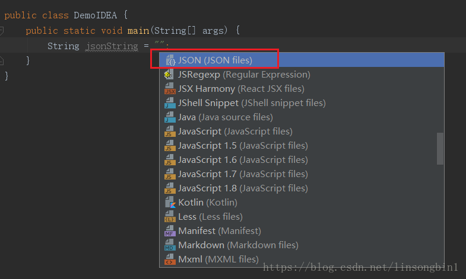
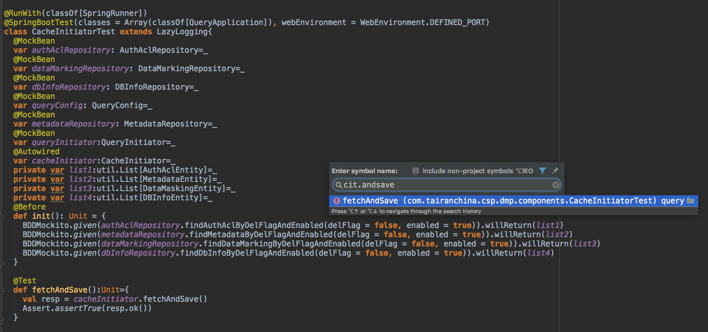
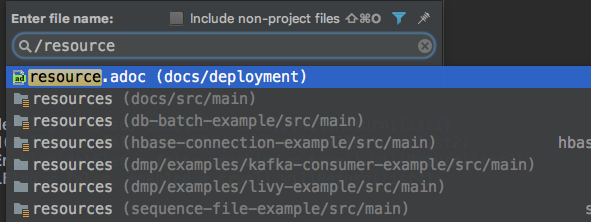
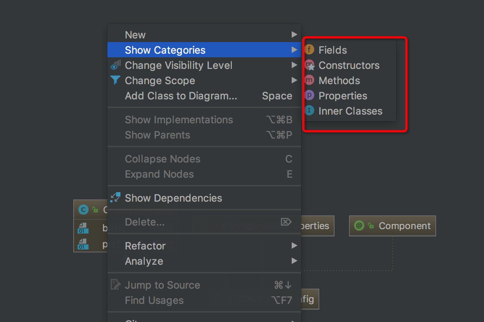

# Intellij 技巧

> 以下都是基于MacOS下的操作进行说明

## 插件推荐

- [Easy-javadoc](https://github.com/starcwang/easy_javadoc): JavaDoc 生成器；
- GIt Commit Template：Git 代码提交模板；
- GjsonFormat：Json 数据格式化处理，在使用例如 Postman 之类的工具时候可以用该工具生成Json 请求参数；
- Maven Helper：定位 Maven 依赖冲突问题；
- Rainbow Brackets：高亮括号；
- Asciidoc：文档编辑器；

## 快捷键

| 快捷键           | 说明                                                         |
| ---------------- | ------------------------------------------------------------ |
| option+F7        | 获取当前选中的方法、类、字段被用到的地方                     |
| command+E        | 最近打开的文件                                               |
| command+option+↔ | 上一次编辑的位置                                             |
| command+option+U | 查看类或方法的继承关系                                       |
| command+N        | 生成代码（getter、setter、构造函数、hashCode/equals,toString） |
| command+option+T | 包围代码（使用if..else, try..catch, for, synchronized等包围选中的代码） |
| command+/        | 注释/取消注释与行注释                                        |
| command+option+/ | 注释/取消注释与块注释                                        |
|                  |                                                              |

## 高效配置

### 高亮提示

在开发过程中我们用todo标记未做之事，但表达方面不是特别的明确，例如可能是希望做优化 Optimize，我们应该怎么设置会高亮呢？

> Preference -> Editor -> TODO -> Pattern 中加上 Optimize。

```
\b(todo|fixme|optimize)\b.*
```

## 神奇的快捷键

### 神奇的Inject language

如果你使用IDEA在编写JSON字符串的时候，然后要一个一个\去转义双引号的话，就实在太不应该了，又烦又容易出错。在IDEA可以使用Inject language帮我们自动转义双引号。 

先将焦点定位到双引号里面，使用`option+enter`快捷键弹出`inject language`视图，并选中 **Inject language or reference**。 


选择后,切记，要直接按下enter回车键，才能弹出inject language列表。在列表中选择 json组件。 



选择完后。鼠标焦点自动会定位在双引号里面，这个时候你再次使用`option+enter`就可以看到 


选中`Edit JSON Fragment`并回车，就可以看到编辑JSON文件的视图了。

可以看到IDEA确实帮我们自动转义双引号了。如果要退出编辑JSON信息的视图，只需要使用`command+F4`快捷键即可。

### 高效添加`{}`

例如在if语句中，需要在末尾添加`{}`，这个时候手打明显不是很有效率的行为。


你可以试试`command+shift+enter`，奇迹就发生了


### 强大的Symbol

如果你依稀记得某个方法名字几个字母，你可以使用Symbol来帮你查找，使用`command+option+O`组合键


如果你记得某个业务类里面有某个方法，那也可以使用首字母找到类,然后加个`.`，再输入方法名字也是可以的



### 快速查找文件/路径

使用`command+shift+O`



### Not Null

在if语句中一般都会遇到判断某个字段的为空场景，非空代码快速生成心法


是不是觉得之前写代码的时候咋都没看到过。


### 生成单测类

使用组合键`command+shift+T`生成单元测试类


### 类继承关系图

在看源码的时候，时常需要查看类的继承关系，以了解全局代码结构，在IDE中提供了`command+shift+option+U`方式，显示光标选择的类的继承关系图。


如果想更加详细的了解每个实体的具体信息，还可以如下：



或者这样


得到全面的信息


是不是感觉很好用