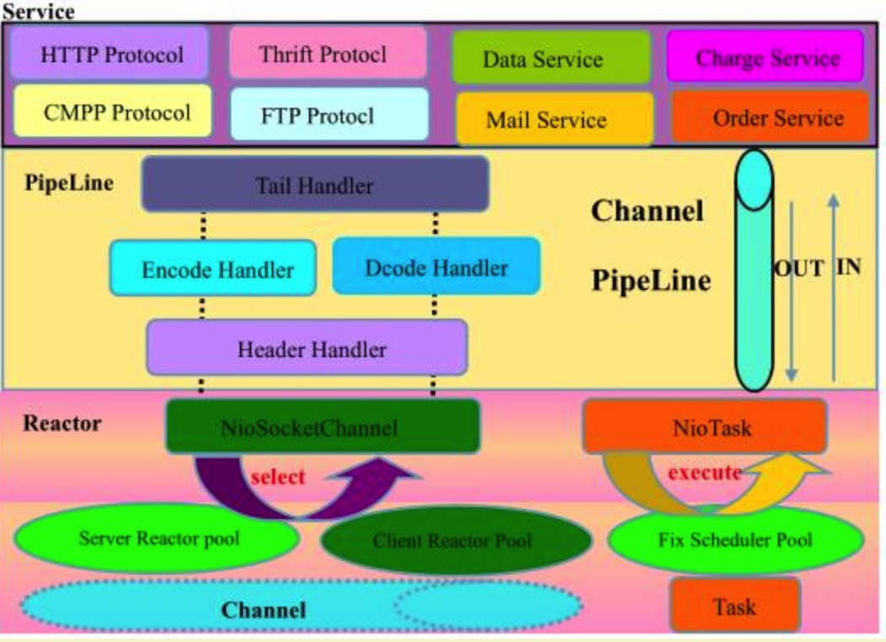

### BIO 是什么？

BIO ，全称 Block-IO ，是一种**阻塞** + **同步**的通信模式。

是一个比较传统的通信方式，模式简单，使用方便。但并发处理能力低，通信耗时，依赖网速。

### BIO 原理是什么？

- 服务器通过一个 Acceptor 线程，负责监听客户端请求和为每个客户端创建一个新的线程进行链路处理。典型的**一请求一应答模式**。
- 若客户端数量增多，频繁地创建和销毁线程会给服务器打开很大的压力。后改良为用线程池的方式代替新增线程，被称为伪异步 IO 。

### NIO 是什么？

NIO ，全称 New IO ，也叫 Non-Block IO ，是一种**非阻塞** + 同步的通信模式。

### NIO 原理是什么？

- NIO 相对于 BIO 来说一大进步。客户端和服务器之间通过 Channel 通信。NIO 可以在 Channel 进行读写操作。这些 Channel 都会被注册在 Selector 多路复用器上。Selector 通过一个线程不停的轮询这些 Channel 。找出已经准备就绪的 Channel 执行 IO 操作。
- NIO 通过一个线程轮询，实现千万个客户端的请求，这就是非阻塞 NIO 的特点。
  - 缓冲区 Buffer ：它是 NIO 与 BIO 的一个重要区别。
    - BIO 是将数据直接写入或读取到流 Stream 对象中。
    - NIO 的数据操作都是在 Buffer 中进行的。Buffer 实际上是一个数组。Buffer 最常见的类型是ByteBuffer，另外还有 CharBuffer，ShortBuffer，IntBuffer，LongBuffer，FloatBuffer，DoubleBuffer。
  - 通道 Channel ：和流 Stream 不同，**通道是双向的**。NIO可以通过 Channel 进行数据的读、写和同时读写操作。
    - 通道分为两大类：一类是网络读写（SelectableChannel），一类是用于文件操作（FileChannel）。我们使用的是前者 SocketChannel 和 ServerSocketChannel ，都是SelectableChannel 的子类。
  - 多路复用器 Selector ：NIO 编程的基础。多路复用器提供选择已经就绪的任务的能力：就是 Selector 会不断地轮询注册在其上的通道（Channel），如果某个通道处于就绪状态，会被 Selector 轮询出来，然后通过 SelectionKey 可以取得就绪的Channel集合，从而进行后续的 IO 操作。
    - 服务器端只要提供一个线程负责 Selector 的轮询，就可以接入成千上万个客户端，这就是 JDK NIO 库的巨大进步。

### BIO、NIO 有什么区别？

- 线程模型不同
  - BIO：一个连接一个线程，客户端有连接请求时服务器端就需要启动一个线程进行处理。所以，线程开销大。可改良为用线程池的方式代替新创建线程，被称为伪异步 IO 。
  - NIO：一个请求一个线程，但客户端发送的连接请求都会注册到多路复用器上，多路复用器轮询到连接有新的 I/O 请求时，才启动一个线程进行处理。可改良为一个线程处理多个请求，基于 [多 Reactor 模型](http://svip.iocoder.cn/Netty/EventLoop-1-Reactor-Model/)。
- BIO 是面向流( Stream )的，而 NIO 是面向缓冲区( Buffer )的。
- BIO 的各种操作是阻塞的，而 NIO 的各种操作是非阻塞的。
- BIO 的 Socket 是单向的，而 NIO 的 Channel 是双向的。

### BIO 存在的问题？

阻塞、同步、TCP 三次握手耗时。

### NIO 存在的问题？

同步，使用复杂

### AIO 是什么？

AIO ，全称 Asynchronous IO ，也叫 NIO**2** ，是一种**非阻塞** + **异步**的通信模式。在 NIO 的基础上，引入了**新的异步通道的概念**，并提供了**异步文件通道**和**异步套接字通道**的实现。

### AIO 原理是什么？

AIO 并没有采用 NIO 的多路复用器，而是使用异步通道的概念。其 read，write 方法的返回类型，都是 Future 对象。而 Future 模型是异步的，其核心思想是：**去主函数等待时间**。

### 说说 Netty 如何实现高性能？

1. **线程模型** ：更加优雅的 Reactor 模式实现、灵活的线程模型、利用 EventLoop 等创新性的机制，可以非常高效地管理成百上千的 Channel 。
2. **内存池设计** ：使用池化的 Direct Buffer 等技术，在提高 IO 性能的同时，减少了对象的创建和销毁。并且，内存池的内部实现是用**一颗二叉查找树，更好的管理内存分配情况**。
3. **内存零拷贝** ：使用 Direct Buffer ，可以使用 Zero-Copy 机制。
4. **议支持** ：提供对 Protobuf 等高性能序列化协议支持。
5. 使用更多本地代码。例如：
   - 直接利用 JNI 调用 Open SSL 等方式，获得比 Java 内建 SSL 引擎更好的性能。
   - 利用 JNI 提供了 Native Socket Transport ，在使用 Epoll edge-triggered 的情况下，可以有一定的性能提升。

### 什么是零拷贝？

Zero-Copy ，在操作数据时，不需要将数据 Buffer 从一个内存区域拷贝到另一个内存区域。因为少了一次内存的拷贝，因此 CPU 的效率就得到的提升。

### Netty 的高性能如何体现？

1. **程模型** ：采用异步非阻塞的 I/O 类库，基于 Reactor 模式实现，解决了传统同步阻塞 I/O 模式下服务端无法平滑处理客户端线性增长的问题。
2. **堆外内存** ：TCP 接收和发送缓冲区采用直接内存代替堆内存，避免了内存复制，提升了 I/O 读取和写入性能。
3. **内存池设计** ：支持通过内存池的方式循环利用 ByteBuf，避免了频繁创建和销毁 ByteBuf 带来的性能消耗。
4. **参数配置** ：可配置的 I/O 线程数目和 TCP 参数等，为不同用户提供定制化的调优参数，满足不同的性能场景。
5. **队列优化** ：采用环形数组缓冲区，实现无锁化并发编程，代替传统的线程安全容器或锁。
6. **并发能力** ：合理使用线程安全容器、原子类等，提升系统的并发能力。
7. **降低锁竞争** ：关键资源的使用采用单线程串行化的方式，避免多线程并发访问带来的锁竞争和额外的 CPU 资源消耗问题。
8. **内存泄露检测** ：通过引用计数器及时地释放不再被引用的对象，细粒度的内存管理降低了 GC 的频率，减少频繁 GC 带来的时延增大和 CPU 损耗。

### Netty 的高可靠如何体现？

1. 链路有效性检测

   ：由于长连接不需要每次发送消息都创建链路，也不需要在消息完成交互时关闭链路，因此相对于短连接性能更高。为了保证长连接的链路有效性，往往需要通过心跳机制周期性地进行链路检测。使用心跳机制的原因是，避免在系统空闲时因网络闪断而断开连接，之后又遇到海量业务冲击导致消息积压无法处理。为了解决这个问题，需要周期性地对链路进行有效性检测，一旦发现问题，可以及时关闭链路，重建 TCP 连接。为了支持心跳，Netty 提供了两种链路空闲检测机制：

   - 读空闲超时机制：连续 T 周期没有消息可读时，发送心跳消息，进行链路检测。如果连续 N 个周期没有读取到心跳消息，可以主动关闭链路，重建连接。
   - 写空闲超时机制：连续 T 周期没有消息需要发送时，发送心跳消息，进行链路检测。如果连续 N 个周期没有读取对方发回的心跳消息，可以主动关闭链路，重建连接。

2. 内存保护机制

   ：Netty 提供多种机制对内存进行保护，包括以下几个方面：

   - 通过对象引用计数器对 ByteBuf 进行细粒度的内存申请和释放，对非法的对象引用进行检测和保护。
   - 可设置的内存容量上限，包括 ByteBuf、线程池线程数等，避免异常请求耗光内存。

3. **优雅停机**：优雅停机功能指的是当系统推出时，JVM 通过注册的 Shutdown Hook 拦截到退出信号量，然后执行推出操作，释放相关模块的资源占用，将缓冲区的消息处理完成或清空，将待刷新的数据持久化到磁盘和数据库中，等到资源回收和缓冲区消息处理完成之后，再退出。

### Netty 的可扩展如何体现？

可定制、易扩展。

- **责任链模式** ：ChannelPipeline 基于责任链模式开发，便于业务逻辑的拦截、定制和扩展。
- **基于接口的开发** ：关键的类库都提供了接口或抽象类，便于用户自定义实现。
- **提供大量的工厂类** ：通过重载这些工厂类，可以按需创建出用户需要的对象。
- **提供大量系统参数** ：供用户按需设置，增强系统的场景定制性。

### 简单介绍 Netty 的核心组件？

Netty 有如下六个核心组件：

- Bootstrap & ServerBootstrap
- Channel
- ChannelFuture
- EventLoop & EventLoopGroup
- ChannelHandler
- ChannelPipeline

### 说说 Netty 的逻辑架构？

Netty 采用了典型的**三层网络架构**进行设计和开发，其逻辑架构如下图所示：

1. **Reactor 通信调度层**：由一系列辅助类组成，包括 Reactor 线程 NioEventLoop 及其父类，NioSocketChannel 和 NioServerSocketChannel 等等。该层的职责就是监听网络的读写和连接操作，负责将网络层的数据读到内存缓冲区，然后触发各自网络事件，例如连接创建、连接激活、读事件、写事件等。将这些事件触发到 pipeline 中，由 pipeline 管理的职责链来进行后续的处理。
2. **职责链 ChannelPipeline**：负责事件在职责链中的有序传播，以及负责动态地编排职责链。职责链可以选择监听和处理自己关心的事件，拦截处理和向后传播事件。
3. **业务逻辑编排层**：业务逻辑编排层通常有两类，一类是纯粹的业务逻辑编排，一类是应用层协议插件，用于特定协议相关的会话和链路管理。由于应用层协议栈往往是开发一次到处运行，并且变动较小，故而将应用协议到 POJO 的转变和上层业务放到不同的 ChannelHandler 中，就可以实现协议层和业务逻辑层的隔离，实现架构层面的分层隔离。

### 什么是 Reactor 模型？

将关注的 I/O 事件注册到多路复用器上，一旦有 I/O 事件触发，将事件分发到事件处理器中，执行就绪 I/O 事件对应的处理函数中。模型中有三个重要的组件：

- 多路复用器：由操作系统提供接口，Linux 提供的 I/O 复用接口有select、poll、epoll 。
- 事件分离器：将多路复用器返回的就绪事件分发到事件处理器中。
- 事件处理器：处理就绪事件处理函数。

### 请介绍 Netty 的线程模型？

- 单 Reactor 单线程模型

  - Reactor 线程，负责多路分离套接字。

    - 有新连接到来触发 `OP_ACCEPT` 事件之后， 交由 Acceptor 进行处理。
    - 有 IO 读写事件之后，交给 Handler 处理。

    Acceptor 主要任务是构造 Handler 。

    - 在获取到 Client 相关的 SocketChannel 之后，绑定到相应的 Handler 上。
    - 对应的 SocketChannel 有读写事件之后，基于 Reactor 分发，Handler 就可以处理了。

- 单 Reactor 多线程模型
- 多 Reactor 多线程模型
  - mainReactor 负责监听 ServerSocketChannel ，用来处理客户端新连接的建立，并将建立的客户端的 SocketChannel 指定注册给 subReactor 。
  - subReactor 维护自己的 Selector ，基于 mainReactor 建立的客户端的 SocketChannel 多路分离 IO 读写事件，读写网络数据。对于业务处理的功能，另外扔给 worker 线程池来完成。

### 什么是业务线程池？

问题**

无论是那种类型的 Reactor 模型，都需要在 Reactor 所在的线程中，进行读写操作。那么此时就会有一个问题，如果我们读取到数据，需要进行业务逻辑处理，并且这个业务逻辑需要对数据库、缓存等等进行操作，会有什么问题呢？假设这个数据库操作需要 5 ms ，那就意味着这个 Reactor 线程在这 5 ms 无法进行注册在这个 Reactor 的 Channel 进行读写操作。也就是说，**多个 Channel 的所有读写操作都变成了串行**。势必，这样的效率会非常非常非常的低。

**解决**

那么怎么解决呢？创建业务线程池，**将读取到的数据，提交到业务线程池中进行处理**。这样，Reactor 的 Channel 就不会被阻塞，而 Channel 的所有读写操作都变成了并行了。

### TCP 粘包 / 拆包的原因？应该这么解决？

**概念**

TCP 是以流的方式来处理数据，所以会导致粘包 / 拆包。

- 拆包：一个完整的包可能会被 TCP 拆分成多个包进行发送。
- 粘包：也可能把小的封装成一个大的数据包发送。

**原因**

- 应用程序写入的字节大小大于套接字发送缓冲区的大小，会发生**拆包**现象。而应用程序写入数据小于套接字缓冲区大小，网卡将应用多次写入的数据发送到网络上，这将会发生**粘包**现象。
- 待发送数据大于 MSS（最大报文长度），TCP 在传输前将进行**拆包**。
- 以太网帧的 payload（净荷）大于 MTU（默认为 1500 字节）进行 IP 分片**拆包**。
- 接收数据端的应用层没有及时读取接收缓冲区中的数据，将发生**粘包**。

解决**

在 Netty 中，提供了多个 Decoder 解析类，如下：

- ① FixedLengthFrameDecoder ，基于**固定长度**消息进行粘包拆包处理的。
- ② LengthFieldBasedFrameDecoder ，基于**消息头指定消息长度**进行粘包拆包处理的。
- ③ LineBasedFrameDecoder ，基于**换行**来进行消息粘包拆包处理的。
- ④ DelimiterBasedFrameDecoder ，基于**指定消息边界方式**进行粘包拆包处理的。

### 了解哪几种序列化协议？

- 序列化（编码），是将对象序列化为二进制形式（字节数组），主要用于网络传输、数据持久化等。
- 反序列化（解码），则是将从网络、磁盘等读取的字节数组还原成原始对象，主要用于网络传输对象的解码，以便完成远程调用。

### 选择序列化协议？

在选择序列化协议的选择，主要考虑以下三个因素：

- 序列化后的**字节大小**。更少的字节数，可以减少网络带宽、磁盘的占用。
- 序列化的**性能**。对 CPU、内存资源占用情况。
- 是否支持**跨语言**。例如，异构系统的对接和开发语言切换。

### 存在哪些序列化方案？

1. 【重点】Java 默认提供的序列化

   - 无法跨语言；序列化后的字节大小太大；序列化的性能差。

2. 【重点】XML 。

   - 优点：人机可读性好，可指定元素或特性的名称。
   - 缺点：序列化数据只包含数据本身以及类的结构，不包括类型标识和程序集信息；只能序列化公共属性和字段；不能序列化方法；文件庞大，文件格式复杂，传输占带宽。
   - 适用场景：当做配置文件存储数据，实时数据转换。

3. 【重点】JSON ，是一种轻量级的数据交换格式。

   - 优点：兼容性高、数据格式比较简单，易于读写、序列化后数据较小，可扩展性好，兼容性好。与 XML 相比，其协议比较简单，解析速度比较快。
   - 缺点：数据的描述性比 XML 差、不适合性能要求为 ms 级别的情况、额外空间开销比较大。
   - 适用场景（可替代 XML ）：跨防火墙访问、可调式性要求高、基于Restful API 请求、传输数据量相对小，实时性要求相对低（例如秒级别）的服务。

4. 【了解】Thrift ，不仅是序列化协议，还是一个 RPC 框架。

   - 优点：序列化后的体积小, 速度快、支持多种语言和丰富的数据类型、对于数据字段的增删具有较强的兼容性、支持二进制压缩编码。
   - 缺点：使用者较少、跨防火墙访问时，不安全、不具有可读性，调试代码时相对困难、不能与其他传输层协议共同使用（例如 HTTP）、无法支持向持久层直接读写数据，即不适合做数据持久化序列化协议。
   - 适用场景：分布式系统的 RPC 解决方案。

5. 【了解】Avro ，Hadoop 的一个子项目，解决了JSON的冗长和没有IDL的问题。

   - 优点：支持丰富的数据类型、简单的动态语言结合功能、具有自我描述属性、提高了数据解析速度、快速可压缩的二进制数据形式、可以实现远程过程调用 RPC、支持跨编程语言实现。
   - 缺点：对于习惯于静态类型语言的用户不直观。
   - 适用场景：在 Hadoop 中做 Hive、Pig 和 MapReduce 的持久化数据格式。

6. 【重点】Protobuf ，将数据结构以`.proto`

   文件进行描述，通过代码生成工具可以生成对应数据结构的 POJO 对象和 Protobuf 相关的方法和属性。

   - 优点：序列化后码流小，性能高、结构化数据存储格式（XML JSON等）、通过标识字段的顺序，可以实现协议的前向兼容、结构化的文档更容易管理和维护。
   - 缺点：需要依赖于工具生成代码、支持的语言相对较少，官方只支持Java 、C++、python。
   - 适用场景：对性能要求高的 RPC 调用、具有良好的跨防火墙的访问属性、适合应用层对象的持久化。

7. 其它

   - 【重点】Protostuff ，基于 Protobuf 协议，但不需要配置proto 文件，直接导包即可。

     - 目前，微博 RPC 框架 Motan 在使用它。

   - 【了解】Jboss Marshaling ，可以直接序列化 Java 类， 无须实 `java.io.Serializable` 接口。

   - 【了解】Message Pack ，一个高效的二进制序列化格式。

   - 【重点】

     Hessian，采用二进制协议的轻量级 remoting on http 服务。

     - 目前，阿里 RPC 框架 Dubbo 的**默认**序列化协议。

   - 【重要】kryo ，是一个快速高效的Java对象图形序列化框架，主要特点是性能、高效和易用。该项目用来序列化对象到文件、数据库或者网络。

     - 目前，阿里 RPC 框架 Dubbo 的可选序列化协议。

   - 【重要】FST ，fast-serialization 是重新实现的 Java 快速对象序列化的开发包。序列化速度更快（2-10倍）、体积更小，而且兼容 JDK 原生的序列化。要求 JDK 1.7 支持。

     - 目前，阿里 RPC 框架 Dubbo 的可选序列化协议。

### Netty 的零拷贝实现？

- 【重点】Netty 的接收和发送 ByteBuffer 采用堆外直接内存 Direct Buffer 。
  - 使用堆外直接内存进行 Socket 读写，不需要进行字节缓冲区的二次拷贝；使用堆内内存会多了一次内存拷贝，JVM 会将堆内存 Buffer 拷贝一份到直接内存中，然后才写入 Socket 中。
  - Netty 创建的 ByteBuffer 类型，由 ChannelConfig 配置。而 ChannelConfig 配置的 ByteBufAllocator 默认创建 Direct Buffer 类型。
- CompositeByteBuf 类，可以将多个 ByteBuf 合并为一个逻辑上的 ByteBuf ，避免了传统通过内存拷贝的方式将几个小 Buffer 合并成一个大的 Buffer 。
  - addComponents(...) 方法，可将 header 与 body 合并为一个逻辑上的 ByteBuf 。这两个 ByteBuf 在CompositeByteBuf 内部都是单独存在的，即 CompositeByteBuf 只是逻辑上是一个整体。
- 通过 FileRegion 包装的 FileChannel 。
  - tranferTo(...) 方法，实现文件传输, 可以直接将文件缓冲区的数据发送到目标 Channel ，避免了传统通过循环 write 方式，导致的内存拷贝问题。
- 通过 wrap 方法, 我们可以将 byte[] 数组、ByteBuf、ByteBuffer 等包装成一个 Netty ByteBuf 对象, 进而避免了拷贝操作。

### 原生的 NIO 存在 Epoll Bug 是什么？Netty 是怎么解决的？

**Java NIO Epoll BUG**

Java NIO Epoll 会导致 Selector 空轮询，最终导致 CPU 100% 。

官方声称在 JDK 1.6 版本的 update18 修复了该问题，但是直到 JDK 1.7 版本该问题仍旧存在，只不过该 BUG 发生概率降低了一些而已，它并没有得到根本性解决。

**Netty 解决方案**

对 Selector 的 select 操作周期进行**统计**，每完成一次**空**的 select 操作进行一次计数，若在某个周期内连续发生 N 次空轮询，则判断触发了 Epoll 死循环 Bug 。

