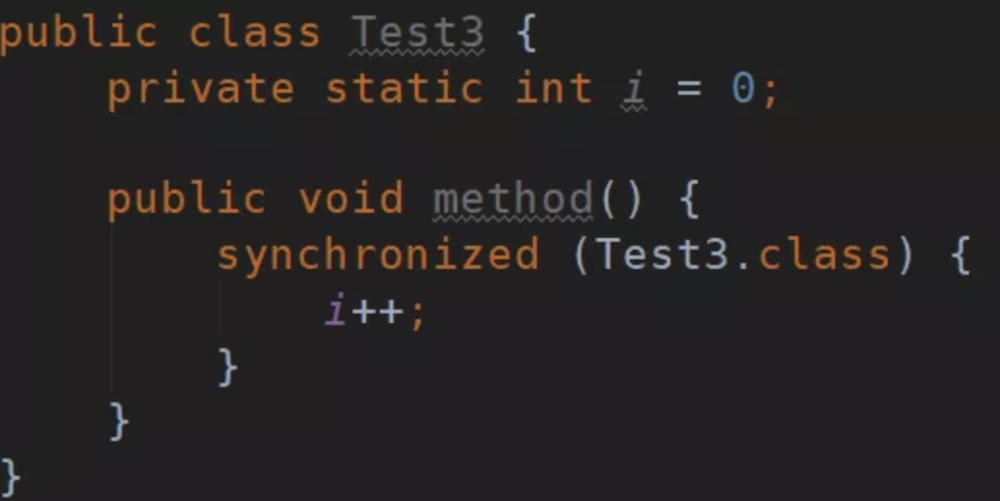
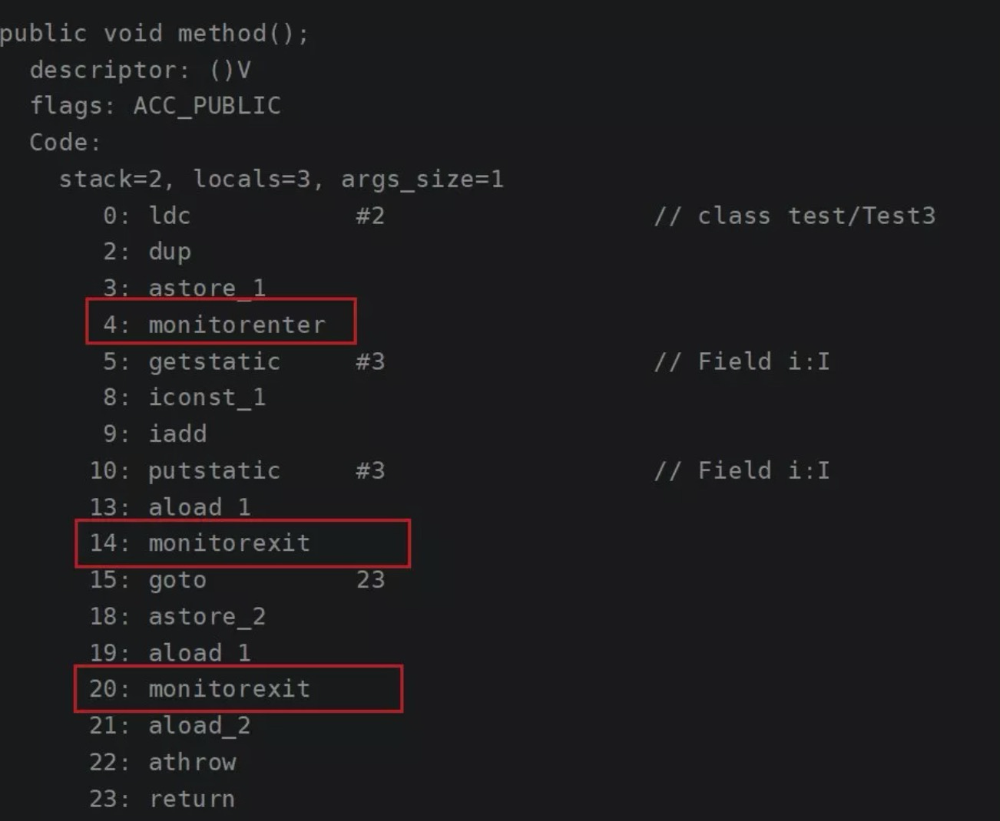
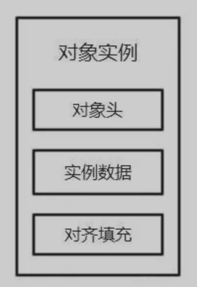
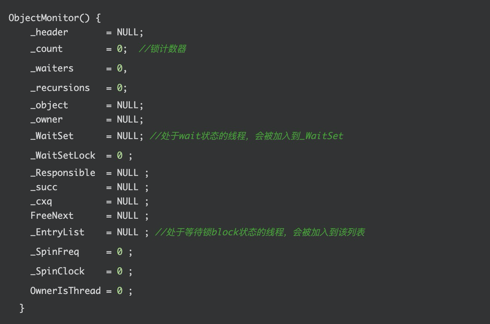
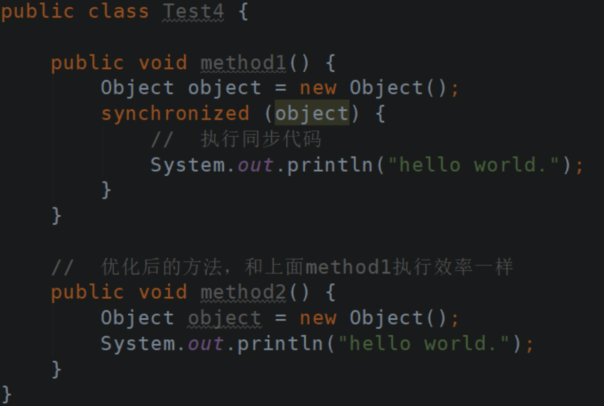
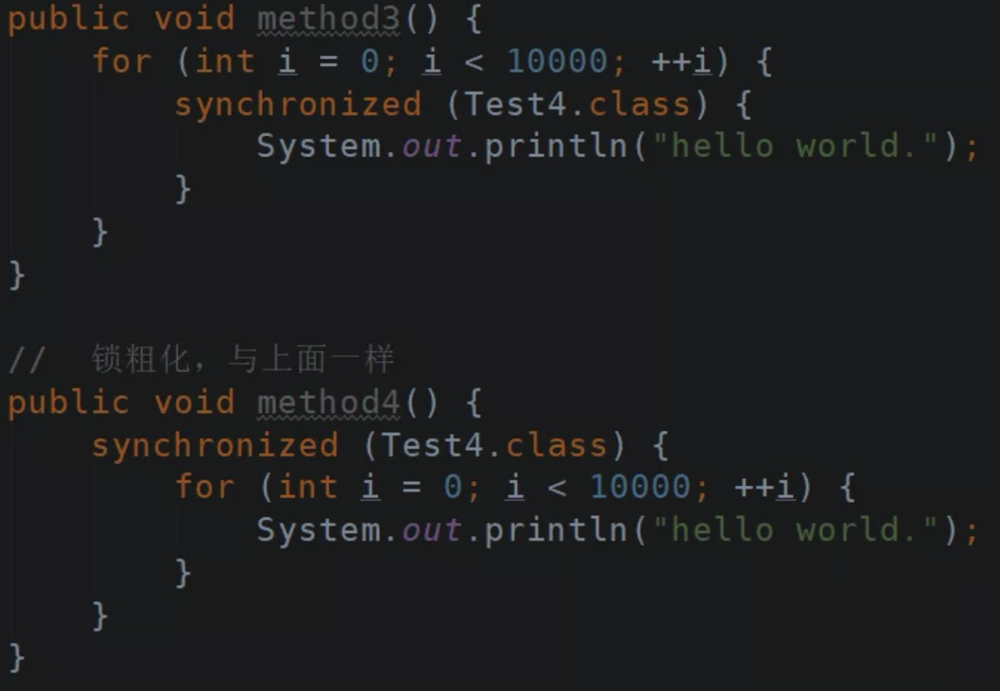
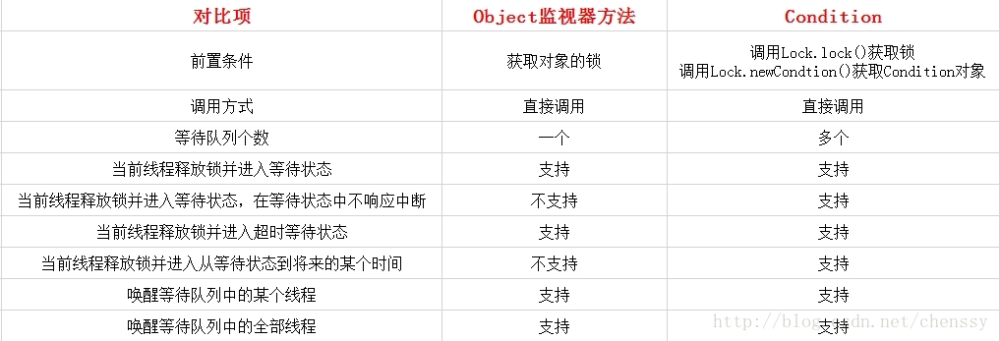
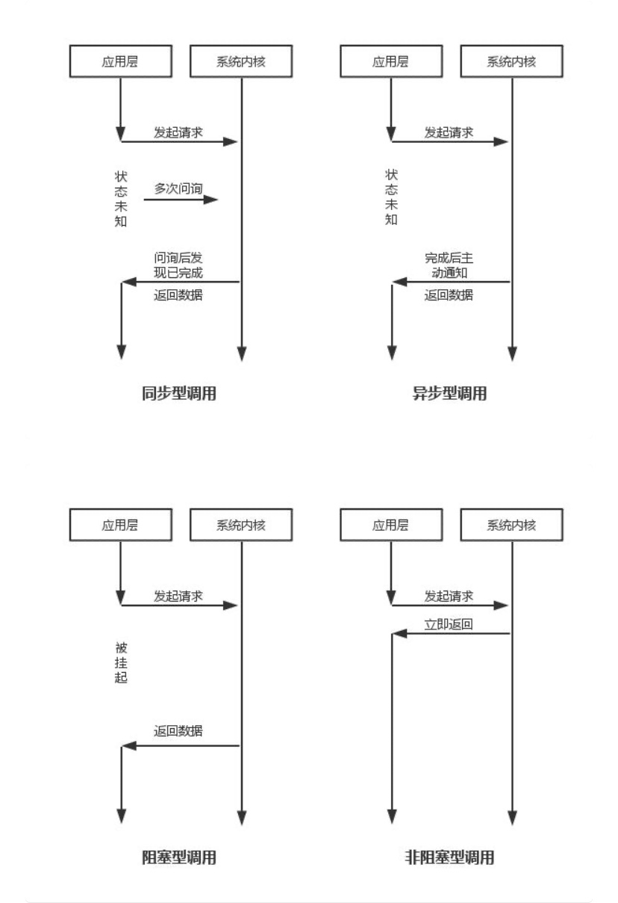

# Java 多线程面试

## 多线程

### 线程定义

#### 什么是程序？

程序，**是含有指令和数据的文件**，被存储在磁盘或其他的数据存储设备中，也就是说程序是静态的代码。

#### 什么是进程？

进程，是程序的一次执行过程，是系统运行程序的基本单位，因此进程是动态的。**系统运行一个程序即是一个进程从创建，运行到消亡的过程**。简单来说，一个进程就是一个执行中的程序，它在计算机中一个指令接着一个指令地执行着，同时，每个进程还占有某些系统资源如CPU时间，内存空间，文件，文件，输入输出设备的使用权等等。换句话说，当程序在执行时，将会被操作系统载入内存中。

#### 什么是线程？

线程，与进程相似，但线程是一个比进程更小的执行单位。**一个进程在其执行的过程中可以产生多个线程。与进程不同的是同类的多个线程共享同一块内存空间和一组系统资源**，所以系统在产生一个线程，或是在各个线程之间作切换工作时，负担要比进程小得多，也正因为如此，线程也被称为轻量级进程。

#### 三者之间的关系？

- 线程是进程划分成的更小的运行单位。线程和进程最大的不同在于基本上各进程是独立的，而各线程则不一定，因为同一进程中的线程极有可能会相互影响。
- 从另一角度来说，进程属于操作系统的范畴，主要是同一段时间内，可以同时执行一个以上的程序，而线程则是在同一程序内几乎同时执行一个以上的程序段。

#### 线程有什么优缺点？

1）好处

- 使用多线程可以把程序中占据时间长的任务放到后台去处理，如图片、视屏的下载。
- 发挥多核处理器的优势，并发执行让系统运行的更快、更流畅，用户体验更好。

2）坏处

- 大量的线程降低代码的可读性。
- 更多的线程需要更多的内存空间。
- 当多个线程对**同一个资源出现争夺时候要注意线程安全**的问题。

#### 守护线程与非守护线程

Java 中的线程分为两种：守护线程（Daemon）和用户线程（User）。

- 任何线程都可以设置为守护线程和用户线程，通过方法`Thread#setDaemon(boolean on)` 设置。`true` 则把该线程设置为守护线程，反之则为用户线程。
- `Thread#setDaemon(boolean on)` 方法，必须在`Thread#start()` 方法之前调用，否则运行时会抛出异常。

唯一的区别是：

程序运行完毕，JVM 会等待非守护线程完成后关闭，但是 JVM 不会等待守护线程。当守护线程无服务对象时（用户线程），就会关闭。

#### 什么是多线程上下文切换？

多线程会共同使用一组计算机上的 CPU ，而线程数大于给程序分配的 CPU 数量时，为了让各个线程都有执行的机会，就需要轮换使用 CPU 。

**不同的线程切换使用 CPU 发生的切换数据等，就是上下文切换。**

- 在上下文切换过程中，CPU 会停止处理当前运行的程序，并保存当前程序运行的具体位置以便之后继续运行。从这个角度来看，上下文切换有点像我们同时阅读几本书，在来回切换书本的同时我们需要记住每本书当前读到的页码。在程序中，上下文切换过程中的“页码”信息是保存在进程控制块（PCB）中的。PCB还经常被称作“切换桢”（switchframe）。“页码”信息会一直保存到CPU的内存中，直到他们被再次使用。
- 上下文切换是存储和恢复 CPU 状态的过程，它使得线程执行能够从中断点恢复执行。上下文切换是多任务操作系统和多线程环境的基本特征。

#### Java 中用到的线程调度算法是什么？

假设计算机只有一个 CPU ，则在任意时刻只能执行一条机器指令，每个线程只有获得 CPU 的使用权才能执行指令。

- 所谓多线程的并发运行，其实是指从宏观上看，各个线程轮流获得 CPU 的使用权，分别执行各自的任务。
- 在运行池中，会有多个处于就绪状态的线程在等待 CPU ，Java 虚拟机的一项任务就是负责线程的调度，线程调度是指按照特定机制为多个线程分配 CPU 的使用权。

有两种调度模型：**分时调度模型和抢占式调度模型。**

- 分时调度模型是指让**所有的线程轮流获得 CPU 的使用权**,并且平均分配每个线程占用的 CPU 的时间片这个也比较好理解。

- Java 虚拟机采用抢占式调度模型，**是指优先让可运行池中优先级高的线程占用 CPU ，如果可运行池中的线程优先级相同，那么就随机选择一个线程，使其占用 CPU 。**处于运行状态的线程会一直运行，直至它不得不放弃 CPU 。

  > 如非特别需要，尽量不要用，防止线程饥饿。

### 线程有哪些生命周期？

线程一共有五个状态，分别如下：

- 新建(new)：当创建Thread类的一个实例（对象）时，此线程进入新建状态（未被启动）。例如：`Thread t1 = new Thread()` 。

- 可运行(runnable)：线程对象创建后，其他线程(比如 main 线程）调用了该对象的 start 方法。该状态的线程位于可运行线程池中，等待被线程调度选中，获取 cpu 的使用权。例如：`t1.start()` 。

  > 有些文章，会称可运行(runnable)为就绪，意思是一样的。

- 运行(running)：线程获得 CPU 资源正在执行任务（`#run()` 方法），此时除非此线程自动放弃 CPU 资源或者有优先级更高的线程进入，线程将一直运行到结束。

- 死亡(dead)：当线程执行完毕或被其它线程杀死，线程就进入死亡状态，这时线程不可能再进入就绪状态等待执行。

  - 自然终止：正常运行完 `#run()`方法，终止。
  - 异常终止：调用 `#stop()` 方法，让一个线程终止运行。

- 堵塞(blocked)：由于某种原因导致正在运行的线程让出 CPU 并暂停自己的执行，即进入堵塞状态。直到线程进入可运行(runnable)状态，才有机会再次获得 CPU 资源，转到运行(running)状态。阻塞的情况有三种：

  - 正在睡眠：调用 `#sleep(long t)` 方法，可使线程进入睡眠方式。

    > 一个睡眠着的线程在指定的时间过去可进入可运行(runnable)状态。

  - 正在等待：调用 `#wait()` 方法。

    > 调用 `notify()` 方法，回到就绪状态。

  - 被另一个线程所阻塞：调用 `#suspend()` 方法。

    > 调用 `#resume()` 方法，就可以恢复。

整体如下图所示：


#### 如何使用 wait + notify 实现通知机制？

在 Java 发展史上，曾经使用 suspend、resume 方法对于线程进行阻塞唤醒，但随之出现很多问题，比较典型的还是死锁问题。

解决方案可以使用以对象为目标的阻塞，即利用 Object 类的 wait 和 notify方法实现线程阻塞。

- 首先，wait、notify 方法是针对对象的，调用任意对象的 wait 方法都将导致线程阻塞，阻塞的同时也将释放该对象的锁，相应地，调用任意对象的 notify 方法则将随机解除该对象阻塞的线程，但它需要重新获取该对象的锁，直到获取成功才能往下执行。
- 其次，wait、notify 方法必须在 `synchronized` 块或方法中被调用，并且要保证同步块或方法的锁对象与调用 wait、notify 方法的对象是同一个，如此一来在调用 wait 之前当前线程就已经成功获取某对象的锁，执行 wait 阻塞后当前线程就将之前获取的对象锁释放。

#### Thread类的 sleep 方法和对象的 wait 方法都可以让线程暂停执行，它们有什么区别？

- sleep 方法，是线程类 Thread 的静态方法。调用此方法会让当前线程暂停执行指定的时间，将执行机会（CPU）让给其他线程，但是对象的锁依然保持，因此休眠时间结束后会自动恢复（线程回到就绪状态）
- wait 方法，是 Object 类的方法。调用对象的 `#wait()` 方法，会导致当前线程放弃对象的锁（线程暂停执行），进入对象的等待池（wait pool），只有调用对象的 `#notify()` 方法（或`#notifyAll()`方法）时，才能唤醒等待池中的线程进入等锁池（lock pool），如果线程重新获得对象的锁就可以进入就绪状态。

#### 为什么 wait, notify 和 notifyAll 这三方法不在 Thread 类里面？

一个很明显的原因是 **Java 提供的锁是对象级**的而不是线程级的，每个对象都有锁，通过线程获得。

由于 wait，notify 和 notifyAll 方法都是锁级别的操作，所以把它们定义在 Object 类中，因为锁属于对象。

#### 为什么 wait 和 notify 方法要在同步块中调用？

- Java API 强制要求这样做，如果你不这么做，你的代码会抛出 IllegalMonitorStateException 异常。
- 还有一个原因是为了**避免 wait 和 notify 之间产生竞态条件**。

#### sleep、join、yield 方法有什么区别？

1）sleep 方法

在指定的毫秒数内，让当前正在执行的线程休眠（暂停执行），此操作受到系统计时器和调度程序精度和准确性的影响。让其他线程有机会继续执行，但它并不释放对象锁。也就是如果有`synchronized` 同步块，其他线程仍然不能访问共享数据。注意该方法要捕获异常。

比如有两个线程同时执行(没有 `synchronized`)，一个线程优先级为`MAX_PRIORITY` ，另一个为 `MIN_PRIORITY` 。

- 如果没有 sleep 方法，只有高优先级的线程执行完成后，低优先级的线程才能执行。但当高优先级的线程 `#sleep(5000)` 后，低优先级就有机会执行了。
- 总之，sleep 方法，可以使低优先级的线程得到执行的机会，当然也可以让同优先级、高优先级的线程有执行的机会。

2）yield 方法

yield 方法和 sleep 方法类似，也不会释放“锁标志”，区别在于：

- 它没有参数，即 yield 方法只是使当前线程重新回到可执行状态，所以执行yield 的线程有可能在进入到可执行状态后马上又被执行。
- 另外 yield 方法只能使同优先级或者高优先级的线程得到执行机会，这也和 sleep 方法不同。

3）join 方法

Thread 的非静态方法 join ，让一个线程 B “加入”到另外一个线程 A 的尾部。在线程 A 执行完毕之前，线程 B 不能工作。示例代码如下：

```
Thread t = new MyThread();
t.start();
t.join();
```

- 保证当前线程停止执行，直到该线程所加入的线程 `t` 完成为止。然而，如果它加入的线程 `t` 没有存活，则当前线程不需要停止。

#### 线程的 sleep 方法和 yield 方法有什么区别？

- sleep 方法给其他线程运行机会时不考虑线程的优先级，因此会给低优先级的线程以运行的机会。yield 方法只会给相同优先级或更高优先级的线程以运行的机会。
- **线程执行 sleep 方法后转入阻塞（blocked）状态，而执行 yield 方法后转入就绪（ready）状态。**
- sleep 方法声明抛出 InterruptedException 异常，而 yield 方法没有声明任何异常。
- sleep 方法比 yield 方法（跟操作系统 CPU 调度相关）具有更好的可移植性。

#### 你如何确保 main 方法所在的线程是 Java 程序最后结束的线程？

我们可以使用 Thread 类的 `#join()` 方法，来确保所有程序创建的线程在 main 方法退出前结束。

#### interrupted 和 isInterrupted 方法的区别？

1）interrupt 方法

`Thread#interrupt()` 方法，用于**中断线程**。调用该方法的线程的状态为将被置为”中断”状态。

注意：线程中断仅仅是置线程的中断状态位，不会停止线程。需要用户自己去监视线程的状态为并做处理。支持线程中断的方法（也就是线程中断后会抛出 InterruptedException 的方法）就是在监视线程的中断状态，一旦线程的中断状态被置为“中断状态”，就会抛出中断异常。

2）interrupted

`Thread#interrupted()` **静态**方法，**查询当前线程的中断状态，并且清除原状态**。如果一个线程被中断了，第一次调用 `#interrupted()` 方法则返回 `true` ，第二次和后面的就返回 `false` 了。

```
// Thread.java

public static boolean interrupted() {
    return currentThread().isInterrupted(true); // 清理
}

private native boolean isInterrupted(boolean ClearInterrupted);
```

3）isInterrupted

`Thread#isInterrupted()` 方法，**查询指定线程的中断状态，不会清除原状态**。代码如下：

```
// Thread.java

public boolean isInterrupted() {
    return isInterrupted(false); // 不清除
}

private native boolean isInterrupted(boolean ClearInterrupted);
```

#### 一个线程运行时发生异常会怎样？

如果异常没有被捕获该线程将会停止执行。`Thread.UncaughtExceptionHandler` 是用于处理未捕获异常造成线程突然中断情况的一个内嵌接口。当一个未捕获异常将造成线程中断的时候 JVM 会使用 `Thread#getUncaughtExceptionHandler()` 方法来查询线程的 UncaughtExceptionHandler 并将线程和异常作为参数传递给 handler 的 `#uncaughtException(exception)` 方法进行处理。

### 线程创建

#### 创建线程的方式及实现

Java 中创建线程主要有三种方式：

- **方式一，继承 Thread 类创建线程类。**
- **方式二，通过 Runnable 接口创建线程类。**
- **方式三，通过 Callable 和 Future 创建线程。**

创建线程的三种方式的对比：

- 使用方式一

  - 优点：编写简单，如果需要访问当前线程，则无需使用 `Thread#currentThread()` 方法，直接使用 `this` 即可获得当前线程。
  - 缺点：线程类已经继承了 Thread 类，所以不能再继承其他父类。

- 使用方式二、或方式三

  - 优点：

    - 线程类只是实现了 Runnable 接口或 Callable 接口，还可以继承其他类。

    - 在这种方式下，多个线程可以共享同一个 `target` 对象，所以非常适合多个相同线程来处理同一份资源的情况，从而可以将 CPU、代码和数据分开，形成清晰的模型，较好地体现了面向对象的思想。

      ```
      Runnable runner = new Runnable(){ ... };
      // 通过new Thread(target, name) 方法创建新线程
      new Thread(runna,"新线程1").start();
      new Thread(runna,"新线程2").start();
      ```

  - 缺点：编程稍微复杂，如果要访问当前线程，则必须使用`Thread#currentThread()` 方法。

#### 创建线程池的几种方式？

Java 类库提供一个灵活的线程池以及一些有用的默认配置，我们可以通过Executors 的静态方法来创建线程池。

> Executors 创建的线程池，分成普通任务线程池，和定时任务线程池。

- 普通任务线程池

  - 1、`#newFixedThreadPool(int nThreads)`

    方法，创建一个固定长度的线程池。

    - 每当提交一个任务就创建一个线程，直到达到线程池的最大数量，这时线程规模将不再变化。

- 当线程发生未预期的错误而结束时，线程池会补充一个新的线程。

- 2、`#newCachedThreadPool()` 

  方法，创建一个可缓存的线程池。

    - 如果线程池的规模超过了处理需求，将自动回收空闲线程。

- 当需求增加时，则可以自动添加新线程。线程池的规模不存在任何限制。

- 3、`#newSingleThreadExecutor()`

  方法，创建一个单线程的线程池。

  - 它创建单个工作线程来执行任务，如果这个线程异常结束，会创建一个新的来替代它。
  - 它的特点是，能确保依照任务在队列中的顺序来串行执行。

- 定时任务线程池

  - 4、`#newScheduledThreadPool(int corePoolSize)` 方法，创建了一个固定长度的线程池，而且以延迟或定时的方式来执行任务，类似 Timer 。
  - 5、`#newSingleThreadExecutor()` 方法，创建了一个固定长度为 1 的线程池，而且以延迟或定时的方式来执行任务，类似 Timer 。

#### 如何使用 ThreadPoolExecutor 创建线程池？

Executors 提供了创建线程池的常用模板，实际场景下，我们可能需要自动以更灵活的线程池，此时就需要使用 ThreadPoolExecutor 类。

- `corePoolSize` 参数，**核心线程数大小**，当线程数 < corePoolSize ，会创建线程执行任务。
- `maximumPoolSize ` 参数，**最大线程数**， 当线程数 >= corePoolSize 的时候，会把任务放入workQueue队列中。
- `keepAliveTime `参数，**保持存活时间**，当线程数 >= corePoolSize 的空闲线程能保持的最大时间。
- `unit` 参数，**时间单位**。
- `workQueue `参数，**保存任务的阻塞队列**。
- `handler `参数，超过阻塞队列的大小时，**使用的拒绝策略**。
- `threadFactory` 参数，**创建线程的工厂**。

#### ThreadPoolExecutor 有哪些拒绝策略？

ThreadPoolExecutor 默认有四个拒绝策略：

- `ThreadPoolExecutor.AbortPolicy()` ，直接抛出异常 RejectedExecutionException 。
- `ThreadPoolExecutor.CallerRunsPolicy()` ，直接调用 run 方法并且阻塞执行。
- `ThreadPoolExecutor.DiscardPolicy()` ，直接丢弃后来的任务。
- `ThreadPoolExecutor.DiscardOldestPolicy()` ，丢弃在队列中队首的任务。

如果我们有需要，可以自己实现 RejectedExecutionHandler 接口，实现自定义的拒绝逻辑。当然，绝大多数是不需要的。

#### 线程池的关闭方式有几种？

ThreadPoolExecutor 提供了两个方法，用于线程池的关闭，分别是：

- `#shutdown()` 方法，不会立即终止线程池，而是要等所有任务缓存队列中的任务都执行完后才终止，但再也不会接受新的任务。
- `#shutdownNow()` 方法，立即终止线程池，并尝试打断正在执行的任务，并且清空任务缓存队列，返回尚未执行的任务。

#### 线程池容量的动态调整？

ThreadPoolExecutor 提供了动态调整线程池容量大小的方法：

- setCorePoolSize：设置核心池大小。
- setMaximumPoolSize：设置线程池最大能创建的线程数目大小。

当上述参数从小变大时，ThreadPoolExecutor 进行线程赋值，还可能立即创建新的线程来执行任务。

#### 什么是 Callable、Future、FutureTask ？

1）**Callable**

Callable 接口，类似于 Runnable ，从名字就可以看出来了，但是Runnable 不会返回结果，并且无法抛出返回结果的异常，而 Callable 功能更强大一些，被线程执行后，**可以返回值**，这个返回值可以被 Future 拿到，也就是说，Future 可以拿到异步执行任务的返回值。

> 简单来说，可以认为是带有回调的 Runnable 。

2）**Future**

Future 接口，表示异步任务，是还没有完成的任务给出的未来结果。所以说 Callable 用于产生结果，Future 用于获取结果。

3）**FutureTask**

在 Java 并发程序中，FutureTask 表示一个可以取消的异步运算。

- 它有启动和取消运算、查询运算是否完成和取回运算结果等方法。只有当运算完成的时候结果才能取回，如果运算尚未完成 get 方法将会阻塞。
- 一个 FutureTask 对象，可以对调用了 Callable 和 Runnable 的对象进行包装，由于 FutureTask 也是继承了 Runnable 接口，所以它可以提交给 Executor 来执行。

#### 线程池执行任务的过程？

刚创建时，里面没有线程调用 execute() 方法，添加任务时：

1. 如果正在运行的线程数量小于核心参数 corePoolSize，继续创建线程运行这个任务
2. 如果正在运行的线程数量大于或等于 `corePoolSize` 。
   1. 如果队列为阻塞队列，则先将任务放到队列中，等队列满了之后，将线程数增长到`maximumPoolSize` 值，如果任务还来不及处理，则根据设置的拒绝策略处理。
   2. 如果队列为非阻塞队列，则将线程数增长到`maximumPoolSize` 值，如果任务还来不及处理，则追加到队列中，等待处理。
3. 完成一个任务，继续取下一个任务处理。
   1. 没有任务继续处理，线程被中断或者线程池被关闭时，线程退出执行，如果线程池被关闭，线程结束。
   2. 否则，判断线程池正在运行的线程数量是否大于核心线程数，如果是，线程结束，否则线程阻塞。因此线程池任务全部执行完成后，继续留存的线程池大小为 `corePoolSize` 。

#### 线程池中 submit 和 execute 方法有什么区别？

两个方法都可以向线程池提交任务。

- `#execute(...)` 方法，返回类型是 `void` ，它定义在 Executor 接口中。
- `#submit(...)` 方法，可以返回持有计算结果的 Future 对象，它定义在 ExecutorService 接口中，它扩展了 Executor 接口，其它线程池类像 ThreadPoolExecutor 和 ScheduledThreadPoolExecutor 都有这些方法。

#### 如果你提交任务时，线程池队列已满，这时会发生什么？

- 如果你使用的 LinkedBlockingQueue，也就是无界队列的话，没关系，继续添加任务到阻塞队列中等待执行，因为 LinkedBlockingQueue 可以近乎认为是一个无穷大的队列，可以无限存放任务。
- 如果你使用的是有界队列比方说 ArrayBlockingQueue 的话，任务首先会被添加到 ArrayBlockingQueue 中，ArrayBlockingQueue满了，则会使用拒绝策略 RejectedExecutionHandler 处理满了的任务，默认是 AbortPolicy 。

## 线程安全

### synchronized

#### synchronized 特点

1. 可重入性
2. 无继承性
3. 原子性
4. 可见性
5. 有序性

##### 原子性

**所谓原子性就是指一个操作或者多个操作，要么全部执行并且执行的过程不会被任何因素打断，要么就都不执行。**

在Java中，对基本数据类型的变量的读取和赋值操作是原子性操作，即这些操作是不可被中断的，要么执行，要么不执行。但是像`i++`、`i+=1`等操作字符就不是原子性的，它们是分成**读取、计算、赋值**几步操作，原值在这些步骤还没完成时就可能已经被赋值了，那么最后赋值写入的数据就是脏数据，无法保证原子性。

被synchronized修饰的类或对象的所有操作都是原子的，因为在执行操作之前必须先获得类或对象的锁，直到执行完才能释放，这中间的过程无法被中断（除了已经废弃的`stop()`方法），即保证了原子性。

**注意！面试时经常会问比较synchronized和volatile，它们俩特性上最大的区别就在于原子性，volatile不具备原子性。**

##### 可见性

**可见性是指多个线程访问一个资源时，该资源的状态、值信息等对于其他线程都是可见的。**

synchronized和volatile都具有可见性，其中synchronized对一个类或对象加锁时，一个线程如果要访问该类或对象必须先获得它的锁，而这个锁的状态对于其他任何线程都是可见的，并且在释放锁之前会将对变量的修改刷新到主存当中，保证资源变量的可见性，如果某个线程占用了该锁，其他线程就必须在锁池中等待锁的释放。

而volatile的实现类似，被volatile修饰的变量，每当值需要修改时都会立即更新主存，主存是共享的，所有线程可见，所以确保了其他线程读取到的变量永远是最新值，保证可见性。

##### 有序性

**有序性值程序执行的顺序按照代码先后执行。**

synchronized和volatile都具有有序性，<u>Java允许编译器和处理器对指令进行重排，但是指令重排并不会影响单线程的顺序，它影响的是多线程并发执行的顺序性。</u><u>synchronized保证了每个时刻都只有一个线程访问同步代码块</u>，也就确定了线程执行同步代码块是分先后顺序的，保证了有序性。实现方式与volatile不一样，volatile是通过禁止指令重排的方式实现。

##### 可重入性

synchronized和ReentrantLock都是可重入锁。当一个线程试图操作一个由其他线程持有的对象锁的临界资源时，将会处于阻塞状态，但当一个线程再次请求<u>自己持有对象锁</u>的临界资源时，这种情况属于重入锁。通俗一点讲就是说一个线程拥有了锁仍然还可以重复申请锁。

#### synchronized 使用范围

#### synchronized 实现原理

synchronized有两种形式上锁，一个是对方法上锁，一个是构造同步代码块。他们的底层实现其实都一样，在进入同步代码之前先获取锁，获取到锁之后锁的计数器+1，同步代码执行完锁的计数器-1，如果获取失败就阻塞式等待锁的释放。只是他们在同步块识别方式上有所不一样，从class字节码文件可以表现出来，一个是通过方法flags标志，一个是monitorenter和monitorexit指令操作。

首先来看在方法上上锁，我们就新定义一个同步方法然后进行反编译，查看其字节码：





可以看到在add方法的flags里面多了一个`ACC_SYNCHRONIZED`标志，这标志用来告诉JVM这是一个同步方法，在进入该方法之前先获取相应的锁，锁的计数器加1，方法结束后计数器-1，如果获取失败就阻塞住，直到该锁被释放。

<u>第二个 monitorexit 就是为了在异常情况下保证不死锁</u>。

在理解锁实现原理之前先了解一下Java的对象头和Monitor，在JVM中，对象是分成三部分存在的：对象头、实例数据、对其填充。



实例数据和对其填充与synchronized无关，这里简单说一下， **实例数据**存放类的属性数据信息，包括父类的属性信息，如果是数组的实例部分还包括数组的长度，这部分内存按4字节对齐；**对齐填充**不是必须部分，由于虚拟机要求对象起始地址必须是8字节的整数倍，对齐填充仅仅是为了使字节对齐。

对象头是我们需要关注的重点，它是synchronized实现锁的基础，因为synchronized申请锁、上锁、释放锁都与对象头有关。对象头主要结构是由`Mark Word` 和 `Class Metadata Address` 组成，**其中`Mark Word`存储对象的hashCode、锁信息或分代年龄或GC标志等信息**，**`Class Metadata Address`是类型指针指向对象的类元数据，JVM通过该指针确定该对象是哪个类的实例**。

锁也分不同状态，JDK6之前只有两个状态：无锁、有锁（重量级锁），而在JDK6之后对synchronized进行了优化，新增了两种状态，总共就是四个状态：**无锁状态、偏向锁、轻量级锁、重量级锁**，其中无锁就是一种状态了。锁的类型和状态在对象头`Mark Word`中都有记录，在申请锁、锁升级等过程中JVM都需要读取对象的`Mark Word`数据。

每一个锁都对应一个monitor对象，在HotSpot虚拟机中它是由ObjectMonitor实现的（C++实现）。每个对象都存在着一个monitor与之关联，对象与其monitor之间的关系有存在多种实现方式，如monitor可以与对象一起创建销毁或当线程试图获取对象锁时自动生成，但当一个monitor被某个线程持有后，它便处于锁定状态。



该段摘自：https://blog.csdn.net/javazejian/article/details/72828483

ObjectMonitor中有两个队列`_WaitSet`和`_EntryList`，用来保存ObjectWaiter对象列表(每个等待锁的线程都会被封装ObjectWaiter对象)，`_owner`指向持有ObjectMonitor对象的线程，当多个线程同时访问一段同步代码时，首先会进入`_EntryList `集合，当线程获取到对象的monitor 后进入 `_Owner` 区域并把monitor中的owner变量设置为当前线程同时monitor中的计数器count加1，若线程调用 wait() 方法，将释放当前持有的monitor，owner变量恢复为null，count自减1，同时该线程进入 WaitSet集合中等待被唤醒。若当前线程执行完毕也将释放monitor(锁)并复位变量的值，以便其他线程进入获取monitor(锁)。

monitor对象存在于每个Java对象的对象头中(存储的指针的指向)，synchronized锁便是通过这种方式获取锁的，也是为什么Java中任意对象可以作为锁的原因，同时也是notify/notifyAll/wait等方法存在于顶级对象Object中的原因(关于这点稍后还会进行分析)

#### synchronized 的优缺点

缺点：

- 当线程尝试获取锁的时候，如果获取不到锁会一直阻塞。
- 如果获取锁的线程进入休眠或者阻塞，除非当前线程异常，否则其他线程尝试获取锁必须一直等待。

优点：

- 不会死锁
- 不会无法禁止指令重排和处理器优化的，但是同一线程内的执行遵守as-if-serial语义。

#### synchronized 锁优化

- 自旋锁
- 锁消除
- 锁粗化

#### 锁膨胀

无锁状态、偏向锁状态、轻量级锁状态、重量级锁状态

上面讲到锁有四种状态，并且会因实际情况进行膨胀升级，其膨胀方向是：**无锁——>偏向锁——>轻量级锁——>重量级锁**，并且膨胀方向不可逆。

##### 偏向锁

一句话总结它的作用：**减少统一线程获取锁的代价**。在大多数情况下，锁不存在多线程竞争，总是由同一线程多次获得，那么此时就是偏向锁。

**核心思想：**

如果一个线程获得了锁，那么锁就进入偏向模式，此时`Mark Word`的结构也就变为偏向锁结构，**当该线程再次请求锁时，无需再做任何同步操作，即获取锁的过程只需要检查`Mark Word`的锁标记位为偏向锁以及当前线程ID等于`Mark Word`的ThreadID即可**，这样就省去了大量有关锁申请的操作。

##### 轻量级锁

轻量级锁是由偏向锁升级而来，当存在第二个线程申请同一个锁对象时，偏向锁就会立即升级为轻量级锁。注意这里的第二个线程只是申请锁，不存在两个线程同时竞争锁，可以是一前一后地交替执行同步块。

##### 重量级锁

重量级锁是由轻量级锁升级而来，当**同一时间**有多个线程<u>竞争锁</u>时，锁就会被升级成重量级锁，此时其申请锁带来的开销也就变大。

重量级锁一般使用场景会在追求吞吐量，同步块或者同步方法执行时间较长的场景。

#### 锁消除

消除锁是虚拟机另外一种锁的优化，这种优化更彻底，在JIT编译时，<u>对运行上下文进行扫描，去除不可能存在竞争的锁</u>。比如下面代码的method1和method2的执行效率是一样的，因为object锁是私有变量，不存在所得竞争关系。



#### 锁粗化

锁粗化是虚拟机对另一种极端情况的优化处理，通过扩大锁的范围，**避免反复加锁和释放锁**。比如下面method3经过锁粗化优化之后就和method4执行效率一样了。



#### 自旋锁与自适应自旋锁

轻量级锁失败后，虚拟机为了避免线程真实地在操作系统层面挂起，还会进行一项称为自旋锁的优化手段。

自旋锁：许多情况下，共享数据的锁定状态持续时间较短，切换线程不值得，通过让线程执行循环等待锁的释放，不让出CPU。如果得到锁，就顺利进入临界区。如果还不能获得锁，那就会将线程在操作系统层面挂起，这就是自旋锁的优化方式。但是它也存在缺点：如果锁被其他线程长时间占用，一直不释放CPU，会带来许多的性能开销。

**自适应自旋锁**：这种相当于是对上面自旋锁优化方式的进一步优化，它的自旋的次数不再固定，其自旋的次数由<u>前一次在同一个锁上的自旋时间</u>及<u>锁的拥有者的状态</u>来决定，这就解决了自旋锁带来的缺点。

### volatile

#### volatile 的特点

可以保证可见性，但不能保证原子性

#### `volatile` 变量和 atomic 变量有什么不同？

- `volatile` 变量，可以确保先行关系，即写操作会发生在后续的读操作之前，但它并不能保证原子性。例如用 `volatile` 修饰 `count` 变量，那么 `count++` 操作就不是原子性的。
- AtomicInteger 类提供的 atomic 方法，可以让这种操作具有原子性。例如 `#getAndIncrement()` 方法，会原子性的进行增量操作把当前值加一，其它数据类型和引用变量也可以进行相似操作。

#### 可以创建 `volatile` 数组吗?

Java 中可以创建 `volatile` 类型数组，**不过只是一个指向数组的引用，而不是整个数组**。如果改变引用指向的数组，将会受到 `volatile` 的保护，但是如果多个线程同时改变数组的元素，`volatile` 标示符就不能起到之前的保护作用了。

同理，对于 Java POJO 类，使用 `volatile` 修饰，只能保证这个引用的可见性，不能保证其内部的属性。

#### `volatile` 能使得一个非原子操作变成原子操作吗?

一个典型的例子是在类中有一个 `long` 类型的成员变量。如果你知道该成员变量会被多个线程访问，如计数器、价格等，你最好是将其设置为 `volatile` 。为什么？因为 Java 中读取 `long` 类型变量不是原子的，需要分成两步，如果一个线程正在修改该 `long` 变量的值，**另一个线程可能只能看到该值的一半（前 32 位）。但是对一个 `volatile` 型的 `long` 或 `double` 变量的读写是原子。**

> 如下的内容，可以作为上面的内容的补充。
>
> 一种实践是用 `volatile` 修饰 `long` 和 `double` 变量，使其能按原子类型来读写。`double` 和 `long` 都是64位宽，因此对这两种类型的读是分为两部分的，第一次读取第一个 32 位，然后再读剩下的 32 位，这个过程不是原子的，但 Java 中 `volatile` 型的 `long` 或 `double` 变量的读写是原子的。

### CAS

所有Atomic相关类的实现都是通过**CAS**（Compare And Swap）去实现的，它是一种乐观锁的实现。对于乐观锁来说，总是会把事情往乐观的方向想，他们认为所有事情总是不太容易发生问题，出错几率很小。当然与之相反的就是悲观锁，也就是synchronized锁，它总是很严谨，认为出错是一种常态，所以无论大小，都考虑的很全面，不允许一点错误发生。

CAS技术就是乐观锁的一种形式，Compare And Swap顾名思义比较交换，它会比较操作之前的值和预期的值是否一致，一致才进行操作，否则什么都不做，然后循环去CAS。它是放在**Unsafe**这个类中的，这个类是不允许更改的，而且也不建议开发者调用，它只是用于JDK内部调用，看名字就知道它是不安全的，因为它是直接操作内存，稍不注意就可能把内存写崩，其内部大部分是native方法。

CAS的过程是这样的：它包含三个参数CAS(V,E,N)。V表示要更新的变量，E表示预期值，N表示新值。仅当V值等于E值时，才会对V的值设为N，否则当前线程什么都不做。

```
public final native boolean compareAndSwapObject(Object var1, long var2, Object var4, Object var5);

public final native boolean compareAndSwapInt(Object var1, long var2, int var4, int var5);

public final native boolean compareAndSwapLong(Object var1, long var2, long var4, long var6);
```

我们去看Atomic类的内部实现可以发现，全是调用的Unsafe类中的方法

与锁相比，使用CAS会使程序看起来更复杂一些，但由于其非阻塞性，它对死锁又天生免疫，并且线程间的相互影响也远远比基于锁的方式要小。更为重要的是，<u>使用无锁的方式完全没有锁竞争带来的系统开销，也没有线程频繁调度带来的开销，因此，它要比基于锁的方式拥有更优越的性能。</u>

#### CAS 如何保证需要找到值就是我要找的值

Unsafe 类中提供一个**内存偏移量** ，用于定位我要找的值，在这个对象的内存的哪个位置。

#### CAS 操作有什么缺点？

1）**ABA 问题**

CAS 只关心开始与结果，对于中间是否发生过变化，是无法辨识出来的。

为了解决这种问题，JDK提供了一个带有时间戳的CAS操作类**AtomicStampedReference**，它内部不仅维护了对象的值，还维护了一个时间戳，当AtomicStampedReference对应的值被修改时，除了更新数据本身外，还必须更新时间戳，当AtomicStampedReference设置对象值时，对象值以及时间戳都必须满足期望，写入才会成功，因此即使对象值被反复读写，写会原值，只要**时间戳**发生变化，就能防止不恰当的写入。

2）**循环时间长开销大**

对于资源竞争严重（线程冲突严重）的情况，CAS 自旋的概率会比较大，从而浪费更多的 CPU 资源，效率低于 `synchronized` 。

3）**只能保证一个共享变量的原子操作**

当对一个共享变量执行操作时，我们可以使用循环 CAS 的方式来保证原子操作，但是对多个共享变量操作时，循环 CAS 就无法保证操作的原子性，这个时候就可以用锁。

### 队列

阻塞队列（BlockingQueue）是一个支持两个附加操作的队列。这两个附加的操作是：

- 在队列为空时，获取元素的线程会等待队列变为非空。
- 当队列满时，存储元素的线程会等待队列可用。

阻塞队列常用于生产者和消费者的场景：

- 生产者是往队列里添加元素的线程，消费者是从队列里拿元素的线程
- 阻塞队列就是生产者存放元素的容器，而消费者也只从容器里拿元素。

BlockingQueue 接口，是 Queue 的子接口，它的主要用途并不是作为容器，而是作为线程同步的的工具，因此他具有一个很明显的特性：

- 当生产者线程试图向 BlockingQueue 放入元素时，如果队列已满，则线程被阻塞。
- 当消费者线程试图从中取出一个元素时，如果队列为空，则该线程会被阻塞。
- 正是因为它所具有这个特性，所以在程序中多个线程交替向BlockingQueue中 放入元素，取出元素，它可以很好的控制线程之间的通信。

阻塞队列使用最经典的场景，就是 Socket 客户端数据的读取和解析：

- 读取数据的线程不断将数据放入队列。
- 然后，解析线程不断从队列取数据解析。

#### Java 提供了哪些阻塞队列的实现？

JDK7 提供了 7 个阻塞队列。分别是：

> Java5 之前实现同步存取时，可以使用普通的一个集合，然后在使用线程的协作和线程同步可以实现生产者，消费者模式，主要的技术就是用好 wait、notify、notifyAll、`sychronized` 这些关键字。
>
> 而在 Java5 之后，可以使用阻塞队列来实现，此方式大大简少了代码量，使得多线程编程更加容易，安全方面也有保障。

- 【最常用】ArrayBlockingQueue ：一个由数组结构组成的有界阻塞队列。

  > 此队列按照先进先出（FIFO）的原则对元素进行排序，但是默认情况下不保证线程公平的访问队列，即如果队列满了，那么被阻塞在外面的线程对队列访问的顺序是不能保证线程公平（即先阻塞，先插入）的。

- LinkedBlockingQueue ：一个由链表结构组成的有界阻塞队列。

  > 此队列按照先出先进的原则对元素进行排序

- PriorityBlockingQueue ：一个支持优先级排序的无界阻塞队列。

- DelayQueue：支持延时获取元素的无界阻塞队列，即可以指定多久才能从队列中获取当前元素。

- SynchronousQueue：一个不存储元素的阻塞队列。

  > 每一个 put 必须等待一个 take 操作，否则不能继续添加元素。并且他支持公平访问队列。

- LinkedTransferQueue：一个由链表结构组成的无界阻塞队列。

  > 相对于其他阻塞队列，多了 tryTransfer 和 transfer 方法。
  >
  > - transfer 方法：如果当前有消费者正在等待接收元素（take 或者待时间限制的 poll 方法），transfer 可以把生产者传入的元素立刻传给消费者。如果没有消费者等待接收元素，则将元素放在队列的 tail 节点，并等到该元素被消费者消费了才返回。
  > - tryTransfer 方法：用来试探生产者传入的元素能否直接传给消费者。如果没有消费者在等待，则返回 false 。和上述方法的区别是该方法无论消费者是否接收，方法立即返回。而 transfer 方法是必须等到消费者消费了才返回。

- LinkedBlockingDeque：一个由链表结构组成的双向阻塞队列。

  > 优势在于多线程入队时，减少一半的竞争。

**ArrayBlockingQueue 与 LinkedBlockingQueue 的区别？**

| Queue               | 阻塞与否 | 是否有界 | 线程安全保障    | 适用场景                       | 注意事项                                                     |
| :------------------ | :------- | :------- | :-------------- | :----------------------------- | :----------------------------------------------------------- |
| ArrayBlockingQueue  | 阻塞     | 有界     | 一把全局锁      | 生产消费模型，平衡两边处理速度 | 用于存储队列元素的存储空间是预先分配的，使用过程中内存开销较小（无须动态申请存储空间） |
| LinkedBlockingQueue | 阻塞     | 可配置   | 存取采用 2 把锁 | 生产消费模型，平衡两边处理速度 | 无界的时候注意内存溢出问题，用于存储队列元素的存储空间是在其使用过程中动态分配的，因此它可能会增加 JVM 垃圾回收的负担。 |

#### 什么是双端队列？

在上面，我们看到的 LinkedBlockingQueue、ArrayBlockingQueue、PriorityBlockingQueue、SynchronousQueue 等，都是阻塞队列。

而 ArrayDeque、LinkedBlockingDeque 就是双端队列，类名以 Deque 结尾。

- 正如阻塞队列适用于生产者消费者模式，双端队列同样适用与另一种模式，即

  工作密取

  。在生产者-消费者设计中，所有消费者共享一个工作队列，而在工作密取中，每个消费者都有各自的双端队列。

  - 如果一个消费者完成了自己双端队列中的全部工作，那么他就可以从其他消费者的双端队列末尾秘密的获取工作。具有更好的可伸缩性，这是**因为工作者线程不会在单个共享的任务队列上发生竞争。**
  - 在大多数时候，他们都只是访问自己的双端队列，从而极大的减少了竞争。当工作者线程需要访问另一个队列时，它会从队列的尾部而不是头部获取工作，因此进一步降低了队列上的竞争。

- 适用于：网页爬虫等任务中

#### 延迟队列的实现方式，DelayQueue 和时间轮算法的异同？

JDK 的 Timer 和 DelayQueue 插入和删除操作的平均时间复杂度为 `O(nlog(n))` ，而基于时间轮可以将插入和删除操作的时间复杂度都降为 `O(1)` 。

#### 简述 ConcurrentLinkedQueue 和 LinkedBlockingQueue 的用处和不同之处？

在 Java 多线程应用中，队列的使用率很高，多数生产消费模型的首选数据结构就是队列(先进先出)。

Java 提供的线程安全的 Queue 可以分为

- 阻塞队列，典型例子是 LinkedBlockingQueue 。

  > 适用阻塞队列的好处：**多线程操作共同的队列时不需要额外的同步，另外就是队列会自动平衡负载**，即那边（生产与消费两边）处理快了就会被阻塞掉，从而减少两边的处理速度差距。

- 非阻塞队列，典型例子是 ConcurrentLinkedQueue 。

  > 当许多线程共享访问一个公共集合时，`ConcurrentLinkedQueue` 是一个恰当的选择。

具体的选择，如下：

- LinkedBlockingQueue 多用于**任务**队列。
  - 单生产者，单消费者
  - 多生产者，单消费者
- ConcurrentLinkedQueue 多用于**消息**队列。
  - 单生产者，多消费者
  - 多生产者，多消费者

### AQS 

`java.util.concurrent.locks.AbstractQueuedSynchronizer` 抽象类，简称 AQS ，AQS则实现了对**同步状态的管理，以及对阻塞线程进行排队，等待通知**等等一些底层的实现处理。AQS的核心包括这些方面:**同步队列，独占式锁的获取和释放，共享锁的获取和释放以及可中断锁，超时等待锁获取这些特性的实现** ，事实上`concurrent` 包内许多类都是基于 AQS 构建。例如 ReentrantLock，Semaphore，CountDownLatch，ReentrantReadWriteLock等。AQS 解决了在实现同步容器时涉及的大量细节问题。

提供了一个基于FIFO队列，可以用于构建锁或者其他相关同步装置的基础框架。该同步器（以下简称同步器）利用了一个int来表示状态，期望它能够成为实现大部分同步需求的基础。使用的方法是继承，子类通过继承同步器并需要实现它的方法来管理其状态，管理的方式就是通过类似acquire和release的方式来操纵状态。

AQS 使用一个 FIFO 的队列表示排队等待锁的线程，队列头节点称作“哨兵节点”或者“哑节点”，它不与任何线程关联。其他的节点与等待线程关联，每个节点维护一个等待状态 `waitStatus` 。

### Lock 接口

`java.util.concurrent.locks.Lock` 接口，比 `synchronized` 提供更具拓展行的锁操作。它允许更灵活的结构，可以具有完全不同的性质，并且可以支持多个相关类的条件对象。它的优势有：

- 可以使锁更公平。
- 可以使线程在等待锁的时候响应中断。
- 可以让线程尝试获取锁，并在无法获取锁的时候立即返回或者等待一段时间。
- 可以在不同的范围，以不同的顺序获取和释放锁。

#### 什么是可重入锁（ReentrantLock）？

**线程可以进入任何一个它已经拥有的锁所同步着的代码块。**

`synchronized`、ReentrantLock 都是可重入的锁，可重入锁相对来说简化了并发编程的开发。

> 简单来说，ReentrantLock 的实现是一种自旋锁，通过循环调用 CAS 操作来实现加锁。它的性能比较好也是因为避免了使线程进入内核态的阻塞状态。想尽办法避免线程进入内核的阻塞状态是我们去分析和理解锁设计的关键钥匙。

#### ReadWriteLock

ReadWriteLock ，读写锁是用来提升并发程序性能的锁分离技术的 Lock 实现类。可以用于 “多读少写” 的场景，读写锁支持多个读操作并发执行，写操作只能由一个线程来操作。

ReadWriteLock 对向数据结构相对不频繁地写入，但是有多个任务要经常读取这个数据结构的这类情况进行了优化。ReadWriteLock 使得你可以同时有多个读取者，只要它们都不试图写入即可。如果写锁已经被其他任务持有，那么任何读取者都不能访问，直至这个写锁被释放为止。

ReadWriteLock 对程序性能的提高主要受制于如下几个因素：

1. 数据被读取的频率与被修改的频率相比较的结果
2. 读取和写入的时间
3. 有多少线程竞争
4. 是否在多处理机器上运行

#### Condition

在没有 Lock 之前，我们使用 `synchronized` 来控制同步，配合 Object 的 `#wait()`、`#notify()` 等一系列方法可以实现**等待 / 通知模式**。在 Java SE 5 后，Java 提供了 Lock 接口，相对于 `synchronized` 而言，Lock 提供了条件 Condition ，对线程的等待、唤醒操作更加详细和灵活。下图是 Condition 与 Object 的监视器方法的对比（摘自《Java并发编程的艺术》）：



#### CopyOnWriteArrayList

CopyOnWriteArrayList(免锁容器)的好处之一是当多个迭代器同时遍历和修改这个列表时，不会抛出ConcurrentModificationException 异常。在 CopyOnWriteArrayList 中，写入将导致创建整个底层数组的副本，而源数组将保留在原地，使得复制的数组在被修改时，读取操作可以安全地执行。

- 由于写操作的时候，需要拷贝数组，会消耗内存，如果原数组的内容比较多的情况下，可能导致 ygc 或者 fgc 。
- 不能用于实时读的场景，像拷贝数组、新增元素都需要时间，所以调用一个 set 操作后，读取到数据可能还是旧的,虽然 CopyOnWriteArrayList 能做到最终一致性,但是还是没法满足实时性要求。

CopyOnWriteArrayList 透露的思想：

- 读写分离，读和写分开
- 最终一致性
- 使用另外开辟空间的思路，来解决并发冲突

CopyOnWriteArrayList 适用于读操作远远多于写操作的场景。例如，缓存。

### 原子操作

原子操作（Atomic Operation），意为”不可被中断的一个或一系列操作”。

- 处理器使用基于对缓存加锁或总线加锁的方式，来实现多处理器之间的原子操作。
- 在 Java 中，可以通过锁和循环 CAS 的方式来实现原子操作。CAS操作 —— Compare & Set ，或是 Compare & Swap ，现在几乎所有的 CPU 指令都支持 CAS 的原子操作。

原子操作是指一个不受其他操作影响的操作任务单元。原子操作是在多线程环境下避免数据不一致必须的手段。

- `int++` 并不是一个原子操作，所以当一个线程读取它的值并加 1 时，另外一个线程有可能会读到之前的值，这就会引发错误。
- 为了解决这个问题，必须保证增加操作是原子的，在 JDK5 之前我们可以使用同步技术来做到这一点。到 JDK5 后，`java.util.concurrent.atomic` 包提供了 `int` 和 `long` 类型的原子包装类，它们可以自动的保证对于他们的操作是原子的并且不需要使用同步。

`java.util.concurrent` 这个包里面提供了一组原子类。其基本的特性就是在多线程环境下，当有多个线程同时执行这些类的实例包含的方法时，具有排他性，即当某个线程进入方法，执行其中的指令时，不会被其他线程打断，而别的线程就像自旋锁一样，一直等到该方法执行完成，才由 JVM 从等待队列中选择一个另一个线程进入，这只是一种逻辑上的理解。

- 原子类：AtomicBoolean，AtomicInteger，AtomicLong，AtomicReference 。
- 原子数组：AtomicIntegerArray，AtomicLongArray，AtomicReferenceArray 。
- 原子属性更新器：AtomicLongFieldUpdater，AtomicIntegerFieldUpdater，AtomicReferenceFieldUpdater 。
- 解决 ABA 问题的原子类：AtomicMarkableReference（通过引入一个`boolean` 来反映中间有没有变过），AtomicStampedReference（通过引入一个 `int` 来累加来反映中间有没有变过）。

#### Semaphore

Semaphore ，是一种新的同步类，它是一个计数信号。从概念上讲，信号量维护了一个许可集合。

- 如有必要，在许可可用前会阻塞每一个 `#acquire()` 方法，然后再获取该许可。
- 每个 `#release()` 方法，添加一个许可，从而可能释放一个正在阻塞的获取者。
- 但是，不使用实际的许可对象，Semaphore 只对可用许可的数量进行计数，并采取相应的行动。
- 支持 FIFO 公平模式。

信号量常常用于多线程的代码中，比如数据库连接池。

#### CountDownLatch

CountDownLatch ，字面意思是减小计数（CountDown）的门闩（Latch）。它要做的事情是，等待指定数量的计数被减少，意味着门闩被打开，然后进行执行。

CountDownLatch 默认的构造方法是 `CountDownLatch(int count)` ，其参数表示需要减少的计数，主线程调用 `#await()` 方法告诉 CountDownLatch 阻塞等待指定数量的计数被减少，然后其它线程调用 CountDownLatch 的 `#countDown()` 方法，减小计数(不会阻塞)。等待计数被减少到零，主线程结束阻塞等待，继续往下执行。

#### CyclicBarrier

CyclicBarrier ，字面意思是可循环使用（Cyclic）的屏障（Barrier）。它要做的事情是，让一组线程到达一个屏障（也可以叫同步点）时被阻塞，直到最后一个线程到达屏障时，屏障才会开门，所有被屏障拦截的线程才会继续干活。

CyclicBarrier 默认的构造方法是 `CyclicBarrier(int parties)` ，其参数表示屏障拦截的线程数量，每个线程调用 `#await()` 方法告诉 CyclicBarrier 我已经到达了屏障，然后当前线程被阻塞，直到 `parties` 个线程到达，结束阻塞。

#### CyclicBarrier 和 CountdownLatch 有什么区别？

CyclicBarrier 可以重复使用，而 CountdownLatch 不能重复使用。

- CountDownLatch 其实可以把它看作一个计数器，只不过这个计数器的操作是原子操作。
  - 你可以向 CountDownLatch 对象设置一个初始的数字作为计数值，任何调用这个对象上的 `#await()` 方法都会阻塞，直到这个计数器的计数值被其他的线程减为 0 为止。所以在当前计数到达零之前，await 方法会一直受阻塞。之后，会释放所有等待的线程，await 的所有后续调用都将立即返回。这种现象只出现一次——计数无法被重置。如果需要重置计数，请考虑使用 CyclicBarrier 。
  - CountDownLatch 的一个非常典型的应用场景是：有一个任务想要往下执行，但必须要等到其他的任务执行完毕后才可以继续往下执行。假如我们这个想要继续往下执行的任务调用一个 CountDownLatch 对象的 `#await()` 方法，其他的任务执行完自己的任务后调用同一个 CountDownLatch 对象上的 `#countDown()` 方法，这个调用 `#await()` 方法的任务将一直阻塞等待，直到这个 CountDownLatch 对象的计数值减到 0 为止。
- CyclicBarrier 一个同步辅助类，它允许一组线程互相等待，直到到达某个公共屏障点 (common barrier point)。在涉及一组固定大小的线程的程序中，这些线程必须不时地互相等待，此时 CyclicBarrier 很有用。因为该 barrier 在释放等待线程后可以重用，所以称它为循环的 barrier 。

整理表格如下：

| CountDownLatch                                               | CyclicBarrier                                                |
| :----------------------------------------------------------- | :----------------------------------------------------------- |
| 减计数方式                                                   | 加计数方式                                                   |
| 计算为 0 时释放所有等待的线程                                | 计数达到指定值时释放所有等待线程                             |
| 计数为 0 时，无法重置                                        | 计数达到指定值时，计数置为 0 重新开始                        |
| 调用 `#countDown()` 方法计数减一，调用 `#await()` 方法只进行阻塞，对计数没任何影响 | 调用 `#await()` 方法计数加 1 ，若加 1 后的值不等于构造方法的值，则线程阻塞 |
| 不可重复利用                                                 | 可重复利用                                                   |

## 问题

<u>1、start 和 run 方法有什么区别？</u>

- 当你调用 start 方法时，你将创建新的线程，并且执行在 run 方法里的代码。
- 但是如果你直接调用 run 方法，它不会创建新的线程也不会执行调用线程的代码，只会把 run 方法当作普通方法去执行。

<u>2、为什么 Thread 类的 sleep 和 yield 方法是静态的？</u>

Thread 类的 sleep 和 yield 方法，将在当前正在执行的线程上运行。所以**在其他处于等待状态的线程上调用这些方法是没有意义的**。这就是为什么这些方法是静态的。它们可以在当前正在执行的线程中工作，并避免程序员错误的认为可以在其他非运行线程调用这些方法。

<u>3、并发编程和并行编程有什么区别？</u>

并发（Concurrency）和并行（Parallellism）是：

- 解释一：并行是指两个或者多个事件在同一时刻发生；而并发是指两个或多个事件在同一时间间隔发生。
- 解释二：并行是在不同实体上的多个事件；并发是在同一实体上的多个事件。
- 解释三：在一台处理器上“同时”处理多个任务，在多台处理器上同时处理多个任务。如 Hadoop 分布式集群。

<u>4、怎么检测一个线程是否拥有锁？</u>

调用 `Thread#holdsLock(Object obj)` **静态**方法，它返回 `true` 如果当且仅当当前线程拥有某个具体对象的锁。

<u>5、异步、同步、阻塞、非阻塞区别？</u>



<u>5、什么是线程饥饿？</u>

饥饿，一个或者多个线程因为种种原因**无法获得所需要的资源**，导致一直无法执行的状态。

<u>6、导致 Java 中饥饿的原因？</u>

- 高优先级线程吞噬所有的低优先级线程的 CPU 时间。
- 线程被永久堵塞在一个等待进入同步块的状态，因为其他线程总是能在它之前持续地对该同步块进行访问。
- 线程在等待一个本身也处于永久等待完成的对象(比如调用这个对象的 wait 方法)，因为其他线程总是被持续地获得唤醒。

<u>7、同步和异步有何异同，在什么情况下分别使用他们？</u>

如果数据将在线程间共享。例如正在写的数据以后可能被另一个线程读到，或者正在读的数据可能已经被另一个线程写过了，那么这些数据就是共享数据，必须进行**同步**存取。

当应用程序在对象上调用了一个需要花费很长时间来执行的方法，并且不希望让程序等待方法的返回时，就应该使用**异步**编程，在很多情况下采用异步途径往往更有效率。

<u>8、当一个线程进入某个对象的一个 `synchronized` 的实例方法后，其它线程是否可进入此对象的其它方法？</u>

- 如果其他方法没有 `synchronized` 的话，其他线程是可以进入的。
- 所以要开放一个线程安全的对象时，得保证每个方法都是线程安全的。

<u>9、同步方法和同步块，哪个是更好的选择？</u>

同步块是更好的选择，因为它不会锁住整个对象（当然你也可以让它锁住整个对象）。同步方法会锁住整个对象，哪怕这个类中有多个不相关联的同步块，这通常会导致他们停止执行并需要等待获得这个对象上的锁。

同步块更要符合开放调用的原则，只在需要锁住的代码块锁住相应的对象，这样从侧面来说也可以避免死锁。

<u>10、在监视器(Monitor)内部，是如何做线程同步的？</u>

监视器和锁在 Java 虚拟机中是一块使用的。监视器监视一块同步代码块，确保一次只有一个线程执行同步代码块。每一个监视器都和一个对象引用相关联。**线程在获取锁之前不允许执行同步代码**。

<u>11、volatile 通过什么方式实现可见性？</u>

禁止指令重排和内存屏障。

<u>12、`volatile` 和 `synchronized` 的区别？</u>

1. `volatile` 本质是在告诉 JVM 当前变量在寄存器（工作内存）中的值是不确定的，需要从主存中读取。`synchronized` 则是锁定当前变量，只有当前线程可以访问该变量，其他线程被阻塞住。
2. `volatile` 仅能使用在变量级别。`synchronized` 则可以使用方法、和类级别的。
3. `volatile` 仅能实现变量的修改可见性，不能保证原子性。而`synchronized` 则可以保证变量的修改可见性和原子性。
4. `volatile` 不会造成线程的阻塞。`synchronized` 可能会造成线程的阻塞。
5. `volatile` 标记的变量不会被编译器优化。`synchronized`标记的变量可以被编译器优化。

> 另外，会有面试官会问 `volatile` 能否取代 `synchronized` 呢？答案肯定是不能，虽然说 `volatile` 被称之为轻量级锁，但是和 `synchronized` 是有本质上的区别，原因就是上面的几点落。

<u>13、什么场景下可以使用 `volatile` 替换 `synchronized` ？</u>

1. 只需要保证共享资源的可见性的时候可以使用 `volatile` 替代，`synchronized` 保证可操作的原子性一致性和可见性。
2. `volatile` 适用于新值不依赖于旧值的情形。
3. 1 写 N 读。
4. 不与其他变量构成不变性条件时候使用 `volatile` 。

<u>14、什么是死锁、活锁？</u>

死锁，是指两个或两个以上的进程（或线程）在执行过程中，因争夺资源而造成的一种互相等待的现象，若无外力作用，它们都将无法推进下去。

<u>15、产生死锁的必要条件？</u>

- 互斥条件：所谓互斥就是进程在某一时间内独占资源。
- 请求与保持条件：一个进程因请求资源而阻塞时，对已获得的资源保持不放。
- 不剥夺条件：进程已获得资源，在末使用完之前，不能强行剥夺。
- 循环等待条件：若干进程之间形成一种头尾相接的循环等待资源关系。

<u>16、死锁的解决方法？</u>

- 撤消陷于死锁的全部进程。
- 逐个撤消陷于死锁的进程，直到死锁不存在。
- 从陷于死锁的进程中逐个强迫放弃所占用的资源，直至死锁消失。
- 从另外一些进程那里强行剥夺足够数量的资源分配给死锁进程，以解除死锁状态。

<u>17、什么是活锁？</u>

活锁，任务或者执行者没有被阻塞，由于某些条件没有满足，导致一直重复尝试，失败，尝试，失败。

<u>18、死锁与活锁的区别？</u>

活锁和死锁的区别在于，处于活锁的实体是在不断的改变状态，所谓的“活”，**而处于死锁的实体表现为等待；活锁有可能自行解开，死锁则不能。**

<u>19、什么是悲观锁、乐观锁？</u>

1）悲观锁

悲观锁，总是假设最坏的情况，每次去拿数据的时候都认为别人会修改，所以每次在拿数据的时候都会上锁，这样别人想拿这个数据就会阻塞直到它拿到锁。

- 传统的关系型数据库里边就用到了很多这种锁机制，比如行锁，表锁等，读锁，写锁等，都是在做操作之前先上锁。
- 再比如 Java 里面的同步原语 `synchronized` 关键字的实现也是悲观锁。

2）乐观锁

乐观锁，顾名思义，就是很乐观，每次去拿数据的时候都认为别人不会修改，所以不会上锁，但是在更新的时候会判断一下在此期间别人有没有去更新这个数据，可以使用版本号等机制。乐观锁适用于多读的应用类型，这样可以提高吞吐量。

- 像数据库提供的类似于 write_condition 机制，其实都是提供的乐观锁。

  > 例如，version 字段（比较跟上一次的版本号，如果一样则更新，如果失败则要重复读-比较-写的操作）

- 在 Java 中 `java.util.concurrent.atomic` 包下面的原子变量类就是使用了乐观锁的一种实现方式 CAS 实现的。

乐观锁的实现方式：

- 使用版本标识来确定读到的数据与提交时的数据是否一致。提交后修改版本标识，不一致时可以采取丢弃和再次尝试的策略。
- Java 中的 Compare and Swap 即 CAS ，当多个线程尝试使用 CAS 同时更新同一个变量时，只有其中一个线程能更新变量的值，而其它线程都失败，失败的线程并不会被挂起，而是被告知这次竞争中失败，并可以再次尝试。

<u>20、synchronized 和 ReentrantLock 异同？</u>

- 相同点
  - 都实现了多线程同步和内存可见性语义。
  - 都是可重入锁。
- 不同点
  - 同步实现机制不同
    - `synchronized` 通过 Java 对象头锁标记和 Monitor 对象实现同步。
    - ReentrantLock 通过CAS、AQS（AbstractQueuedSynchronizer）和 LockSupport（用于阻塞和解除阻塞）实现同步。
  - 可见性实现机制不同
    - `synchronized` 依赖 JVM 内存模型保证包含共享变量的多线程内存可见性。
    - ReentrantLock 通过 AQS 的 `volatile state` 保证包含共享变量的多线程内存可见性。
  - 使用方式不同
    - `synchronized` 可以修饰实例方法（锁住实例对象）、静态方法（锁住类对象）、代码块（显示指定锁对象）。
    - ReentrantLock 显示调用 tryLock 和 lock 方法，需要在 `finally` 块中释放锁。
  - 功能丰富程度不同
    - `synchronized` 不可设置等待时间、不可被中断（interrupted）。
    - ReentrantLock 提供有限时间等候锁（设置过期时间）、可中断锁（lockInterruptibly）、condition（提供 await、condition）等丰富功能
  - 锁类型不同
    - `synchronized` 只支持非公平锁。
    - ReentrantLock 提供公平锁和非公平锁实现。当然，在大部分情况下，非公平锁是高效的选择。

<u>21、Java 中用到的线程调度算法有哪些？</u>

分时调度模型和抢占式调度模型。

<u>22、suspend、resume 不推荐使用的原因是什么？</u>

会导致死锁。推荐使用Object 类的 wait 和 notify方法实现线程阻塞。

不推荐使用 suspend() 去挂起线程的原因，是因为 suspend() 在导致线程暂停的同时，**并不会去释放任何锁资源（CPU）**。其他线程都无法访问被它占用的锁。直到对应的线程执行 resume() 方法后，被挂起的线程才能继续，从而其它被阻塞在这个锁的线程才可以继续执行。

<u>23、 为什么 wait, notify 和 notifyAll 这三方法不在 Thread 类里面？</u>

一个很明显的原因是 **Java 提供的锁是对象级**的而不是线程级的，每个对象都有锁，通过线程获得。

<u>24、为什么 wait 和 notify 方法要在同步块中调用？</u>

- Java API 强制要求这样做，如果你不这么做，你的代码会抛出 IllegalMonitorStateException 异常。
- 还有一个原因是为了**避免 wait 和 notify 之间产生竞态条件**。

<u>25、为什么 wait 和 notify 方法要在同步块中调用？</u>

- Java API 强制要求这样做，如果你不这么做，你的代码会抛出 IllegalMonitorStateException 异常。
- 还有一个原因是为了**避免 wait 和 notify 之间产生竞态条件**。

<u>26、CAS 存在的问题？</u>

1）**ABA 问题**

比如说一个线程 one 从内存位置 V 中取出 A ，这时候另一个线程 two 也从内存中取出 A ，并且 two 进行了一些操作变成了 B ，然后 two 又将 V 位置的数据变成 A ，这时候线程 one 进行 CAS 操作发现内存中仍然是 A ，然后 one 操作成功。尽管线程 one 的 CAS 操作成功，但可能存在潜藏的问题。

从 Java5 开始 JDK 的 `atomic`包里提供了一个类 **AtomicStampedReference** 来解决 ABA 问题。

2）**循环时间长开销大**

对于资源竞争严重（线程冲突严重）的情况，CAS 自旋的概率会比较大，从而浪费更多的 CPU 资源，效率低于 `synchronized` 。

3）**只能保证一个共享变量的原子操作**

当对一个共享变量执行操作时，我们可以使用循环 CAS 的方式来保证原子操作，但是对多个共享变量操作时，循环 CAS 就无法保证操作的原子性，这个时候就可以用锁。