# MySQL

### MySQL 的架构

MySQL 从第一个版本发布到现在已经有了 20 多年的历史，在这么多年的发展和演变中，整个应用的体系结构变得越来越复杂：

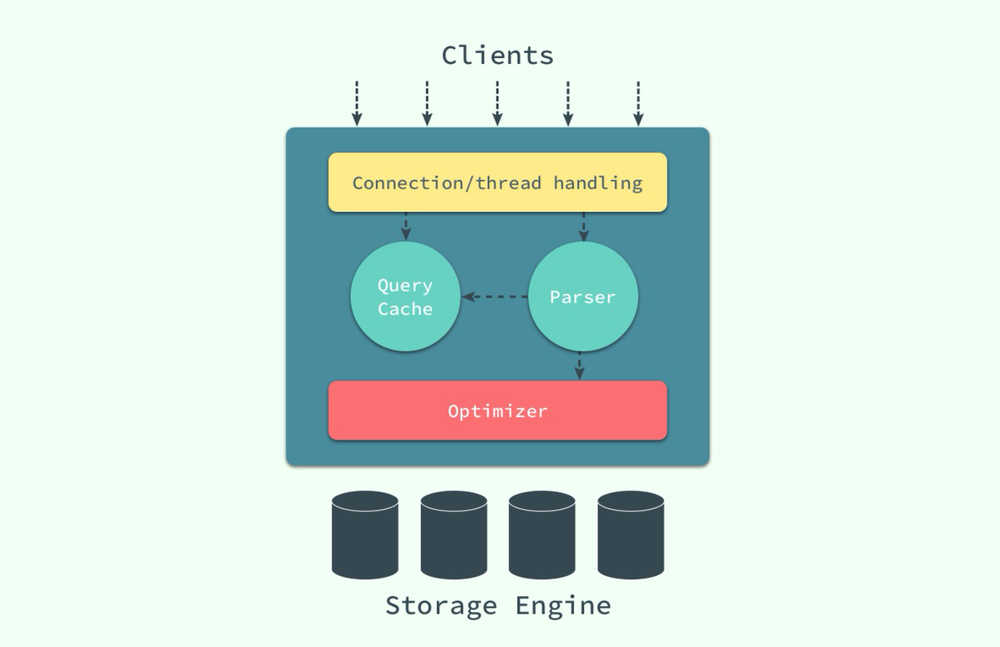

最上层用于连接、线程处理的部分并不是 MySQL 『发明』的，很多服务都有类似的组成部分；第二层中包含了大多数 MySQL 的核心服务，包括了对 SQL 的解析、分析、优化和缓存等功能，存储过程、触发器和视图都是在这里实现的；而第三层就是 MySQL 中真正负责数据的存储和提取的存储引擎，例如：[InnoDB](https://en.wikipedia.org/wiki/InnoDB)、[MyISAM](https://en.wikipedia.org/wiki/MyISAM) 等，文中对存储引擎的介绍都是对 InnoDB 实现的分析。

## 数据的存储

在整个数据库体系结构中，我们可以使用不同的存储引擎来存储数据，而绝大多数存储引擎都以二进制的形式存储数据；这一节会介绍 InnoDB 中对数据是如何存储的。

在 InnoDB 存储引擎中，所有的数据都被**逻辑地**存放在表空间中，表空间（tablespace）是存储引擎中最高的存储逻辑单位，在表空间的下面又包括段（segment）、区（extent）、页（page）：

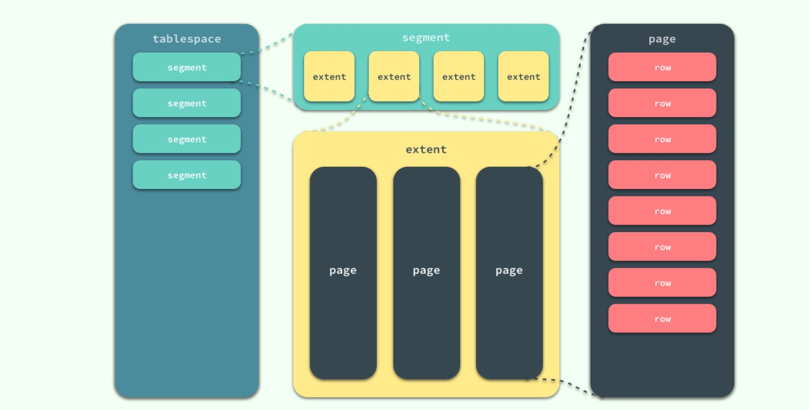

同一个数据库实例的所有表空间都有相同的页大小；默认情况下，表空间中的页大小都为 16KB，当然也可以通过改变 `innodb_page_size` 选项对默认大小进行修改，需要注意的是不同的页大小最终也会导致区大小的不同：

在 InnoDB 存储引擎中，一个区的大小最小为 1MB，页的数量最少为 64 个。

> 每次 IO 读取大小也是 16K，在索引中每个 B+ 树节点为一个页，也就是16k，每一个节点只需要读取一次IO即可。这是MYSQL设计的巧妙之处。

### 如何存储表

MySQL 使用 InnoDB 存储表时，会将**表的定义**和**数据索引**等信息分开存储，其中前者存储在 `.frm` 文件中，后者存储在 `.ibd` 文件中，这一节就会对这两种不同的文件分别进行介绍。

#### .frm 文件

无论在 MySQL 中选择了哪个存储引擎，所有的 MySQL 表都会在硬盘上创建一个 `.frm` 文件用来描述表的格式或者说定义；`.frm` 文件的格式在不同的平台上都是相同的。

```
CREATE TABLE test_frm(
    column1 CHAR(5),
    column2 INTEGER
);
```

当我们使用上面的代码创建表时，会在磁盘上的 `datadir` 文件夹中生成一个 `test_frm.frm` 的文件，这个文件中就包含了表结构相关的信息：

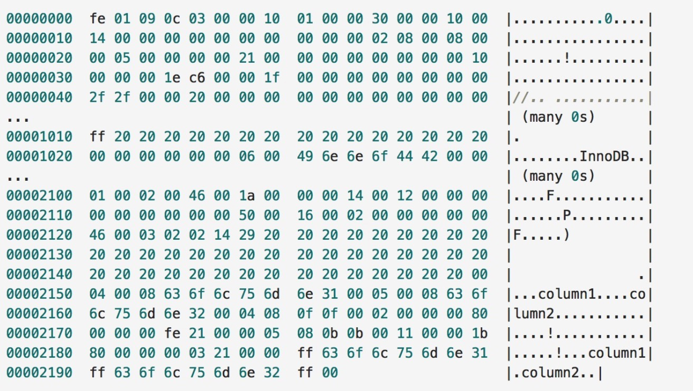

#### .ibd 文件

InnoDB 中用于存储数据的文件总共有两个部分，一是系统表空间文件，包括 `ibdata1`、`ibdata2` 等文件，其中存储了 InnoDB 系统信息和用户数据库表数据和索引，是所有表公用的。

当打开 `innodb_file_per_table` 选项时，`.ibd` 文件就是每一个表独有的表空间，文件存储了当前表的数据和相关的索引数据。

### 如何存储记录

与现有的大多数存储引擎一样，InnoDB 使用页作为磁盘管理的最小单位；数据在 InnoDB 存储引擎中都是按行存储的，每个 16KB 大小的页中可以存放 2-200 行的记录。

当 InnoDB 存储数据时，它可以使用不同的行格式进行存储；MySQL 5.7 版本支持以下格式的行存储方式：

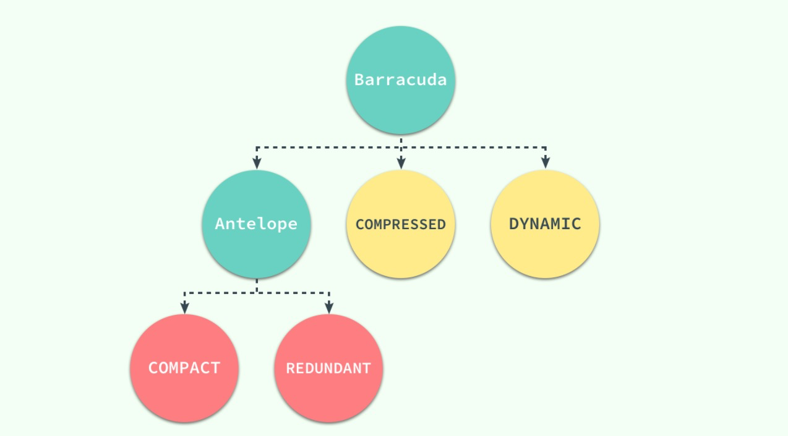

Antelope 是 InnoDB 最开始支持的文件格式，它包含两种行格式 Compact 和 Redundant，它最开始并没有名字；Antelope 的名字是在新的文件格式 Barracuda 出现后才起的，Barracuda 的出现引入了两种新的行格式 Compressed 和 Dynamic；InnoDB 对于文件格式都会向前兼容，而官方文档中也对之后会出现的新文件格式预先定义好了名字：Cheetah、Dragon、Elk 等等。

Compact 和 Redundant 格式最大的不同就是记录格式的第一个部分；在 Compact 中，行记录的第一部分倒序存放了一行数据中列的长度（Length），而 Redundant 中存的是每一列的偏移量（Offset），从总体上上看，Compact 行记录格式相比 Redundant 格式能够减少 20% 的存储空间。

#### 行溢出数据

当 InnoDB 使用 Compact 或者 Redundant 格式存储极长的 VARCHAR 或者 BLOB 这类大对象时，我们并不会直接将所有的内容都存放在数据页节点中，而是将行数据中的前 768 个字节存储在数据页中，后面会通过偏移量指向溢出页。

但是当我们使用新的行记录格式 Compressed 或者 Dynamic 时都只会在行记录中保存 20 个字节的指针，实际的数据都会存放在溢出页面中。

当然在实际存储中，可能会对不同长度的 TEXT 和 BLOB 列进行优化，不过这就不是本文关注的重点了。

### 数据页结构

页是 InnoDB 存储引擎管理数据的最小磁盘单位，而 B-Tree 节点就是实际存放表中数据的页面，我们在这里将要介绍页是如何组织和存储记录的；首先，一个 InnoDB 页有以下七个部分：


每一个页中包含了两对 header/trailer：内部的 Page Header/Page Directory 关心的是页的状态信息，而 Fil Header/Fil Trailer 关心的是记录页的头信息。

在页的头部和尾部之间就是用户记录和空闲空间了，每一个数据页中都包含 Infimum 和 Supremum 这两个**虚拟**的记录（可以理解为占位符），Infimum 记录是比该页中任何主键值都要小的值，Supremum 是该页中的最大值：


User Records 就是整个页面中真正用于存放行记录的部分，而 Free Space 就是空余空间了，它是一个链表的数据结构，为了保证插入和删除的效率，整个页面并不会按照主键顺序对所有记录进行排序，它会自动从左侧向右寻找空白节点进行插入，行记录在物理存储上并不是按照顺序的，它们之间的顺序是由 `next_record` 这一指针控制的。

B+ 树在查找对应的记录时，并不会直接从树中找出对应的行记录，它只能获取记录所在的页，将整个页加载到内存中，再通过 Page Directory 中存储的稀疏索引和 `n_owned`、`next_record` 属性取出对应的记录，不过因为这一操作是在内存中进行的，所以通常会忽略这部分查找的耗时。

InnoDB 存储引擎中对数据的存储是一个非常复杂的话题，这一节中也只是对表、行记录以及页面的存储进行一定的分析和介绍，虽然作者相信这部分知识对于大部分开发者已经足够了，但是想要真正消化这部分内容还需要很多的努力和实践。

## 索引

索引是数据库中非常非常重要的概念，它是存储引擎能够快速定位记录的秘密武器，对于提升数据库的性能、减轻数据库服务器的负担有着非常重要的作用；**索引优化是对查询性能优化的最有效手段**，它能够轻松地将查询的性能提高几个数量级。

### 索引的数据结构

在上一节中，我们谈了行记录的存储和页的存储，在这里我们就要从更高的层面看 InnoDB 中对于数据是如何存储的；InnoDB 存储引擎在绝大多数情况下使用 B+ 树建立索引，这是关系型数据库中查找最为常用和有效的索引，但是 B+ 树索引并不能找到一个给定键对应的具体值，**它只能找到数据行对应的页**，然后正如上一节所提到的，数据库把整个页读入到内存中，并在内存中查找具体的数据行。

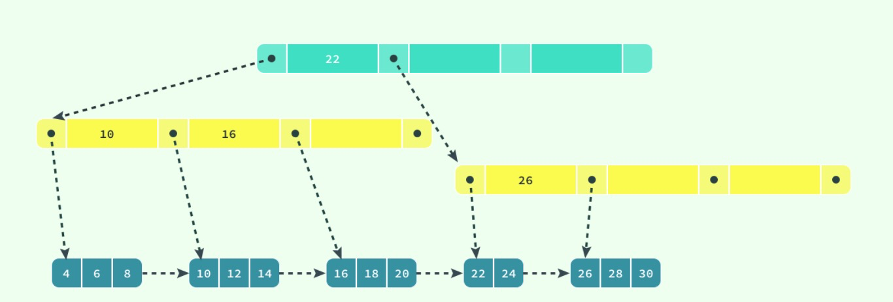

B+ 树是平衡树，**它查找任意节点所耗费的时间都是完全相同的**，比较的次数就是 B+ 树的高度。 B+ 树层级低，相对于 B 树占用空间少。

### 聚集索引和辅助索引

数据库中的 B+ 树索引可以分为聚集索引（clustered index）和辅助索引（secondary index），它们之间的最大区别就是，聚集索引中存放着一条行记录的全部信息，而辅助索引中只包含索引列和一个用于查找对应行记录的『书签』。

#### 聚集索引

InnoDB 存储引擎中的表都是使用索引组织的，也就是按照键的顺序存放；聚集索引就是按照表中主键的顺序构建一颗 B+ 树，并在叶节点中存放表中的行记录数据。

```sql
CREATE TABLE users(
    id INT NOT NULL,
    first_name VARCHAR(20) NOT NULL,
    last_name VARCHAR(20) NOT NULL,
    age INT NOT NULL,
    PRIMARY KEY(id),
    KEY(last_name, first_name, age)
    KEY(first_name)
);
```

如果使用上面的 SQL 在数据库中创建一张表，B+ 树就会使用 `id` 作为索引的键，并在叶子节点中存储一条记录中的**所有**信息。

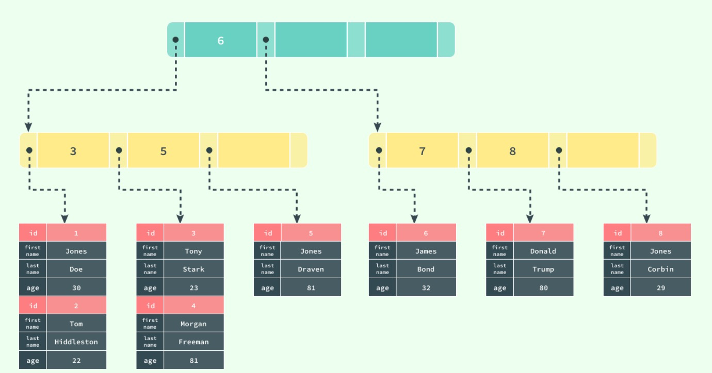

> 图中对 B+ 树的描述与真实情况下 B+ 树中的数据结构有一些差别，不过这里想要表达的主要意思是：聚集索引叶节点中保存的是整条行记录，而不是其中的一部分。

聚集索引与表的物理存储方式有着非常密切的关系，所有正常的表应该**有且仅有一个**聚集索引（绝大多数情况下都是主键），表中的所有行记录数据都是按照**聚集索引**的顺序存放的。

当我们使用聚集索引对表中的数据进行检索时，可以直接获得聚集索引所对应的整条行记录数据所在的页，不需要进行第二次操作。

#### 辅助索引

数据库将所有的非聚集索引都划分为辅助索引，但是这个概念对我们理解辅助索引并没有什么帮助；辅助索引也是通过 B+ 树实现的，但是它的叶节点并不包含行记录的全部数据，仅包含索引中的所有键和一个用于查找对应行记录的『书签』，在 InnoDB 中这个书签就是当前记录的主键。

辅助索引的存在并不会影响聚集索引，因为聚集索引构成的 B+ 树是数据实际存储的形式，而辅助索引只用于加速数据的查找，所以一张表上往往有多个辅助索引以此来提升数据库的性能。

> 一张表一定包含一个聚集索引构成的 B+ 树以及若干辅助索引的构成的 B+ 树。

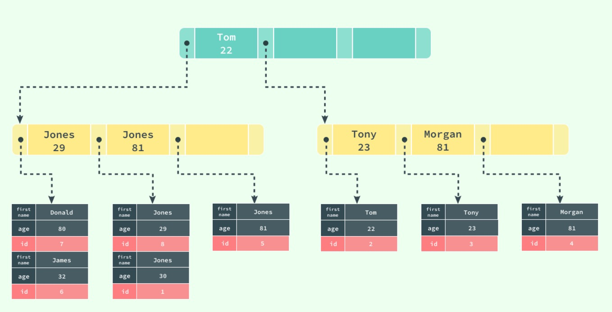

如果在表 `users` 中存在一个辅助索引 `(first_name, age)`，那么它构成的 B+ 树大致就是上图这样，按照 `(first_name, age)` 的字母顺序对表中的数据进行排序，当查找到主键时，再通过聚集索引获取到整条行记录。

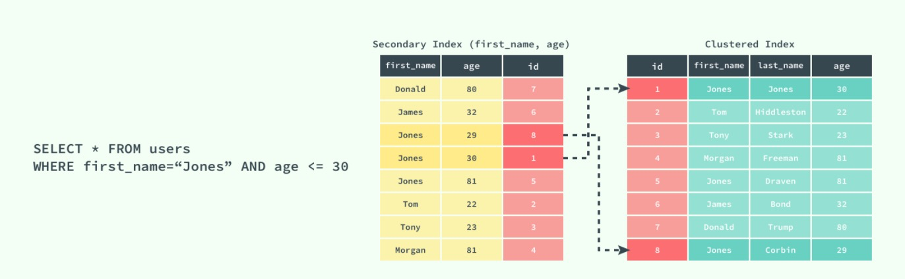

上图展示了一个使用辅助索引查找一条表记录的过程：通过辅助索引查找到对应的主键，最后在聚集索引中使用主键获取对应的行记录，这也是通常情况下行记录的查找方式。

### 索引的设计

索引的设计其实是一个非常重要的内容，同时也是一个非常复杂的内容；索引的设计与创建对于提升数据库的查询性能至关重要，不过这不是本文想要介绍的内容，有关索引的设计与优化可以阅读 [数据库索引设计与优化](https://draveness.me/mysql-innodb/数据库索引设计与优化) 一书，书中提供了一种非常科学合理的方法能够帮助我们在数据库中建立最适合的索引，当然作者也可能会在之后的文章中对索引的设计进行简单的介绍和分析。

## 锁

我们都知道锁的种类一般分为乐观锁和悲观锁两种，InnoDB 存储引擎中使用的就是悲观锁，而按照锁的粒度划分，也可以分成行锁和表锁。

### 并发控制机制

乐观锁和悲观锁其实都是并发控制的机制，同时它们在原理上就有着本质的差别；

- 乐观锁是一种思想，它其实并不是一种真正的『锁』，它会先尝试对资源进行修改，在写回时判断资源是否进行了改变，如果没有发生改变就会写回，否则就会进行重试，在整个的执行过程中其实都**没有对数据库进行加锁**；
- 悲观锁就是一种真正的锁了，它会在获取资源前对资源进行加锁，确保同一时刻只有有限的线程能够访问该资源，其他想要尝试获取资源的操作都会进入等待状态，直到该线程完成了对资源的操作并且释放了锁后，其他线程才能重新操作资源；

虽然乐观锁和悲观锁在本质上并不是同一种东西，一个是一种思想，另一个是一种真正的锁，但是它们都是一种并发控制机制。

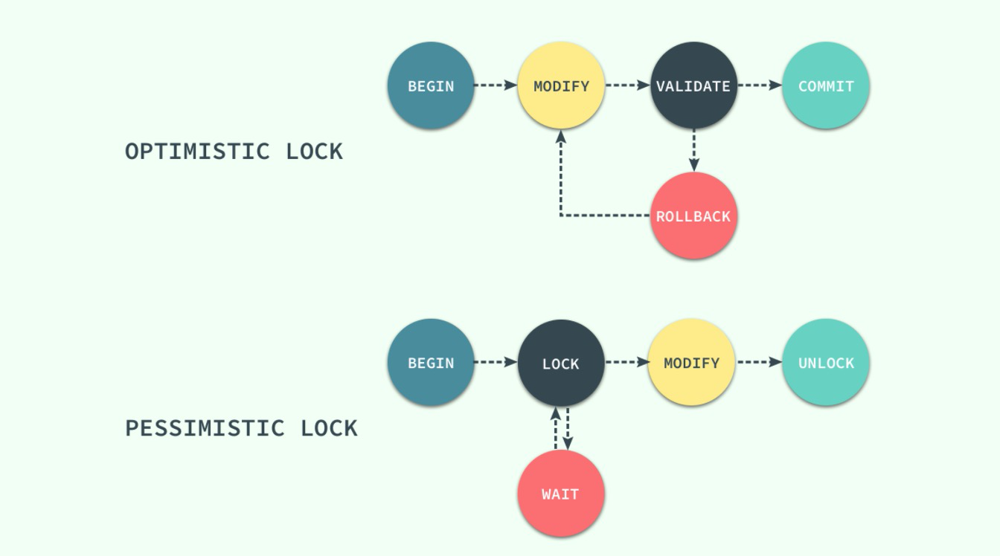

乐观锁不会存在死锁的问题，但是由于更新后验证，所以当**冲突频率**和**重试成本**较高时更推荐使用悲观锁，而需要非常高的**响应速度**并且**并发量**非常大的时候使用乐观锁就能较好的解决问题，在这时使用悲观锁就可能出现严重的性能问题；在选择并发控制机制时，需要综合考虑上面的四个方面（冲突频率、重试成本、响应速度和并发量）进行选择。

### 锁的种类

对数据的操作其实只有两种，也就是读和写，而数据库在实现锁时，也会对这两种操作使用不同的锁；InnoDB 实现了标准的行级锁，也就是共享锁（Shared Lock）和互斥锁（Exclusive Lock）；共享锁和互斥锁的作用其实非常好理解：

- **共享锁（读锁）**：允许事务对一条行数据进行读取；
- **互斥锁（写锁）**：允许事务对一条行数据进行删除或更新；

而它们的名字也暗示着各自的另外一个特性，共享锁之间是兼容的，而互斥锁与其他任意锁都不兼容：

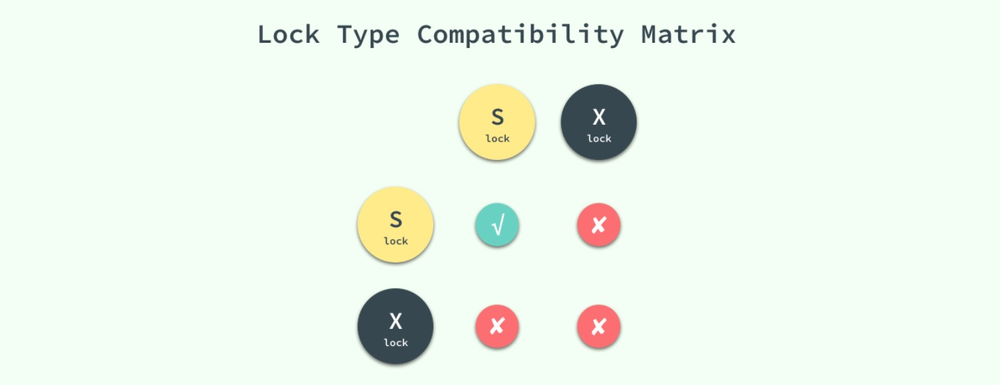

稍微对它们的使用进行思考就能想明白它们为什么要这么设计，因为共享锁代表了读操作、互斥锁代表了写操作，所以我们可以在数据库中**并行读**，但是只能**串行写**，只有这样才能保证不会发生线程竞争，实现线程安全。

### 锁的粒度

无论是共享锁还是互斥锁其实都只是对某一个数据行进行加锁，InnoDB 支持多种粒度的锁，也就是行锁和表锁；为了支持多粒度锁定，InnoDB 存储引擎引入了意向锁（Intention Lock），意向锁就是一种表级锁。

与上一节中提到的两种锁的种类相似的是，意向锁也分为两种：

- **意向共享锁**：事务想要在获得表中某些记录的共享锁，需要在表上先加意向共享锁；
- **意向互斥锁**：事务想要在获得表中某些记录的互斥锁，需要在表上先加意向互斥锁；

随着意向锁的加入，锁类型之间的兼容矩阵也变得愈加复杂：

​	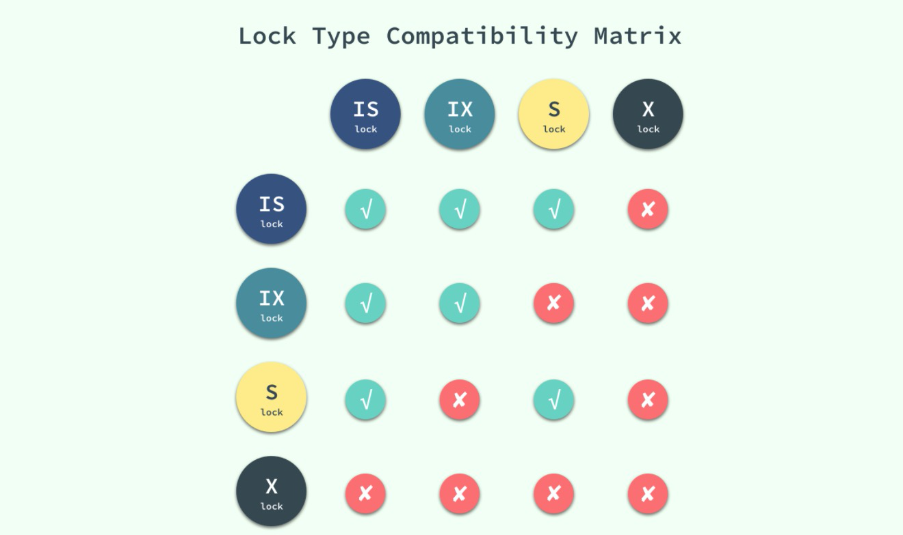

意向锁其实不会阻塞全表扫描之外的任何请求，它们的主要目的是为了表示**是否有人请求锁定表中的某一行数据**。

> 有的人可能会对意向锁的目的并不是完全的理解，我们在这里可以举一个例子：如果没有意向锁，当已经有人使用行锁对表中的某一行进行修改时，如果另外一个请求要对全表进行修改，那么就需要对所有的行是否被锁定进行扫描，在这种情况下，效率是非常低的；不过，在引入意向锁之后，当有人使用行锁对表中的某一行进行修改之前，会先为表添加意向互斥锁（IX），再为行记录添加互斥锁（X），在这时如果有人尝试对全表进行修改就不需要判断表中的每一行数据是否被加锁了，只需要通过等待意向互斥锁被释放就可以了。

### 锁的算法

到目前为止已经对 InnoDB 中锁的粒度有一定的了解，也清楚了在对数据库进行读写时会获取不同的锁，在这一小节将介绍锁是如何添加到对应的数据行上的，我们会分别介绍三种锁的算法：Record Lock、Gap Lock 和 Next-Key Lock。

#### Record Lock

记录锁（Record Lock）是加到**索引记录**上的锁，假设我们存在下面的一张表 `users`：

```sql
CREATE TABLE users(
    id INT NOT NULL AUTO_INCREMENT,
    last_name VARCHAR(255) NOT NULL,
    first_name VARCHAR(255),
    age INT,
    PRIMARY KEY(id),
    KEY(last_name),
    KEY(age)
);
```

> 如果我们使用 `id` 或者 `last_name` 作为 SQL 中 `WHERE` 语句的过滤条件，那么 InnoDB 就可以通过索引建立的 B+ 树找到行记录并添加锁，但是如果使用 `first_name` 作为过滤条件时，由于 InnoDB 不知道待修改的记录具体存放的位置，也无法对将要修改哪条记录提前做出判断就会锁定整个表。

#### Gap Lock

记录锁是在存储引擎中最为常见的锁，除了记录锁之外，InnoDB 中还存在间隙锁（Gap Lock），间隙锁是对索引记录中的一段连续区域的锁；当使用类似 `SELECT * FROM users WHERE id BETWEEN 10 AND 20 FOR UPDATE;` 的 SQL 语句时，就会阻止其他事务向表中插入 `id = 15` 的记录，因为整个范围都被间隙锁锁定了。

> 间隙锁是存储引擎对于性能和并发做出的权衡，并且只用于某些事务隔离级别。

虽然间隙锁中也分为共享锁和互斥锁，不过它们之间并不是互斥的，也就是不同的事务可以同时持有一段相同范围的共享锁和互斥锁，它唯一阻止的就是**其他事务向这个范围中添加新的记录**。

#### Next-Key Lock

Next-Key 锁相比前两者就稍微有一些复杂，它是记录锁和记录前的间隙锁的结合，在 `users` 表中有以下记录：

```
+------|-------------|--------------|-------+
|   id | last_name   | first_name   |   age |
|------|-------------|--------------|-------|
|    4 | stark       | tony         |    21 |
|    1 | tom         | hiddleston   |    30 |
|    3 | morgan      | freeman      |    40 |
|    5 | jeff        | dean         |    50 |
|    2 | donald      | trump        |    80 |
+------|-------------|--------------|-------+
```

如果使用 Next-Key 锁，那么 Next-Key 锁就可以在需要的时候锁定以下的范围：

```sql
(-∞, 21]
(21, 30]
(30, 40]
(40, 50]
(50, 80]
(80, ∞)
```

> 既然叫 Next-Key 锁，锁定的应该是当前值和后面的范围，但是实际上却不是，Next-Key 锁锁定的是当前值和前面的范围。

当我们更新一条记录，比如 `SELECT * FROM users WHERE age = 30 FOR UPDATE;`，InnoDB 不仅会在范围 `(21, 30]` 上加 Next-Key 锁，还会在这条记录后面的范围 `(30, 40]` 加间隙锁，所以插入 `(21, 40]` 范围内的记录都会被锁定。

Next-Key 锁的作用其实是为了解决幻读的问题，我们会在下一节谈事务的时候具体介绍。

## 事务与隔离级别

在介绍了锁之后，我们再来谈谈数据库中一个非常重要的概念 —— 事务；相信只要是一个合格的软件工程师就对事务的特性有所了解，其中被人经常提起的就是事务的原子性，在数据提交工作时，要么保证所有的修改都能够提交，要么就所有的修改全部回滚。

但是事务还遵循包括原子性在内的 ACID 四大特性：原子性（Atomicity）、一致性（Consistency）、隔离性（Isolation）和持久性（Durability）；文章不会对这四大特性全部展开进行介绍，相信你能够通过 Google 和数据库相关的书籍轻松获得有关它们的概念，本文最后要介绍的就是事务的四种隔离级别。

### 几种隔离级别

事务的隔离性是数据库处理数据的几大基础之一，而隔离级别其实就是提供给用户用于在性能和可靠性做出选择和权衡的配置项。

ISO 和 ANIS SQL 标准制定了四种事务隔离级别，而 InnoDB 遵循了 SQL:1992 标准中的四种隔离级别：`READ UNCOMMITED`、`READ COMMITED`、`REPEATABLE READ` 和 `SERIALIZABLE`；每个事务的隔离级别其实都比上一级多解决了一个问题：

- `RAED UNCOMMITED`：使用查询语句不会加锁，可能会读到未提交的行（Dirty Read）；
- `READ COMMITED`：只对记录加记录锁，而不会在记录之间加间隙锁，所以允许新的记录插入到被锁定记录的附近，所以再多次使用查询语句时，可能得到不同的结果（Non-Repeatable Read）；
- `REPEATABLE READ`：多次读取同一范围的数据会返回第一次查询的快照，不会返回不同的数据行，但是可能发生幻读（Phantom Read）；
- `SERIALIZABLE`：InnoDB 隐式地将全部的查询语句加上共享锁，解决了幻读的问题；

MySQL 中默认的事务隔离级别就是 `REPEATABLE READ`，但是它通过 Next-Key 锁也能够在某种程度上解决幻读的问题。

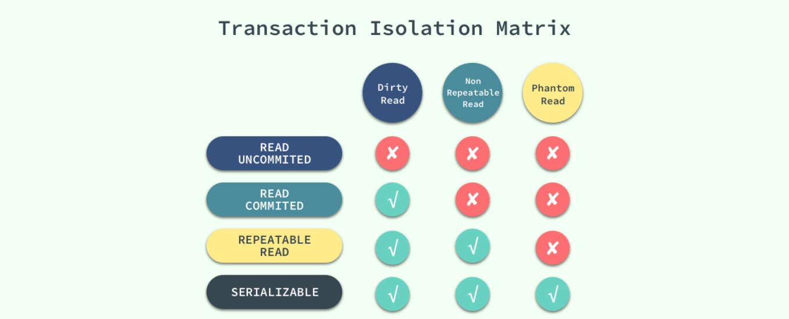

接下来，我们将数据库中创建如下的表并通过个例子来展示在不同的事务隔离级别之下，会发生什么样的问题：

```sql
CREATE TABLE test(
    id INT NOT NULL,
    UNIQUE(id)
);
```

### 脏读

> 在一个事务中，读取了其他事务未提交的数据。

当事务的隔离级别为 `READ UNCOMMITED` 时，我们在 `SESSION 2` 中插入的**未提交**数据在 `SESSION 1` 中是可以访问的。

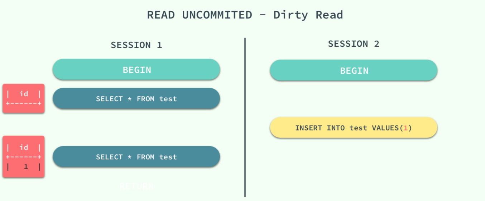

### 不可重复读

> 在一个事务中，同一行记录被访问了两次却得到了不同的结果。

当事务的隔离级别为 `READ COMMITED` 时，虽然解决了脏读的问题，但是如果在 `SESSION 1` 先查询了**一行**数据，在这之后 `SESSION 2` 中修改了同一行数据并且提交了修改，在这时，如果 `SESSION 1` 中再次使用相同的查询语句，就会发现两次查询的结果不一样。

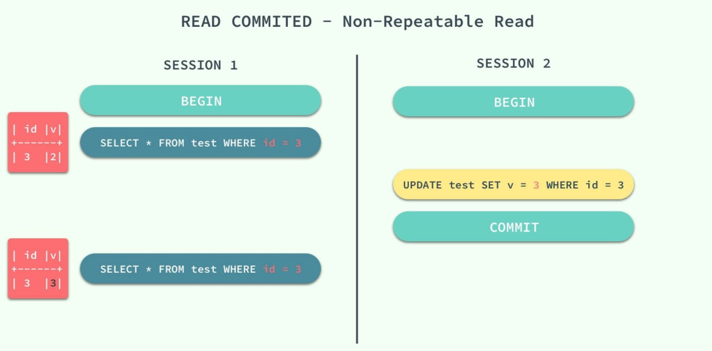

不可重复读的原因就是，在 `READ COMMITED` 的隔离级别下，存储引擎不会在查询记录时添加行锁，锁定 `id = 3` 这条记录。

### 幻读

> 在一个事务中，同一个范围内的记录被读取时，其他事务向这个范围添加了新的记录。

重新开启了两个会话 `SESSION 1` 和 `SESSION 2`，在 `SESSION 1` 中我们查询全表的信息，没有得到任何记录；在 `SESSION 2` 中向表中插入一条数据并提交；由于 `REPEATABLE READ` 的原因，再次查询全表的数据时，我们获得到的仍然是空集，但是在向表中插入同样的数据却出现了错误。

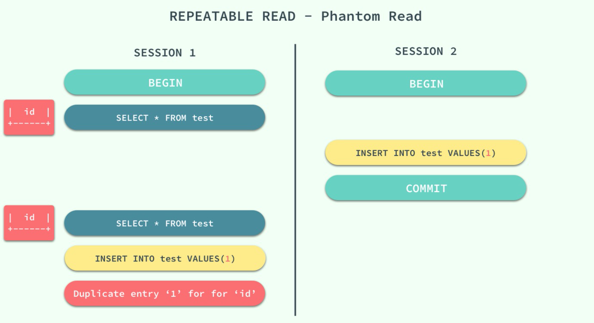

这种现象在数据库中就被称作幻读，虽然我们使用查询语句得到了一个空的集合，但是插入数据时却得到了错误，好像之前的查询是幻觉一样。

在标准的事务隔离级别中，幻读是由更高的隔离级别 `SERIALIZABLE` 解决的，但是它也可以通过 MySQL 提供的 Next-Key 锁解决：

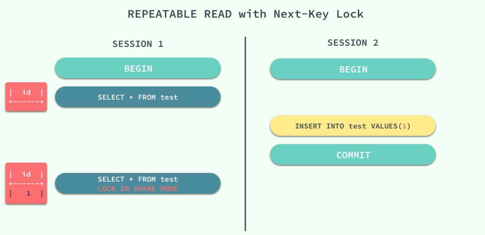

`REPEATABLE READ` 和 `READ UNCOMMITED` 其实是矛盾的，如果保证了前者就看不到已经提交的事务，如果保证了后者，就会导致两次查询的结果不同，MySQL 为我们提供了一种折中的方式，能够在 `REPEATABLE READ` 模式下加锁访问已经提交的数据，其本身并不能解决幻读的问题，而是通过文章前面提到的 Next-Key 锁来解决。

## 面试题

#### MySQL 中 varchar 与 char 的区别？varchar(50) 中的 50 代表的涵义？

- 1、varchar 与 char 的区别，char 是一种固定长度的类型，varchar 则是一种可变长度的类型。
- 2、varchar(50) 中 50 的含义最多存放 50 个字符。varchar(50) 和 (200) 存储 hello 所占空间一样，**但后者在排序时会消耗更多内存，因为 `ORDER BY col` 采用 fixed_length 计算 col 长度(memory引擎也一样)**。

#### **int(11) 中的 11 代表什么涵义？**

int(11) 中的 11 ，不影响字段存储的范围，只影响展示效果，当值不足 11 位时，会进行 0 补足。大于11位，可以正常存储。

#### MySQL 有哪些存储引擎

- InnoDB
- MyISAM
- MRG_MYISAM
- MEMORY
- CSV
- ARCHIVE
- BLACKHOLE
- PERFORMANCE_SCHEMA
- FEDERATED

####  InnoDB 优势是什么？

- 【最重要】支持事务。
- 支持行级锁和表级锁，能支持更多的并发量。
- 查询不加锁，完全不影响查询。
- 支持崩溃后恢复。

#### 请说明 InnoDB 和 MyISAM 的区别？

|              | InnoDB                 | MyISAM                 |
| :----------- | :--------------------- | :--------------------- |
| 事务         | 支持                   | 不支持                 |
| 存储限制     | 64TB                   | 无                     |
| 锁粒度       | 行锁                   | 表锁                   |
| 崩溃后的恢复 | 支持                   | 不支持                 |
| 外键         | 支持                   | 不支持                 |
| 全文检索     | 5.7 版本后支持         | 支持                   |
| 主键         | 必须有，主键查询效率高 | 非必须，主键查询效率低 |

#### 索引的类型？

- 1、普通索引：最基本的索引，没有任何约束。
- 2、唯一索引：与普通索引类似，但具有唯一性约束。
- 3、主键索引：特殊的唯一索引，不允许有空值。
- 4、复合索引：将多个列组合在一起创建索引，可以覆盖多个列。
- 5、外键索引：只有InnoDB类型的表才可以使用外键索引，保证数据的一致性、完整性和实现级联操作。
- 6、全文索引：MySQL 自带的全文索引只能用于 InnoDB、MyISAM ，并且只能对英文进行全文检索，一般使用全文索引引擎。

#### **MySQL 索引的“创建”原则？**

- 1、最适合索引的列是出现在 `WHERE` 子句中的列，或连接子句中的列，而不是出现在 `SELECT` 关键字后的列。
- 2、索引列的基数越大，索引效果越好。
- 3、根据情况创建复合索引，复合索引可以提高查询效率。
- 4、避免创建过多的索引，索引会额外占用磁盘空间，降低写操作效率。
- 5、主键尽可能选择较短的数据类型，可以有效减少索引的磁盘占用提高查询效率。
- 6、对字符串进行索引，应该定制一个前缀长度，可以节省大量的索引空间。

确定前缀索引长度方法：https://blog.csdn.net/tuzhen007/article/details/17008467

#### 为什么Mysql用B+树做索引而不用B-树或红黑树

**B+ 树层级更加低，同时顺序查询方面 B+树更好。**

**B+相对于B-数据占用存储空间比较少。** B+树只有叶节点存放数据，其余节点用来索引，而B-树是每个索引节点都会有Data域。所以从Mysql（Inoodb）的角度来看，B+树是用来充当索引的，一般来说索引非常大，尤其是关系性数据库这种数据量大的索引能达到亿级别，所以为了减少内存的占用，索引也会被存储在磁盘上。
**B+树降低磁盘IO次数。** B-树/B+树 的特点就是每层节点数目非常多，层数很少，目的就是为了就少磁盘IO次数，但是B-树的每个节点都有data域（指针），这无疑增大了节点大小，说白了增加了磁盘IO次数（**磁盘IO一次读出的数据量大小是固定的，单个数据变大，每次读出的就少，IO次数增多，一次IO多耗时**），而B+树除了叶子节点其它节点并不存储数据，节点小，磁盘IO次数就少。
**B+树支持遍历。**B+树所有的Data域在叶子节点，一般来说都会进行一个优化，就是**将所有的叶子节点用指针串起来**。这样**遍历**叶子节点就能获得全部数据，这样就能进行区间访问啦。在数据库中基于范围的查询是非常频繁的，而B树不支持这样的遍历操作。

##### B树相对于红黑树的区别

**AVL 数和红黑树基本都是存储在内存中才会使用的数据结构**。在大规模数据存储的时候，红黑树往往出现由于**树的深度过大**而造成磁盘IO读写过于频繁，进而导致效率低下的情况。为什么会出现这样的情况，我们知道要获取磁盘上数据，必须先通过磁盘移动臂移动到数据所在的柱面，然后找到指定盘面，接着旋转盘面找到数据所在的磁道，最后对数据进行读写。磁盘IO代价主要花费在查找所需的柱面上，树的深度过大会造成磁盘IO频繁读写。根据**磁盘查找存取的次数往往由树的高度所决定**，所以，只要我们通过某种较好的树结构减少树的结构尽量减少树的高度，B树可以有多个子女，从几十到上千，可以降低树的高度。

**数据库系统的设计者巧妙利用了磁盘预读原理**，将一个节点的大小设为等于一个页，这样每个节点只需要一次I/O就可以完全载入。为了达到这个目的，在实际实现 B-Tree 还需要使用如下技巧：每次新建节点时，直接申请一个页的空间，这样就保证**一个节点物理上也存储在一个页里**，加之计算机存储分配都是按页对齐的，就实现了一个节点只需一次I/O。

http://blog.codinglabs.org/articles/theory-of-mysql-index.html

#### MySQL有哪些索引实现方案？

- B-Tree 索引。
- Hash 索引。

https://www.cnblogs.com/igoodful/p/9361500.html

#### MYSQL B+ 树有那些索引类型？

- 主键索引的叶子节点存的数据是整行数据( 即具体数据 )。在 InnoDB 里，主键索引也被称为**聚集索引**（clustered index）。
- 非主键索引的叶子节点存的数据是整行数据的主键，键值是索引。在 InnoDB 里，非主键索引也被称为**辅助索引**（secondary index）。

聚集索引是要确定唯一性的，聚集索引可以非唯一的

#### **什么是索引的最左匹配特性？**

当 B+Tree 的数据项是复合的数据结构，比如索引 `(name, age, sex)` 的时候，B+Tree 是按照从左到右的顺序来建立搜索树的。

b+树会优先比较name来确定下一步的所搜方向，如果name相同再依次比较age和sex，最后得到检索的数据；但当(20,F)这样的没有name的数据来的时候，b+树就不知道下一步该查哪个节点，因为建立搜索树的时候name就是第一个比较因子，必须要先根据name来搜索才能知道下一步去哪里查询。比如当(张三,F)这样的数据来检索时，b+树可以用name来指定搜索方向，但下一个字段age的缺失，所以只能把名字等于张三的数据都找到，然后再匹配性别是F的数据了， 这个是非常重要的性质，即索引的最左匹配特性。

#### 事务的特性？

1. **原子性** Atomicity ：**一个事务（transaction）中的所有操作，或者全部完成，或者全部不完成，不会结束在中间某个环节**。事务在执行过程中发生错误，会被恢复（Rollback）到事务开始前的状态，就像这个事务从来没有执行过一样。即，事务不可分割、不可约简。
2. **一致性** Consistency ：在事务开始之前和事务结束以后，数据库的完整性没有被破坏。这表示写入的资料必须完全符合所有的预设[约束](https://zh.wikipedia.org/wiki/数据完整性)、[触发器](https://zh.wikipedia.org/wiki/触发器_(数据库))、[级联回滚](https://zh.wikipedia.org/w/index.php?title=级联回滚&action=edit&redlink=1)等。
3. **隔离性** Isolation ：数据库允许多个并发事务同时对其数据进行读写和修改的能力，**隔离性可以防止多个事务并发执行时由于交叉执行而导致数据的不一致**。事务隔离分为不同级别，包括读未提交（Read uncommitted）、读提交（read committed）、可重复读（repeatable read）和串行化（Serializable）。
4. **持久性** Durability ：事务处理结束后，**对数据的修改就是永久的**，即便系统故障也不会丢失。

#### 四种事务类型？

- READ UNCOMMITTED（未提交读）：事务中的修改，即使没有提交，对其他事务也都是可见的，产生脏读。
- READ COMMITTED（提交读）：事务从开始直到提交之前，所做的任何修改对其他事务都是不可见的，产生不可重复读。
- REPEATABLE READ（可重复读）：一个事务按相同的查询条件读取以前检索过的数据，其他事务插入了满足其查询条件的新数据。产生幻。
- SERIALIZABLE（可串行化）：强制事务串行执行。

| 事务隔离级别                 | 脏读 | 不可重复读 | 幻读    |
| :--------------------------- | :--- | :--------- | :------ |
| 读未提交（read-uncommitted） | 是   | 是         | 是      |
| 读已提交（read-committed）   | 否   | 是         | 是      |
| 可重复读（repeatable-read）  | 否   | 否         | 是（x） |
| 串行化（serializable）       | 否   | 否         | 否      |

MySQL 默认的事务隔离级别为可重复读（repeatable-read）。

#### MYSQL 乐观锁和悲观锁的实现方式？

乐观锁：MVCC

悲观锁：`SELECT xxx FROM t WHERE id = ? FOR UPDATE`

#### **MySQL 中 InnoDB 引擎的行锁是通过加在什么上完成(或称实现)的？为什么是这样子的？？**

InnoDB 是基于索引来完成行锁。例如：`SELECT * FROM tab_with_index WHERE id = 1 FOR UPDATE` 。

- `FOR UPDATE` 可以根据条件来完成**行锁**锁定，并且 id 是有索引键的列,如果 id 不是索引键那么 InnoDB 将完成**表锁**，并发将无从谈起。

#### **MySQL 的锁机制？**

Innodb 的锁的策略为 next-key 锁，即 record lock + gap lock ，是通过在 index 上加 lock 实现的。

- 如果 index 为 unique index ，则降级为 record lock 行锁。
- 如果是普通 index ，则为 next-key lock 。
- 如果没有 index ，则直接锁住全表，即表锁。

#### MYSQL范围查询有哪些要注意的？

- 大于、小于范围时，该条件之后的索引都不生效，当前索引生效
- 多个比较大小的范围查询时，可能存在只有一个比较大小索引命中，其他的都不命中的可能性

https://draveness.me/mysql-innodb

### 数据库事务的实现？

数据库进行任何写入操作的时候都是要先写日志的，同样的道理，我们在执行事务的时候数据库首先会记录下这个事务的redo操作日志，然后才开始真正操作数据库，在操作之前首先会把日志文件写入磁盘，那么当突然断电的时候，即使操作没有完成，在重新启动数据库时候，数据库会根据当前数据的情况进行undo回滚或者是redo前滚，这样就保证了数据的强一致性。

### Mysql 数据库能存储多少数据

一般来讲，单一数据库实例的数据的阈值在1TB之内，是比较合理的范围。

### 分库分表之间的优点和缺点

### bit 和 tinyint 的区别及使用场景？

tinyint是数字类型,存储小数, 一般对应编辑语言里的小字典或枚举类型. 节省空间的同时, 避免存入超范围的值。

bit类似多用于存储状态. 如bit(1) 直接对应Java语言的布尔类型true和false. 用做状态保存时一个字段可以保存多至64个状态.
如我开发的某个系统需要保存对用户发送短信的状态,有10几种不同类型的短信,每种都要标记发过没有, 这时候用bit类型就很方便,当然用int也能实现, 但用bit更符合语义. 查询或更新某个状态时按位操作即可。

### BigDecimal 与 Float、Double 区别

Float、Double 在运算场景，比如sum中，就会存在失去精度的情况存在。

### **MySQL的binlog有有几种录入格式？分别有什么区别？**

有三种格式，statement，row和mixed。

- statement模式下，每一条会修改数据的sql都会记录在binlog中。不需要记录每一行的变化，减少了binlog日志量，节约了IO，提高性能。由于sql的执行是有上下文的，因此在保存的时候需要保存相关的信息，同时还有一些使用了函数之类的语句无法被记录复制。
- row级别下，不记录sql语句上下文相关信息，仅保存哪条记录被修改。记录单元为每一行的改动，基本是可以全部记下来但是由于很多操作，会导致大量行的改动(比如alter table)，因此这种模式的文件保存的信息太多，日志量太大。
- mixed，一种折中的方案，普通操作使用statement记录，当无法使用statement的时候使用row。

此外，新版的MySQL中对row级别也做了一些优化，当表结构发生变化的时候，会记录语句而不是逐行记录。

### MySQL的binlog有几种录入格式？分别有什么区别？

有三种格式，statement，row和mixed。

- statement模式下，每一条会修改数据的sql都会记录在binlog中。不需要记录每一行的变化，减少了binlog日志量，节约了IO，提高性能。由于sql的执行是有上下文的，因此在保存的时候需要保存相关的信息，同时还有一些使用了函数之类的语句无法被记录复制。
- row级别下，不记录sql语句上下文相关信息，仅保存哪条记录被修改。记录单元为每一行的改动，基本是可以全部记下来但是由于很多操作，会导致大量行的改动(比如alter table)，因此这种模式的文件保存的信息太多，日志量太大。
- mixed，一种折中的方案，普通操作使用statement记录，当无法使用statement的时候使用row。

此外，新版的MySQL中对row级别也做了一些优化，当表结构发生变化的时候，会记录语句而不是逐行记录。

### order by

当我们使用order by将查询结果按照某个字段排序时，如果该字段没有建立索引，那么执行计划会将查询出的所有数据使用外部排序（将数据从硬盘分批读取到内存使用内部排序，最后合并排序结果），这个操作是很影响性能的，因为需要将查询涉及到的所有数据从磁盘中读到内存（如果单条数据过大或者数据量过多都会降低效率），更无论读到内存之后的排序了。

### 哪些场景应该考虑索引

- order by
- join 条件

### 数据库三大范式是什么

第一范式：每个列都不可以再拆分。

第二范式：在第一范式的基础上，非主键列完全依赖于主键，而不能是依赖于主键的一部分。

第三范式：在第二范式的基础上，非主键列只依赖于主键，不依赖于其他非主键。

### **索引的数据结构（b树，hash）**

索引的数据结构和具体存储引擎的实现有关，在MySQL中使用较多的索引有Hash索引，B+树索引等，而我们经常使用的InnoDB存储引擎的默认索引实现为：B+树索引。对于哈希索引来说，底层的数据结构就是哈希表，因此在绝大多数需求为单条记录查询的时候，可以选择哈希索引，查询性能最快；其余大部分场景，建议选择BTree索引。

### **索引设计的原则？**

1. 适合索引的列是出现在where子句中的列，或者连接子句中指定的列
2. 基数较小的类，索引效果较差，没有必要在此列建立索引
3. 使用短索引，如果对长字符串列进行索引，应该指定一个前缀长度，这样能够节省大量索引空间
4. 不要过度索引。索引需要额外的磁盘空间，并降低写操作的性能。在修改表内容的时候，索引会进行更新甚至重构，索引列越多，这个时间就会越长。所以只保持需要的索引有利于查询即可。

### **创建索引的原则（重中之重）**

索引虽好，但也不是无限制的使用，最好符合一下几个原则

1） 最左前缀匹配原则，组合索引非常重要的原则，mysql会一直向右匹配直到遇到范围查询(>、<、between、like)就停止匹配，比如a = 1 and b = 2 and c > 3 and d = 4 如果建立(a,b,c,d)顺序的索引，d是用不到索引的，如果建立(a,b,d,c)的索引则都可以用到，a,b,d的顺序可以任意调整。

2）较频繁作为查询条件的字段才去创建索引

3）更新频繁字段不适合创建索引

4）若是不能有效区分数据的列不适合做索引列(如性别，男女未知，最多也就三种，区分度实在太低)

5）尽量的扩展索引，不要新建索引。比如表中已经有a的索引，现在要加(a,b)的索引，那么只需要修改原来的索引即可。

6）定义有外键的数据列一定要建立索引。

7）对于那些查询中很少涉及的列，重复值比较多的列不要建立索引。

8）对于定义为text、image和bit的数据类型的列不要建立索引。

### **创建索引时需要注意什么？**

- 非空字段：应该指定列为NOT NULL，除非你想存储NULL。在mysql中，含有空值的列很难进行查询优化，因为它们使得索引、索引的统计信息以及比较运算更加复杂。你应该用0、一个特殊的值或者一个空串代替空值；
- 取值离散大的字段：（变量各个取值之间的差异程度）的列放到联合索引的前面，可以通过count()函数查看字段的差异值，返回值越大说明字段的唯一值越多字段的离散程度高；
- 索引字段越小越好：数据库的数据存储以页为单位一页存储的数据越多一次IO操作获取的数据越大效率越高。

### **按照锁的粒度分数据库锁有哪些？锁机制与InnoDB锁算法**

在关系型数据库中，可以按照锁的粒度把数据库锁分为行级锁(INNODB引擎)、表级锁(MYISAM引擎)和页级锁(BDB引擎 )。

MyISAM和InnoDB存储引擎使用的锁：

- MyISAM采用表级锁(table-level locking)。
- InnoDB支持行级锁(row-level locking)和表级锁，默认为行级锁

行级锁，表级锁和页级锁对比

行级锁 行级锁是Mysql中锁定粒度最细的一种锁，表示只针对当前操作的行进行加锁。行级锁能大大减少数据库操作的冲突。其加锁粒度最小，但加锁的开销也最大。行级锁分为共享锁 和 排他锁。

特点：开销大，加锁慢；会出现死锁；锁定粒度最小，发生锁冲突的概率最低，并发度也最高。

表级锁 表级锁是MySQL中锁定粒度最大的一种锁，表示对当前操作的整张表加锁，它实现简单，资源消耗较少，被大部分MySQL引擎支持。最常使用的MYISAM与INNODB都支持表级锁定。表级锁定分为表共享读锁（共享锁）与表独占写锁（排他锁）。

特点：开销小，加锁快；不会出现死锁；锁定粒度大，发出锁冲突的概率最高，并发度最低。

页级锁 页级锁是MySQL中锁定粒度介于行级锁和表级锁中间的一种锁。表级锁速度快，但冲突多，行级冲突少，但速度慢。所以取了折衷的页级，一次锁定相邻的一组记录。

特点：开销和加锁时间界于表锁和行锁之间；会出现死锁；锁定粒度界于表锁和行锁之间，并发度一般

### 从锁的类别上分MySQL都有哪些锁呢？像上面那样子进行锁定岂不是有点阻碍并发效率了

从锁的类别上来讲，有共享锁和排他锁。
共享锁: 又叫做读锁。当用户要进行数据的读取时，对数据加上共享锁。共享锁可以同时加上多个。
排他锁: 又叫做写锁。当用户要进行数据的写入时，对数据加上排他锁。排他锁只可以加一个，他和其他的排他锁，共享锁都相斥。
用上面的例子来说就是用户的行为有两种，一种是来看房，多个用户一起看房是可以接受的。一种是真正的入住一晚，在这期间，无论是想入住的还是想看房的都不可以。
锁的粒度取决于具体的存储引擎，InnoDB实现了行级锁，页级锁，表级锁。
他们的加锁开销从大到小，并发能力也是从大到小。

### MySQL中InnoDB引擎的行锁是怎么实现的？

答：InnoDB是基于索引来完成行锁
例: select * from tab_with_index where id = 1 for update;
for update 可以根据条件来完成行锁锁定，**并且 id 是有索引键的列**，如果 id 不是索引键那么InnoDB将完成表锁，并发将无从谈起

从锁的类别上分MySQL都有哪些锁呢？像上面那样子进行锁定岂不是有点阻碍并发效率了
从锁的类别上来讲，有共享锁和排他锁。
共享锁: 又叫做读锁。当用户要进行数据的读取时，对数据加上共享锁。共享锁可以同时加上多个。
排他锁: 又叫做写锁。当用户要进行数据的写入时，对数据加上排他锁。排他锁只可以加一个，他和其他的排他锁，共享锁都相斥。
用上面的例子来说就是用户的行为有两种，一种是来看房，多个用户一起看房是可以接受的。一种是真正的入住一晚，在这期间，无论是想入住的还是想看房的都不可以。
锁的粒度取决于具体的存储引擎，InnoDB实现了行级锁，页级锁，表级锁。
他们的加锁开销从大到小，并发能力也是从大到小。

### **InnoDB存储引擎的锁的算法有三种**

- Record lock：单个行记录上的锁
- Gap lock：间隙锁，锁定一个范围，不包括记录本身
- Next-key lock：record+gap 锁定一个范围，包含记录本身

相关知识点：

1. innodb对于行的查询使用next-key lock
2. Next-locking keying为了解决Phantom Problem幻读问题
3. 当查询的索引含有唯一属性时，将next-key lock降级为record key
4. Gap锁设计的目的是为了阻止多个事务将记录插入到同一范围内，而这会导致幻读问题的产生
5. 有两种方式显式关闭gap锁：（除了外键约束和唯一性检查外，其余情况仅使用record lock） A. 将事务隔离级别设置为RC B. 将参数innodb_locks_unsafe_for_binlog设置为1

### **什么是死锁？怎么解决？**

死锁是指两个或多个事务在同一资源上相互占用，并请求锁定对方的资源，从而导致恶性循环的现象。

常见的解决死锁的方法

1、如果不同程序会并发存取多个表，尽量约定以相同的顺序访问表，可以大大降低死锁机会。

2、在同一个事务中，尽可能做到一次锁定所需要的所有资源，减少死锁产生概率；

3、对于非常容易产生死锁的业务部分，可以尝试使用升级锁定颗粒度，通过表级锁定来减少死锁产生的概率；

如果业务处理不好可以用分布式事务锁或者使用乐观锁

Mybatis 进行锁颗粒度控制，需要自行命令实现。

e.g.

```
LOCK TABLE users READ;
select * from users where id=#{id};
```

https://blog.csdn.net/turbo_zone/article/details/84074721