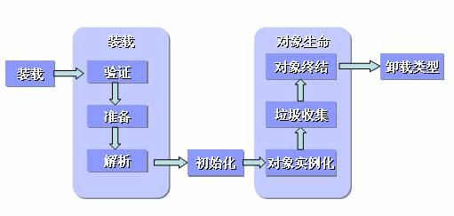

# JVM 结构

这篇主要了解 JVM 内在的运行结构是怎么样的。

## 虚拟机的意义

Java 作为一门高级程序语言，它的语法非常复杂，抽象程度也很高。因此，直接在硬件上运行这种复杂的程序并不现实。所以呢，在运行 Java 程序之前，我们需要对其进行一番转换。

Java 虚拟机可以由硬件实现，但更为常见的是在各个现有平台（如 Windows_x64、Linux_aarch64）上提供**软件实现**。这么做的意义在于，一旦一个程序被转换成 Java 字节码，那么它便可以在不同平台上的虚拟机实现里运行。这也就是我们经常说的“**一次编写，到处运行**”。

虚拟机的另外一个好处是它带来了一个托管环境（Managed Runtime）。这个托管环境能够代替我们处理一些代码中冗长而且容易出错的部分。其中最广为人知的当属自动内存管理与垃圾回收，这部分内容甚至催生了一波垃圾回收调优的业务。

使用虚拟机还有一个好处，可以在编译的过程中对代码进行优化，对代码进行精简，以提高执行效率。

### 虚拟机结构


可以看出，JVM主要由**类加载器子系统、运行时数据区（内存空间）、执行引擎以及与本地方法接口**等组成。其中运行时数据区又由**方法区、堆、Java栈、程序计数器、本地方法栈**组成。

从上图中还可以看出，在**内存空间中方法区和堆是所有Java线程共享的**，而 **Java栈、本地方法栈、程序计数器则由每个线程私有**，这会引出一些问题，后文会进行具体讨论。

众所周知，Java语言具有跨平台的特性，这也是由JVM来实现的。更准确地说，是Sun利用JVM在不同平台上的实现帮我们把平台相关性的问题给解决了，这就好比是HTML语言可以在不同厂商的浏览器上呈现元素（虽然某些浏览器在对W3C标准的支持上还有一些问题）。同时，**Java语言支持通过JNI（Java Native Interface）来实现本地方法的调用**，但是需要注意到，如果你在Java程序用调用了**本地方法**，那么你的程序就很可能不再具有跨平台性，即本地方法会破坏平台无关性。

- **类加载器：**在 JVM 启动时或者类运行时将需要的 class 加载到 JVM 中。

- **内存区**将内存划分成若干个区以模拟实际机器上的存储、记录和调度功能模块，如实际机器上的各种功能的寄存器或者 PC 指针的记录器等。

- **执行引擎：**执行引擎的任务是负责执行 class 文件中包含的字节码指令，相当于实际机器上的 CPU 。

- **本地方法调用**调用 C 或 C++ 实现的本地方法的代码返回结果。

## 类加载

JAVA 对象创建的过程，如下图所示：



1. 检测类是否被加载

当虚拟机遇到 `new` 指令时，首先先去检查这个指令的参数是否能在常量池中**定位到一个类的符号引用**，并且检查这个符号引用代表的类是否已被加载、解析和初始化过。如果没有，就执行类加载过程。

2. 为对象分配内存

类加载完成以后，虚拟机就开始为对象分配内存，此时所需内存的大小就已经确定了。只需要在堆上分配所需要的内存即可。

具体的分配内存有两种情况：第一种情况是内存空间绝对规整，第二种情况是内存空间是不连续的。

- 对于内存绝对规整的情况相对简单一些，虚拟机只需要在被占用的内存和可用空间之间移动指针即可，这种方式被称为“**指针碰撞**”。
- 对于内存不规整的情况稍微复杂一点，这时候虚拟机需要维护一个列表，来记录哪些内存是可用的。分配内存的时候需要找到一个可用的内存空间，然后在列表上记录下已被分配，这种方式成为“**空闲列表**”。

多线程并发时会出现正在给对象 A 分配内存，还没来得及修改指针，对象 B 又用这个指针**分配内存**，这样就出现问题了。解决这种问题有两种方案：

- 第一种，是采用同步的办法，使用 CAS 来保证操作的原子性。
- 另一种，是每个线程分配内存都在自己的空间内进行，即是每个线程都在堆中预先分配一小块内存，称为本地线程分配缓冲（Thread Local Allocation Buffer, TLAB），分配内存的时候再TLAB上分配，互不干扰。可以通过 `-XX:+/-UseTLAB` 参数决定。

3. 为分配的内存空间初始化零值

对象的内存分配完成后，还需要将对象的内存空间都初始化为零值，这样能保证对象即使没有赋初值，也可以直接使用。

4. 对对象进行其他设置

分配完内存空间，初始化零值之后，虚拟机还需要对对象进行其他必要的设置，设置的地方都在**对象头**中，包括这个对象所属的类，类的元数据信息，对象的 hashcode ，GC 分代年龄等信息。

5. 执行 init 方法

执行完上面的步骤之后，在虚拟机里这个对象就算创建成功了，但是对于 Java 程序来说还需要执行 init 方法才算真正的创建完成，因为这个时候对象只是被初始化零值了，还没有真正的去根据程序中的代码分配初始值，调用了 init 方法之后，这个对象才真正能使用。

到此为止一个对象就产生了，这就是 new 关键字创建对象的过程。

### 类加载过程

类加载分为**装载、链接、初始化**三步。

```java
ClassLoader loader = TestClassLoader.class.getClassLoader();

System.out.println(loader.toString());

System.out.println(loader.getParent().toString());

System.out.println(loader.getParent().getParent());
```

#### 加载

通过类的全限定名和ClassLoader加载类，主要是将指定的.class文件加载至JVM。当类被加载以后，在JVM内部就以“类的全限定名+ClassLoader实例ID”来标明类。

**在内存中，ClassLoader实例和类的实例都位于堆中，它们的类信息都位于方法区**。

在加载阶段，虚拟机需要完成以下三件事情：

- 通过一个类的全限定名来获取其定义的二进制字节流。
- 将这个字节流所代表的**静态存储结构**转化为方法区的**运行时数据结构**。
- 在Java堆中生成一个代表这个类的 `java.lang.Class` 对象，作为对方法区中这些数据的访问入口。

##### ClassLoader 分类

- 启动类加载器（BootStrap Class Loader）：启动类加载器主要加载的是JVM自身需要的类，这个类加载使用C++语言实现的，是虚拟机自身的一部分，它负责将 **<JAVA_HOME>/lib** 路径下的核心类库或 -Xbootclasspath 参数指定的路径下的jar包加载到内存中，注意由于虚拟机是按照文件名识别加载jar包的，如 **rt.jar**，如果文件名不被虚拟机识别，即使把jar包丢到lib目录下也是没有作用的（出于安全考虑，Bootstrap启动类加载器只加载包名为java、javax、sun等开头的类），在 Sun JDK中，这个类加载器是由 **C++** 实现的，并且在 Java 语言中无法获得它的引用，因此在 Java 中只能用 null 来指代。除了启动类加载器之外，其他的类加载器都是 java.lang.ClassLoader 的子类，因此有对应的 Java 对象。**这些类加载器需要先由另一个类加载器，比如说启动类加载器，加载至 Java 虚拟机中，方能执行类加载。**
- 扩展类加载器（Extension Class Loader）：扩展类加载器是指Sun公司(已被Oracle收购)实现的**sun.misc.Launcher$ExtClassLoader** 类，由Java语言实现的，是Launcher的静态内部类，它负责加载**<JAVA_HOME>/lib/ext**目录下或者由系统变量 **-Djava.ext.dir** 指定位路径中的类库，开发者可以直接使用标准扩展类加载器。
- 应用类加载器（System Class Loader）：是指 Sun公司实现的**sun.misc.Launcher$AppClassLoader**。它负责加载系统类路径**java -classpath**或 **-Djava.class.path** 指定路径下的类库，也就是我们经常用到的classpath路径，开发者可以直接使用系统类加载器，一般情况下该类加载是程序中默认的类加载器，通过`ClassLoader#getSystemClassLoader()`方法可以获取到该类加载器。**通常我们自己写的Java类也是由该ClassLoader加载**。在Sun JDK中，系统类加载器的名字叫 AppClassLoader。
- 用户自定义类加载器（User Defined Class Loader）：由用户自定义类的加载规则，可以手动控制加载过程中的步骤。

Java 9 引入了模块系统，并且略微更改了上述的类加载器。扩展类加载器被改名为**平台类加载器**（platform class loader）。Java SE 中除了少数几个关键模块，比如说 java.base 是由启动类加载器加载之外，其他的模块均由平台类加载器所加载。

##### 双亲委派模型

装载过程采用了一种被称为“**双亲委派模型（Parent Delegation Model）**”的方式，当一个ClassLoader要加载类时，它会先请求它的双亲ClassLoader（其实这里只有两个ClassLoader，所以称为父ClassLoader可能更容易理解）加载类，而它的双亲ClassLoader会继续把加载请求提交再上一级的ClassLoader，直到启动类加载器。只有其双亲ClassLoader无法加载指定的类时，它才会自己加载类。而这种父子关系一般通过组合（Composition）关系来实现，而不是通过继承（Inheritance）。

双亲委派模型是JVM的第一道安全防线，它**保证了类的安全加载**，这里同时依赖了**类加载器隔离**的原理：不同类加载器加载的类之间是无法直接交互的，即使是同一个类，被不同的ClassLoader加载，它们也无法感知到彼此的存在。这样即使有恶意的类冒充自己在核心包（例如java.lang）下，由于它无法被启动类加载器加载，也造成不了危害。
由此也可见，如果用户自定义了类加载器，那就必须自己保障类加载过程中的安全。

#### 链接

链接的任务是**把二进制的类型信息合并到JVM运行时状态中去**。

链接分为以下三步：

**验证：校验`.class`文件的正确性，确保该文件是符合规范定义的，并且适合当前JVM使用。**

**准备：为类分配内存，同时初始化类中的静态变量赋值为默认值。**

**解析（可选）：主要是把类的常量池中的符号引用解析为直接引用，这一步可以在用到相应的引用时再解析。**

**验证阶段的目的**，在于确保被加载类能够满足 Java 虚拟机的约束条件。一般而言，有Java编译器生成的类文件必然满足约束条件。

**准备阶段的目的**，则是为被加载类的静态字段分配内存。Java 代码中对静态字段的具体初始化，则会在稍后的初始化阶段中进行。除了分配内存外，部分 Java 虚拟机还会在此阶段构造其他跟类层次相关的数据结构，比如说用来实现虚方法的动态绑定的方法表。

在 class 文件被加载至 Java 虚拟机之前，这个类无法知道其他类及其方法、字段所对应的具体地址，甚至不知道自己方法、字段的地址。因此，每当需要引用这些成员时，**Java 编译器会生成一个符号引用**。在运行阶段，这个符号引用一般都能够无歧义地定位到具体目标上。

举例来说，对于一个方法调用，编译器会生成一个包含目标方法所在类的名字、目标方法的名字、接收参数类型以及返回值类型的符号引用，来指代所要调用的方法。

**解析阶段的目的**，正是将这些符号引用解析成为实际引用。如果符号引用指向一个未被加载的类，或者未被加载类的字段或方法，那么解析将触发这个类的加载（但未必触发这个类的链接以及初始化。）

Java 虚拟机规范并没有要求在链接过程中完成解析。它仅规定了：**如果某些字节码使用了符号引用，那么在执行这些字节码之前，需要完成对这些符号引用的解析。**

#### 初始化

**初始化类中的静态变量，并执行类中的static代码、类构造函数。**

初始化阶段是**真正开始执行类中定义的java程序代码(字节码)**并按程序猿的意图去初始化类变量的过程。更直接地说，初始化阶段就是执行类构造器`<clinit>()`方法的过程。`<clinit>()`方法是由编译器自动收集类中的所有类变量的赋值动作和静态代码块`static{}`中的语句合并产生的，其中编译器收集的顺序是由语句在源文件中出现的顺序所决定。

如果直接赋值的静态字段被 final 所修饰，并且它的类型是基本类型或字符串时，那么该字段便会被 Java 编译器标记成常量值（ConstantValue），其初始化直接由 Java 虚拟机完成。除此之外的直接赋值操作，以及所有静态代码块中的代码，则会被 Java 编译器置于同一方法中，并把它命名为 `< clinit >`。

类加载的最后一步是初始化，便是为标记为常量值的字段赋值，以及执行 `< clinit >` 方法的过程。Java 虚拟机会通过加锁来确保类的 `< clinit >` 方法仅被执行一次。

**类构造器()与实例构造器()不同，它不需要程序员进行显式调用，虚拟机会保证在子类类构造器()执行之前，父类的类构造()执行完毕。**

那么，类的初始化何时会被触发呢？JVM 规范枚举了下述多种触发情况：

- 当虚拟机启动时，初始化用户指定的主类；
- 当遇到用以新建目标类实例的 new 指令时，初始化 new 指令的目标类；
- 当遇到调用静态方法的指令时，初始化该静态方法所在的类；
- 当遇到访问静态字段的指令时，初始化该静态字段所在的类；
- 子类的初始化会触发父类的初始化；
- 如果一个接口定义了 default 方法，那么直接实现或者间接实现该接口的类的初始化，会触发该接口的初始化；
- 使用反射 API 对某个类进行反射调用时，初始化这个类；
- 当初次调用 MethodHandle 实例时，初始化该 MethodHandle 指向的方法所在的类。

由于**类初始化是线程安全的，并且仅被执行一次**，因此程序可以确保多线程环境下有且仅有一个 Singleton 实例。

## 运行时数据区

运行时数据区由**方法区、堆、Java栈、程序计数器、本地方法栈**组成。

### Java栈（Java Stack）

**Java栈的主要任务是存储方法参数、局部变量、中间运算结果，并且提供部分其它模块工作需要的数据。**

Java栈总是与线程关联在一起的，每当创建一个线程，JVM就会为该线程创建对应的Java栈，在这个Java栈中又会包含多个栈帧(Stack Frame)，这些栈帧是与每个方法关联起来的，每运行一个方法就创建一个栈帧，**每个栈帧会含有一些局部变量、操作栈和方法返回值等信息**。**每当一个方法执行完成时，该栈帧就会弹出栈帧的元素作为这个方法的返回值，并且清除这个栈帧，Java栈的栈顶的栈帧就是当前正在执行的活动栈，也就是当前正在执行的方法，程序计数器也会指向该地址。**只有这个活动的栈帧的本地变量可以被操作栈使用，当在这个栈帧中调用另外一个方法时，与之对应的一个新的栈帧被创建，这个新创建的栈帧被放到Java栈的栈顶，变为当前的活动栈。同样现在只有这个栈的本地变量才能被使用，当这个栈帧中所有指令都完成时，这个栈帧被移除Java栈，刚才的那个栈帧变为活动栈帧，前面栈帧的返回值变为这个栈帧的操作栈的一个操作数。

由于**Java栈是与线程对应起来的，Java栈数据不是线程共有的，所以不需要关心其数据一致性，也不会存在同步锁的问题**。

它分为三部分：局部变量区、操作数栈、帧数据区。

#### 局部变量区

局部变量区是以字长为单位的数组，在这里，byte、short、char类型会被转换成int类型存储，除了long和double类型占两个字长以外，其余类型都只占用一个字长。特别地，boolean类型在编译时会被转换成int或byte类型，boolean数组会被当做byte类型数组来处理。局部变量区也会包含对象的引用，包括类引用、接口引用以及数组引用。

局部变量区包含了方法参数和局部变量，此外，实例方法隐含第一个局部变量this，它指向调用该方法的对象引用。对于对象，局部变量区中永远只有指向堆的引用。

#### 操作数栈

操作数栈也是以字长为单位的数组，但是正如其名，它只能进行入栈出栈的基本操作。在进行计算时，操作数被弹出栈，计算完毕后再入栈。

#### 帧数据区

帧数据区的任务主要有：记录指向类的常量池的指针，以便于解析。
帮助方法的正常返回，包括恢复调用该方法的栈帧，设置程序计数器指向调用方法对应的下一条指令，把返回值压入调用栈帧的操作数栈中。
记录异常表，发生异常时将控制权交由对应异常的catch子句，如果没有找到对应的catch子句，会恢复调用方法的栈帧并重新抛出异常。

**局部变量区和操作数栈的大小依照具体方法在编译时就已经确定**。调用方法时会从方法区中找到对应类的类型信息，从中得到具体方法的局部变量区和操作数栈的大小，依此分配栈帧内存，压入Java栈。

在Java虚拟机规范中，对这个区域规定了两种异常状况：**如果线程请求的栈深度大于虚拟机所允许的深度，将抛出StackOverflowError异常；如果虚拟机可以动态扩展，如果扩展时无法申请到足够的内存，就会抛出OutOfMemoryError异常。**

### 本地方法栈（Native Method Stack）

本地方法栈类似于Java栈，主要存储了本地方法调用的状态。区别不过是Java栈为JVM执行Java方法服务，而本地方法栈为JVM执行Native方法服务。本地方法栈也会抛出StackOverflowError和OutOfMemoryError异常。在Sun JDK中，本地方法栈和Java栈是同一个。

### PC寄存器/程序计数器（Program Count Register）

严格来说是一个数据结构，用于保存当前正在执行的程序的内存地址，由于Java是支持多线程执行的，所以程序执行的轨迹不可能一直都是线性执行。当有多个线程交叉执行时，被中断的线程的程序当前执行到哪条内存地址必然要保存下来，以便用于被中断的线程恢复执行时再按照被中断时的指令地址继续执行下去。为了线程切换后能恢复到正确的执行位置，每个线程都需要有一个独立的程序计数器，**各个线程之间计数器互不影响，独立存储**，我们称这类内存区域为“线程私有”的内存,这在某种程度上有点类似于“ThreadLocal”，**是线程安全的**。

### 方法区（Method Area）

**类型信息和类的静态变量都存储在方法区中**。方法区中对于每个类存储了以下数据：

- 类及其父类的全限定名（java.lang.Object没有父类）
- 类的类型（Class or Interface）
- 访问修饰符（public, abstract, final）
- 实现的接口的全限定名的列表
- 常量池
- 字段信息
- 方法信息
- 静态变量
- ClassLoader引用
- Class引用

**可见类的所有信息都存储在方法区中**。由于**方法区是所有线程共享的**，所以必须保证线程安全，举例来说，如果两个类同时要加载一个尚未被加载的类，那么一个类会请求它的ClassLoader去加载需要的类，另一个类只能等待而不会重复加载。

常量池本身是方法区中的一个数据结构。**常量池中存储了如字符串、final变量值、类名和方法名常量**。常量池在编译期间就被确定，并保存在已编译的.class文件中。一般分为两类：**字面量和引用量**。字面量就是字符串、final变量等。类名和方法名属于引用量。引用量最常见的是在调用方法的时候，根据方法名找到方法的引用，并以此定为到函数体进行函数代码的执行。引用量包含：类和接口的权限定名、字段的名称和描述符，方法的名称和描述符。

此外为了加快调用方法的速度，通常还会为每个非抽象类创建私有的方法表，方法表是一个数组，存放了实例可能被调用的实例方法的直接引用。

在Sun JDK中，方法区对应了持久代（Permanent Generation），默认最小值为16MB，最大值为64MB。大小可以通过参数来设置,可以通过-XX:PermSize指定初始值，-XX:MaxPermSize指定最大值。

### 堆（Heap）

堆是JVM所管理的内存中最大的一块，**是被所有Java线程锁共享的，不是线程安全的**，在JVM启动时创建。

**堆用于存储对象实例以及数组值**。堆是存储Java对象的地方，这一点Java虚拟机规范中描述是：所有的对象实例以及数组都要在堆上分配。堆中有指向类数据的指针，**该指针指向了方法区中对应的类型信息**。堆中还可能存放了指向方法表的指针。堆是所有线程共享的，所以在进行实例化对象等操作时，需要解决同步问题。此外，堆中的实例数据中还包含了对象锁，并且针对不同的垃圾收集策略，可能存放了引用计数或清扫标记等数据。

在堆的管理上，Sun JDK从1.2版本开始引入了分代管理的方式。主要分为新生代、旧生代。分代方式大大改善了垃圾收集的效率。

1、新生代（New Generation）
大多数情况下新对象都被分配在新生代中，新生代由Eden Space和两块相同大小的Survivor Space组成，后两者主要用于Minor GC时的对象复制（Minor GC的过程在此不详细讨论）。
JVM在Eden Space中会开辟一小块独立的TLAB（Thread Local Allocation Buffer）区域用于更高效的内存分配，我们知道在堆上分配内存需要锁定整个堆，而在TLAB上则不需要，JVM在分配对象时会尽量在TLAB上分配，以提高效率。
2、老年代（Old Generation/Tenuring Generation）
在新生代中存活时间较久的对象将会被转入老年代，老年代进行垃圾收集的频率没有新生代高。

## 执行引擎

执行引擎是JVM执行Java字节码的核心，执行方式主要分为解释执行、编译执行、自适应优化执行、硬件芯片执行方式。

JVM的指令集是基于栈而非寄存器的，这样做的好处在于可以使指令尽可能紧凑，便于快速地在网络上传输（别忘了Java最初就是为网络设计的），同时也很容易适应通用寄存器较少的平台，并且有利于代码优化，由于Java栈和PC寄存器是线程私有的，线程之间无法互相干涉彼此的栈。**每个线程拥有独立的JVM执行引擎实例。**

JVM指令由单字节操作码和若干操作数组成。对于需要操作数的指令，通常是先把操作数压入操作数栈，即使是对局部变量赋值，也会先入栈再赋值。注意这里是“通常”情况，之后会讲到由于优化导致的例外。

### 解释执行

和一些动态语言类似，JVM可以解释执行字节码。Sun JDK采用了token-threading的方式，感兴趣的同学可以深入了解一下。解释执行中有几种优化方式：

- 栈顶缓存：将位于操作数栈顶的值直接缓存在寄存器上，对于大部分只需要一个操作数的指令而言，就无需再入栈，可以直接在寄存器上进行计算，结果压入操作数栈。这样便减少了寄存器和内存的交换开销。

- 部分栈帧共享：被调用方法可将调用方法栈帧中的操作数栈作为自己的局部变量区，这样在获取方法参数时减少了复制参数的开销。
- 执行机器指令：在一些特殊情况下，JVM会执行机器指令以提高速度。

### 编译执行

为了提升执行速度，Sun JDK提供了将字节码编译为机器指令的支持，主要利用了**JIT（Just-In-Time）编译器**在运行时进行编译，它会在第一次执行时编译字节码为机器码并缓存，之后就可以重复利用。Oracle JRockit采用的是完全的编译执行。

### 自适应优化执行

自适应优化执行的思想是程序中10%20%的代码占据了80%90%的执行时间，所以通过将那少部分代码编译为优化过的机器码就可以大大提升执行效率。自适应优化的典型代表是Sun的Hotspot VM，正如其名，JVM会监测代码的执行情况，当判断特定方法是瓶颈或热点时，将会启动一个后台线程，把该方法的字节码编译为极度优化的、静态链接的C++代码。当方法不再是热区时，则会取消编译过的代码，重新进行解释执行。

自适应优化不仅通过利用小部分的编译时间获得大部分的效率提升，而且由于在执行过程中时刻监测，对内联代码等优化也起到了很大的作用。由于面向对象的多态性，一个方法可能对应了很多种不同实现，自适应优化就可以通过监测只内联那些用到的代码，大大减少了内联函数的大小。

Sun JDK在编译上采用了两种模式：Client和Server模式。前者较为轻量级，占用内存较少。后者的优化程序更高，占用内存更多。

在Server模式中会进行对象的逃逸分析，即方法中的对象是否会在方法外使用，如果被其它方法使用了，则该对象是逃逸的。对于非逃逸对象，JVM会在栈上直接分配对象（所以对象不一定是在堆上分配的），线程获取对象会更加快速，同时当方法返回时，由于栈帧被抛弃，也有利于对象的垃圾收集。Server模式还会通过分析去除一些不必要的同步，感兴趣的同学可以研究一下Sun JDK 6引入的Biased Locking机制。

此外，执行引擎也必须保证线程安全性，因而**JMM（Java Memory Model）也是由执行引擎确保的**。

## Java 内存模型（JMM）

Java内存模型（Java Memory Model）**描述了Java程序中各种变量（线程共享变量）的访问规则，以及在JVM中将变量存储到内存和从内存中读取出变量这样的底层细节。**

多个线程同时对主内存的一个共享变量进行读取和修改时，首先会读取这个变量到自己的工作内存中成为一个副本，对这个副本进行改动之后，再更新回主内存中变量所在的地方。

（由于CPU时间片是以线程为最小单位，所以这里的工作内存实际上就是指的物理缓存，CPU运算时获取数据的地方；而主内存也就是指的是内存，也就是原始的共享变量存放的位置）

JMM 关键技术点都是围绕多线程的**原子性、可见性、有序性**来建立的。

原子性：

原子性是指一个操作是不可中断的。即使是在多个线程一起执行的时候，一个操作一旦开始，就不会被其他线程干扰。

可见性：

可见性是指当一个线程修改了某一个共享变量的值，其他线程是否能够立即知道这个修改。在串行程序中是不存在可见性的问题，但在多线程场景就存在比较多的问题。

有序性：

按先后顺序执行。有序性问题的原因是因为程序在执行时，可能会进行指令重排，重排后的指令与原指令的顺序未必一致。


- 所有的变量都存储在主内存中
- 每个线程都有自己独立的工作内存，里面保存该线程使用到的变量的副本（主内存中该变量的一份拷贝）
- 两条规定
  - **线程对共享变量的所有操作都必须在自己的工作内存中进行，不能直接从主内存中读写**
  - **不同线程之间无法直接访问其他线程工作内存中的变量，线程间变量值的传递需要功过主内存来完成。**
- 共享变量可见性实现的原理

### 可见性

一个线程对共享变量值的修改，能够及时地被其他线程看到。

线程1对共享变量的修改要想被线程2及时看到，必须要经过如下的两个步骤：

1. 把工作内存1中更新过的共享变量刷新到主内存中
2. 把内存中最新的共享变量的值更新到工作内存2中

#### 可见性分析

导致共享变量在**线程间不可见**的原因：

1. 线程的交叉执行
2. 重排序结合线程交叉执行
3. 共享变量更新后的值没有在工作内存与主内存间及时更新

#### synchronized实现可见性

- 线程解锁前，必须把共享变量的最新值刷新到主内存中。
- 线程加锁时，将**清空工作内存中共享变量的值,**从而使用共享变量时需要从主内存中重新读取最新的值（注意：加锁与解锁需要的是同一把锁）

这两点结合起来，就可以**保证线程解锁前对共享变量的修改在下次加锁时对其他的线程可见**，也就保证了线程之间共享变量的可见性。

#### 线程执行互斥代码的过程：

1. 获得互斥锁
2. 清空工作内存
3. 从主内存拷贝最新副本到工作内存中
4. 执行代码
5. 将更改过后的共享变量的值刷新到主内存中去。
6. 释放互斥锁

### 重排序

重排序：代码书写的顺序与实际执行的顺序不同，指令重排序是编译器或**处理器为了提供程序的性能而做的优化**。

指令重排能保证串行语义一致，但没有义务保证多线程间的语义也一致。

之所以存在指令重排完全是为了提高性能。

问题：为什么指令重排可以提高性能呢？

减少执行流水线中断，从而提高了 CPU 处理性能。

分类：

1. 编译器优化的重排序（编译器优化）
2. 指令级并行重排序（处理器优化）
3. 内存系统的重排序（处理器优化）

#### as-if-serial

无论如何重排序，程序执行的结果应该和代码顺序执行的结果一致（Java编译器、运行时和处理器都会保证Java在**单线程下遵循as-if-serial语义**），重排序不会给单线程带来**内存可见性问题**。

```java
int num1=1;//第一行
int num2=2;//第二行
int sum=num1+num;//第三行
```

- 单线程：第一行和第二行可以重排序，但第三行不行
- 重排序不会给单线程带来内存可见性问题
- 多线程中程序交错执行时，重排序可能会照成内存可见性问题

指令重排是基于以下原则之上

- 程序顺序原则：一个线程内保证语义的串行性
- volatile 规则：volatile 变量的写，先发生于读，保证了 volatile 变量的可见性
- 锁规则：解锁必然发生在随后的加锁之前
- 传递性：A 先于 B，B 先于 C，那么 A 必然先于 C
- 线程的 start() 方法先于他的每一个动作
- 线程的所有操作先于线程的终结
- 线程的中断先于被中断线程的代码
- 对象的构造函数执行、结束先于 `finalize()` 方法

### volatile实现可见性

#### volatile 关键字

- 能够保证volatile变量的可见性
- 不能保证volatile变量的原子性

#### volatile如何实现内存可见性：

深入来说：通过加入**内存屏障和禁止重排序优化**来实现的。

通俗的讲：volatile 变量在每次被线程访问时，都强迫从主内存中重读该变量的值，而当变量发生变化时，又强迫线程将最新的值刷新到主内存。这样任何时刻，不同的线程总能看到该变量的最新的值。

- 对 volatile 变量执行写操作时，会在写操作后加入一条 store 屏障指令
  - store 指令会在写操作后把最新的值强制刷新到主内存中。同时还会禁止 cpu 对代码进行重排序优化。这样就保证了值在主内存中是最新的。
- 对 volatile 变量执行读操作时，会在读操作前加入一条 load 屏障指令
  - load 指令会在读操作前把工作内存缓存中的值清空后，再从主内存中读取最新的值。

##### 线程写volatile变量的过程：

1. 改变线程工作内存中volatile变量副本的值。
2. 将改变后的副本的值从工作内存刷新到主内存。

##### 线程读volatile变量的过程：

1. 从主内存中读取最新的volatile变量的值到工作内存中。
2. 从工作内存中读取volatile变量的副本。

#### volatile 不能保证原子性

```java
private int number=0;//原子性操作
number++;//不是原子性操作
```

从 Load 到store 到内存屏障，一共4步，其中最后一步jvm让这个最新的变量的值在所有线程可见，也就是最后一步让所有的CPU内核都获得了最新的值，但**中间的几步（从Load到Store）**是不安全的，中间如果其他的 CPU 修改了值将会丢失。

为 volatile 变量赋值的场景，不要存在依赖于 volatile 变量情况。

比如：

```java
public class Wrongsingleton {
    private static volatile Wrongsingleton _instance = null; 
 
    private wrongsingleton() {}
 
    public static wrongsingleton getInstance() {
 
        if (_instance == null) {
          // 可能执行下面的语句的时候，其他的线程已经执行 new 操作了
            _instance = new Wrongsingleton();
        }
 
        return _instance;
    }
}
```

#### 保证方法操作的原子性

解决方案：

- 使用synchronized关键字
- 使用ReentrantLock(java.until.concurrent.locks包下)
- 使用AtomicInterger(vava,util.concurrent.atomic包下)

#### volatile 适用场景

要在多线程总安全的使用volatile变量，必须同时满足：

1. **对变量的写入操作不依赖其当前值**
   - 不满足：number++、count=count*5
   - 满足：boolean变量、记录温度变化的变量等
2. 该变量没有包含在具有其他变量的不变式中
   - 不满足：不变式 ` low < up`

### 内存屏障

内存屏障（[memory barrier](http://en.wikipedia.org/wiki/Memory_barrier)）是一个 CPU 指令。基本上，它是这样一条指令： a) 确保一些特定操作执行的顺序； b) 影响一些数据的可见性(可能是某些指令执行后的结果)。编译器和 CPU 可以在保证输出结果一样的情况下对指令重排序，使性能得到优化。插入一个内存屏障，**相当于告诉 CPU 和编译器先于这个命令的必须先执行，后于这个命令的必须后执行**。内存屏障另一个作用是**强制更新一次不同 CPU 之间的缓存**。例如，一个写屏障会把这个屏障前写入的数据刷新到缓存，这样任何试图读取该数据的线程将得到最新值，而不用考虑到底是被哪个 CPU 核心或者哪颗 CPU 执行的。

#### Store Barrier

Store屏障，是x86的”sfence“指令，强制所有在store屏障指令之前的store指令，都在该store屏障指令执行之前被执行，并把store缓冲区的数据都刷到CPU缓存。这会使得程序状态对其它CPU可见，这样其它CPU可以根据需要介入。一个实际的好例子是Disruptor中的BatchEventProcessor。当序列Sequence被一个消费者更新时，其它消费者(Consumers)和生产者（Producers）知道该消费者的进度，因此可以采取合适的动作。所以屏障之前发生的内存更新都可见了。

#### Load Barrier

Load屏障，是x86上的”ifence“指令，强制所有在load屏障指令之后的load指令，都在该load屏障指令执行之后被执行，并且一直等到load缓冲区被该CPU读完才能执行之后的load指令。这使得从其它CPU暴露出来的程序状态对该CPU可见，这之后CPU可以进行后续处理。一个好例子是上面的BatchEventProcessor的sequence对象是放在屏障后被生产者或消费者使用。

#### Full Barrier

Full屏障，是x86上的”mfence“指令，复合了load和save屏障的功能。

### 对 64 位（long、double）变量的读写可能不是原子操作

Java 内存模型允许JVM将没有被 volatile 修饰的 64 位数据类型读写操作划分为两次 32 位的读写操作来进行，这就会导致有可能读取到“半个变量”的情况，解决办法就是加上 volatile 关键字。

### final 也可以保证线程之间内存变量的可见性

Final 变量在并发当中，原理是通过禁止 cpu 的指令集重排序，来提供现成的可见性，来保证对象的安全发布，防止对象引用被其他线程在对象被完全构造完成前拿到并使用。

与锁和 volatile 相比较，对 final 域的读和写更像是普通的变量访问。对于 final 域，编译器和处理器要遵守两个重排序规则：

1. 在构造函数内对一个 final 域的写入，与随后把这个被构造对象的引用赋值给一个引用变量，这两个操作之间不能重排序。
2. 初次读一个包含 final 域的对象的引用，与随后初次读这个 final 域，这两个操作之间不能重排序。

## 问题：

**1、代码在 Windows 上面被编译为 class 文件，到其他系统下可以直接运行吗？**

可以，java文件一旦被编译转换为 Java 字节码文件，也就是 class 文件之后，就运行被其他平台所支持和运行。

**2、实现 Java 虚拟机的方式有哪些？**

软件方式和硬件方式，常见的方式是软件方式。

**3、JVM 由哪些组成？**

类加载器子系统、运行时数据区（内存空间）、执行引擎以及与本地方法接口。

**4、运行时数据区有哪些组成？**

由方法区、堆、Java栈、PC寄存器、本地方法栈组成，其中内存空间中方法区和堆是所有Java线程共享的，而Java栈、本地方法栈、PC寄存器则由每个线程私有。

4个部分组成：

- PC寄存器/程序计数器：线程私有；记录指令执行的位置，这里不会出现 OutOfMemoryError
- Java栈：线程私有，生命周期和线程一致，存储方法参数、局部变量、中间运算结果，会出现异常：如果线程请求的栈深度大于虚拟机所允许的深度，将抛出StackOverflowError异常；如果虚拟机可以动态扩展，如果扩展时无法申请到足够的内存，就会抛出OutOfMemoryError异常。
- 本地方法栈：存储了本地方法调用的状态。区别不过是Java栈为JVM执行Java方法服务，而本地方法栈为JVM执行Native方法服务。本地方法栈也会抛出StackOverflowError和OutOfMemoryError异常。在Sun JDK中，本地方法栈和Java栈是同一个。
- 堆：堆是JVM所管理的内存中最大的一块，**是被所有Java线程锁共享的，不是线程安全的**，也会有 StackOverflowError和OutOfMemoryError异常
- 方法区：线程共享；类型信息和类的静态变量都存储在方法区中。

**5、什么操作会导致程序的跨平台性？**

在程序中调用本地方法会不在具有跨平台性。

**6、Java 是通过什么方式实现 Java 语言的本地方法调用？**

使用 JNI（Java Native Interface）方式实现。

**7、启动类加载器是通过什么方式初始化加载的？**

它不是Java类，因此它不需要被别人加载，它嵌套在Java虚拟机内核里面，也就是JVM启动的时候Bootstrap就已经启动，它是用C++写的二进制代码（不是字节码）

**8、sun.misc.Launcher$ExtClassLoader 与 java.lang.ClassLoader 关系？**

除了 启动类加载器 外其他都是继承自 java.lang.ClassLoader。

**9、其他类加载器如何初始化？**

其他的类加载器都是通过 `sun.misc.Launcher` 类下面的静态内部类实现，拓展类加载器就是 ExtClassLoader，应用加载器就是 AppClassLoader。

**10、说一下类加载的流程是怎么样的？**

装载、链接（校验、准备、解析）、初始化。

- 装载：通过类的全限定名和ClassLoader加载类，主要是将指定的.class文件加载至JVM
- 校验：校验.class文件的正确性，确保该文件是符合规范定义的，并且适合当前JVM使用
- 准备：为类分配内存，同时初始化类中的静态变量赋值为默认值
- 解析：主要是把类的常量池中的符号引用解析为直接引用，这一步可以在用到相应的引用时再解析
- 初始化：初始化类中的静态变量，并执行类中的static代码、构造函数

**11、讲一下类加载的过程采用了什么模型？**

双亲委派模型。

某个特定的类加载器在接到加载类的请求时，首先将加载任务委托给父类加载器，**依次递归**，如果父类加载器可以完成类加载任务，就成功返回；只有父类加载器无法完成此加载任务时，才自己去加载。

当 Java 虚拟机要加载一个类时，到底派出哪个类加载器去加载呢？

- 首先当前线程的类加载器去加载线程中的第一个类（假设为类A）。
  注：当前线程的类加载器可以通过Thread类的getContextClassLoader()获得，也可以通过setContextClassLoader()自己设置类加载器。
- 如果类A中引用了类B，Java虚拟机将使用加载类A的类加载器去加载类B。
- 还可以直接调用`ClassLoader.loadClass()`方法来指定某个类加载器去加载某个类。

**12、双亲委派的意义是什么？**

**委托机制的意义 — 防止内存中出现多份同样的字节码**
比如两个类A和类B都要加载System类：

- 如果不用委托而是自己加载自己的，那么类A就会加载一份System字节码，然后类B又会加载一份System字节码，**这样内存中就出现了两份System字节码。**
- 如果使用委托机制，会递归的向父类查找，也就是**首选用Bootstrap尝试加载**，如果找不到再向下。这里的System就能在Bootstrap中找到然后加载，如果此时类B也要加载System，也从Bootstrap开始，此时**Bootstrap发现已经加载过了System那么直接返回内存中的System即可而不需要重新加载**，这样内存中就只有一份System的字节码了。

**13、能不能自己写个类叫`java.lang.System`？**

通常不可以，但可以采取另类方法达到这个需求。

为了不让我们写System类，类加载采用委托机制，这样可以保证爸爸们优先，爸爸们能找到的类，儿子就没有机会加载。而System类是Bootstrap加载器加载的，就算自己重写，也总是使用Java系统提供的System，**自己写的System类根本没有机会得到加载。**

但是，我们可以**自己定义一个类加载器来达到这个目的**，为了避免双亲委托机制，这个类加载器也必须是特殊的。由于系统自带的三个类加载器都加载特定目录下的类，如果我们自己的类加载器放在一个特殊的目录，那么系统的加载器就无法加载，也就是最终还是由我们自己的加载器加载。

**14、JVM 中何时会触发类加载的行为？**

- 通过new关键字、反射、clone、反序列化机制实例化对象时。
- 调用类的静态方法时。
- 使用类的静态字段或对其赋值时。
- 通过反射调用类的方法时。
- 初始化该类的子类时（初始化子类前其父类必须已经被初始化）。
- JVM启动时被标记为启动类的类（简单理解为具有main方法的类）。

**15、常量池的作用是什么？**

常量池本身是方法区中的一个数据结构。**常量池中存储了如字符串、final变量值、类名和方法名常量**。常量池在编译期间就被确定，并保存在已编译的.class文件中。一般分为两类：**字面量和引用量**。字面量就是字符串、final变量等。类名和方法名属于引用量。

**16、解释一下 Java内存模型？**

Java内存模型（Java Memory Model）描述了Java程序中各种变量（线程共享变量）的访问规则，以及在JVM中将变量存储到内存和从内存中读取出变量这样的底层细节。


**17、什么叫可见性？**

一个线程对共享变量值的修改，能够及时地被其他线程看到。

**18、什么叫有序性？**

按先后顺序执行。有序性问题的原因是因为程序在执行时，可能会进行指令重排，重排后的指令与原指令的顺序未必一致。

**19、什么叫原子性？**

原子性是指一个操作是不可中断的。即使是在多个线程一起执行的时候，一个操作一旦开始，就不会被其他线程干扰。

**20、导致共享变量在线程间不可见的原因？**

1. 线程的交叉执行
2. 重排序结合线程交叉执行
3. 共享变量更新后的值没有在工作内存与主内存间及时更新

**21、synchronize 如何保证有序性？**

- 线程解锁前，必须把共享变量的最新值刷新到主内存中。
- 线程加锁时，将清空工作内存中共享变量的值,从而使用共享变量时需要从主内存中重新读取最新的值（注意：加锁与解锁需要的是同一把锁）

**22、线程执行互斥代码的过程？**

1. 获得互斥锁
2. 清空工作内存
3. 从主内存拷贝最新副本到工作内存中
4. 执行代码
5. 将更改过后的共享变量的值刷新到主内存中去。
6. 释放互斥锁

**23、指令重排序的价值是什么？**

指令重排序是编译器或**处理器为了提供程序的性能而做的优化**，

**24、为什么指令重排序可以提升性能？**

减少执行流水线中断，从而提高了 CPU 处理性能。

**25、重排序类别？**

1. 编译器优化的重排序（编译器优化）
2. 指令级并行重排序（处理器优化）
3. 内存系统的重排序（处理器优化）

**26、重排序规则？**

指令重排是基于以下原则之上

- 程序顺序原则：一个线程内保证语义的串行性
- volatile 规则：volatile 变量的写，先发生于读，保证了 volatile 变量的可见性
- 锁规则：解锁必然发生在随后的加锁之前
- 传递性：A 先于 B，B 先于 C，那么 A 必然先于 C
- 线程的 start() 方法先于他的每一个动作
- 线程的所有操作先于线程的终结
- 线程的中断先于被中断线程的代码
- 对象的构造函数执行、结束先于 `finalize()` 方法

**27、volatile如何实现内存可见性？**

通过加入**内存屏障和禁止重排序优化**来实现的。

volatile 变量在每次被线程访问时，都强迫从主内存中重读该变量的值，而当变量发生变化时，又强迫线程将最新的值刷新到主内存。这样任何时刻，不同的线程总能看到该变量的最新的值。

**28、什么是内存屏障？**

内存屏障（memory barrier）是一个 CPU 指令。基本上，它是这样一条指令： a) 确保一些特定操作执行的顺序； b) 影响一些数据的可见性(可能是某些指令执行后的结果)。

它们通过确保从另一个CPU来看屏障的两边的所有指令都是正确的程序顺序，而保持程序顺序的外部可见性；其次它们可以实现内存数据可见性，确保内存数据会同步到CPU缓存子系统。

**29、为什么内存屏障能保证可见性和禁止指令重排序？**

编译器和 CPU 可以在保证输出结果一样的情况下对指令重排序，使性能得到优化。插入一个内存屏障，**相当于告诉 CPU 和编译器先于这个命令的必须先执行，后于这个命令的必须后执行**。内存屏障另一个作用是**强制更新一次不同 CPU 之间的缓存**。

Java内存模型中**volatile**变量在**写操作之后会插入一个store屏障，在读操作之前会插入一个load屏障**。一个类的**final**字段会**在初始化后插入一个store屏障**，来确保final字段在构造函数初始化完成并可被使用时可见。

**30、重排序是怎么做到执行性能优化的？**

编译器优化重排序：在不影响结果的前提下，对执行顺序进行优化

指令级并行重排序：使用CPU核内部包含的多个执行单元，组合进行算术运算，提高计算并行度和执行效率，但这个过程中可能就会存在程序顺序的不确定性。

内存系统重排序：为了尽可能地避免处理器访问主内存的时间开销，处理器大多会利用缓存(cache)以提高性能。


在这种模型下会存在一个现象，即缓存中的数据与主内存的数据并不是实时同步的，各CPU（或CPU核心）间缓存的数据也不是实时同步的。这导致在同一个时间点，各CPU所看到同一内存地址的数据的值可能是不一致的。从程序的视角来看，就是在同一个时间点，各个线程所看到的共享变量的值可能是不一致的。

**31、CPU 读取缓存优先级？**

寄存器》高速缓存》内存

**32、为什么 JMM 中存在工作内存和主内存的设计模式呢？**

这与 CPU 读取内存有关，从内存中读取和写入数据的过程和CPU的执行速度比起来差距就会越来越大,这就导致CPU每次操作内存都要耗费很多等待时间。在CPU和内存之间增加高速缓存，以此来提高CPU的读写效率，从而也可想而知，使用volatile是存在性能损坏的。

## 拓展阅读

[Java多线程和内存可见性](https://segmentfault.com/a/1190000009828216)

[Java内存访问重排序的研究](https://tech.meituan.com/2014/09/23/java-memory-reordering.html)

[内存屏障](http://ifeve.com/memory-barriers-or-fences/)

[Java虚拟机结构分析](https://blog.csdn.net/u013256816/article/details/51484031)

