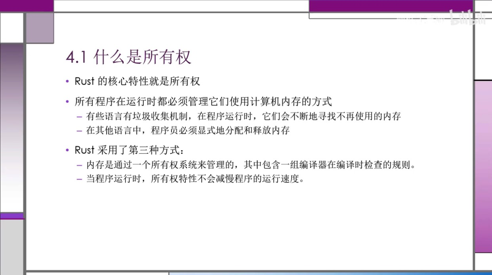
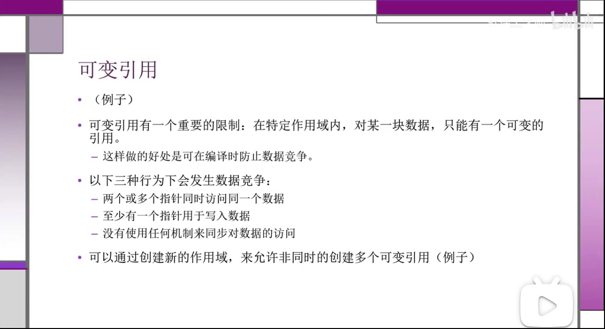
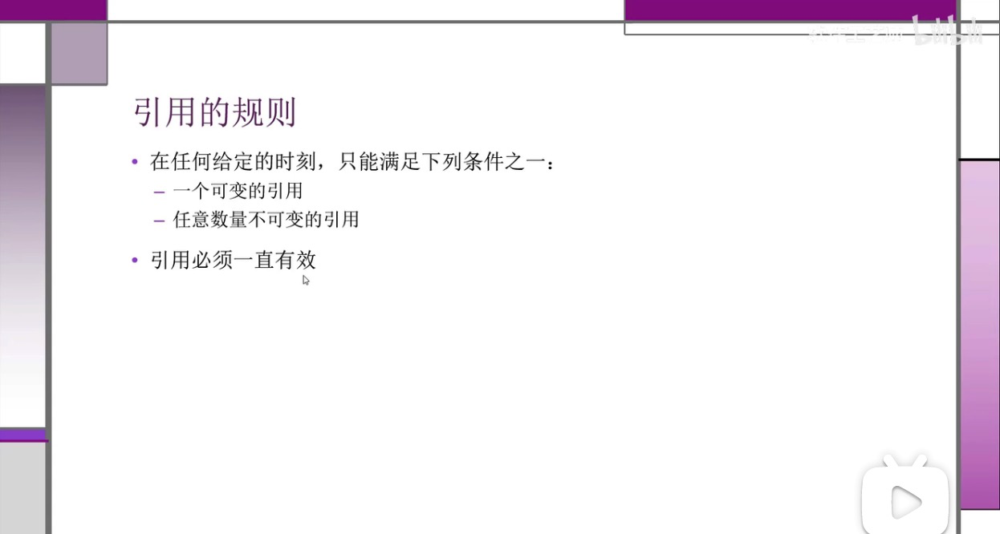

# Rust

使用场景

- 需要运行是的速度
- 内存安全
- 更好的多线程

与其他对比

- 无需 GC
- 安全

擅长领域

- 高性能 web Service
- WebAssembly
- 命令行工具
- 网络编程
- 嵌入式设备
- 系统编程

安装

https://www.rust-lang.org/zh-CN/learn/get-started

```toml
[package]
name = "hello-rust"
version = "0.1.0"
authors = ["zoeminghong <617405347@qq.com>"]
edition = "2018" // rust 版本

# See more keys and their definitions at https://doc.rust-lang.org/cargo/reference/manifest.html

[dependencies]
rand = "^0.3.14"
```

在 Rust 里面，代码的包称作 crate。

cargo run，编译代码+执行结果。

cargo check，检查代码，他比 cargo buid 快，提高编码效率。

cargo build --release，为了发布构建，在编译的时候会进行优化，但编译时间长。

cargo update 会更新 Cargo.toml 文件中的内容。

## 语法

:: 静态变量

调用方法用点号

变量使用下划线分隔

expect() 当前面执行的结果报错时，会调用 expect 中的提示语。

&表示对象引用。

Rust 是类型推断语言

```rust
loop{

// 循环
}
```

```
match []
[] =>
```

变量

```rust
let x=5;//不可变
println!("{}",x);

let mut x=5;// 可变
```

常量

常量用券大写字母，和每个单词之间用下划线分开。

```rust
const MAX:u32=1000;
```

隐藏

类型可以跟之前的不一样。

```rust
let x=5;
let x=x+1;
```

第二个 x 替换了第一个 x。

标量类型

- 整数类型：u32（无符号类型），i32（有符号类型）、isize、usize 由计算机的架构决定
- 浮点类型：f32，f64（默认）
- 布尔类型：bool
- 字符类型：char，单引号

数据类型溢出的情况，在 release 时不会校验，运行时会循环覆盖。

复合类型

Tuple

创建之后，不能修改

```rust
let tup:(i32,f64,u8)=(23,34.23,1);
let (x,y,z)=tup;
println!("{},{},{}",tup.0,tup.1,tup.2);
```

数组

```rust
let a:[i32;5]=[1,2,3,4,5];
let a:[3;5]=[3,3,3,3,3];
a[0]
```

超出数组的范围的时候，编译不会报错，运行会报错。

函数

所有字母都小写，用下划线分开

函数参数的类型必须指明

```rust
fn another_fun(x:i32){
	println!("another function");
}

fn another_fun(x:i32)-> i32{
	println!("another function");
}

let y={
  let x=1;
  x+2 // 不要加分号，否则就是一个空tuple {}
};
```

主函数

```rust
fn main() {
    let x:i32 ={
        3+2
    };

    println!("输出：{}",x)

}
```

if 语句

``` rust
if num>5 {

}else {

}

let num=if true {}else{}
```

循环语句

```rust
loop{

}
```

```rust
while [] {

}
```

```rust
for e in es.iter(){
	printlin!({},e)
}
```

```rust
for num in (1..4).rev(){

}
// rev 反向
```



Rust 与 Java 一样都有堆和栈内容。


当变量离开作用域之后，就会释放内存空间。

```rust
str.clone()// 克隆
```

任何简单标量的组合类型都是可以是 Copy 的

引用

```rust
fn main() {
    let s:String=String::from("ceshi");
    println!("输出：{}-{}",s,get_test(&s))
}

fn get_test(s:&String)-> usize{
    s.len()
}
```

```rust
fn main() {
    let mut s:String=String::from("ceshi");
    get_test(&mut s);
    println!("输出：{}",s);

}

fn get_test(s:&mut String)-> usize{
    s.push_str("sss");
    s.len()
}
```





切片

```rust
fn main() {
    let s:String=String::from("ceshi");
    let a=&s[1..3];
    let a=&s[1..];
    let a=&s[..3];
    println!("输出：{}",a);
}
```

方法返回值

```
&str
usize
```

Struct

```rust
struct Test{
	name:String,
	age:u32
}

let s:Test={
	name:"zhangsan",
	age:11
}
```

struct 声明方法或者关联函数（类似于 java 静态方法）

```rust
#[derive(Debug)]
struct Ract {
    width: u32,
    length: u32,
}

impl Ract {
    fn area(&self) -> u32 {
        self.length * self.width
    }
    // 关联函数，没有self
    fn square(size: u32) -> Ract {
        Ract {
            width: size,
            length: size,
        }
    }
}

fn main() {
    let rect = Ract {
        width: 20,
        length: 50,
    };
    println!("{}", rect.area());
    println!("{:#?}", rect);
    // 关联函数
    let sq = Ract::square(20);
    println!("{}", sq.area());
}

```

impl 可以是多个相同的代码块。

debug

```rust
#[derive(Debug)]

{:?}
{:#?}
```

枚举

```
#[derive(Debug)]
enum IPAddr{
    Ip4,
    Ip6
}

fn main() {
    println!("{:?}", IPAddr::Ip4);
}
```
