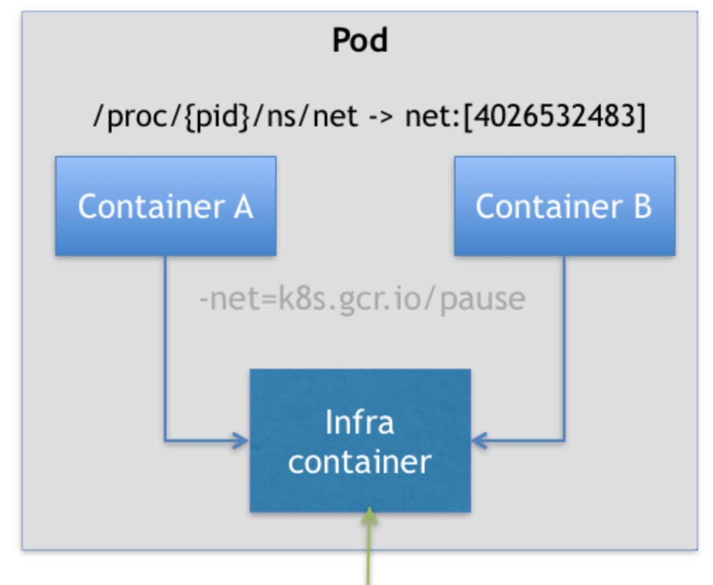
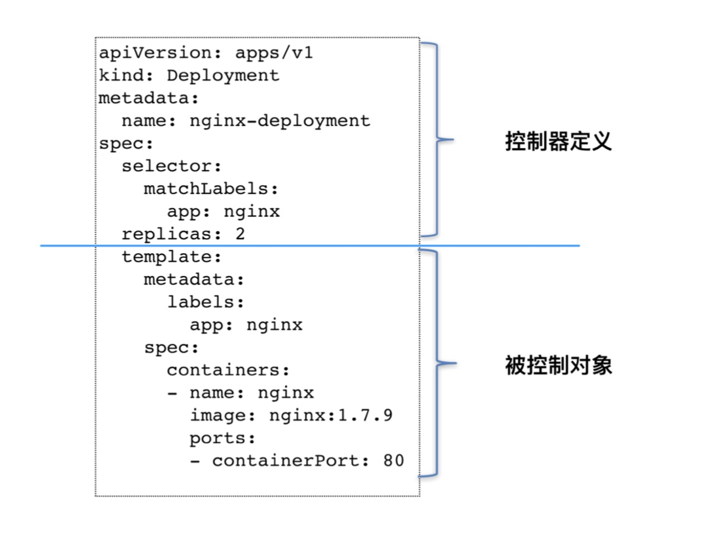
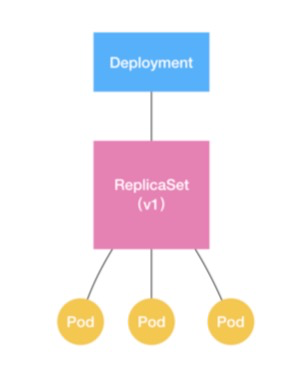
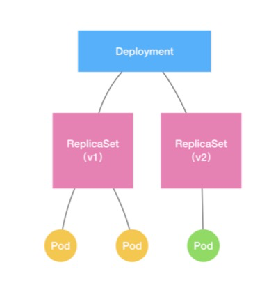
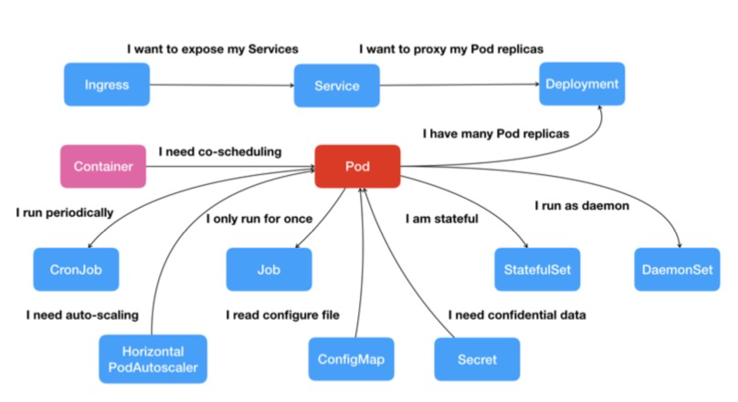

# Kubernetes

Namespace 做隔离，Cgroups 做限制，rootfs 做文件系统

容器的本质到底是什么?

容器的本质是进程。

那么 Kubernetes 呢?

Kubernetes 就是操作系统!


控制节点，即 Master 节点，由三个紧密协作的独立组件组合而成，它们分别是负责 API 服 务的 kube-apiserver、负责调度的 kube-scheduler，以及负责容器编排的 kube-controller-manager。整个集群的持久化数据，则由 kube-apiserver 处理后保存在 Ectd 中。 

而计算节点上最核心的部分，则是一个叫作 kubelet 的组件。 

在 Kubernetes 项目中，kubelet 主要负责同容器运行时(比如 Docker 项目)打交道。而这个交互所依赖的是一个称作 CRI(Container Runtime Interface) 的远程调用接口，这个接口定义了容器运行时的各项核心操作，比如:启动一个容器需要的所有参数。 

这也是为何，Kubernetes 项目并不关心你部署的是什么容器运行时、使用的什么技术实现，只要你 的这个容器运行时能够运行标准的容器镜像，它就可以通过实现 CRI 接入到 Kubernetes 项目当中。 

而具体的容器运行时，比如 Docker 项目，则一般通过 OCI 这个容器运行时规范同底层的 Linux 操 作系统进行交互，即:把 CRI 请求翻译成对 Linux 操作系统的调用(操作 Linux Namespace 和 Cgroups 等)。 

此外，kubelet 还通过 gRPC 协议同一个叫作 Device Plugin 的插件进行交互。这个插件是 Kubernetes 项目用来管理 GPU 等宿主机物理设备的主要组件，也是基于 Kubernetes 项目进行机器学习训练、高性能作业支持等工作必须关注的功能。 

而 kubelet 的另一个重要功能，则是调用网络插件和存储插件为容器配置网络和持久化存储。这两个插件与 kubelet 进行交互的接口，分别是 CNI(Container Networking Interface)和 CSI(Container Storage Interface)。

### Pod（类服务器）

在 Kubernetes 项目中，这些容器则会被划分为一个“Pod”，**Pod 里的容器共享同一个 Network Namespace、同一组数据卷，从而达到高效率交换信息的目的**。Pod，是 Kubernetes 项目的原子调度单位。

Pod 就是 Kubernetes 世界里的“应用”。而一个应用，**可以由多个容器组成。**

为了解决一些应用需要部署到同一台机子上的需求。容器之间有时存在一些亲密关系，要求部署在同一台服务器中，比如：互相之间会发生直接的文件交换、使用 localhost 或者 Socket 文件进行本地通信、会发生非常频繁的远程调用、需要共享某些 Linux Namespace。

首先，关于 Pod 最重要的一个事实是:它只是一个逻辑概念。 

也就是说，Kubernetes 真正处理的还是宿主机操作系统上 Linux 容器的 Namespace 和 Cgroups，而并不存在一个所谓的 Pod 的边界或者隔离环境。 

在 Kubernetes 项目里，Pod 的实现需要使用一个中间容器，这个容器叫作 Infra 容器。在这个 Pod 中，Infra 容器永远都是第一个被创建的容器，而其他用户定义的容器，则通过 Join Network Namespace 的方式，与 Infra 容器关联在一起。这样的组织关系，可以用下面这样一个示意图来表达:



如上图所示，这个 Pod 里有两个用户容器 A 和 B，还有一个 Infra 容器。很容易理解，在 Kubernetes 项目里，Infra 容器一定要占用极少的资源，所以它使用的是一个非常特殊的镜像，叫作:k8s.gcr.io/pause。这个镜像是一个用汇编语言编写的、永远处于“暂停”状态的容器，解压后的大小也只有 100~200 KB 左右。

这也就意味着，对于 Pod 里的容器 A 和容器 B 来说: 

- 它们可以直接使用 localhost 进行通信;
- 它们看到的网络设备跟 Infra 容器看到的完全一样; 
- 一个 Pod 只有一个 IP 地址，也就是这个 Pod 的 Network Namespace 对应的 IP 地址;
- 当然，其他的所有网络资源，都是一个 Pod 一份，并且被该 Pod 中的所有容器共享;
- Pod 的生命周期只跟 Infra 容器一致，而与容器 A 和 B 无关。

```yaml
apiVersion: v1
kind: Pod
metadata:
  name: two-containers
spec:
  restartPolicy: Never
  volumes:
  - name: shared-data
    hostPath:
      path: /data
  containers:
  - name: nginx-container
    image: nginx
    volumeMounts:
    - name: shared-data
      mountPath: /usr/share/nginx/html
  - name: debian-container
    image: debian
    volumeMounts:
    - name: shared-data
      mountPath: /pod-data
    command: ["/bin/sh"]
    args: ["-c", "echo Hello from the debian container > /pod-data/index.html"]
```

Pod 这种“超亲密关系”容器的设计思想，实际上就是希望，当用户想在一个容器里跑多个功能并不相关的应用时，应该优先考虑它们是不是更应该被描述成一个 Pod 里的多个容器。 

第一个最典型的例子是:WAR 包与 Web 服务器。 

我们现在有一个 Java Web 应用的 WAR 包，它需要被放在 Tomcat 的 webapps 目录下运行起 来。 

假如，你现在只能用 Docker 来做这件事情，那该如何处理这个组合关系呢? 

一种方法是，把 WAR 包直接放在 Tomcat 镜像的 webapps 目录下，做成一个新的镜像运行起来。可是，这时候，如果你要更新 WAR 包的内容，或者要升级 Tomcat 镜像，就要重新制作一个新的发布镜像，非常麻烦。
 另一种方法是，你压根儿不管 WAR 包，永远只发布一个 Tomcat 容器。不过，这个容器的 webapps 目录，就必须声明一个 hostPath 类型的 Volume，从而把宿主机上的 WAR 包挂载进 Tomcat 容器当中运行起来。不过，这样你就必须要解决一个问题，即:如何让每一台宿主机， 都预先准备好这个存储有 WAR 包的目录呢?这样来看，你只能独立维护一套分布式存储系统 了。 

```yaml
apiVersion: v1
kind: Pod
metadata:
  name: javaweb-2
spec:
  initContainers:
  - image: geektime/sample:v2
    name: war
    command: ["cp", "/sample.war", "/app"]
    volumeMounts:
    - mountPath: /app
      name: app-volume
  containers:
  - image: geektime/tomcat:7.0
    name: tomcat
    command: ["sh","-c","/root/apache-tomcat-7.0.42-v2/bin/start.sh"]
    volumeMounts:
    - mountPath: /root/apache-tomcat-7.0.42-v2/webapps
      name: app-volume
    ports:
    - containerPort: 8080
      hostPort: 8001
  volumes:
  - name: app-volume
    emptyDir: {}
```

在 Pod 中，所有 Init Container 定义的容器，都会比 spec.containers 定义的用户容器先启动。并且，Init Container 容器会按顺序逐一启动，而直到它们都启动并且退出了，用户容器才会启动。

所以，这个 Init Container 类型的 WAR 包容器启动后，我执行了一句 "cp /sample.war /app"， 把应用的 WAR 包拷贝到 /app 目录下，然后退出。 

而后这个 /app 目录，就挂载了一个名叫 app-volume 的 Volume。 接下来就很关键了。Tomcat 容器，同样声明了挂载 app-volume 到自己的 webapps 目录下。 

所以，等 Tomcat 容器启动时，它的 webapps 目录下就一定会存在 sample.war 文件:这个文件 正是 WAR 包容器启动时拷贝到这个 Volume 里面的，而这个 Volume 是被这两个容器共享的。 

像这样，我们就用一种“组合”方式，解决了 WAR 包与 Tomcat 容器之间耦合关系的问题。 

实际上，这个所谓的“组合”操作，正是容器设计模式里最常用的一种模式，它的名字叫: **sidecar。** 

顾名思义，sidecar 指的就是我们可以在一个 Pod 中，启动一个辅助容器，来完成一些独立于主进程(主容器)之外的工作。

比如，在我们的这个应用 Pod 中，Tomcat 容器是我们要使用的主容器，而 WAR 包容器的存在，只是为了给它提供一个 WAR 包而已。所以，我们用 Init Container 的方式优先运行 WAR 包容器，扮演了一个 sidecar 的角色。

[容器设计模式](https://www.usenix.org/sites/default/files/conference/protected-files/hotcloud16_slides_burns.pdf)

Pod 扮演的是传统部署环境里“虚拟机”的角色。这样的设计，是为了使用户从传统环境(虚拟机环境)向Kubernetes(容器环境)的迁移，更加平滑。

而如果你能把 Pod 看成传统环境里的“机器”、把容器看作是运行在这个“机器”里的“用户程序”，那么很多关于 Pod 对象的设计就非常容易理解了。

比如，凡是调度、网络、存储，以及安全相关的属性，基本上是 Pod 级别的。

NodeSelector:是一个供用户将 Pod 与 Node 进行绑定的字段，用法如下所示:

```yaml
apiVersion: v1
kind: Pod
...
spec:
 nodeSelector:
 disktype: ssd
```

这样的一个配置，意味着这个 Pod 永远只能运行在携带了“disktype: ssd”标签(Label)的节点上;否则，它将调度失败。

NodeName:一旦 Pod 的这个字段被赋值，Kubernetes 项目就会被认为这个 Pod 已经经过了调度，调度的结果就是赋值的节点名字。所以，这个字段一般由调度器负责设置，但用户也可以设置它来“骗过”调度器，当然这个做法一般是在测试或者调试的时候才会用到。

HostAliases:定义了 Pod 的 hosts 文件(比如 /etc/hosts)里的内容，用法如下:

```yaml
apiVersion: v1
kind: Pod
...
spec:
  hostAliases:
  - ip: "10.1.2.3"
    hostnames:
    - "foo.remote"
    - "bar.remote"
...
```

在 Kubernetes 项目中，如果要设置 hosts 文件里的内容，一定要通过这种方法。否则，如果直接修改了 hosts 文件的话，在 Pod 被删除重建之后，kubelet 会自动覆盖掉被修改的内容。

除了上述跟“机器”相关的配置外，你可能也会发现，凡是跟容器的 Linux Namespace 相关的属性，也一定是 Pod 级别的。这个原因也很容易理解:Pod 的设计，就是要让它里面的容器尽可能多地共享 Linux Namespace，仅保留必要的隔离和限制能力。这样，Pod 模拟出的效果，就跟虚拟机里程序间的关系非常类似了。 

举个例子，在下面这个 Pod 的 YAML 文件中，我定义了 shareProcessNamespace=true: 

```yaml
apiVersion: v1
kind: Pod
metadata:
 name: nginx
spec:
 shareProcessNamespace: true
 containers:
 - name: nginx
 image: nginx
 - name: shell
 image: busybox
 stdin: true
 tty: true
```

这就意味着这个 Pod 里的容器要共享 PID Namespace。

在 Pod 的 YAML 文件里声明开启它们俩，其实等同于设置了 docker run 里的 -it(-i 即 stdin，-t 即 tty)参数。 

如果你还是不太理解它们俩的作用的话，可以直接认为 tty 就是 Linux 给用户提供的一个常驻小程 序，用于接收用户的标准输入，返回操作系统的标准输出。当然，为了能够在 tty 中输入信息，你还需要同时开启 stdin(标准输入流)。 

Kubernetes 项目中对 Container 的定义，和 Docker 相比并没有什么太大区别。我在前面的容器
技术概念入门系列文章中，和你分享的 Image(镜像)、Command(启动命令)、workingDir(容器的工作目录)、Ports(容器要开发的端口)，以及 volumeMounts(容器要挂载的 Volume)都是构成 Kubernetes 项目中 Container 的主要字段。不过在这里，还有这么几个属性值得你额外关注。

首先，是 ImagePullPolicy 字段。它定义了镜像拉取的策略。而它之所以是一个 Container 级别的 属性，是因为容器镜像本来就是 Container 定义中的一部分。 

ImagePullPolicy 的值默认是 Always，即每次创建 Pod 都重新拉取一次镜像。另外，当容器的镜像是类似于 nginx 或者 nginx:latest 这样的名字时，ImagePullPolicy 也会被认为 Always。 

而如果它的值被定义为 Never 或者 IfNotPresent，则意味着 Pod 永远不会主动拉取这个镜像，或者只在宿主机上不存在这个镜像时才拉取。 

其次，是 Lifecycle 字段。它定义的是 Container Lifecycle Hooks。顾名思义，Container Lifecycle Hooks 的作用，是在容器状态发生变化时触发一系列“钩子”。我们来看这样一个例子:

```yaml
apiVersion: v1
kind: Pod
metadata:
  name: lifecycle-demo
spec:
  containers:
  - name: lifecycle-demo-container
    image: nginx
    lifecycle:
      postStart:
        exec:
          command: ["/bin/sh", "-c", "echo Hello from the postStart handler > /usr/share/message"
      preStop:
        exec:
          command: ["/usr/sbin/nginx","-s","quit"]
```

postStart 它指的是，在容器启动后，立刻执行一个指定的操作。需要明确的是，postStart 定义的操作，虽然是在 Docker 容器 ENTRYPOINT 执行之后，但它并不严格保证顺序。
也就是说，在 postStart 启动时，ENTRYPOINT 有可能还没有结束。

而类似地，preStop 发生的时机，则是容器被杀死之前(比如，收到了 SIGKILL 信号)。而需要明确的是，preStop 操作的执行，是同步的。所以，它会阻塞当前的容器杀死流程，直到这个 Hook 定义操作完成之后，才允许容器被杀死，这跟 postStart 不一样。

Pod 生命周期的变化，主要体现在 Pod API 对象的Status 部分，这是它除了 Metadata 和 Spec 之外的第三个重要字段。其中，pod.status.phase，就是 Pod 的当前状态，它有如下几种可能的情况: 

1. Pending。这个状态意味着，Pod 的 YAML 文件已经提交给了 Kubernetes，API 对象已经被创建并保存在 Etcd 当中。但是，这个 Pod 里有些容器因为某种原因而不能被顺利创建。比如，调度不成功。 
2. Running。这个状态下，Pod 已经调度成功，跟一个具体的节点绑定。它包含的容器都已经创 建成功，并且至少有一个正在运行中。 
3. Succeeded。这个状态意味着，Pod 里的所有容器都正常运行完毕，并且已经退出了。这种情 况在运行一次性任务时最为常见。 
4. Failed。这个状态下，Pod 里至少有一个容器以不正常的状态(非 0 的返回码)退出。这个状 态的出现，意味着你得想办法 Debug 这个容器的应用，比如查看 Pod 的 Events 和日志。 
5. Unknown。这是一个异常状态，意味着 Pod 的状态不能持续地被 kubelet 汇报给 kube- apiserver，这很有可能是主从节点(Master 和 Kubelet)间的通信出现了问题。 

更进一步地，Pod 对象的 Status 字段，还可以再细分出一组 Conditions。这些细分状态的值包 括:PodScheduled、Ready、Initialized，以及 Unschedulable。它们主要用于描述造成当前 Status 的具体原因是什么。 

比如，Pod 当前的 Status 是 Pending，对应的 Condition 是 Unschedulable，这就意味着它的调 度出现了问题。 

而其中，Ready 这个细分状态非常值得我们关注:它意味着 Pod 不仅已经正常启动(Running 状 态)，而且已经可以对外提供服务了。这两者之间(Running 和 Ready)是有区别的，你不妨仔细 思考一下。 

Pod 的这些状态信息，是我们判断应用运行情况的重要标准，尤其是 Pod 进入了非“Running”状 态后，你一定要能迅速做出反应，根据它所代表的异常情况开始跟踪和定位，而不是去手忙脚乱地 查阅文档。 

作为 Kubernetes 项目里最核心的编排对象，Pod 携带的信息非常丰富。其中，资源定义(比如 CPU、内存等)，以及调度相关的字段，我会在后面专门讲解调度器时再进行深入的分析。在本篇，我们就先从一种特殊的 Volume 开始，来帮助你更加深入地理解 Pod 对象各个重要字段的含 义。 

这种特殊的 Volume，叫作 Projected Volume，你可以把它翻译为“投射数据卷”。 

这些特殊 Volume 的作用，是为容器提供预先定义好的数据。所以，从容器的角度来看，这些 Volume 里的信息就是仿佛是被 Kubernetes“投射”(Project)进入容器当中的。这正是 Projected Volume 的含义。

到目前为止，Kubernetes 支持的 Projected Volume 一共有四种: 

1. Secret;
2. ConfigMap;
3. Downward API; 

4. ServiceAccountToken；

Secret

它的作用，是帮你把 Pod 想要访问的加密数据，存放到 Etcd 中。然后，你就可以通过在 Pod 的容器里挂载 Volume 的方式，访问到这些 Secret 里保存的信息了。

```yaml
apiVersion: v1
kind: Pod
metadata:
  name: test-projected-volume
spec:
  containers:
  - name: test-secret-volume
    image: busybox
    args:
    - sleep
    - "86400"
    volumeMounts:
    - name: mysql-cred
      mountPath: "/projected-volume"
      readOnly: true
  volumes:
  - name: mysql-cred
    projected:
      sources:
      - secret:
          name: user
      - secret:
          name: pass
```

在这个 Pod 中，我定义了一个简单的容器。它声明挂载的 Volume，并不是常见的 emptyDir 或者 hostPath 类型，而是 projected 类型。而这个 Volume 的数据来源(sources)，则是名为 user 和 pass 的 Secret 对象，分别对应的是数据库的用户名和密码。

```shell
$ cat ./username.txt
admin
$ cat ./password.txt
c1oudc0w!
$ kubectl create secret generic user --from-file=./username.txt
$ kubectl create secret generic pass --from-file=./password.txt
```

其中，username.txt 和 password.txt 文件里，存放的就是用户名和密码；而 user 和 pass，则是我为 Secret 对象指定的名字。而我想要查看这些 Secret 对象的话，只要执行一条 kubectl get 命令就可以了:

```shell
$ kubectl get secrets
```

当然，除了使用 kubectl create secret 指令外，我也可以直接通过编写 YAML 文件的方式来创建这个 Secret 对象，比如:

```yaml
apiVersion: v1
kind: Secret
metadata:
  name: mysecret
type: Opaque
data:
	user: YWRtaW4=
  pass: MWYyZDFlMmU2N2Rm
```

Secret 对象要求这些数据必须是经过 Base64 转码的，以免出现明文密码的安全隐患。

```shell
$ echo -n 'admin' | base64
YWRtaW4=
$ echo -n '1f2d1e2e67df' | base64
MWYyZDFlMmU2N2Rm
```

这里需要注意的是，像这样创建的 Secret 对象，它里面的内容仅仅是经过了转码，而并没有被加密。在真正的生产环境中，你需要在 Kubernetes 中开启 Secret 的加密插件，增强数据的安全性。关于开启 Secret 加密插件的内容，我会在后续专门讲解 Secret 的时候，再做进一步说明。

```shell
$ kubectl create -f test-projected-volume.yaml
```

当 Pod 变成 Running 状态之后，我们再验证一下这些 Secret 对象是不是已经在容器里了:

```shell
$ kubectl exec -it test-projected-volume -- /bin/sh
$ ls /projected-volume/
user
pass
$ cat /projected-volume/user
root
$ cat /projected-volume/pass
1f2d1e2e67df
```

从返回结果中，我们可以看到，保存在 Etcd 里的用户名和密码信息，已经以文件的形式出现在了容器的 Volume 目录里。而这个文件的名字，就是 kubectl create secret 指定的 Key。

更重要的是，像这样通过挂载方式进入到容器里的 Secret，一旦其对应的 Etcd 里的数据被更新， 这些 Volume 里的文件内容，同样也会被更新。其实，这是 kubelet 组件在定时维护这些 Volume。 

需要注意的是，这个更新可能会有一定的延时。所以在编写应用程序时，在发起数据库连接的代码处写好重试和超时的逻辑，绝对是个好习惯。

ConfigMap

Secret 类似的是 ConfigMap，它与 Secret 的区别在于，ConfigMap 保存的是不需要加密的、应用所需的配置信息。而 ConfigMap 的用法几乎与 Secret 完全相同。

```shell
# .properties 文件的内容
$ cat example/ui.properties color.good=purple color.bad=yellow allow.textmode=true how.nice.to.look=fairlyNice
# 从.properties 文件创建 ConfigMap
$ kubectl create configmap ui-config --from-file=example/ui.properties
# 查看这个 ConfigMap 里保存的信息 (data)
$ kubectl get configmaps ui-config -o yaml apiVersion: v1
data:
  ui.properties: |
    color.good=purple
    color.bad=yellow
    allow.textmode=true
    how.nice.to.look=fairlyNice
kind: ConfigMap
metadata:
  name: ui-config
  ...
```

> kubectl get -o yaml 这样的参数，会将指定的 Pod API 对象以 YAML 的方式展示出来。

Downward API

让 Pod 里的容器能够直接获取到这个 Pod API 对象本身的信息。

```yaml
apiVersion: v1
kind: Pod
metadata:
 name: test-downwardapi-volume
 labels:
 zone: us-est-coast
 cluster: test-cluster1
 rack: rack-22
spec:
 containers:
 - name: client-container
 image: k8s.gcr.io/busybox
 command: ["sh", "-c"]
 args:
 - while true; do
          if [[ -e /etc/podinfo/labels ]]; then
            echo -en '\n\n'; cat /etc/podinfo/labels; fi;
          sleep 5;
        done;
 volumeMounts:
 - name: podinfo
 mountPath: /etc/podinfo
 readOnly: false
 volumes:
 - name: podinfo
 projected:
 sources:
 - downwardAPI:
 items:
 - path: "labels"
fieldRef:
fieldPath: metadata.labels
```

在这个 Pod 的 YAML 文件中，我定义了一个简单的容器，声明了一个 projected 类型的 Volume。只不过这次 Volume 的数据来源，变成了 Downward API。而这个 Downward API Volume，则声明了要暴露 Pod 的 metadata.labels 信息给容器。 

通过这样的声明方式，当前 Pod 的 Labels 字段的值，就会被 Kubernetes 自动挂载成为容器里的 /etc/podinfo/labels 文件。 

可以通过 kubectl logs 指令，查看到这些 Labels 字段被打印出来。

Downward API 支持的字段

```yaml
1. 使用 fieldRef 可以声明使用:
spec.nodeName - 宿主机名字
status.hostIP - 宿主机 IP
metadata.name - Pod 的名字
metadata.namespace - Pod 的 Namespace
status.podIP - Pod 的 IP
spec.serviceAccountName - Pod 的 Service Account 的名字 metadata.uid - Pod 的 UID
metadata.labels['<KEY>'] - 指定 <KEY> 的 Label 值 metadata.annotations['<KEY>'] - 指定 <KEY> 的 Annotation 值 metadata.labels - Pod 的所有 Label
metadata.annotations - Pod 的所有 Annotation
2. 使用 resourceFieldRef 可以声明使用: 
容器的 CPU limit
容器的 CPU request 
容器的 memory limit
容器的 memory request
```

需要注意的是，Downward API 能够获取到的信息，一定是 Pod 里的容器进程启动之前就能够确定下来的信息。而如果你想要获取 Pod 容器运行后才会出现的信息，比如，容器进程的 PID，那就肯定不能使用 Downward API 了，而应该考虑在 Pod 里定义一个 sidecar 容器。

其实，Secret、ConfigMap，以及 Downward API 这三种 Projected Volume 定义的信息，大多还可以通过环境变量的方式出现在容器里。但是，通过环境变量获取这些信息的方式，不具备自动更新的能力。所以，一般情况下，我都建议你使用 Volume 文件的方式获取这些信息。

Service Account

相信你一定有过这样的想法:我现在有了一个 Pod，我能不能在这个 Pod 里安装一个 Kubernetes 

的 Client，这样就可以从容器里直接访问并且操作这个 Kubernetes 的 API 了呢? 这当然是可以的。
 不过，你首先要解决 API Server 的授权问题。 

Service Account 对象的作用，就是 Kubernetes 系统内置的一种“服务账户”，它是 Kubernetes 进行权限分配的对象。比如，Service Account A，可以只被允许对 Kubernetes API 进行 GET 操 作，而 Service Account B，则可以有 Kubernetes API 的所有操作的权限。 

像这样的 Service Account 的授权信息和文件，实际上保存在它所绑定的一个特殊的 Secret 对象里 的。这个特殊的 Secret 对象，就叫作ServiceAccountToken。任何运行在 Kubernetes 集群上的应用，都必须使用这个 ServiceAccountToken 里保存的授权信息，也就是 Token，才可以合法地访问 API Server。 

所以说，Kubernetes 项目的 Projected Volume 其实只有三种，因为第四种 ServiceAccountToken，只是一种特殊的 Secret 而已。 

另外，为了方便使用，Kubernetes 已经为你提供了一个的默认“服务账户”(default Service Account)。并且，任何一个运行在 Kubernetes 里的 Pod，都可以直接使用这个默认的 Service Account，而无需显示地声明挂载它。 

这是如何做到的呢?

当然还是靠 Projected Volume 机制。 

如果你查看一下任意一个运行在 Kubernetes 集群里的 Pod，就会发现，每一个 Pod，都已经自动声明一个类型是 Secret、名为 default-token-xxxx 的 Volume，然后 自动挂载在每个容器的一个 固定目录上。比如: 

```
$ kubectl describe pod nginx-deployment-5c678cfb6d-lg9lw
Containers:
... Mounts:
      /var/run/secrets/kubernetes.io/serviceaccount from default-token-s8rbq (ro)
Volumes:
    default-token-s8rbq:
    Type:       Secret (a volume populated by a Secret)
    SecretName:  default-token-s8rbq
    Optional:    false
```

这个 Secret 类型的 Volume，正是默认 Service Account 对应的 ServiceAccountToken。所以说，Kubernetes 其实在每个 Pod 创建的时候，自动在它的 spec.volumes 部分添加上了默认 ServiceAccountToken 的定义，然后自动给每个容器加上了对应的 volumeMounts 字段。这个过程对于用户来说是完全透明的。 

这样，一旦 Pod 创建完成，容器里的应用就可以直接从这个默认 ServiceAccountToken 的挂载目录里访问到授权信息和文件。这个容器内的路径在 Kubernetes 里是固定的， 即:/var/run/secrets/kubernetes.io/serviceaccount ，而这个 Secret 类型的 Volume 里面的内容如下所示: 

```
$ ls /var/run/secrets/kubernetes.io/serviceaccount
ca.crt namespace  token
```

所以，你的应用程序只要直接加载这些授权文件，就可以访问并操作 Kubernetes API 了。而且，如果你使用的是 Kubernetes 官方的 Client 包(k8s.io/client-go)的话，它还可以自动加载这个目录下的文件，你不需要做任何配置或者编码操作。

这种把 Kubernetes 客户端以容器的方式运行在集群里，然后使用 default Service Account 自动 授权的方式，被称作“InClusterConfig”，也是我最推荐的进行 Kubernetes API 编程的授权方 式。 

当然，考虑到自动挂载默认 ServiceAccountToken 的潜在风险，Kubernetes 允许你设置默认不为 Pod 里的容器自动挂载这个 Volume。 

除了这个默认的 Service Account 外，我们很多时候还需要创建一些我们自己定义的 Service Account，来对应不同的权限设置。这样，我们的 Pod 里的容器就可以通过挂载这些 Service Account 对应的 ServiceAccountToken，来使用这些自定义的授权信息。在后面讲解为 Kubernetes 开发插件的时候，我们将会实践到这个操作。 

#### 容器健康检查和恢复机制

在 Kubernetes 中，你可以为 Pod 里的容器定义一个健康检查“探针”(Probe)。这样，kubelet 就会根据这个 Probe 的返回值决定这个容器的状态，而不是直接以容器进行是否运行(来自 Docker 返回的信息)作为依据。这种机制，是生产环境中保证应用健康存活的重要手段。

```yaml
apiVersion: v1
kind: Pod
metadata:
 labels:
 test: liveness
 name: test-liveness-exec
spec:
 containers:
  - name: liveness
 image: busybox
 args:
    - /bin/sh
    - -c
    - touch /tmp/healthy; sleep 30; rm -rf /tmp/healthy; sleep 600
 livenessProbe:
 exec:
 command:
        - cat
        - /tmp/healthy
 initialDelaySeconds: 5
 periodSeconds: 5
```

在这个 Pod 中，我们定义了一个有趣的容器。它在启动之后做的第一件事，就是在 /tmp 目录下创 建了一个 healthy 文件，以此作为自己已经正常运行的标志。而 30 s 过后，它会把这个文件删除 掉。 

与此同时，我们定义了一个这样的 livenessProbe(健康检查)。它的类型是 exec，这意味着，它会在容器启动后，在容器里面执行一句我们指定的命令，比如:“cat /tmp/healthy”。这时，如果这个文件存在，这条命令的返回值就是 0，Pod 就会认为这个容器不仅已经启动，而且是健康的。这个健康检查，在容器启动 5 s 后开始执行(initialDelaySeconds: 5)，每 5 s 执行一次 (periodSeconds: 5)。 如果  /tmp 下文件不存在说明 pod 已经不健康了。

Kubernetes 里的Pod 恢复机制，也叫 restartPolicy。它是 Pod 的 Spec 部分的一个标准字段(pod.spec.restartPolicy)，默认值是 Always，即:任何时候这个容器发生了异常，它一定会被重新创建。

但一定要强调的是，Pod 的恢复过程，永远都是发生在当前节点上，而不会跑到别的节点上去。事实上，一旦一个 Pod 与一个节点(Node)绑定，除非这个绑定发生了变化(pod.spec.node 字段被修改)，否则它永远都不会离开这个节点。这也就意味着，如果这个宿主机宕机了，这个 Pod 也不会主动迁移到其他节点上去。

而如果你想让 Pod 出现在其他的可用节点上，就必须使用 Deployment 这样的“控制器”来管理 Pod，哪怕你只需要一个 Pod 副本。即一个单 Pod 的 Deployment 与一个 Pod 最主要的区别。 

而作为用户，你还可以通过设置 restartPolicy，改变 Pod 的恢复策略。除了 Always，它还有 OnFailure 和 Never 两种情况: 

- Always:在任何情况下，只要容器不在运行状态，就自动重启容器; 

- OnFailure: 只在容器异常时才自动重启容器;

- Never: 从来不重启容器 

值得一提的是，Kubernetes 的官方文档，把 restartPolicy 和 Pod 里容器的状态，以及 Pod 状态 的对应关系，总结了非常复杂的一大堆情况。实际上，你根本不需要死记硬背这些对应关系，只要 记住如下两个基本的设计原理即可: 

1. 只要 Pod 的 restartPolicy 指定的策略允许重启异常的容器(比如:Always)，那么这个 Pod 就会保持 Running 状态，并进行容器重启。否则，Pod 就会进入 Failed 状态 。 
2. 对于包含多个容器的 Pod，只有它里面所有的容器都进入异常状态后，Pod 才会进入 Failed 状 态。在此之前，Pod 都是 Running 状态。此时，Pod 的 READY 字段会显示正常容器的个数， 比如: 

```
$ kubectl get pod test-liveness-exec
NAME           READY     STATUS    RESTARTS   AGE
liveness-exec   0/1       Running   1          1m
```

所以，假如一个 Pod 里只有一个容器，然后这个容器异常退出了。那么，只有当 restartPolicy=Never 时，这个 Pod 才会进入 Failed 状态。而其他情况下，由于 Kubernetes 都可 以重启这个容器，所以 Pod 的状态保持 Running 不变。 

而如果这个 Pod 有多个容器，仅有一个容器异常退出，它就始终保持 Running 状态，哪怕即使 restartPolicy=Never。只有当所有容器也异常退出之后，这个 Pod 才会进入 Failed 状态。 

preset.yaml

开发人员只需要提交一个基本的、非常简单的 Pod YAML，Kubernetes 自动给对应的 Pod 对象加上其他必要的信息。

运维人员就可以定义一个 PodPreset 对象。在这个对象中，凡是他想在开发人员编写的 Pod 里追加的字段，都可以预先定义好。比如这个 preset.yaml:

```
apiVersion: settings.k8s.io/v1alpha1
kind: PodPreset
metadata:
  name: allow-database
spec:
  selector:
    matchLabels:
      role: frontend
  env:
    - name: DB_PORT
      value: "6379"
  volumeMounts:
    - mountPath: /cache
      name: cache-volume
  volumes:
    - name: cache-volume
      emptyDir: {}
```

在这个 PodPreset 的定义中，首先是一个 selector。这就意味着后面这些追加的定义，只会作用于 selector 所定义的、带有“role: frontend”标签的 Pod 对象，这就可以防止“误伤”。 

然后，我们定义了一组 Pod 的 Spec 里的标准字段，以及对应的值。比如，env 里定义了 DB_PORT 这个环境变量，volumeMounts 定义了容器 Volume 的挂载目录，volumes 定义了一 个 emptyDir 的 Volume。 

接下来，我们假定运维人员先创建了这个 PodPreset，然后开发人员才创建 Pod:

```
$ kubectl create -f preset.yaml
$ kubectl create -f pod.yaml
```

```yaml
$ kubectl get pod website -o yaml
apiVersion: v1
kind: Pod
metadata:
 name: website
 labels:
 app: website
 role: frontend
 annotations:
    podpreset.admission.kubernetes.io/podpreset-allow-database: "resource version"
spec:
 containers:
 - name: website
 image: nginx
 volumeMounts:
 - mountPath: /cache
 name: cache-volume
 ports:
 - containerPort: 80
 env:
 - name: DB_PORT
 value: "6379"
 volumes:
 - name: cache-volume
 emptyDir: {}
```

### Controller

用于控制 Pod 的对象。控制器对象本身，负责定义被管理对象的期望状态。

```yaml
apiVersion: apps/v1
kind: Deployment
metadata:
  name: nginx-deployment
spec:
  selector:
    matchLabels:
      app: nginx
  replicas: 2
  template:
    metadata:
      labels:
        app: nginx
    spec:
      containers:
      - name: nginx
        image: nginx:1.7.9
        ports:
        - containerPort: 80
```

如果在这个集群中，携带 app=nginx 标签的 Pod 的个数大于 2 的时候，就会有旧的 Pod 被删除;反之，就会有新的 Pod 被创建。Deployment 就是控制器的一种。这些控制器之所以被统一放在 pkg/controller 目录下，就是因为它们都遵循 Kubernetes
项目中的一个通用编排模式，即:控制循环(control loop)或者叫调谐循环（Reconcile Loop）。

查看控制器列表

```
cd kubernetes/pkg/controller/
$ ls -d */
```

以 Deployment 为例，我和你简单描述一下它对控制器模型的实现:

1. Deployment 控制器从 Etcd 中获取到所有携带了“app: nginx”标签的 Pod，然后统计它们 的数量，这就是实际状态; 
2. Deployment 对象的 Replicas 字段的值就是期望状态; 
3. Deployment 控制器将两个状态做比较，然后根据比较结果，确定是创建 Pod，还是删除已有 的 Pod(具体如何操作 Pod 对象，我会在下一篇文章详细介绍)。 

一个 Kubernetes 对象的主要编排逻辑，实际上是在第三步的“对比”阶段完成的。

这个操作，通常被叫作调谐(Reconcile)。这个调谐的过程，则被称作“Reconcile Loop”(调谐循环)或者“Sync Loop”(同步循环)。

在这里存在被控制者和控制者两方，而被控制对象的定义，则来自于一个“模板”。比如，Deployment 里的 template 字段。所有被这个 Deployment 管理的 Pod 实例，其实都是根据这个 template 字段的内容创建出来的。

像 Deployment 定义的 template 字段，在 Kubernetes 项目中有一个专有的名字，叫作 PodTemplate(Pod 模板)。

被控制性对象信息就被存在 Ectd 中。



这就是为什么，在所有 API 对象的 Metadata 里，都有一个字段叫作 ownerReference，用于保存当前这个 API 对象的拥有者(Owner)的信息。对于一个 Deployment 所管理的 Pod，它的 ownerReference 是 ReplicaSet。

#### 滚动更新

K8S 通过 Deployment 实现了 pod 滚动更新。Deployment 控制器实际操纵的是 ReplicaSet 对象，而不是 Pod 对象。

```yaml
apiVersion: apps/v1
kind: Deployment
metadata:
  name: nginx-deployment
  labels:
    app: nginx
spec:
  replicas: 3  # 副本个数是3
  selector:
    matchLabels:
      app: nginx
  template:
    metadata:
      labels:
        app: nginx
    spec:
      containers:
      - name: nginx
        image: nginx:1.7.9
        ports:
        - containerPort: 80
```

 

ReplicaSet 负责通过“控制器模式”，保证系统中 Pod 的个数永远等于指定的个数(比如，3 个)。这也正是 Deployment 只允许容器的 restartPolicy=Always 的主要原因:只有在容器能保证自己始终是 Running 状态的前提下，ReplicaSet 调整 Pod 的个数才有意义。

“水平扩展 / 收缩”非常容易实现，Deployment Controller 只需要修改它所控制的ReplicaSet 的 Pod 副本个数就可以了。

```
kubectl scale deployment nginx-deployment --replicas=4
```

滚动更新

```shell
# --record 参数。它的作用，是记录下你每次操作所执行的命令
kubectl create -f nginx-deployment.yaml --record
```

查看创建后的状态

```shell
kubectl get deployments
```

在返回结果中，我们可以看到四个状态字段，它们的含义如下所示。

1. DESIRED:用户期望的 Pod 副本个数(spec.replicas 的值); 
2. CURRENT:当前处于 Running 状态的 Pod 的个数; 
3. UP-TO-DATE:当前处于最新版本的 Pod 的个数，所谓最新版本指的是 Pod 的 Spec 部分 与 Deployment 里 Pod 模板里定义的完全一致; 
4. AVAILABLE:当前已经可用的 Pod 的个数，即:既是 Running 状态，又是最新版本，并且已经处于 Ready(健康检查正确)状态的 Pod 的个数。 

可以看到，只有这个 AVAILABLE 字段，描述的才是用户所期望的最终状态。 

而 Kubernetes 项目还为我们提供了一条指令，让我们可以实时查看 Deployment 对象的状态变化。

```shell
kubectl rollout status deployment/nginx-deployment
NAME               DESIRED   CURRENT   UP-TO-DATE   AVAILABLE   AGE
nginx-deployment   3         3         3            3           20s
```

查看一下这个 Deployment 所控制的 ReplicaSet

```shell
kubectl get rs
NAME                          DESIRED   CURRENT   READY   AGE
nginx-deployment-3167673210   3         3         3       20s
```

ReplicaSet 的名字，则是由 Deployment 的名字和一个随机字符串共同组成。这个随机字符串叫作 pod-template-hash，在我们这个例子里就是:3167673210。而 ReplicaSet 的 DESIRED、CURRENT 和 READY 字段的含义，和 Deployment 中是一致
的。

当你修改了 Deployment 里的 Pod 定义之后，Deployment Controller 会 使用这个修改后的 Pod 模板，创建一个新的 ReplicaSet(hash=1764197365)，这个新的 ReplicaSet 的初始 Pod 副本数是:0。 

如此交替进行，新 ReplicaSet 管理的 Pod 副本数，从 0 个变成 1 个，再变成 2 个，最后变成 3 个。而旧的 ReplicaSet 管理的 Pod 副本数则从 3 个变成 2 个，再变成 1 个，最后变成 0 个。这样，就完成了这一组 Pod 的版本升级过程。

然后，在 Age=24 s 的位置，Deployment Controller 开始将这个新的 ReplicaSet 所控制的 Pod 副本数从 0 个变成 1 个，即:“水平扩展”出一个副本。 

在这个“滚动更新”过程完成之后，你可以查看一下新、旧两个 ReplicaSet 的最终状态:

```shell
$ kubectl get rs
NAME                          DESIRED   CURRENT   READY   AGE
nginx-deployment-1764197365   3         3         3       6s
nginx-deployment-3167673210   0         0         0       30s
```

修改 Deployment 方法：

- kubectl edit 指令编辑 Etcd 里的 API 对象。kubectl edit 指令编辑完成后，保存退出，Kubernetes 就会立刻触发“滚动更新”的过程
- kubectl set image

```shell
kubectl set image deployment/nginx-deployment nginx=nginx:1.91
```

而为了进一步保证服务的连续性，Deployment Controller 还会确保，在任何时间窗口内，只有指定比例的 Pod 处于离线状态。同时，它也会确保，在任何时间窗口内，只有指定比例的新 Pod 被创建出来。这两个比例的值都是可以配置的，默认都是 DESIRED 值的 25%。 

所以，在上面这个 Deployment 的例子中，它有 3 个 Pod 副本，那么控制器在“滚动更 新”的过程中永远都会确保至少有 2 个 Pod 处于可用状态，至多只有 4 个 Pod 同时存在于集群中。这个策略，是 Deployment 对象的一个字段，名叫 RollingUpdateStrategy，如下所 示: 

```
spec:
...
  strategy:
    type: RollingUpdate
    rollingUpdate:
      maxSurge: 1
      maxUnavailable: 1
```

在上面这个 RollingUpdateStrategy 的配置中，maxSurge 指定的是除了 DESIRED 数量之 外，在一次“滚动”中，Deployment 控制器还可以创建多少个新 Pod;而 maxUnavailable 指的是，在一次“滚动”中，Deployment 控制器可以删除多少个旧 Pod。 

同时，这两个配置还可以用前面我们介绍的百分比形式来表示，比如: maxUnavailable=50%，指的是我们最多可以一次删除“50%*DESIRED 数量”个 Pod。 



回滚

我们只需要执行一条 kubectl rollout undo 命令，就能把整个 Deployment 回滚到上一个版本:

```shell
kubectl rollout undo deployment/nginx-deployment
```

原先 ReplicaSet 将再次 “扩展” 成 3个 Pod，而让新的 ReplicaSet 重新“收缩”到 0 个 Pod。

如果我们需要指定版本回退呢？

我需要使用 kubectl rollout history 命令，查看每次 Deployment 变更对应的版本。而由于我们在创建这个 Deployment 的时候，指定了–record 参数，所以我们创建这些版本时执行的 kubectl 命令，都会被记录下来。

```shell
kubectl rollout history deployment/nginx-deployment
deployments "nginx-deployment"
REVISION    CHANGE-CAUSE
1           kubectl create -f nginx-deployment.yaml --record
2           kubectl edit deployment/nginx-deployment
3           kubectl set image deployment/nginx-deployment nginx=nginx:1.91
```

你还可以通过这个 kubectl rollout history 指令，看到每个版本对应的 Deployment 的 API 对象的细节。

```shell
kubectl rollout history deployment/nginx-deployment --revision=2
```

然后，我们就可以在 kubectl rollout undo 命令行最后，加上要回滚到的指定版本的版本号，就可以回滚到指定版本了。这个指令的用法如下:

```shell
kubectl rollout undo deployment/nginx-deployment --to-revision=2
```

每次滚动升级的时候都会创建一个新的 ReplicaSet 对象，避免资源的浪费，能否沿用当前的呢？

1. Deployment 进入了一个“暂停”状态
2. 对 Deployment 修改
3. Deployment “恢复”回来

```shell
# pause deployment
kubectl rollout pause deployment/nginx-deployment
# resume deployment
kubectl rollout resume deployment/nginx-deployment
```

那么，我们又该如何控制这些“历史”ReplicaSet 的数量呢? 

很简单，Deployment 对象有一个字段，叫作 spec.revisionHistoryLimit，就是 Kubernetes 为 Deployment 保留的“历史版本”个数。所以，如果把它设置为 0，你就再也不能做回滚操 作了。 

#### DaemonSet

DaemonSet 其实是一个非常简单的控制器。在它的控制循环中，只需要遍历所有节点，然后根据节点上是否有被管理 Pod 的情况，来决定是否要创建或者删除一个 Pod。 

只不过，在创建每个 Pod 的时候，DaemonSet 会自动给这个 Pod 加上一个 nodeAffinity，从而保证这个 Pod 只会在指定节点上启动。同时，它还会自动给这个 Pod 加上一个 Toleration，从而忽略节点的 unschedulable“污点”。 

当然，你也可以在 Pod 模板里加上更多种类的 Toleration，从而利用 DaemonSet 实现自己的目的。

```shell
1 tolerations:
2 - key: node-role.kubernetes.io/master 
3 effect: NoSchedule
```

### Job

用来描述离线业务的 API 对象。

```yaml
apiVersion: batch/v1
kind: Job
metadata:
  name: pi
spec:
  template:
    spec:
      containers:
      - name: pi
        image: resouer/ubuntu-bc
        command: ["sh", "-c", "echo 'scale=10000; 4*a(1)' | bc -l "]
      restartPolicy: Never
  backoffLimit: 4
```

这个 Job 对象在创建后，它的 Pod 模板，被自动加上了一个 controller-uid=< 一 个随机字符串 > 这样的 Label。而这个 Job 对象本身，则被自动加上了这个 Label 对应的 Selector，从而保证了 Job 与它所管理的 Pod 之间的匹配关系。

restartPolicy 在 Job 对象里只允许被设置为 Never 和 OnFailure。离线计算的 Pod 永远都不应该被重启，否则它们会再重新计算一遍。那么离线作业失败后 Job Controller 就会不断地尝试创建一个新 Pod，会不断地有新 Pod 被创建出来。这个尝试肯定不能无限进行下去。所以，我们就在 Job 对象的 spec.backoffLimit 字段 里定义了重试次数为 4(即，backoffLimit=4)，而这个字段的默认值是 6。

当一个 Job 的 Pod 运行结束后，它会进入 Completed 状态。但是，如果这个 Pod 因为某种原因一直不肯结束呢? spec.activeDeadlineSeconds 字段可以设置最长运行时间。

在 Job 对象中，负责并行控制的参数有两个:

1. spec.parallelism，它定义的是一个 Job 在任意时间最多可以启动多少个 Pod 同时运行;

2. spec.completions，它定义的是 Job 至少要完成的 Pod 数目，即 Job 的最小完成数。

### CronJob

定时任务。

```yaml
apiVersion: batch/v1beta1
kind: CronJob
metadata:
  name: hello
spec:
  schedule: "*/1 * * * *"
  jobTemplate:
    spec:
      template:
        spec:
          containers:
          - name: hello
            image: busybox
            args:
            - /bin/sh
            - -c
            - date; echo Hello from the Kubernetes cluster
           restartPolicy: OnFailure
```

CronJob 是一个 Job 对象的控制器(Controller)。没错，CronJob 与 Job 的关系，正如同 Deployment 与 Pod 的关系一样。CronJob 是一个专 门用来管理 Job 对象的控制器。只不过，它创建和删除 Job 的依据，是 schedule 字段定义 的、一个标准的Unix Cron格式的表达式。

```shell
kubectl create -f ./cronjob.yaml
kubectl get jobs
```

需要注意的是，由于定时任务的特殊性，很可能某个 Job 还没有执行完，另外一个新 Job 就产 生了。这时候，你可以通过 spec.concurrencyPolicy 字段来定义具体的处理策略。比如:

1. concurrencyPolicy=Allow，这也是默认情况，这意味着这些 Job 可以同时存在;
2. concurrencyPolicy=Forbid，这意味着不会创建新的 Pod，该创建周期被跳过;
3. concurrencyPolicy=Replace，这意味着新产生的 Job 会替换旧的、没有执行完的 Job。

而如果某一次 Job 创建失败，这次创建就会被标记为“miss”。当在指定的时间窗口内，miss 的数目达到 100 时，那么 CronJob 会停止再创建这个 Job。

这个时间窗口，可以由 spec.startingDeadlineSeconds 字段指定。比如 startingDeadlineSeconds=200，意味着在过去 200 s 里，如果 miss 的数目达到了 100 次， 那么这个 Job 就不会被创建执行了。

### Service

部署的服务不在同一台机子上，Service 服务声明的 IP 地址等信息是“终生不变”的。Service 服务的主要作用，就是作为 Pod 的代理入口(Portal)，从而代替 Pod 对外暴露一个固定的网络地址。



在 Kubernetes 项目中，我们所推崇的使用方法是: 

- 首先，通过一个“编排对象”，比如 Pod、Job、CronJob 等，来描述你试图管理的应用;
-  然后，再为它定义一些“服务对象”，比如 Service、Secret、Horizontal Pod Autoscaler(自动水平扩展器)等。这些对象，会负责具体的平台级功能。 

这种使用方法，就是所谓的“声明式 API”。这种 API 对应的“编排对象”和“服务对象”，都是 Kubernetes 项目中的 API 对象(API Object)。 

**可以使用 Docker 部署 K8S 吗？**

已经提到 kubelet 是 Kubernetes 项目用来操作 Docker 等容器运行时的核心组件。可是，除了跟容器运行时打交道外，kubelet 在配置容器网络、管理容器数据卷时，都需要 直接操作宿主机。 而如果现在 kubelet 本身就运行在一个容器里，那么直接操作宿主机就会变得很麻烦。 

### kubeadm

kubeadm 是一键安装 K8S 的方案。

使用 kubeadm 的第一步，是在机器上手动安装 kubeadm、kubelet 和 kubectl 这三个二进制文件。

#### kubeadm init 的工作流程 

当你执行 kubeadm init 指令后，kubeadm 首先要做的，是一系列的检查工作，以确定这台机器可 以用来部署 Kubernetes。这一步检查，我们称为“Preflight Checks”，它可以为你省掉很多后续 的麻烦。 

其实，Preflight Checks 包括了很多方面，比如: 

Linux 内核的版本必须是否是 3.10 以上?
 Linux Cgroups 模块是否可用?
机器的 hostname 是否标准?在 Kubernetes 项目里，机器的名字以及一切存储在 Etcd 中的 API 对象，都必须使用标准的 DNS 命名(RFC 1123)。
 用户安装的 kubeadm 和 kubelet 的版本是否匹配?
 机器上是不是已经安装了 Kubernetes 的二进制文件?
 Kubernetes 的工作端口 10250/10251/10252 端口是不是已经被占用?
 ip、mount 等 Linux 指令是否存在?
 Docker 是否已经安装?
 ...... 

在通过了 Preflight Checks 之后，kubeadm 要为你做的，是生成 Kubernetes 对外提供服务所需 的各种证书和对应的目录。 

Kubernetes 对外提供服务时，除非专门开启“不安全模式”，否则都要通过 HTTPS 才能访问 kube-apiserver。这就需要为 Kubernetes 集群配置好证书文件。 

kubeadm 为 Kubernetes 项目生成的证书文件都放在 Master 节点的 /etc/kubernetes/pki 目录 下。在这个目录下，最主要的证书文件是 ca.crt 和对应的私钥 ca.key。 

此外，用户使用 kubectl 获取容器日志等 streaming 操作时，需要通过 kube-apiserver 向 kubelet 发起请求，这个连接也必须是安全的。kubeadm 为这一步生成的是 apiserver-kubelet- client.crt 文件，对应的私钥是 apiserver-kubelet-client.key。 

除此之外，Kubernetes 集群中还有 Aggregate APIServer 等特性，也需要用到专门的证书，这里我就不再一一列举了。需要指出的是，你可以选择不让 kubeadm 为你生成这些证书，而是拷贝现有的证书到如下证书的目录里:

```
/etc/kubernetes/pki/ca.{crt,key}
```

这时，kubeadm 就会跳过证书生成的步骤，把它完全交给用户处理。 

证书生成后，kubeadm 接下来会为其他组件生成访问 kube-apiserver 所需的配置文件。这些文件 的路径是: `/etc/kubernetes/xxx.conf`: 

```
ls /etc/kubernetes/
admin.conf  controller-manager.conf  kubelet.conf  scheduler.conf
```

这些文件里面记录的是，当前这个 Master 节点的服务器地址、监听端口、证书目录等信息。这 样，对应的客户端(比如 scheduler，kubelet 等)，可以直接加载相应的文件，使用里面的信息与 kube-apiserver 建立安全连接。 

接下来，kubeadm 会为 Master 组件生成 Pod 配置文件。我已经在上一篇文章中和你介绍过 Kubernetes 有三个 Master 组件 kube-apiserver、kube-controller-manager、kube- scheduler，而它们都会被使用 Pod 的方式部署起来。 

你可能会有些疑问:这时，Kubernetes 集群尚不存在，难道 kubeadm 会直接执行 docker run 来 启动这些容器吗? 

当然不是。 

在 Kubernetes 中，有一种特殊的容器启动方法叫做“Static Pod”。它允许你把要部署的 Pod 的 YAML 文件放在一个指定的目录里。这样，当这台机器上的 kubelet 启动时，它会自动检查这个目 录，加载所有的 Pod YAML 文件，然后在这台机器上启动它们。 

从这一点也可以看出，kubelet 在 Kubernetes 项目中的地位非常高，在设计上它就是一个完全独 立的组件，而其他 Master 组件，则更像是辅助性的系统容器。 

在 kubeadm 中，Master 组件的 YAML 文件会被生成在 `/etc/kubernetes/manifests` 路径下。比如，`kube-apiserver.yaml`: 

```yaml
apiVersion: v1
kind: Pod
metadata:
 annotations:
    scheduler.alpha.kubernetes.io/critical-pod: ""
 creationTimestamp: null
 labels:
 component: kube-apiserver
 tier: control-plane
 name: kube-apiserver
 namespace: kube-system
spec:
 containers:
 - command:
 - kube-apiserver
 - --authorization-mode=Node,RBAC
 - --runtime-config=api/all=true
 - --advertise-address=10.168.0.2
    ...
 - --tls-cert-file=/etc/kubernetes/pki/apiserver.crt
 - --tls-private-key-file=/etc/kubernetes/pki/apiserver.key
 image: k8s.gcr.io/kube-apiserver-amd64:v1.11.1
 imagePullPolicy: IfNotPresent
 livenessProbe:
      ...
 name: kube-apiserver
 resources:
 requests:
 cpu: 250m
 volumeMounts:
 - mountPath: /usr/share/ca-certificates
 name: usr-share-ca-certificates
 readOnly: true
      ...
 hostNetwork: true
 priorityClassName: system-cluster-critical
 volumes:
 - hostPath:
 path: /etc/ca-certificates
 type: DirectoryOrCreate
 name: etc-ca-certificates
 ...
```

关于一个 Pod 的 YAML 文件怎么写、里面的字段如何解读，我会在后续专门的文章中为你详细分 析。在这里，你只需要关注这样几个信息: 

1. 这个 Pod 里只定义了一个容器，它使用的镜像是:k8s.gcr.io/kube-apiserver- amd64:v1.11.1 。这个镜像是 Kubernetes 官方维护的一个组件镜像。 
2. 这个容器的启动命令(commands)是 kube-apiserver --authorization-mode=Node,RBAC ...，这样一句非常长的命令。其实，它就是容器里 kube-apiserver 这个二进制文件再加上指定 的配置参数而已。 
3. 如果你要修改一个已有集群的 kube-apiserver 的配置，需要修改这个 YAML 文件。 
4. 这些组件的参数也可以在部署时指定，我很快就会讲解到。 

在这一步完成后，kubeadm 还会再生成一个 Etcd 的 Pod YAML 文件，用来通过同样的 Static Pod 的方式启动 Etcd。所以，最后 Master 组件的 Pod YAML 文件如下所示: 

```
$ ls /etc/kubernetes/manifests/
etcd.yaml  kube-apiserver.yaml  kube-controller-manager.yaml  kube-scheduler.yaml
```

而一旦这些 YAML 文件出现在被 kubelet 监视的 /etc/kubernetes/manifests 目录下，kubelet 就 会自动创建这些 YAML 文件中定义的 Pod，即 Master 组件的容器。 

Master 容器启动后，kubeadm 会通过检查 localhost:6443/healthz 这个 Master 组件的健康检查 URL，等待 Master 组件完全运行起来。 

然后，kubeadm 就会为集群生成一个 bootstrap token。在后面，只要持有这个 token，任何一 个安装了 kubelet 和 kubadm 的节点，都可以通过 kubeadm join 加入到这个集群当中。 

这个 token 的值和使用方法会，会在 kubeadm init 结束后被打印出来。 

在 token 生成之后，kubeadm 会将 ca.crt 等 Master 节点的重要信息，通过 ConfigMap 的方式 保存在 Etcd 当中，供后续部署 Node 节点使用。这个 ConfigMap 的名字是 cluster-info。 

kubeadm init 的最后一步，就是安装默认插件。Kubernetes 默认 kube-proxy 和 DNS 这两个插 件是必须安装的。它们分别用来提供整个集群的服务发现和 DNS 功能。其实，这两个插件也只是两个容器镜像而已，所以 kubeadm 只要用 Kubernetes 客户端创建两个 Pod 就可以了。 

#### kubeadm join 的工作流程

这个流程其实非常简单，kubeadm init 生成 bootstrap token 之后，你就可以在任意一台安装了 

kubelet 和 kubeadm 的机器上执行 kubeadm join 了。 

可是，为什么执行 kubeadm join 需要这样一个 token 呢? 

因为，任何一台机器想要成为 Kubernetes 集群中的一个节点，就必须在集群的 kube-apiserver 上 注册。可是，要想跟 apiserver 打交道，这台机器就必须要获取到相应的证书文件(CA 文件)。可 是，为了能够一键安装，我们就不能让用户去 Master 节点上手动拷贝这些文件。 

所以，kubeadm 至少需要发起一次“不安全模式”的访问到 kube-apiserver，从而拿到保存在 ConfigMap 中的 cluster-info(它保存了 APIServer 的授权信息)。而 bootstrap token，扮演的 就是这个过程中的安全验证的角色。 

只要有了 cluster-info 里的 kube-apiserver 的地址、端口、证书，kubelet 就可以以“安全模 式”连接到 apiserver 上，这样一个新的节点就部署完成了。 

接下来，你只要在其他节点上重复这个指令就可以了。

#### Kind

Deployment

是一个定义多副本应用(即多个副本 Pod)的对象。Deployment扮演的正是 Pod 的控制器的角色。

#### Labels

API 对象的“标识”，即元数据。是一组 key-value 格式的标签。

## Quick Started

`nginx-deployment.yaml`

```yaml
apiVersion: apps/v1
kind: Deployment # Deployment 对象
metadata:
  name: nginx-deployment
  labels:
    app: nginx
spec:
  replicas: 2  # 2个副本
  selector:
    matchLabels:
      app: nginx
  template:
    metadata:
      labels:
        app: nginx
    spec:
      containers:
      - name: nginx
        image: nginx:1.7.9
        ports:
        - containerPort: 80
```

启动：

```shell
# 运行
kubectl create -f nginx-deployment.yaml
```

```shell
# 查看状态
kubectl get pods -l app=nginx

NAME                                READY     STATUS    RESTARTS   AGE
nginx-deployment-67594d6bf6-9gdvr   1/1       Running   0          10m
nginx-deployment-67594d6bf6-v6j7w   1/1       Running   0          10m
```

在命令行中，所有 key-value 格式的参数，都使用“=”而非“:”表示。

```shell
# 查看一个 API 对象
kubectl describe pod nginx-deployment-67594d6bf6-9gdvr
```

如果进行nginx版本升级

```shell
# 更新
kubectl replace -f nginx-deployment.yaml
```

推荐使用 kubectl apply 命令，来统一进行 Kubernetes 对象的创建和更新操作，滚动更新	

```shell
$ kubectl apply -f nginx-deployment.yaml 
# 修改 nginx-deployment.yaml 的内容
$ kubectl apply -f nginx-deployment.yaml
```

而这个流程的好处是，它有助于帮助开发和运维人员，围绕着可以版本化管理的 YAML 文件，而不是“行踪不定”的命令行进行协作，从而大大降低开发人员和运维人员之间的沟通成本。

增加 Volume

```yml
apiVersion: apps/v1
kind: Deployment
metadata:
  name: nginx-deployment
spec:
  selector:
    matchLabels:
      app: nginx
  replicas: 2
  template:
    metadata:
      labels:
        app: nginx
    spec:
      containers:
      - name: nginx
        image: nginx:1.8
        ports:
        - containerPort: 80
        volumeMounts:  
        - mountPath: "/usr/share/nginx/html"
          name: nginx-vol
      volumes:  # volume 配置
      - name: nginx-vol
        emptyDir: {}
```

什么是 emptyDir 类型呢?

Docker 的隐式 Volume 参数，即:不显式声明宿主机目录的 Volume。所以，Kubernetes 也会在宿主机上创建一个临时目录，这个目录将来就会被绑定挂载到容器所声明的 Volume 目录上。

显式挂载

```yaml
... volumes:
     - name: nginx-vol
       hostPath:
         path: /var/data
```

容器 Volume 挂载的宿主机目录，就变成了 /var/data。

查看文件

```shell
kubectl exec -it nginx-deployment-5c678cfb6d-lg9lw -- /bin/bash
ls /usr/share/nginx/html
```

Kubernetes 集群中删除这个 Nginx Deployment 的话

```shell
kubectl delete -f nginx-deployment.yaml
```

## 声明式API

什么才是“声明式 API”呢？

答案是，kubectl apply 命令。

它跟 kubectl replace 命令有什么本质区别吗?

实际上，你可以简单地理解为，kubectl replace 的执行过程，是使用新的 YAML 文件中的 API 对象，替换原有的 API 对象;而 kubectl apply，则是执行了一个对原有 API 对象的 PATCH 操 作。

更进一步地，这意味着 kube-apiserver 在响应命令式请求(比如，kubectl replace)的时候， 一次只能处理一个写请求，否则会有产生冲突的可能。而对于声明式请求(比如，kubectl apply)，一次能处理多个写操作，并且具备 Merge 能力。

## Minikube

```
minikube version
minikube start --wait=false
```

statefulset

Daemonset

http://docs.kubernetes.org.cn