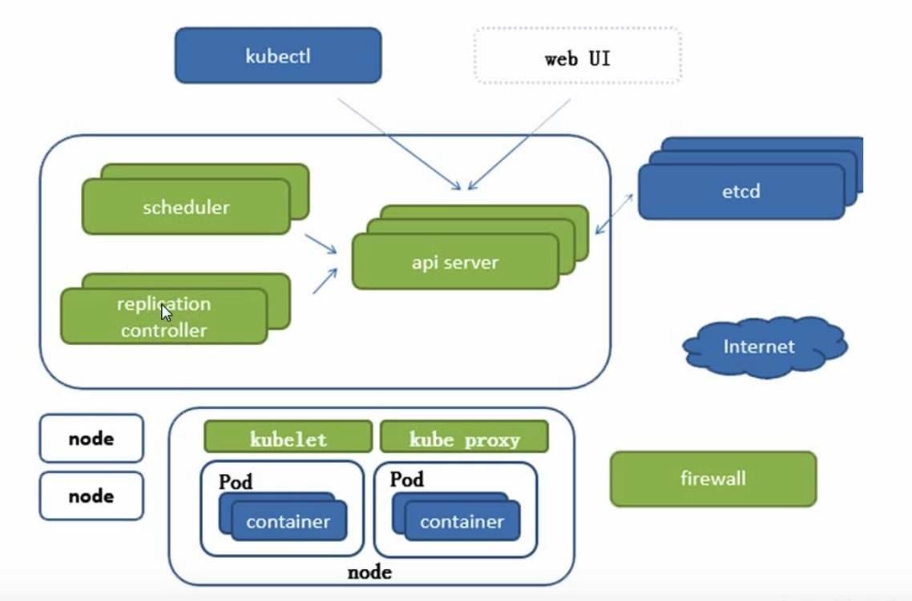
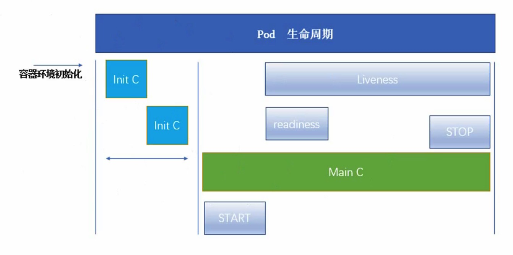
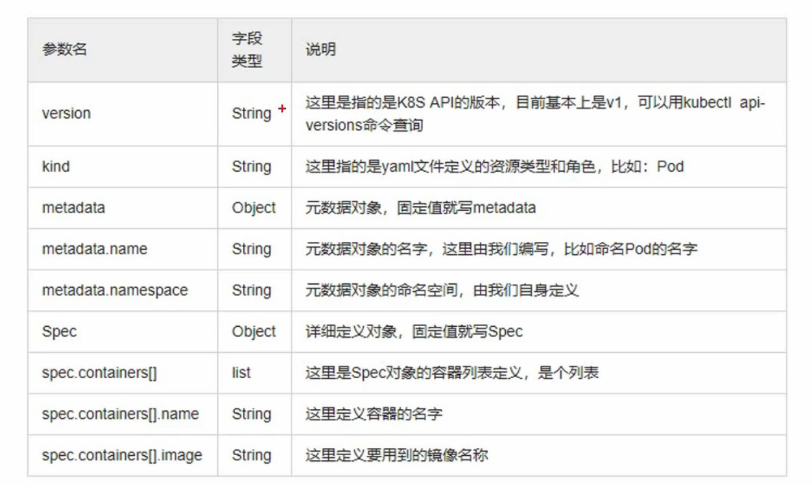
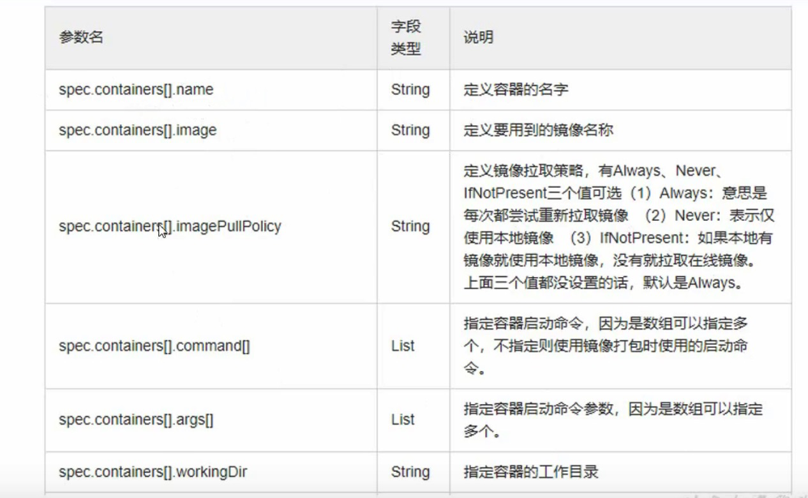
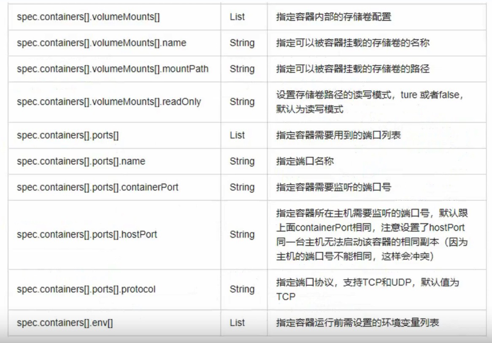
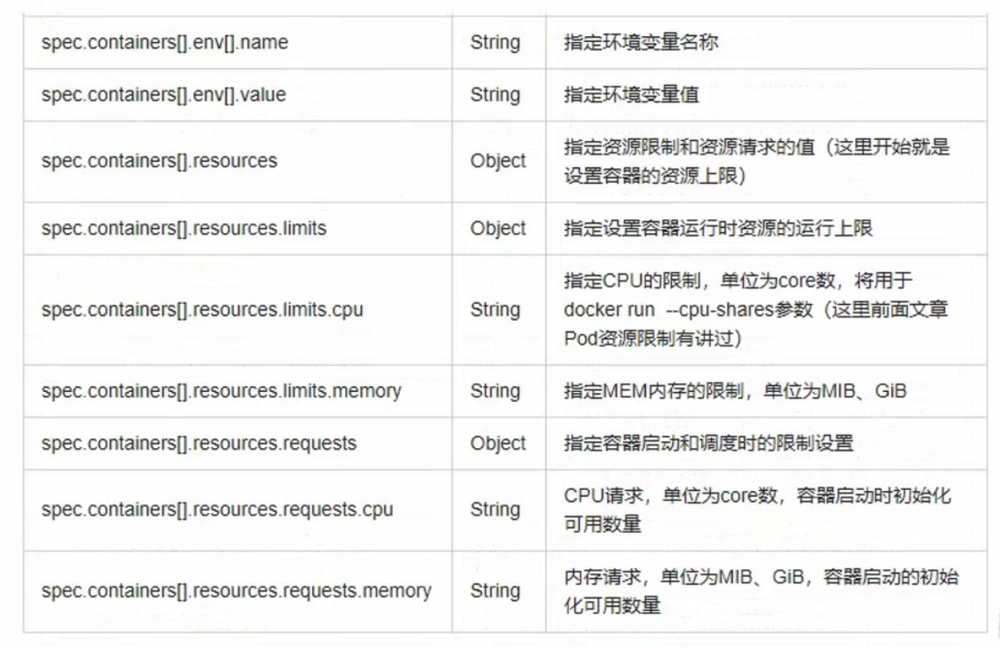
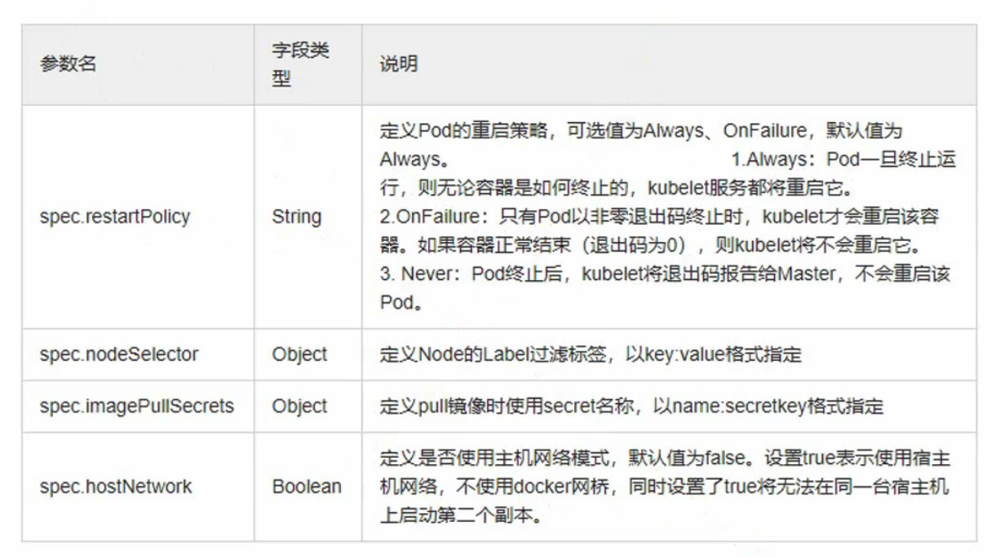
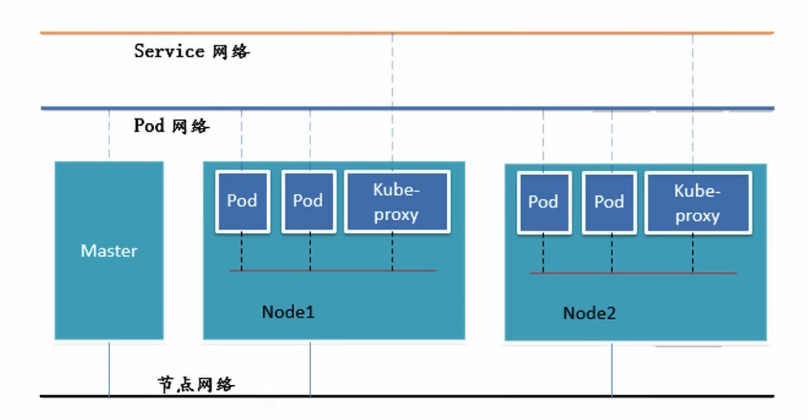
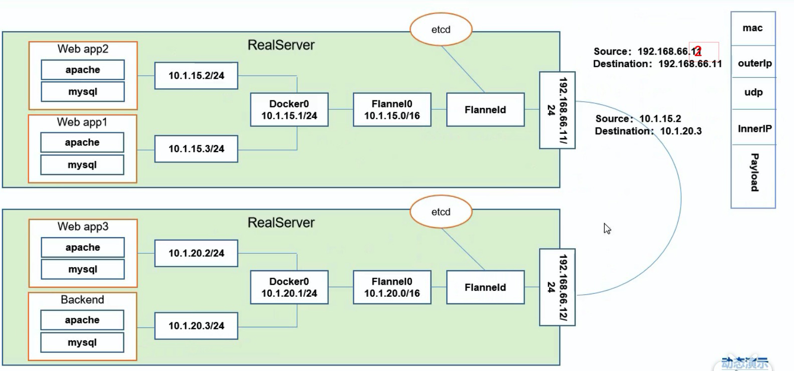
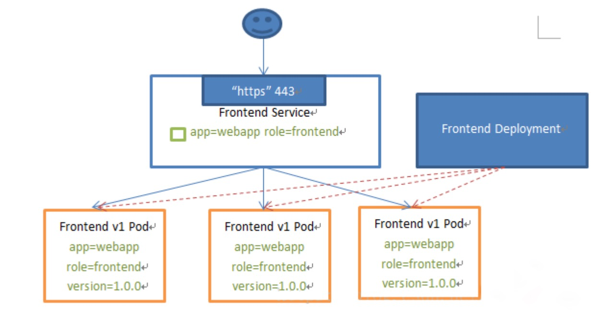

# Kubernetes Awesome

## 资料

[awesome-kubernetes-cn](https://github.com/wh211212/awesome-kubernetes-cn#useful-articles)

[Kubernetes Examples](https://kubernetesbyexample.com/)

[Kubernetes Tutorial](https://www.tutorialspoint.com/kubernetes/kubernetes_architecture.htm)

## 问题

- 一个 ClusterIP Service 能被 NodePort 所代理吗？

## 功能组件



### kubelet

kubelet 是在每个节点上运行的主要 **“节点代理”**。kubelet 以 PodSpec 为单位来运行任务，PodSpec 是一个描述 pod 的 YAML 或 JSON 对象。 kubelet 运行多种机制（主要通过 apiserver）提供的一组 PodSpec，并确保这些 PodSpecs 中描述的容器健康运行。 不是 Kubernetes 创建的容器将不在 kubelet 的管理范围。

除了来自 apiserver 的 PodSpec 之外，还有三种方法可以将容器清单提供给 Kubelet。

- 文件：通过命令行传入的文件路径。kubelet 将定期监听该路径下的文件以获得更新。监视周期默认为 20 秒，可通过参数进行配置。
- HTTP 端点：HTTP 端点以命令行参数传入。每 20 秒检查一次该端点（该时间间隔也是可以通过命令行配置的）。
- HTTP 服务：kubelet 还可以监听 HTTP 并响应简单的 API（当前未指定）以提交新的清单。

### [apiserver（控制面）](https://kubernetes.io/zh/docs/reference/command-line-tools-reference/kube-apiserver/)

Kubernetes API server 为 api 对象验证并配置数据，包括 pods、 services、 replicationcontrollers 和其它 api 对象。API Server 提供 REST 操作和到集群共享状态的前端，所有其他组件通过它进行交互。

## 模型对象

### Pod



readiness：能正常对外提供服务；

liveness：存活状态；

#### Init 容器

init 容器具有访问 Secure 的权限。

```
initContainers:
	- name:
		image:
		command: []
```

*Pod* 是 Kubernetes 应用程序的基本执行单元，即它是 Kubernetes 对象模型中创建或部署的最小和最简单的单元。Pod 表示在 [集群](https://kubernetes.io/zh/docs/reference/glossary/?all=true#term-cluster) 上运行的进程。

Pod 分类：

- 控制器管理Pod
- 自主Pod

Pod 共享：

- 共享存储卷、网络；

包含一个或多个 Pod 的控制器一些示例包括：

- [Deployment](https://kubernetes.io/docs/concepts/workloads/controllers/deployment/)
- [StatefulSet](https://kubernetes.io/docs/concepts/workloads/controllers/statefulset/)
- [DaemonSet](https://kubernetes.io/docs/concepts/workloads/controllers/daemonset/)

同一个 Pod 中容器端口号不能重复；

不同 Pod 之间端口可以重复；

```
# 根据label 筛选
kubectl get pods -l <app=nginx>
# 查看某一个pod实例信息
kubectl describe pod <pod-name>
# 详细信息
kubectl get pod -o wide
```


### Service

- 是发现后端pod服务；
- 是为一组具有相同功能的容器应用提供一个统一的入口地址；
- 是将请求进行负载分发到后端的各个容器应用上的控制器；

用户可以通过ServiceType来指定如何来发布服务，类型有以下几种：

- **ClusterIP**：提供一个集群内部的虚拟IP以供Pod访问（service默认类型)。
-  **NodePort**:在每个Node上打开一个端口以供外部访问；
- **LoadBalancer**：通过外部的负载均衡器来访问；

Service 通过 selector 筛选满足 Label 条件的 Pod 服务。

❓Service 支持多节点吗？

负载均衡：

- RoundRobin：轮询模式，即轮询将请求转发到后端的各个pod上（默认模式）；

- SessionAffinity：基于客户端IP地址进行会话保持的模式，第一次客户端访问后端某个pod，之后的请求都转发到这个pod上；

服务发现方式：

- **环境变量**： 当创建一个Pod的时候，kubelet会在该Pod中注入集群内所有Service的相关环境变量。需要注意的是，要想一个Pod中注入某个Service的环境变量，则必须Service要先比该Pod创建。这一点，几乎使得这种方式进行服务发现不可用；

- **DNS**：可以通过cluster add-on的方式轻松的创建KubeDNS来对集群内的Service进行服务发现——这也是k8s官方强烈推荐的方式。为了让Pod中的容器可以使用kube-dns来解析域名，k8s会修改容器的/etc/resolv.conf配置；

https://zhuanlan.zhihu.com/p/39909011

### 控制器

控制器通过 [apiserver](https://kubernetes.io/docs/reference/generated/kube-apiserver/) 监控集群的公共状态，并致力于将当前状态转变为期望的状态。

### Docker

[Docker](https://www.docker.com/) 是 Kubernetes Pod 中最常用的容器运行时。Pod 来控制容器的行为。

## Kubernetes API 

[Kubernetes API](https://kubernetes.io/docs/reference/generated/kubernetes-api/v1.18/)

### 访问控制

分为三层，认证、授权、准入控制。

#### 认证

认证模块支持客户端证书，密码和 Plain Tokens， Bootstrap Tokens，以及 JWT Tokens（用于服务账户）。

#### 授权

请求须包含请求者的用户名，请求动作，以及该动作影响的对象。 如果存在相应策略，声明该用户具有进行相应操作的权限，则该请求会被授权。

#### 准入控制

准入控制模块是能够修改或拒绝请求的软件模块。 作为授权模块的补充，准入控制模块会访问被创建或更新的对象的内容。 它们作用于对象的创建，删除，更新和连接（proxy）阶段，但不包括对象的读取。

准入控制过程分为两个阶段。第一阶段，运行变更准入控制器。第二阶段，运行验证准入控制器。 再次提醒，某些控制器既是变更准入控制器又是验证准入控制器。

与认证和授权模块不同的是，如果**任一个**准入控制器拒绝请求，那么整个请求会立即被拒绝。

[准入控制器插件列表](https://kubernetes.io/zh/docs/reference/access-authn-authz/admission-controllers/)

### API 的端口和 IP

默认情况下，API 服务器在 2 个端口上提供 HTTP 服务。

- Localhost Port
- Secure Port

[连接](https://kubernetes.io/zh/docs/reference/access-authn-authz/controlling-access/#api-%E7%9A%84%E7%AB%AF%E5%8F%A3%E5%92%8C-ip)

## Kubernetes 对象

在 Kubernetes 系统中，*Kubernetes 对象* 是持久化的实体。Kubernetes 使用这些实体去表示整个集群的状态。

### 对象规约（Spec）与状态（Status）

每个 Kubernetes 对象包含两个嵌套的对象字段，它们负责管理对象的配置：对象 *spec* 和 对象 *status* 。 *spec* 是必需的，它描述了对象的 *期望状态（Desired State）* —— 希望对象所具有的特征。 *status* 描述了对象的 *实际状态（Actual State）* ，它是由 Kubernetes 系统提供和更新的。在任何时刻，Kubernetes 控制面一直努力地管理着对象的实际状态以与期望状态相匹配。

## 配置对象

### 资源清单

必填对象



主要对象









查看详细信息

```
kubctl explain [名称]
```


## 网络对象

三层网络：




网络场景：

1. 同一个 Pod 内的多个容器之间：IO；
2. 各 Pod 之间的通讯：Overlay Network（Flannel）；
3. Pod 与 Service 之间的通讯：各个节点的 iptables 规则或 LVS；

Flannel 通讯方案



分为在同一台机器、不在同一台机器情况。

### Service

Service 是一个 Pod 的逻辑分组，一种可以访问它们的策略——通常称为微服务。这组 Pod 能够被 Service 访问到，通常是通过 Label Selector。



❓**Service 如何找到目标 Pod？**

通过 Label Selector 找到相同 tag 的 Pod。

❓**为什么不使用 round-robin DNS？**

DNS 存在缓存问题。

#### 代理模式分类

1. userspace 代理模式；
2. iptables 代理模式；
3. ipvs 代理模式（最新版推荐）；

拓展阅读：

- [IPVS](https://www.cnblogs.com/hongdada/p/9758939.html)

#### 网络类型

网络类型分为如下几种：

1. ClusterIP
2. Headerless Service
3. NodePort
4. LoadBalance
5. ExternalName

🔅**ClusterIP**

默认类型，自动分配一个仅集群内部可以访问的虚拟 IP。

🔅**Headerless Service**

有时不需要或者不想要负载均衡，以及单独的 Service Ip。遇到这种情况，可以通过指定 Cluster IP（spec.clusterIP）的值为 None 来创建 Headless Service.这类 Service 并不会分配 Cluster IP，kube-proxy 不会处理它们，而且平台也不会为它们进行负载均衡和路由。

```yaml
apiVersion: v1
kind: Service
metadata:
	name: myapp-headless
	namespace: default
spec:
	selector:
		app: myapp
		clusterIP: None
		ports:
			- port: 80
				targetPort: 80
```

**场景：**

1. 自主选择权，有时候 `client` 想自己来决定使用哪个`Real Server`，可以通过查询DNS来获取 `Real Server` 的信息。

2. `Headless Service` 的对应的每一个 `Endpoints`，即每一个`Pod`，都会有对应的`DNS域名`，这样`Pod之间`就可以`互相访问`。

🔅**NodePort**

当希望 K8s  外部的网络能访问到 Node 场景中使用。为 Service 在每台机器上绑定一个端口，这样就可以通过 NodePort 访问服务。

```yaml
apiVersion: apps/v1 # for versions before 1.9.0 use apps/v1beta2
kind: Deployment
metadata:
  name: nginx-deployment
spec:
  selector:
    matchLabels:
      app: nginx
  replicas: 2 # tells deployment to run 2 pods matching the template
  template:
    metadata:
      labels:
        app: nginx
    spec:
      containers:
      - name: nginx
        image: nginx:1.14.2
        imagePullPolicy: IfNotPresent
        ports:
        - containerPort: 80
----
apiVersion: v1
kind: Service
metadata:
    name: myapp
    namespace: default
    labels:
      run: my-nginx
spec:
    type: NodePort
    selector:
        app: nginx
    ports:
        - name: http
          protocol: TCP
          port: 80 # 抽象的 Service 端口，可以使任何其它 Pod 访问该 Service 的端口
          targetPort: 80 # 容器接收流量的端口
          nodePort: 30008  #对外暴露的端口
```

🔅**LoadBalance**

云服务厂商提供的负载均衡器功能。

🔅**ExternalName**

当 Pod 内部容器需要调用其他 Pod 或者 K8s 集群外部资源时，防止外部资源地址的变更而频繁变更内部容器配置信息。ExternalName 可以解决这个问题。

ExternalName 实质就是一个 DNS 解析。

```yaml
apiVersion: v1
kind: Service
metadata:
  name: my-service
  namespace: default
spec:
	type: ExternalName
	externalName: hub.zerostech.com
```

当查询 `my-service.default.svc.cluster.local`（`<serviceName>.<namespace>.svc.cluster.local`） 时，集群的DNS服务将会返回 externalName 配置项服务的结果数据信息。

当 externalName 值发生变更时，只要 servicename 没有变更，就不会影响到 Pod 引用的地址信息。

`<serviceName>.<namespace>.svc.cluster.local` 是 K8s 默认会生成的路径。

小结

- Service 支持多层级，用service01作为对外调用的口子，service01-1和service01-2只在内部使用；
- 一个 Pod 拥有一个k8s集群的一个内部ip，Pod 内部 container ip 由 Pod 自己生成；

### Ingress

Ingress 用于实现 Service 的负载均衡。

[Ingress](https://kubernetes.io/docs/reference/generated/kubernetes-api/v1.18/#ingress-v1beta1-networking-k8s-io) 公开了从集群外部到集群内[服务](https://kubernetes.io/zh/docs/concepts/services-networking/service/)的 HTTP 和 HTTPS 路由。**只支持 HTTP 和 HTTPS 两种协议哦。**

将 HTTP 和 HTTPS 以外的服务公开到 Internet 时，通常使用 [Service.Type=NodePort](https://kubernetes.io/zh/docs/concepts/services-networking/service/#nodeport) 或 [Service.Type=LoadBalancer](https://kubernetes.io/zh/docs/concepts/services-networking/service/#loadbalancer) 类型的服务。

[Kubernetes Ingress Controller的使用介绍及高可用落地](https://www.servicemesher.com/blog/kubernetes-ingress-controller-deployment-and-ha/)

*这确实意味着订购要求* - 必须在`Pod`本身之前创建`Pod`想要访问的任何`Service`，否则将不会填充环境变量。 DNS没有此限制。

- 一个可选（尽管强烈推荐）[cluster add-on](https://kubernetes.io/docs/concepts/cluster-administration/addons/)是 DNS 服务器。DNS 服务器为新的`Services`监视 Kubernetes API，并为每个创建一组 DNS 记录。 如果在整个集群中启用了 DNS，则所有`Pods`应该能够自动对`Services`进行名称解析。

- 除非绝对必要，否则不要为 Pod 指定`hostPort`。 将 Pod 绑定到`hostPort`时，它会限制 Pod 可以调度的位置数，因为每个<`hostIP`, `hostPort`, `protocol`>组合必须是唯一的。如果您没有明确指定`hostIP`和`protocol`，Kubernetes将使用`0.0.0.0`作为默认`hostIP`和`TCP`作为默认`protocol`。

如果您只需要访问端口以进行调试，则可以使用[apiserver proxy](https://kubernetes.io/docs/tasks/access-application-cluster/access-cluster/#manually-constructing-apiserver-proxy-urls)或[`kubectl port-forward`](https://kubernetes.io/docs/tasks/access-application-cluster/port-forward-access-application-cluster/)。

如果您明确需要在节点上公开 Pod 的端口，请在使用`hostPort`之前考虑使用[NodePort](https://kubernetes.io/docs/concepts/services-networking/service/#nodeport) 服务。

- 避免使用`hostNetwork`，原因与`hostPort`相同。
- 当您不需要`kube-proxy`负载平衡时，使用 [无头服务](/docs/concepts/services-networking/service/#headless- services) (具有`None`的`ClusterIP`)以便于服务发现。

https://kubernetes.io/zh/docs/concepts/services-networking/ingress/

## 常用命令

```shell
# 查看DNS解析
dig -t A www.baidu.com @10.244.0.7
```

## 问题与解答

❓如何通过 Label 发布到指定的 Node 节点上？

`spec.nodeSelector` 可以实现 Label 方式部署到指定 Label 节点下面。

```yaml
apiVersion: v1
kind: Pod
metadata:
  name: nginx
  labels:
    env: test
spec:
  containers:
  - name: nginx
    image: nginx
    imagePullPolicy: IfNotPresent
  nodeSelector:
    disktype: ssd  # disktype: ssd 就是一个 label
```

```shell
kubectl label nodes <your-node-name> disktype=ssd  # 为Node创建Label
kubectl get nodes --show-labels # 显示 Node 的 label
```

