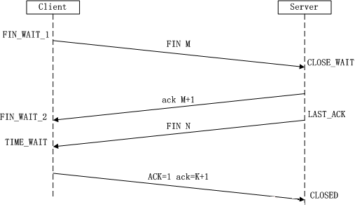
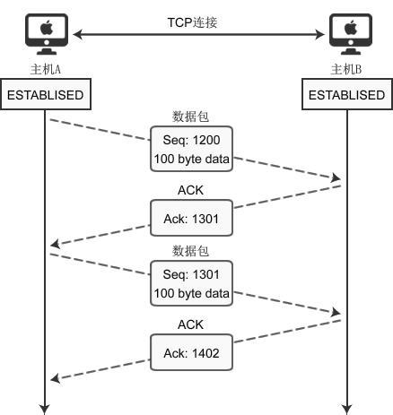
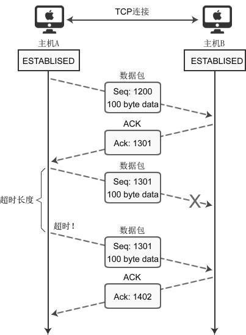

# 网络

## 网络分层

OSI 七层体系结构是一个理论上的国际标准。

TCP/IP 四层体系结构是应用标准。

五层体系结构综合了OSI 和 TCP/IP 的优点，但只是学术研究而提出的。

### OSI 七层体系结构

- 应用层（数据）：确定进程之间通信的性质以满足用户需要以及提供网络与用户应用
- 表示层（数据）：主要解决用户信息的语法表示问题，如加密解密
- 会话层（数据）：提供包括访问验证和会话管理在内的建立和维护应用之间通信的机制，如服务器验证用户登录便是由会话层完成的
- 传输层（段）：实现网络不同主机上用户进程之间的数据通信，可靠
  与不可靠的传输，传输层的错误检测，流量控制等
- 网络层（包）：提供逻辑地址（IP）、选路，数据从源端到目的端的
  传输
- 数据链路层（帧）：将上层数据封装成帧，用MAC地址访问媒介，错误检测与修正
- 物理层（比特流）：设备之间比特流的传输，物理接口，电气特性等

### 简述 TCP/IP 四层体系结构

#### 应用层

HTTP、TELNET、FTP、SMTP

#### 传输层

TCP、UDP

#### 网络层

IP、ICMP

#### 网络接口层

PPP

### 详细说明 Keepalived 的故障切换工作原理？

这种故障切换，是通过 **VRRP** 协议来实现的。

- 主节点会按一定的时间间隔发送心跳信息的广播包，告诉备节点自己的存活状态信息。
- 当主节点发生故障时，备节点在一段时间内就收到广播包，从而判断主节点出现故障，因此会调用自身的接管程序来接管主节点的 IP 资源及服务。
- 当主节点恢复时，备节点会主动释放资源，恢复到接管前的状态，从而来实现主备故障切换

### IP 地址与物理地址的区别？

- 物理地址(MAC 地址)，是数据链路层和物理层使用的地址。
- IP 地址是网络层和以上各层使用的地址，是一种逻辑地址。
- 其中 ARP 协议用于 IP 地址与物理地址的对应。

### 网络层的 ARP 协议工作原理？

网络层的 ARP 协议完成了 IP 地址与物理地址的映射。

- 首先，每台主机都会在自己的 ARP 缓冲区中建立一个 ARP 列表，以表示 IP 地址和 MAC 地址的对应关系。
- 当源主机需要将一个数据包要发送到目的主机时，会首先检查自己 ARP 列表中是否存在该 IP 地址对应的 MAC 地址：
  - 如果有，就直接将数据包发送到这个 MAC 地址。
  - 如果没有，就向本地网段发起一个ARP请求的广播包，查询此目的主机对应的 MAC 地址。此 ARP 请求数据包里包括源主机的 IP 地址、硬件地址、以及目的主机的 IP 地址。网络中所有的主机收到这个 ARP 请求后，会检查数据包中的目的 IP 是否和自己的 IP地址一致。
    - 如果不相同，就忽略此数据包。
    - 如果相同，该主机首先将发送端的 MAC 地址和 IP 地址添加到自己的 ARP 列表中(如果 ARP 表中已经存在该 IP 的信息，则将其覆盖)，然后给源主机发送一个 ARP 响应数据包，告诉对方自己是它需要查找的 MAC 地址。
      - 源主机收到这个 ARP 响应数据包后，将得到的目的主机的 IP 地址和 MAC 地址添加到自己的 ARP 列表中，并利用此信息开始数据的传输。
      - 如果源主机一直没有收到 ARP 响应数据包，表示 ARP 查询失败。

> 在 OSI 模型中 ARP 协议属于链路层；而在 TCP/IP 模型中，ARP 协议属于网络层。

## TCP

TCP(Transmission Control Protocol)，传输控制协议，是一种面向连接的、可靠的、基于字节流的传输层通信协议。主要特点如下：

- TCP 是面向连接的。

- 每一条 TCP 连接只能有两个端点，每一条TCP连接只能是点对点的（一对一）。
- TCP 提供可靠交付的服务。通过TCP连接传送的数据，无差错、不丢失、不重复、并且按序到达。
- TCP 提供全双工通信。TCP 允许通信双方的应用进程在任何时候都能发送数据。TCP 连接的两端都设有发送缓存和接收缓存，用来临时存放双方通信的数据。
- 面向字节流。

### TCP 对应的应用层协议？

- FTP ：定义了文件传输协议，使用 21 端口。常说某某计算机开了 FTP 服务便是启动了文件传输服务。下载文件，上传主页，都要用到 FTP 服务。
- Telnet ：它是一种用于远程登陆的端口，用户可以以自己的身份远程连接到计算机上，通过这种端口可以提供一种基于 DOS 模式下的通信服务。如以前的 BBS 是纯字符界面的，支持 BBS 的服务器将 23 端口打开，对外提供服务。
- 邮箱
  - SMTP ：定义了简单邮件传送协议，现在很多邮件服务器都用的是这个协议，用于发送邮件。如常见的免费邮件服务中用的就是这个邮件服务端口，所以在电子邮件设置-中常看到有这么 SMTP 端口设置这个栏，服务器开放的是 25 号端口。
  - POP3 ：它是和 SMTP 对应，POP3 用于接收邮件。通常情况下，POP3 协议所用的是 110 端口。也是说，只要你有相应的使用 POP3 协议的程序（例如 Foxmail 或 Outlook），就可以不以 Web 方式登陆进邮箱界面，直接用邮件程序就可以收到邮件（如是 163 邮箱就没有必要先进入网易网站，再进入自己的邮箱来收信）。
- HTTP ：从 Web 服务器传输超文本到本地浏览器的传送协议。

### 什么是 TCP 三次握手？

三次握手，简单来说，就是：

- 发送方：我要和你建立链接？
- 接收方：你真的要和我建立链接么？
- 发送方：我真的要和你建立链接，成功。

第一次握手：Client 将标志位 SYN=1 ，随机产生一个值 seq=J ，并将该数据包发送给 Server 。此时，Client 进入SYN_SENT 状态，等待 Server 确认。

第二次握手：Server 收到数据包后由标志位 SYN=1 知道Client请求建立连接，Server 将标志位 SYN 和 ACK 都置为 1 ，ack=J+1，随机产生一个值 seq=K ，并将该数据包发送给 Client 以确认连接请求，Server 进入 SYN_RCVD 状态。此时，Server 进入 SYC_RCVD 状态。

第三次握手：Client 收到确认后，检查 ack 是否为 J+1 ，ACK 是否为 1 。

如果正确，则将标志位 ACK 置为 1 ，ack=K+1 ，并将该数据包发送给 Server 。此时，Client 进入 ESTABLISHED 状态。

Server 检查 ack 是否为 K+1 ，ACK 是否为 1 ，如果正确则连接建立成功。此时 Server 进入 ESTABLISHED 状态，完成三次握手，随后 Client 与 Server 之间可以开始传输数据了。

仔细看来，Client 会发起两次数据包，分别是 SYNC 和 ACK ；Server 会发起一次数据包，包含 SYNC 和 ACK 。也就是说，三次握手的过程中，Client 和 Server 互相做了一次 SYNC 和 ACK 。

### 为什么 TCP 连接需要三次握手，两次不可以么，为什么？

为了防止**已失效的连接请求**报文突然又传送到了服务端，因而产生错误。

### 客户端不断进行请求链接会怎样？

服务器端准备为每个请求创建一个链接，并向其发送确认报文，然后等待客户端进行确认后创建。如果此时客户端一直不确认，会造成 SYN 攻击，即：

SYN 攻击，英文为 SYN Flood ，是一种典型的 DoS/DDoS 攻击。

- 客户端向服务端发送请求连接数据包。
- 服务端向客户端发送确认数据包。
- 客户端不向服务端发送确认数据包，服务器一直等待来自客户端的确认。

### 如何检测 SYN 攻击？

检测 SYN 攻击非常的方便，当你在服务器上看到大量的半连接状态时，特别是源 IP 地址是随机的，基本上可以断定这是一次 SYN 攻击。在 Linux/Unix 上可以使用系统自带的 netstat 命令来检测 SYN 攻击。

### 怎么解决 SYN 攻击呢？

答案是**只能预防**，没有彻底根治的办法，除非不使用 TCP 。

- 限制同时打开 SYN 半链接的数目
- 缩短 SYN 半链接的 Timeout 时间
- 关闭不必要的服务
- 增加最大半连接数

### 什么是 TCP 四次挥手？

- 发送方：我要和你断开连接！
- 接收方：好的，断吧。
- 接收方：我也要和你断开连接！
- 发送方：好的，断吧。

> 图片有问题，最后是 ACK=N+1

第一次挥手：Client 发送一个 FIN=M ，用来关闭 Client 到 Server 的数据传送。此时，Client 进入 FIN_WAIT_1 状态。

第二次挥手，Server 收到 FIN 后，发送一个 ACK 给 Client ，确认序号为 M+1（与 SYN 相同，一个 FIN 占用一个序号）。此时，Server 进入 CLOSE_WAIT 状态。注意，**TCP 链接处于半关闭状态，即客户端已经没有要发送的数据了，但服务端若发送数据，则客户端仍要接收。**

第三次挥手，Server 发送一个 FIN=N ，用来关闭 Server 到 Client 的数据传送。此时 Server 进入 LAST_ACK 状态。

第四次挥手，Client 收到 FIN 后，此时 Client 进入 TIME_WAIT 状态。接着，Client 发送一个 ACK 给 Server ，确认序号为 N+1 。Server 接收到后，此时 Server 进入 CLOSED 状态，完成四次挥手。

### 为什么要四次挥手？

TCP 协议是一种面向连接的、可靠的、基于字节流的运输层通信协议。**TCP 是全双工模式**，这就意味着：

- 当主机 1 发出 `FIN` 报文段时，只是表示主机 1 已经没有数据要发送了，主机 1 告诉主机 2 ，它的数据已经全部发送完毕了；**但是，这个时候主机 1 还是可以接受来自主机 2 的数据；**当主机 2 返回 `ACK` 报文段时，表示它已经知道主机 1 没有数据发送了，但是主机 2 还是可以发送数据到主机 1 的。

因为主机 2 此时可能还有数据想要发送给主机 1 ，所以挥手不能像握手只有三次，而是多了那么“一次”！

- 当主机 2 也发送了 `FIN` 报文段时，这个时候就表示主机 2 也没有数据要发送了，就会告诉主机 1 ，我也没有数据要发送了，之后彼此就会愉快的中断这次 TCP 连接。

### TCP 数据如何传输？

上图给出了主机 A 分 2 次（分 2 个数据包）向主机 B 传递 200 字节的过程。

- 首先，主机 A 通过 1 个数据包发送 100 个字节的数据，数据包的 Seq 号设置为 1200 。主机 B 为了确认这一点，向主机 A 发送 ACK 包，并将 Ack 号设置为 1301 。
- 为了保证数据准确到达，目标机器在收到数据包（包括 SYN 包、FIN 包、普通数据包等）包后必须立即回传 ACK 包，这样发送方才能确认数据传输成功。
- 此时 Ack 号为 1301 而不是 1201，原因在于 Ack 号的增量为传输的数据字节数。假设每次 Ack 号不加传输的字节数，这样虽然可以确认数据包的传输，但无法明确 100 字节全部正确传递还是丢失了一部分，比如只传递了 80 字节。因此按如下的公式确认 Ack 号：Ack 号 = Seq 号 + 传递的字节数 + 1 。
- 与三次握手协议相同，最后加 1 是为了告诉对方要传递的 Seq 号。

### TCP 数据传输丢失怎么办？

上图表示通过 `Seq` 1301 数据包向主机 B 传递 100 字节的数据，但中间发生了错误，主机 B 未收到。经过一段时间后，主机 A 仍未收到对于 `Seq` 1301 的 `ACK` 确认，因此尝试重传数据。为了完成数据包的重传，TCP 套接字每次发送数据包时都会**启动定时器**，如果在一定时间内没有收到目标机器传回的 `ACK` 包，那么定时器超时，数据包会重传。上图演示的是数据包丢失的情况，也会有 `ACK` 包丢失的情况，一样会重传。

**重传超时时间(RTO，Retransmission Time Out)**

这个值太大了会导致不必要的等待，太小会导致不必要的重传，理论上最好是网络 RTT 时间，但又受制于网络距离与瞬态时延变化，所以实际上使用自适应的动态算法（例如 Jacobson 算法和 Karn 算法等）来确定超时时间。

往返时间（RTT，Round-Trip Time）表示从发送端发送数据开始，到发送端收到来自接收端的 ACK 确认包（接收端收到数据后便立即确认），总共经历的时长。

**重传次数**

TCP 数据包重传次数，根据系统设置的不同而有所区别。有些系统，一个数据包只会被重传 3 次，如果重传 3 次后还未收到该数据包的 `ACK` 确认，就不再尝试重传。但有些要求很高的业务系统，会不断地重传丢失的数据包，以尽最大可能保证业务数据的正常交互。

最后需要说明的是，发送端只有在收到对方的 `ACK` 确认包后，才会清空输出缓冲区中的数据。

### 什么是 TCP 滑动窗口？

**背景**

将 TCP 与 UDP 这样的简单传输协议区分开来的是，它传输数据的质量。TCP 对于发送数据进行跟踪，这种数据管理需要协议有以下两大关键功能：

- 可靠性：保证数据确实到达目的地。如果未到达，能够发现并重传。
- 数据流控：管理数据的发送速率，以使接收设备不致于过载。

要完成这些任务，整个协议操作是围绕**滑动窗口** + **确认机制**来进行的。因此，理解了滑动窗口，也就是理解了 TCP 。

**到底什么是 TCP 滑动窗口呢？**

滑动窗口协议，是传输层进行流控的一种措施，**接收方通过通告发送方自己的窗口大小**，从而控制发送方的发送速度，从而达到防止发送方发送速度过快而导致自己被淹没的目的。

TCP 的滑动窗口解决了端到端的**流量控制**问题，允许接受方对传输进行限制，直到它拥有足够的缓冲空间来容纳更多的数据。

